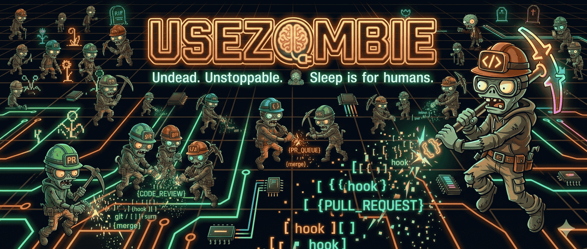

<div align="center">



# UseZombie

**Agent Delivery Control Plane — one Zig binary that takes a spec and ships a validated PR.**

[](https://github.com/usezombie/usezombie/actions/workflows/test.yml?query=branch%3Amain)
[](https://github.com/usezombie/usezombie/actions/workflows/release.yml)
[](https://codecov.io/gh/usezombie/usezombie/flags/website)
[](https://codecov.io/gh/usezombie/usezombie/flags/apps)
[](https://opensource.org/licenses/MIT)
[](https://github.com/usezombie/usezombie/releases)
[](https://ziglang.org)
[](https://www.npmjs.com/package/zombiectl)

> **🚧 In Development** — UseZombie is under active development and not yet ready for production use. APIs, CLI, and behavior may change without notice.

</div>

---

## What it does

UseZombie connects a spec queue to a coordinated agent team (**Echo → Scout → Warden**) and ships validated PRs with retry loops, structured defect reports, and full audit trails.

Drop a `PENDING_*.md` spec into your repo → UseZombie picks it up, generates code, reviews it, validates it, and opens a PR. No babysitting.

## Stack

- **`zombied`** — one static Zig binary (~2-3MB). HTTP API + worker pipeline + agent runtime.
- **PlanetScale Postgres** — state, transitions, artifacts, workspace memories.
- **Upstash Redis Streams** — dispatch queue. Zero CPU while idle.
- **NullClaw** — native Zig agent runtime via `@import("nullclaw")`. No subprocess.
- **GitHub App OAuth** — per-workspace repo access with short-lived tokens.

## Local Development

### Prerequisites

- [Docker](https://docs.docker.com/get-docker/) + Docker Compose
- Git

### Setup

```bash
git clone https://github.com/usezombie/usezombie.git
cd usezombie
cp .env.example .env
```

### Dev Commands

```bash
make up          # Start Postgres + zombied (builds in Docker, tails logs)
make down        # Stop all services, remove volumes, cleanup
make lint        # Format + lint check
make test        # Run all tests (unit + e2e)
make doctor      # Check Postgres, config, LLM key
```

### Build & Deploy

```bash
make build       # Build production container
make build-dev   # Build development container
make push-dev    # Push dev image to GHCR
make push        # Promote dev-latest → production tags
```

### Release

```bash
make version-bump VERSION=0.2.0   # Bump VERSION, build.zig.zon, README.md
# Update CHANGELOG.md, commit, then:
git tag v0.2.0 && git push --tags  # Triggers: Docker push + npm publish + GitHub Release
```


## Binary

```bash
zombied serve    # HTTP API + worker loop
zombied doctor   # Check Postgres, config, LLM key
zombied run      # One-shot spec run (planned)
```

## Highlights

- **Spec-Driven** — Drop `PENDING_*.md` files into your repo to trigger automated PRs
- **Agent Team** — Echo (planning) → Scout (building) → Warden (validation)
- **One Binary** — Single ~2-3MB Zig binary with embedded HTTP API and worker pipeline
- **Validated Delivery** — Retry loops, structured defect reports, full audit trails
- **Machine-Readable** — OpenAPI, agent manifests, and skill instructions for AI integration

## Getting Started

New to UseZombie? Start here:

- **[Getting Started Guide](https://docs.usezombie.com/start/getting-started)** — Installation, authentication, and first spec
- **[CLI Reference](https://docs.usezombie.com/cli)** — Complete command documentation
- **[Architecture Overview](https://docs.usezombie.com/concepts/architecture)** — How the agent team works

## Documentation

- **[UseZombie.com](https://usezombie.com)** — Product homepage
- **[docs.usezombie.com](https://docs.usezombie.com)** — Full documentation
- **[usezombie.sh](https://usezombie.sh)** — Agent discovery and machine-readable surfaces

## Machine-Readable Surfaces

- [`public/openapi.json`](public/openapi.json) — OpenAPI 3.1 spec
- [`public/agent-manifest.json`](public/agent-manifest.json) — JSON-LD agent discovery
- [`public/llms.txt`](public/llms.txt) — LLM-friendly API summary
- [`public/skill.md`](public/skill.md) — Agent onboarding instructions

## License

MIT License — Copyright (c) 2026 UseZombie

See [LICENSE](LICENSE) for details.
