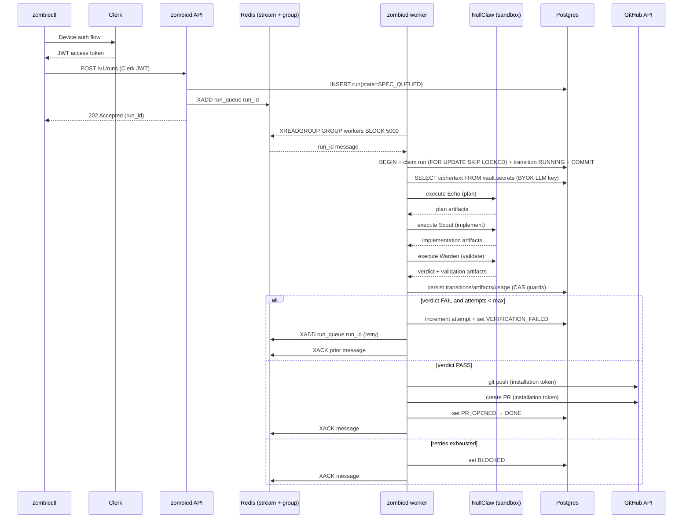

# UseZombie Architecture (v1 Canonical)

Date: Mar 4, 2026
Status: Canonical architecture baseline for v1 planning and implementation

## Goal

UseZombie accepts a spec request and produces a validated pull request through a deterministic worker loop with explicit retry, policy checks, and auditable artifacts.

## Version Roadmap

### v1 — Ship (CLI-first launch)

1. **Queue:** Redis streams for worker coordination (replaces Postgres polling).
2. **Execution:** NullClaw runs directly on the worker host with built-in sandbox (Landlock on Linux).
3. **Git:** Hardened git CLI subprocess (hook disabling, timeouts, error handling).
4. **Auth:** Clerk (device flow for CLI, JWT for API, M2M for agents).
5. **Delivery:** `zombiectl` CLI (`npx zombiectl`).
6. **Website:** Static marketing at `usezombie.com` + agent discovery at `usezombie.sh`.

### v2 — Harden (production multi-tenant)

1. **Execution:** Firecracker microVMs — NullClaw runs inside VMs, worker becomes orchestrator.
2. **Git:** libgit2 (native calls, no subprocess).
3. **Scaling:** Multi-worker concurrency, token bucket rate limiting.
4. **Encryption:** Full envelope encryption with KMS-backed KEK.
5. **Analytics:** PostHog Zig SDK integration.

### v3 — Scale (platform)

1. **Mission Control UI:** `app.usezombie.com` (Vercel + Clerk frontend).
2. **Team model:** Workspaces, teams, branch-level access (design TBD in v2).
3. **Billing:** Dodo integration, agent-second metering.
4. **Auth:** GitHub + Google login via Clerk (no SSO/SAML).

## Canonical Assumptions

1. `zombied` is split into two roles:
   - API role (`zombied serve`)
   - Worker role (`zombied worker`)
2. Postgres is the source of truth for run state and artifacts metadata.
3. Redis is mandatory for queueing and worker coordination.
4. Service-to-service access is constrained through **Tailscale** network policy plus provider allowlists.
5. v1 delivery target is CLI-first (`zombiectl`); Mission Control UI (`app.usezombie.com`) is v3.
6. v1 git operations use hardened CLI subprocess; v2 migrates to **libgit2**.
7. v1 execution uses NullClaw built-in sandbox; v2 migrates to **Firecracker microVMs**.

## System Components

1. `zombiectl`: CLI used by humans/agents to submit specs and monitor runs.
2. `zombied API`: validates requests, persists run metadata, enqueues work to Redis.
3. `zombied worker`: claims queued work from Redis, executes agent loop, writes state transitions, opens PRs.
4. `Redis`: stream-based queue + consumer-group coordination.
5. `Postgres`: run state, transitions, usage, artifact index, policy events, secrets (vault schema).
6. `Clerk`: authentication for CLI (device flow), API (JWT), and M2M (client credentials).
7. `NullClaw`: agent runtime for Echo/Scout/Warden execution.

## Canonical Execution Lifecycle

1. `spec request`: `zombiectl` submits run request to API (Clerk JWT auth).
2. `worker scheduling`: API writes run row in Postgres and enqueues `run_id` in Redis stream.
3. `sandbox execution`: worker claims message via XREADGROUP, runs Echo → Scout → Warden via NullClaw.
4. `result evaluation`: worker persists verdict and artifacts metadata in Postgres.
5. `iteration loop`: on validation fail with retries available, worker re-enqueues the same `run_id` with incremented attempt.
6. `PR creation`: on pass, worker pushes branch and creates PR via GitHub App installation token.

## Single Canonical Diagram (v1)



## Firecracker Execution Model (v2)

In v2, the worker becomes an orchestrator. Agent execution moves inside Firecracker microVMs:

```
Worker claims run from Redis
  → Prepares VM payload (spec, worktree snapshot, agent configs, BYOK key)
  → Boots Firecracker microVM (pre-warmed snapshot, <125ms boot)
  → VM contains: thin runner binary + NullClaw library + restricted egress
  → Runner executes Echo → Scout → Warden INSIDE the VM
  → Results returned to worker via vsock or HTTP callback
  → Worker persists artifacts to Postgres
  → Worker tears down VM
```

**Key constraints:**
- A single run stays on one worker. All three stages run on that host's VMs.
- Different runs distribute across workers via Redis consumer groups.
- Secrets are injected per-VM via vsock, never written to VM disk image.
- VM egress restricted to: LLM provider endpoints, GitHub API, control plane callback.

**Firecracker vs Daytona (Decision):** Firecracker directly. Strongest isolation boundary with predictable VM lifecycle. Daytona revisited only if managed multi-tenant orchestration is needed post-v2.

## Authentication Model

| Flow | Method | Token | Used by |
|---|---|---|---|
| CLI login | OAuth 2.0 Device Authorization (RFC 8628) | Clerk JWT | `zombiectl` |
| API requests | Bearer token | Clerk JWT (verified via JWKS) | All clients |
| Agent pipelines | OAuth 2.0 Client Credentials | Clerk M2M JWT | AI PM agents, CI |
| GitHub operations | GitHub App installation token | `ghs_...` (1hr, repo-scoped) | Worker git ops |
| Local dev fallback | Static API key | `API_KEY` env var | Dev only |

## Security Model

### Network (Tailscale)

1. API and worker nodes join the same Tailscale tailnet.
2. Only API/worker nodes are allowed to reach Postgres and Redis.
3. Managed Postgres/Redis: enforce fixed egress IP allowlists from Tailscale nodes.
4. Workers have no direct internet ingress.

### Database (Role Separation)

| Role | `public` schema | `vault` schema |
|---|---|---|
| `api_accessor` | SELECT, INSERT, UPDATE | No access |
| `worker_accessor` | SELECT, INSERT, UPDATE | SELECT, INSERT, UPDATE |
| `callback_accessor` | No access | SELECT, INSERT, UPDATE |

### Redis (ACLs)

- API user: XADD only (enqueue).
- Worker user: XREADGROUP, XACK, XAUTOCLAIM (dequeue + ack).
- Default user disabled.

### Secrets

- `ENCRYPTION_MASTER_KEY`: memory only, never stored.
- GitHub installation tokens: generated per run, 1-hour lifetime, discarded after use.
- BYOK LLM keys: encrypted in `vault.secrets` (BYTEA), decrypted in worker memory only.

#### GitHub App — Implementation Detail

Operator setup:
1. Register UseZombie as a GitHub App with callback URL `https://api.usezombie.com/v1/github/callback`.
2. Store `GITHUB_APP_ID` and `GITHUB_APP_PRIVATE_KEY` in vault-managed env.

Per-workspace install:
1. Customer authorizes the app.
2. GitHub redirects to `/v1/github/callback?installation_id=<id>&state=<workspace_id>`.
3. Callback handler upserts workspace metadata and stores `github_app_installation_id` in `vault.secrets`.

Per-run token flow:
1. Worker loads installation id from `vault.secrets`.
2. Worker generates a short-lived GitHub App JWT (`RS256`, signed with `GITHUB_APP_PRIVATE_KEY`).
3. Worker exchanges JWT for installation access token via GitHub REST API.
4. Token is used for git push and PR creation, cached in memory, then discarded.

## Redis Usage Contract

1. Stream: `run_queue`.
2. Consumer group: `workers`.
3. API path:
   - `XADD run_queue * run_id=<id> attempt=<n> workspace_id=<ws_id>`
4. Worker path:
   - `XREADGROUP GROUP workers <consumer> BLOCK 5000 COUNT 1 STREAMS run_queue >`
   - On success: `XACK run_queue workers <message_id>`
5. Recovery path:
   - periodic `XAUTOCLAIM run_queue workers <consumer> 300000 0-0 COUNT 10`
6. Idempotency:
   - Postgres transition update must be compare-and-set (`WHERE state = expected_state`) before side effects.

## Documentation Simplification Policy

1. This file contains the **single canonical architecture diagram** for v1.
2. Deployment and GTM docs may reference this diagram but should not duplicate alternate architecture diagrams.
3. Additional diagrams are only allowed for narrowly scoped runbooks or debugging notes.

## Open Risks

1. **Redis client in Zig:** No established library. Must implement RESP protocol directly or use hiredis C bindings.
2. **Clerk JWT in Zig:** No Clerk SDK for Zig. Must implement JWT verification (RS256 + JWKS) manually or via C library.
3. **Firecracker orchestration (v2):** Snapshot pool, VM lifecycle, cleanup, timeout enforcement still needs a dedicated implementation milestone.
4. **libgit2 Zig bindings (v2):** No production-quality bindings exist. Must write FFI layer or find C interop path.
