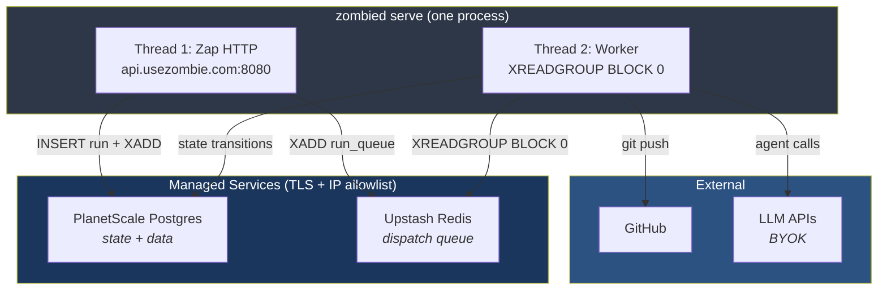
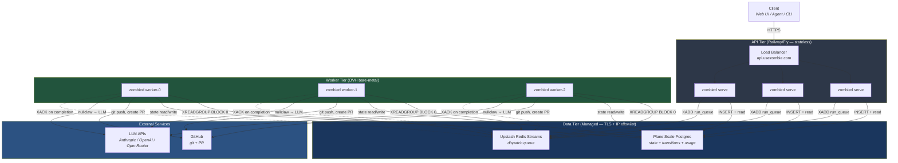
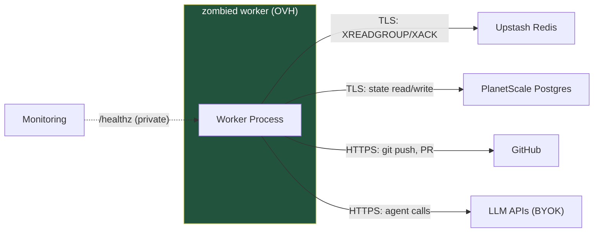
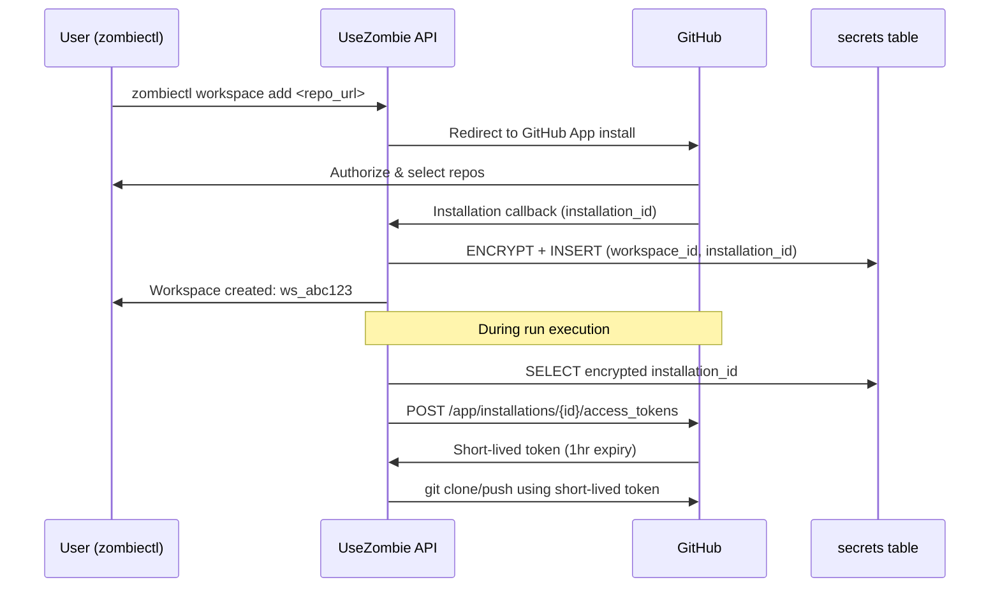
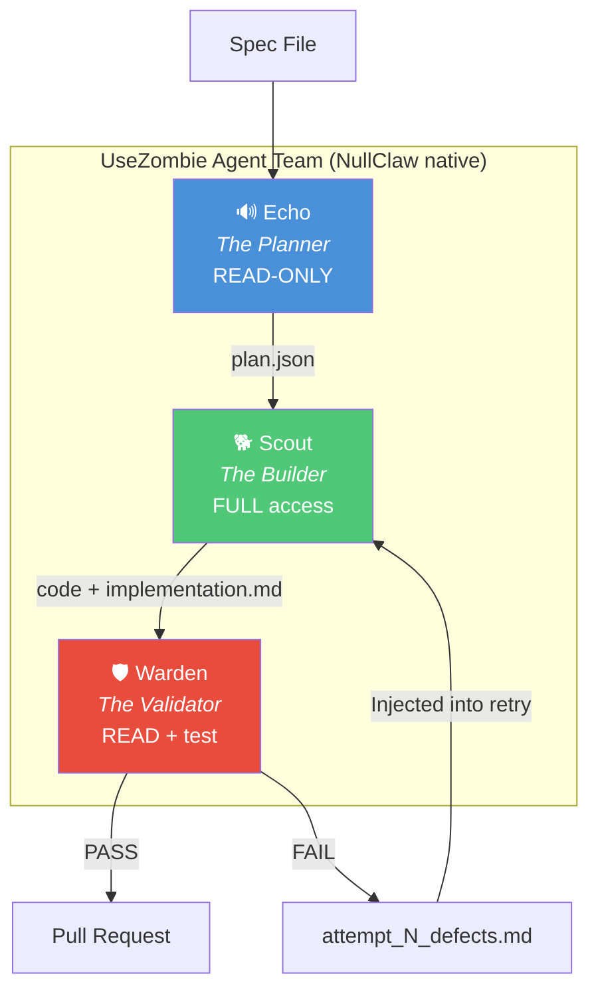
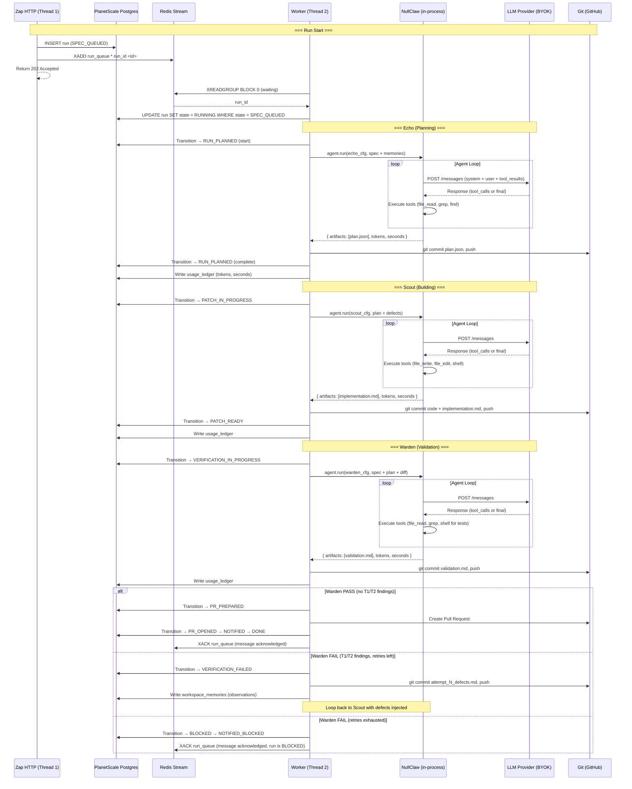
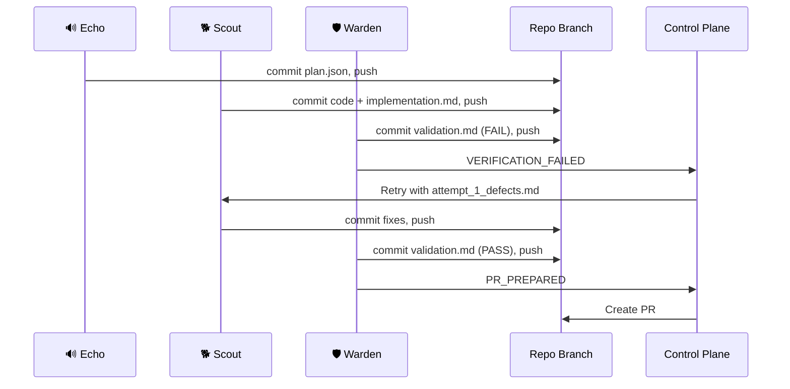
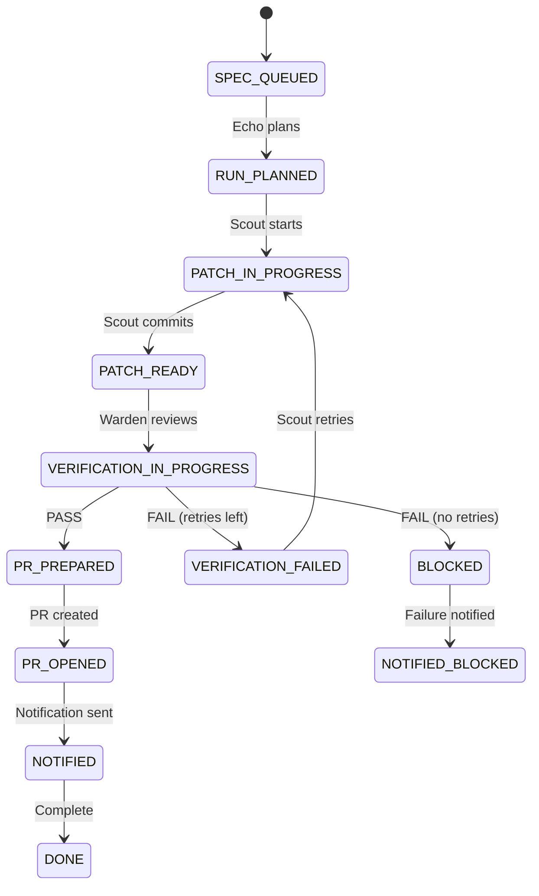

# UseZombie Architecture — Agent Delivery Control Plane

Date: Mar 3, 2026

## Goal

One Zig binary that takes a spec file and ships a validated PR.

1. NullClaw is imported as a Zig library (`@import("nullclaw")`). Native calls, not subprocess.
2. Control plane, agent runtime, and sandbox are the same binary.
3. Git branch is the distributed state. Any worker can run any stage.

## The Stack

```
4 things. That's it.

┌──────────────────────────────────────────────┐
│  zombied         One Zig binary (~2-3MB)     │
│                  ├── @import("nullclaw")      │
│                  ├── HTTP API (Zap)           │
│                  ├── State machine            │
│                  └── Landlock/Bubblewrap      │
│                                              │
│  PlanetScale     Postgres (state + data)     │
│  Redis           Streams (dispatch queue)    │
│  git             Bare clone + worktree       │
└──────────────────────────────────────────────┘

Two modes, same binary:
  zombied serve    HTTP API only (stateless, behind LB)
  zombied worker   Agent pipeline (blocks on Redis stream)
  M1: serve does both. M2+: split them.

Dispatch: Redis Streams from day one.
  API  → XADD run_queue        (instant, fire-and-forget)
  Worker → XREADGROUP BLOCK 0  (blocks until work, zero CPU)
  Worker → XACK after completion (reliable delivery)

Scale path:
  → More throughput    N workers in same consumer group, each gets unique work
  → More API capacity  N serve instances behind load balancer
  → Dead worker        XAUTOCLAIM reclaims unacked messages after timeout
  → Distributed        any worker fetches branch, runs stage, pushes

NOT in the stack:
  TypeScript, Bun, Node, npm, Docker, Kubernetes, Daytona,
  Rivet, Temporal, Firecracker, Nomad, gRPC
```

## 5-Layer Architecture

```
┌─────────────────────────────────────────────┐
│ 1. Intent        Spec files, API calls      │
├─────────────────────────────────────────────┤
│ 2. Policy        Budget, retry, action class│
├─────────────────────────────────────────────┤
│ 3. Orchestration State machine, scheduling  │
├─────────────────────────────────────────────┤
│ 4. Execution     NullClaw (native, in-proc) │
├─────────────────────────────────────────────┤
│ 5. Proof         Artifacts, audit trail     │
└─────────────────────────────────────────────┘
```

## v1 Execution Profile

1. M1 is **control plane + agent pipeline** in one binary.
2. Active ingress: **web + agent API**.
3. HTTP API via Zap (Zig). 6 endpoints.
4. NullClaw called natively via `@import`. No subprocess, no stdout parsing.
5. Isolation: NullClaw's built-in Landlock/Bubblewrap. No containers.
6. Git branch is the handoff between stages. Works local. Works distributed.

## Runtime Concurrency Model

`nullclaw.agent.run()` is a **blocking call**. Each agent invocation is a multi-turn LLM loop (send prompt → get response → call tool → repeat) that can run for minutes. This has direct implications for how the binary operates.

### M1: Two-thread model

```
┌─────────────────────────────────────────────┐
│  Thread 1: Zap HTTP server                  │
│  ├── /healthz             (always responds) │
│  ├── /v1/runs POST        (DB + XADD)      │
│  ├── /v1/runs/:id GET     (reads from DB)   │
│  ├── /v1/runs/:id:retry   (DB + XADD)      │
│  └── ... (all 6 endpoints)                  │
│                                             │
│  Thread 2: Worker loop                      │
│  ├── XREADGROUP BLOCK 0   (waits on Redis)  │
│  ├── UPDATE run state → RUNNING             │
│  ├── nullclaw.agent.run(echo)   [blocking]  │
│  ├── git commit + push                      │
│  ├── nullclaw.agent.run(scout)  [blocking]  │
│  ├── git commit + push                      │
│  ├── nullclaw.agent.run(warden) [blocking]  │
│  ├── git commit + push                      │
│  ├── XACK run_queue                         │
│  └── create PR or retry                     │
└─────────────────────────────────────────────┘
```

**Thread 1 (Zap HTTP):** Accepts API requests, writes to Postgres, pushes `run_id` to Redis stream via `XADD`, returns immediately. Never blocks on agent execution. `/healthz` always responds. `POST /v1/runs` inserts a run record with state `SPEC_QUEUED`, does `XADD run_queue * run_id <id>`, and returns `202 Accepted`.

**Thread 2 (Worker):** Blocks on `XREADGROUP ... BLOCK 0` — zero CPU while idle, wakes instantly when work arrives. Claims the run in Postgres (`UPDATE ... SET state = RUNNING WHERE run_id = ? AND state = SPEC_QUEUED`). Executes the full Echo → Scout → Warden pipeline. Each `nullclaw.agent.run()` call blocks this thread until the agent completes. Records transitions to Postgres between stages. Calls `XACK` after pipeline completion (or failure) to acknowledge the message.

**Dead worker recovery:** If a worker dies before `XACK`, the message stays in Redis's pending entries list (PEL). A background sweep (or another worker) calls `XAUTOCLAIM` to reclaim messages pending longer than a timeout (e.g., 30 minutes). The run's Postgres state is still `SPEC_QUEUED` or mid-pipeline — the claiming worker picks up from the last committed state.

### M1 constraint: one spec at a time

M1 runs one spec at a time. The worker thread processes one run to completion (or failure) before picking the next. This is sufficient for dogfood. The API can accept and queue multiple runs — they wait in the Redis stream.

### Timeout and kill mechanism

The worker thread sets a **wall-clock deadline** per agent call. Implementation:

```zig
// Worker spawns agent with timeout
const deadline = std.time.nanoTimestamp() + (max_agent_seconds * std.time.ns_per_s);
const result = nullclaw.agent.run(cfg, .{
    .message = prompt,
    .timeout_ns = max_agent_seconds * std.time.ns_per_s,
    .sandbox = sandbox_cfg,
});
// NullClaw respects timeout internally — returns error.AgentTimeout
```

If NullClaw's internal timeout fails (hung LLM call, stuck tool), the worker thread can force-cancel via NullClaw's abort API. The HTTP thread remains responsive throughout — it can report the run as `BLOCKED` via `GET /v1/runs/:id`.

### Metering during execution

Usage metering is recorded **after each agent call returns**, not during. The worker writes `agent_seconds` and `token_count` to `usage_ledger` between stages. The HTTP thread can query `usage_ledger` at any time.

### Scale path

When one-spec-at-a-time is insufficient:

1. **More workers:** Run N instances of `zombied worker`. All join the same Redis consumer group. Each gets unique work — no double-dispatch.
2. **Separate API and worker modes:** `zombied serve` (HTTP only) and `zombied worker` (pipeline only). Same binary, different entry point. API pushes to Redis stream, workers read from it.
3. **Dead worker recovery:** `XAUTOCLAIM` reclaims unacked messages after timeout. No orphan runs.

---

## Deployment Topology

### M1: Combined mode (single node)

One node runs `zombied serve` which starts both the HTTP API and the worker loop.



Single URL: `https://api.usezombie.com` → reverse proxy → `:8080`.

Both PlanetScale and Upstash are managed services accessed over TLS. IP allowlisted to the single node's IP.

### M2+: Split mode (API + dedicated workers)

Separate the binary into two roles. Same binary, different subcommand.



**Key topology rules:**

1. **`zombied serve`** — HTTP API only. Stateless. Horizontally scalable behind a load balancer. Single public URL: `api.usezombie.com`. Writes to Postgres + pushes to Redis stream. Runs on PaaS (Railway/Fly/Render).
2. **`zombied worker`** — Agent execution only. Blocks on Redis stream (`XREADGROUP BLOCK 0`). Wakes instantly when work arrives, zero CPU while idle. **No inbound HTTP needed** (except `/healthz` on a private port for monitoring). Runs on bare-metal/VMs (OVH).
3. **Workers don't need public DNS names.** They are not called by the API server. The API pushes `run_id` to Redis → worker pops it → worker reads/writes Postgres for state → pushes to git. No callbacks, no webhooks between API and worker.
4. **Two coordination points:** Redis for dispatch (what to work on), Postgres for state (what happened). API servers and workers never communicate directly.
5. **All connections are TLS + IP allowlisted.** Both PlanetScale and Upstash are managed services. IP allowlists locked to known API node and worker node IPs.

### Worker networking

Workers connect outbound to four services. No inbound connections required.



Workers are fire-and-forget compute nodes. If a worker dies, the unacked Redis message is reclaimed by another worker via `XAUTOCLAIM`.

### Network security model

All external services are accessed over TLS on the public internet. This is the standard model for managed infrastructure.

| Service | Transport | Auth | Access control |
|---------|-----------|------|---------------|
| PlanetScale Postgres | TLS (mandatory) | Connection string credentials | IP allowlist |
| Upstash Redis | TLS (mandatory) | Token in connection string | IP allowlist + Redis ACLs |
| GitHub | HTTPS | GitHub App installation token | Per-repo granular permissions via App |
| LLM APIs | HTTPS | API key (BYOK) | Key-scoped |

**Defense-in-depth (when compliance requires it):** Upstash Pro offers VPC Peering and AWS PrivateLink. PlanetScale offers similar. Alternatively, add all nodes to a [Tailscale](https://tailscale.com) mesh — workers connect to data services via Tailscale exit node, removing public-internet exposure entirely. Zero config, no gateway VM needed. Upgrade when compliance requires zero public-internet DB traffic — not needed for M1/M2.

## Credential Model

### Solution: Per-workspace GitHub App installation

Auth path is GitHub App OAuth. One path. No fallbacks.

**Flow:**

1. UseZombie registers as a GitHub App (one-time operator setup).
2. User runs `zombiectl login` → Clerk OAuth → authenticated.
3. User runs `zombiectl workspace add <repo_url>` → browser opens GitHub App install flow.
4. User grants repo access → GitHub sends installation token to UseZombie callback.
5. UseZombie stores installation ID encrypted in `secrets` table (`key_name = 'github_app_installation_id'`).
6. Worker uses installation ID to generate short-lived tokens (GitHub App JWT → installation access token).
7. Short-lived tokens used for git clone/push and PR creation — auto-expire after 1 hour.

**Why GitHub App over PAT:**

- Per-repo granular permissions (not user-wide).
- Short-lived tokens (1 hour, not permanent).
- Installation can be revoked per-repo without rotating a user's PAT.
- Audit trail: GitHub logs which app accessed what.

No fallback. Every workspace must have a GitHub App installation. No `GITHUB_PAT` env var path.

**Storage:**

| Field | Value |
|-------|-------|
| Table | `secrets` |
| `workspace_id` | FK to workspace |
| `key_name` | `github_app_installation_id` |
| `encrypted_value` | AES-256-GCM encrypted installation ID |
| `created_at` | Timestamp |



---

## Client Interfaces

### zombiectl (CLI)

`zombiectl` is the primary client interface for end-users. Node.js + TypeScript, distributed via `npx zombiectl`. See `docs/spec/v1/M2_007_CLI_ZOMBIECTL.md` for the full milestone spec.

**Core commands:**

| Command | Purpose |
|---------|---------|
| `zombiectl login` | Browser OAuth via Clerk |
| `zombiectl workspace add <repo_url>` | Install GitHub App on repo, create workspace |
| `zombiectl workspace list` | List connected workspaces |
| `zombiectl specs sync [path]` | Sync PENDING_*.md specs to workspace |
| `zombiectl run [spec_id]` | Trigger a run |
| `zombiectl run status <run_id>` | Watch run progress |
| `zombiectl runs list` | List recent runs with status |
| `zombiectl doctor` | Check connectivity, auth, workspace health |

**Tech stack:** `commander` (CLI framework), Clerk SDK (device auth flow), typed API client from `public/openapi.json`, config at `~/.zombie/config.json`.

**`zombied run` (binary subcommand):** M1 implementation pending — currently routes to the HTTP API via `zombiectl run`.

### usezombie.sh (Agent Discovery)

`https://usezombie.sh` is the `/agents` route — the agent landing page for machine-readable discovery. An LLM agent browsing `usezombie.sh` finds `agent-manifest.json`, discovers the UseZombie API, and can install `zombiectl` to onboard workspaces and trigger runs. `skill.md` at `usezombie.sh/skill.md` contains onboarding instructions that reference `zombiectl`.

### Web UI

Status dashboard at `usezombie.com`. Read-only run monitoring for M1. Not the primary interface — `zombiectl` is.

### HTTP API

6 endpoints served by Zap. See `public/openapi.json` for the canonical spec. All client interfaces (CLI, web, agents) call this API.

---

## Assumptions

1. GitHub is the only forge.
2. Agents (`echo`, `scout`, `warden`) run via `nullclaw.agent.run()` — native Zig calls.
3. Web UI and agent clients call control plane HTTP API directly.
4. Single binary deploys anywhere: bare metal, VM, your laptop.

## Design Principles

1. **One binary.** Control plane + agent runtime + sandbox in one static Zig binary. Deploy by copying a file.
2. **Native calls.** `@import("nullclaw")` — typed results, Zig errors with stack traces, zero serialization.
3. **Git is the bus.** Feature branch is shared state. Commit + push between stages. Any machine can run any stage.
4. **State machine is the orchestrator.** 11 states, 12 transitions, Postgres table. No workflow engine.
5. **Isolate the agent.** Landlock/Bubblewrap sandbox. Zero secrets in agent context. Control plane is credential proxy.
6. **Less moving parts.** If you can't draw the architecture on a napkin, it's too complex.

---

## The Agent Team

Three NullClaw agent invocations per run. Each with distinct config, tools, and system prompt.



#### 🔊 Echo — The Planner
**Config:** `echo.json` — tools: `file_read`, `grep`, `find`, `ls`.
**Output:** `plan.json`

#### 🐕 Scout — The Builder
**Config:** `scout.json` — tools: `file_read`, `file_write`, `file_edit`, `shell`.
**Output:** code commits + `implementation.md`

#### 🛡️ Warden — The Validator
**Config:** `warden.json` — tools: `file_read`, `grep`, `find`, `shell`.
**Output:** `validation.md` with tiered findings (T1-T4).

---

## Agent Execution Model

NullClaw is called as a native Zig library. No process spawn. No stdout parsing.

```zig
const nullclaw = @import("nullclaw");

// Load agent config
const echo_cfg = try nullclaw.config.load("echo.json");

// Run agent — native call, typed result
const plan = try nullclaw.agent.run(echo_cfg, .{
    .message = spec_content ++ repo_context ++ memory_context,
    .sandbox = .{ .mode = .bubblewrap, .allow_paths = &.{workspace_path} },
});

// plan.artifacts — typed, not stdout parsing
// plan.token_count — for metering
// plan.exit_status — Zig error, not exit code
```

### Inside `nullclaw.agent.run()` — the agent loop

NullClaw doesn't shell out to Claude Code or OpenCode. It IS the agent runtime. It makes direct HTTP calls to LLM APIs and executes tools in a loop until completion.

```
nullclaw.agent.run(cfg, opts)
    │
    ┌──────────────── AGENT LOOP ────────────────┐
    │                                             │
    │  1. Build prompt                            │
    │     ├── system prompt (from config)         │
    │     ├── user message (spec + context)       │
    │     └── tool results (from prior turns)     │
    │                                             │
    │  2. HTTP POST → LLM provider                │
    │     (Anthropic, OpenAI, OpenRouter, etc.)   │
    │     Using BYOK API key from config          │
    │                                             │
    │  3. Parse LLM response                      │
    │     ├── tool_calls? → execute tools:        │
    │     │   file_read, file_write, file_edit,   │
    │     │   shell, grep, find, ls               │
    │     │   (scoped by vtable config)           │
    │     │   → append results → GOTO step 1      │
    │     │                                       │
    │     ├── final answer? → extract artifacts   │
    │     │   → RETURN typed result               │
    │     │                                       │
    │     ├── timeout? → RETURN error.AgentTimeout│
    │     └── max_turns? → RETURN error.MaxTurns  │
    │                                             │
    └─────────────────────────────────────────────┘
    │
    Returns: {
      .artifacts    // plan.json, implementation.md, etc.
      .token_count  // for metering
      .turn_count   // number of LLM round-trips
      .wall_seconds // for agent-second billing
    }
```

**Key design points:**
- The loop is blocking. The calling thread waits until the agent completes or times out.
- Each tool execution is sandboxed by Bubblewrap (filesystem, network, PID isolation).
- Tool permissions are enforced by the vtable config — Echo can't write files, Scout can.
- The LLM provider is configured per-agent (could use different models for Echo vs Scout).
- Token usage is tracked per-turn and aggregated in the return value.

### Full run sequence



### Execution sequence (text)

```
zombied binary (one process)
    │
    ├── nullclaw.agent.run(echo_cfg, spec + context)
    │   └── Returns: plan.json (typed result)
    │
    ├── git commit plan.json → git push
    │
    ├── nullclaw.agent.run(scout_cfg, plan + defects)
    │   └── Returns: code changes + implementation.md
    │
    ├── git commit code + implementation.md → git push
    │
    ├── nullclaw.agent.run(warden_cfg, spec + plan + diff)
    │   └── Returns: validation.md with tiered verdict
    │
    ├── git commit validation.md → git push
    │
    └── If PASS: create PR. If FAIL and retries remain: loop to Scout.
```

### Git branch as distributed state

Each stage commits and pushes to the feature branch. This means:

**Same machine (M1):** All three agents run sequentially in one process. Git push between stages is optional (local worktree is shared).

**Distributed (scale):** Each stage can run on any machine. Worker fetches branch, runs agent, commits, pushes. Next worker fetches, continues.

```
Worker A: git fetch → Echo → commit plan.json → push
Worker B: git fetch → Scout → commit code → push
Worker C: git fetch → Warden → commit validation.md → push
```

No shared filesystem. No NFS. No S3 sync. Git push/pull. Workers are stateless.

### Handoff mechanism

- **Local (M1):** shared git worktree. Files on disk.
- **Distributed:** git branch. Commit + push between stages. Any worker fetches and continues.
- **Artifacts:** always committed to feature branch under `docs/runs/<run_id>/`.

---

## Feedback Loop and Artifacts

### Run artifacts

```
docs/runs/<run_id>/
├── plan.json              # 🔊 Echo
├── implementation.md      # 🐕 Scout
├── validation.md          # 🛡️ Warden (tiered T1-T4)
├── attempt_1_defects.md   # If retry
└── run_summary.md         # Final summary
```

### Retry flow



---

## Cross-Run Memory

### Layer 1: PlanetScale (cross-run)

`workspace_memories` table. Written by worker at run end. Injected into Echo's prompt at next run start.

### Layer 2: NullClaw SQLite (per-run)

NullClaw's built-in hybrid vector+FTS5 SQLite for within-run context. Ephemeral — created at run start, gone at end.

### Layer 3: Prompt auto-tightening (when needed)

Same defect 3+ times → promoted to permanent agent config rule.

---

## State Machine



Every transition: append-only `run_transitions` table. Timestamp, actor, reason_code, attempt.


---

## Why Zig. Why NullClaw. Why Not X.

### Why Zig (not TypeScript/Bun)

The original proposal had a TypeScript/Bun control plane (Hono + Drizzle) spawning NullClaw as a subprocess. This was rejected.

| | TypeScript/Bun + subprocess | Zig + `@import(“nullclaw”)` |
|---|---|---|
| **Deploy artifact** | Node runtime + dependencies + NullClaw binary | One static binary (~2-3MB) |
| **Agent integration** | Spawn process, parse stdout, handle exit codes | Native call, typed result, Zig error union |
| **Language boundary** | TypeScript ↔ Zig via JSON over pipes | None. Same language. Same types. |
| **Error handling** | Exit codes + stderr parsing | Zig errors with stack traces |
| **Runtime deps** | Node.js/Bun, npm packages | Zero. Static binary. |

**Decision:** One binary. No language boundary. No subprocess. No TypeScript anywhere.

### Why NullClaw (not PI SDK, Claude Agent SDK, or raw LLM calls)

| | NullClaw | PI SDK / Claude Agent SDK | Raw LLM API calls |
|---|---|---|---|
| **Language** | Zig (678KB static binary) | TypeScript (~28MB with Node) | Any |
| **Startup** | <2ms | >500ms | N/A |
| **Memory** | ~1MB | >1GB | Depends |
| **LLM providers** | 22+ (Anthropic, OpenAI, OpenRouter, etc.) | 1 (Anthropic only / OpenAI only) | Manual per-provider |
| **Built-in tools** | file_read, file_write, file_edit, shell, grep, find, ls, memory | Varies | None |
| **Sandbox** | Landlock/Bubblewrap (OS-level) | None (application-level) | None |
| **Tool permissions** | vtable config (compile-time enforcement) | Runtime checks | Manual |
| **Tests** | 3,230+ | ~50 | N/A |

**Decision:** NullClaw from day one. No throwaway code. Every line carries forward.

### Why not Daytona (container sandbox)

Daytona provides Docker/OCI container sandboxes with sub-90ms creation, file sync, and snapshot/resume. It's a good product for running untrusted code in containers.

**Rejected because:**
1. NullClaw already has OS-level sandboxing (Landlock/Bubblewrap) built in — PID, mount, and network namespace isolation without Docker.
2. Adding a container platform means managing Docker, images, registries, volume mounts, and network policies. More moving parts.
3. Daytona adds 2-5 seconds boot time per sandbox. NullClaw's native sandbox adds <2ms.
4. Container isolation is a superset of what we need for M1. Bubblewrap provides the same security boundary with less complexity.

**Reference:** Daytona (daytona.io) — secure sandbox infrastructure for AI-generated code. Python and TypeScript SDKs. $0.0504/hour per vCPU. Integrates with Rivet Sandbox Agent SDK.

### Why not Rivet (actor framework)

Rivet provides stateful serverless actors with in-memory state, SQLite persistence, workflows, queues, and scheduling. Their Sandbox Agent SDK can remotely control Claude Code, Codex, OpenCode, and Amp.

**Rejected because:**
1. We run 3 sequential agent calls per spec, not 100K concurrent actors. A Postgres state machine (11 states, 12 transitions) is the right abstraction.
2. Adding an actor framework is a second orchestration layer on top of the state machine we already have.
3. Rivet's value is in long-lived stateful actors and deterministic workflow replay. Our agents are ephemeral — start, run, return result, done.
4. The scale path (more worker processes in a Redis consumer group) is simpler than actor lifecycle management.

**Reference:** Rivet (rivet.dev) — stateful serverless primitives. Rust engine. Supports Firecracker VMs. Sandbox Agent SDK for remote agent control (Claude Code, Codex, OpenCode, Amp).

### Why not workflow engines (Temporal, Nomad)

Same argument as Rivet. The state machine IS the orchestrator. 11 states, 12 transitions, Postgres table. Adding Temporal or Nomad is a second orchestration layer for a pipeline that runs 3 sequential calls.

---

## Tech Stack

| Component | Choice | Why |
|-----------|--------|-----|
| Everything | **Zig** (one binary) | `@import("nullclaw")` — native agent runtime, typed errors, one deploy artifact |
| HTTP API | **Zap** | Fast Zig HTTP server. 6 endpoints. |
| Agent runtime | **NullClaw** (native) | vtable interfaces, 22+ LLM providers, built-in sandbox |
| Database | **PlanetScale Postgres** | State, memories, transitions, artifacts index |
| Dispatch queue | **Upstash Redis Streams** | Consumer groups, XACK, XAUTOCLAIM. Managed, TLS + IP allowlist. |
| Git | **libgit2** | Native git operations via libgit2 — clone, checkout, push. No subprocess. |
| Code host | **GitHub REST API** | PR creation |
| Secrets | **AES-256-GCM** in PlanetScale | NullClaw's built-in security module for runtime |
| Sandbox | **Landlock/Bubblewrap** | NullClaw built-in. OS-level. No containers. |
| Observability | **Langfuse + OTel** | Structured events. Signal analysis when needed. |
| Payments | **Dodo** (feature-flagged) | Deferred. |

---

## Security and Isolation

### Threat model

| Threat | Mitigation |
|--------|------------|
| Cross-tenant code access | Bubblewrap: isolated PID/mount/network namespaces per run |
| Agent escapes sandbox | Landlock kernel filesystem restriction + Bubblewrap |
| Secret exfiltration | Zero secrets in agent context. Control plane is credential proxy. |
| Rogue network calls | Bubblewrap network namespace: allowlisted endpoints only |
| Runaway agent | Kill timeout. Control plane force-kills. |
| Prompt injection | Scoped tool permissions per agent config (vtable) |
| Unauthorized DB access | PlanetScale TLS (enforced) + IP allowlist + per-role credentials |
| DB credential leak | Credentials in Proton Pass vaults, rotated quarterly. Separate roles for API vs workers. |

### Sandbox

```zig
// NullClaw sandbox is a config option, not a platform
const result = try nullclaw.agent.run(scout_cfg, .{
    .message = plan_content,
    .sandbox = .{
        .mode = .bubblewrap,
        .allow_paths = &.{"/workspace"},
        .allow_net = &.{"control-plane.internal", "api.anthropic.com"},
    },
});
```

### Secrets lifecycle

1. **At rest:** AES-256-GCM in PlanetScale.
2. **In transit:** Short-lived session token + HTTPS.
3. **In agent:** Zero secrets. Agent gets `SESSION_TOKEN`, `CONTROL_PLANE_URL`, `SESSION_ID`. Calls back for credentials.
4. **In prompts:** System prompts prohibit secret logging/committing.

---

## Git Operations

1. **First run:** `git clone --bare` → `/cache/<workspace_id>.git`
2. **Each stage:** `git fetch` → `git worktree add` → run agent → `git commit` → `git push`
3. **After run:** `git worktree remove`
4. **Distributed:** any machine with git access can run any stage

---

## Machine-Readable API Surfaces

Three canonical files in `public/` describe the live API to both humans and agents. They must never drift from each other.

| File | Audience | Content |
|------|----------|---------|
| `public/openapi.json` | Typed clients, SDK generators | Canonical source of truth. All 6 operationIds, request + response schemas. |
| `public/agent-manifest.json` | AI agents, discovery crawlers | JSON-LD (`@type: SoftwareApplication`). Mirrors all 6 operationIds + action class mapping. |
| `public/llms.txt` | LLM context windows | Plain-text discovery: base URL, all 6 operationId:method:path tuples, artifact names. |
| `public/skill.md` | Agent skill registries | Markdown skill card: what UseZombie does, endpoint table, run lifecycle, artifact list. |

**Sync rule:** any endpoint change requires same-PR updates to all four surfaces. CI validates that operationIds in agent-manifest.json and llms.txt match openapi.json.

### Served routes

```
GET /openapi.json    → public/openapi.json
GET /agents          → public/agent-manifest.json  (JSON-LD)
GET /llms.txt        → public/llms.txt
GET /skill.md        → public/skill.md
```

---

## Policy Enforcement Model

Every control action is classified before execution. Classification is encoded in `src/http/handler.zig` (runtime) and `public/agent-manifest.json` (discovery).

### Action class table

| Endpoint | operationId | Class |
|----------|-------------|-------|
| `GET /v1/runs/{run_id}` | get_run | `safe` |
| `GET /v1/specs` | list_specs | `safe` |
| `GET /healthz` | — | `safe` |
| `POST /v1/workspaces/{workspace_id}:sync` | sync_specs | `safe` |
| `POST /v1/runs` | start_run | `sensitive` |
| `POST /v1/runs/{run_id}:retry` | retry_run | `sensitive` |
| `POST /v1/workspaces/{workspace_id}:pause` | pause_workspace | `sensitive` |

### Enforcement modes

| Mode | Behaviour |
|------|-----------|
| **M1 permissive** (default) | Every handler call writes a `policy_decision` row (`allow`) to the `policy_events` table. Full audit trail. No gate blocks requests. |
| **strict** (future, `POLICY_ENFORCE=strict`) | Sensitive actions require explicit confirmation token. Critical actions require double confirmation + identity proof. |

### Policy event record

Every sensitive action writes to `policy_events` via `src/state/policy.zig:recordPolicyEvent()`:

```
run_id, workspace_id, action_class, decision, rule_id, actor, ts
```

Rule IDs: `m1.start_run`, `m1.retry_run`, `m1.pause_workspace`.

SLO targets and alert thresholds are encoded in `config/policy.json` under `slos` and `alerts` keys and loaded by the worker loop.

---

## Out of Scope for M1

1. OAuth / user registration (API key only)
2. Web UI beyond status dashboard
3. GitLab / Bitbucket (GitHub only)
4. Billing (metering recorded, billing deferred)
5. Chat/voice
6. Multi-region

---

## Source References

1. `docs/GTM.md`
2. `docs/DEPLOYMENT.md`
3. `docs/spec/v1/KICKOFF.md`
4. `docs/done/v1/DONE_M1_000_CONTROL_PLANE_NULLCLAW_BASELINE.md`
5. `docs/done/v1/DONE_M1_002_API_AND_EVENTS_CONTRACTS.md`
6. `docs/done/v1/DONE_M1_003_OBSERVABILITY_AND_POLICY.md`
7. `docs/USECASE.md`
8. `docs/spec/v1/M2_007_CLI_ZOMBIECTL.md`
