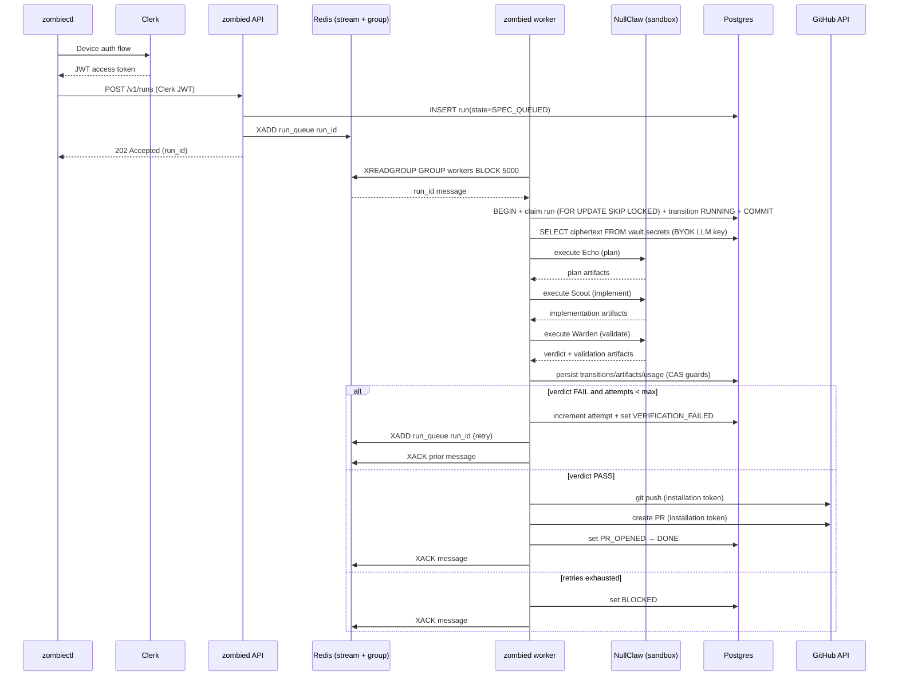
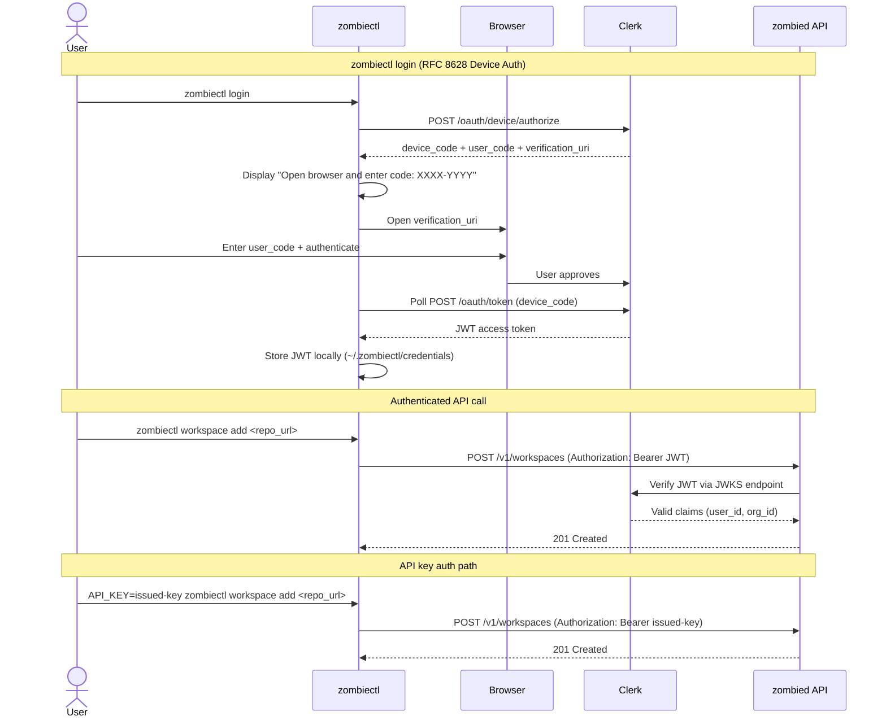
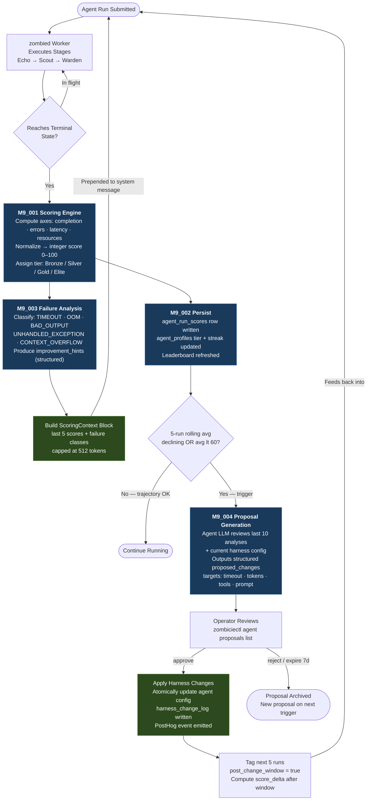

# UseZombie Architecture (v1 Canonical)

Date: Mar 4, 2026
Status: Canonical architecture baseline for v1 planning and implementation

## Goal

UseZombie accepts a spec request and produces a validated pull request through a deterministic worker loop with explicit retry, policy checks, and auditable artifacts.

## Version Roadmap

### v1 — Ship (CLI-first launch)

1. **Queue:** Redis streams for worker coordination (replaces Postgres polling).
2. **Execution:** NullClaw runs directly on the worker host with built-in sandbox (Landlock on Linux).
3. **Git:** Hardened git CLI subprocess (hook disabling, timeouts, error handling).
4. **Auth:** Clerk (device flow for CLI, JWT for API, M2M for agents).
5. **Delivery:** `zombiectl` CLI (`npx zombiectl`).
6. **Website:** Static marketing at `usezombie.com` + agent discovery at `usezombie.sh`.

### v2 — Harden (production multi-tenant)

1. **Execution:** Firecracker microVMs — NullClaw runs inside VMs, worker becomes orchestrator.
2. **Git:** libgit2 (native calls, no subprocess).
3. **Scaling:** Multi-worker concurrency, token bucket rate limiting.
4. **Encryption:** Full envelope encryption with KMS-backed KEK.
5. **Analytics:** PostHog Zig SDK integration.

### v3 — Scale (platform)

1. **Mission Control UI:** `app.usezombie.com` (Vercel + Clerk frontend).
2. **Team model:** Workspaces, teams, branch-level access (design TBD in v2).
3. **Billing:** Dodo integration, agent-second metering.
4. **Auth:** GitHub + Google login via Clerk (no SSO/SAML).

## Canonical Assumptions

1. `zombied` is split into two roles:
   - API role (`zombied serve`)
   - Worker role (`zombied worker`)
2. Postgres is the source of truth for run state and artifacts metadata.
3. Redis is mandatory for queueing and worker coordination.
4. Service-to-service access is constrained through **Tailscale** network policy plus provider allowlists.
5. v1 delivery target is CLI-first (`zombiectl`); Mission Control UI (`app.usezombie.com`) is v3.
6. v1 git operations use hardened CLI subprocess; v2 migrates to **libgit2**.
7. v1 execution uses NullClaw built-in sandbox; v2 migrates to **Firecracker microVMs**.

## System Components

1. `zombiectl`: CLI used by humans/agents to submit specs and monitor runs.
2. `zombied API`: validates requests, persists run metadata, enqueues work to Redis.
3. `zombied worker`: claims queued work from Redis, executes agent loop, writes state transitions, opens PRs.
4. `Redis`: stream-based queue + consumer-group coordination.
5. `Postgres`: run state, transitions, usage, artifact index, policy events, secrets (vault schema).
6. `Clerk`: authentication for CLI (device flow), API (JWT), and M2M (client credentials).
7. `NullClaw`: agent runtime for Echo/Scout/Warden execution.

## Canonical Execution Lifecycle

1. `spec request`: `zombiectl` submits run request to API (Clerk JWT auth).
2. `worker scheduling`: API writes run row in Postgres and enqueues `run_id` in Redis stream.
3. `sandbox execution`: worker claims message via XREADGROUP, resolves active workspace profile (fallback `default-v1` when no active profile exists), and runs profile-defined stages via NullClaw.
4. `result evaluation`: worker persists verdict and artifacts metadata in Postgres.
5. `iteration loop`: on validation fail with retries available, worker re-enqueues the same `run_id` with incremented attempt.
6. `PR creation`: on pass, worker pushes branch and creates PR via GitHub App installation token.

## Dynamic Agent Profile Use Case (M5_008 Step 1)

This is the canonical profile workflow for v1.

1. Operator stores profile source:
   - `PUT /v1/workspaces/{workspace_id}/harness/source`
2. Operator compiles candidate profile:
   - `POST /v1/workspaces/{workspace_id}/harness/compile`
3. Operator activates a valid compiled version:
   - `POST /v1/workspaces/{workspace_id}/harness/activate`
4. Runtime resolves active profile for execution:
   - `GET /v1/workspaces/{workspace_id}/harness/active`
5. Worker executes stage topology from resolved profile and persists run artifacts with profile snapshot linkage.

Immutable audit linkage contract (sync, DB-backed):
- `COMPILE` artifact row records `compile_job_id -> profile_version_id`.
- `ACTIVATE` artifact row records `profile_version_id` and parent compile artifact when available.
- `RUN` artifact row records `run_id -> profile_version_id` and parent activate artifact.
- All linkage artifacts are append-only rows in `profile_linkage_audit_artifacts` (updates/deletes rejected by trigger).
- `GET /v1/runs/{run_id}` exposes queryable linkage IDs (`run_artifact_id`, `activate_artifact_id`, `compile_artifact_id`, `compile_job_id`, `profile_version_id`).
- "Immutable" means Postgres is the append-only authority; downstream ClickHouse/Langfuse linkage views are async projections only.

Fail-closed behavior:
- Invalid profile versions cannot activate.
- Cross-workspace profile selection is rejected by workspace-scoped queries and tenant checks.
- If no active profile exists, runtime uses `default-v1` deterministic fallback.

### Operator Runbook Snippet (API-first, deterministic)

Set required context:

```bash
export API_BASE_URL="http://localhost:3000"
export WORKSPACE_ID="ws_123"
export AUTH_HEADER="Authorization: Bearer <jwt>"
```

1. Put harness source markdown:

```bash
curl -sS -X PUT "$API_BASE_URL/v1/workspaces/$WORKSPACE_ID/harness/source" \
  -H "$AUTH_HEADER" \
  -H "Content-Type: application/json" \
  -d @- <<'JSON'
{
  "name": "Workspace Harness",
  "source_markdown": "# Harness\n```json\n{\"profile_id\":\"ws_123-harness\",\"stages\":[{\"stage_id\":\"plan\",\"role\":\"planner\",\"skill\":\"echo\"},{\"stage_id\":\"implement\",\"role\":\"implementer\",\"skill\":\"scout\",\"on_pass\":\"verify\",\"on_fail\":\"retry\"},{\"stage_id\":\"verify\",\"role\":\"security\",\"skill\":\"warden\",\"gate\":true,\"on_pass\":\"done\",\"on_fail\":\"retry\"}]}\n```"
}
JSON
```

Expected response keys: `profile_id`, `profile_version_id`.

2. Compile profile version:

```bash
curl -sS -X POST "$API_BASE_URL/v1/workspaces/$WORKSPACE_ID/harness/compile" \
  -H "$AUTH_HEADER" \
  -H "Content-Type: application/json" \
  -d '{"profile_id":"ws_123-harness"}'
```

Expected response keys: `compile_job_id`, `profile_version_id`, `is_valid`, `validation_report`.
Expected fail-closed behavior: `is_valid=false` when prompt-injection/unsafe patterns are present.

3. Activate compiled valid version:

```bash
curl -sS -X POST "$API_BASE_URL/v1/workspaces/$WORKSPACE_ID/harness/activate" \
  -H "$AUTH_HEADER" \
  -H "Content-Type: application/json" \
  -d '{"profile_version_id":"<pver_id>","activated_by":"operator"}'
```

Expected response keys: `profile_version_id`, `activated_by`, `activated_at`.

4. Resolve active profile used by runtime:

```bash
curl -sS "$API_BASE_URL/v1/workspaces/$WORKSPACE_ID/harness/active" \
  -H "$AUTH_HEADER"
```

Expected response keys: `source`, `profile_version_id`, `profile`.
Fallback behavior: `source="default-v1"` with `profile_version_id=null` when no active profile exists.

### Demo Evidence Checklist (Profile Switch Proof)

- Capture command output for source put with returned `profile_version_id`.
- Capture compile output showing `is_valid=true` and `compile_job_id`.
- Capture activate output for the same `profile_version_id`.
- Capture active-profile output showing activated `profile_version_id`.
- Trigger one run and capture run artifact/log showing stage IDs from resolved profile.
- Trigger one negative compile case (prompt-injection/unsafe text) and capture `is_valid=false` validation report.
- Store all command transcripts in PR/MR evidence notes for audit.

## Single Canonical Diagram (v1)



## Firecracker Execution Model (v2)

In v2, the worker becomes an orchestrator. Agent execution moves inside Firecracker microVMs:

```
Worker claims run from Redis
  → Prepares VM payload (spec, worktree snapshot, agent configs, BYOK key)
  → Boots Firecracker microVM (pre-warmed snapshot, <125ms boot)
  → VM contains: thin runner binary + NullClaw library + restricted egress
  → Runner executes Echo → Scout → Warden INSIDE the VM
  → Results returned to worker via vsock or HTTP callback
  → Worker persists artifacts to Postgres
  → Worker tears down VM
```

**Key constraints:**
- A single run stays on one worker. All three stages run on that host's VMs.
- Different runs distribute across workers via Redis consumer groups.
- Secrets are injected per-VM via vsock, never written to VM disk image.
- VM egress restricted to: LLM provider endpoints, GitHub API, control plane callback.

**Firecracker vs Daytona (Decision):** Firecracker directly. Strongest isolation boundary with predictable VM lifecycle. Daytona revisited only if managed multi-tenant orchestration is needed post-v2.

## Authentication Model

| Flow | Method | Token | Used by |
|---|---|---|---|
| CLI login | OAuth 2.0 Device Authorization (RFC 8628) | Clerk JWT | `zombiectl` |
| API requests | Bearer token | Clerk JWT or issued `API_KEY` | All clients |
| Agent pipelines | OAuth 2.0 Client Credentials | Clerk M2M JWT | AI PM agents, CI |
| GitHub operations | GitHub App installation token | `ghs_...` (1hr, repo-scoped) | Worker git ops |
| API key auth | Bearer API key | `API_KEY` | Users or operators issued API keys |

### CLI Authentication Flow (Device Authorization)



## Security Model

### Network (Tailscale)

1. API and worker nodes join the same Tailscale tailnet.
2. Only API/worker nodes are allowed to reach Postgres and Redis.
3. Managed Postgres/Redis: enforce fixed egress IP allowlists from Tailscale nodes.
4. Workers have no direct internet ingress.

### Database (Role Separation)

| Role | `public` schema | `vault` schema |
|---|---|---|
| `api_accessor` | SELECT, INSERT, UPDATE | No access |
| `worker_accessor` | SELECT, INSERT, UPDATE | SELECT, INSERT, UPDATE |
| `callback_accessor` | No access | SELECT, INSERT, UPDATE |

Implementation note (Mar 05, 2026):
- Target model is strict separation above.
- Current v1 callback path (`/v1/github/callback`) executes in API process; deploy must either:
  1. route callback handling through a process using `DATABASE_URL_CALLBACK` (`callback_accessor`), or
  2. grant the API DB credential minimal vault write access for `github_app_installation_id` until callback role split is completed.

### Redis (ACLs)

- API user: XADD only (enqueue).
- Worker user: XREADGROUP, XACK, XAUTOCLAIM (dequeue + ack).
- Default user disabled.

### Secrets

- `ENCRYPTION_MASTER_KEY`: memory only, never stored.
- GitHub installation tokens: generated per run, 1-hour lifetime, discarded after use.
- BYOK LLM keys: encrypted in `vault.secrets` (BYTEA), decrypted in worker memory only.

#### GitHub App — Implementation Detail

Moved to [`docs/USECASE.md`](./USECASE.md) under:
`0. GitHub Auth + Installation + Runtime Token Flow`.

## Redis Usage Contract

1. Stream: `run_queue`.
2. Consumer group: `workers`.
3. API path:
   - `XADD run_queue * run_id=<id> attempt=<n> workspace_id=<ws_id>`
4. Worker path:
   - `XREADGROUP GROUP workers <consumer> BLOCK 5000 COUNT 1 STREAMS run_queue >`
   - On success: `XACK run_queue workers <message_id>`
5. Recovery path:
   - periodic `XAUTOCLAIM run_queue workers <consumer> 300000 0-0 COUNT 10`
6. Idempotency:
   - Postgres transition update must be compare-and-set (`WHERE state = expected_state`) before side effects.

## Side-Effect Outbox Contract

Side effects (GitHub PR creation, notifications) are written to `run_side_effect_outbox` in Postgres before the external call is attempted. This separates durable intent from fragile delivery.

**Delivery states:** `pending` → `delivered` | `dead_letter`

**Two recovery paths run in parallel:**

1. **Worker startup reconciler** — on startup, each worker claims a batch of `status='pending'` rows using `SELECT ... FOR UPDATE SKIP LOCKED` and re-attempts delivery. `SKIP LOCKED` ensures 5 concurrent workers each claim a disjoint set — no double-delivery. If delivery succeeds: `delivered`. If it fails again: row left `pending` for the next startup cycle.

2. **Terminal-state reconciler** (`reconcileSideEffectsForRunState`) — when a run reaches a terminal state (`DONE`, `BLOCKED`, `NOTIFIED_BLOCKED`, `SPEC_QUEUED` on requeue), any `status='claimed'` rows for that run are dead-lettered. This covers the case where a worker crashed mid-delivery and the run moved forward via a different worker.

**Idempotency:** the outbox upsert uses `ON CONFLICT (run_id, effect_key) DO UPDATE`. Re-delivery of an already-delivered side effect is a safe no-op.

**Relationship to Redis recovery:** `XAUTOCLAIM` (Redis) recovers stale run messages for re-execution. The outbox reconciler (Postgres) recovers stale side-effect delivery for already-executed runs. They are complementary, not overlapping.

## Documentation Simplification Policy

1. This file contains the **single canonical architecture diagram** for v1.
2. Deployment and GTM docs may reference this diagram but should not duplicate alternate architecture diagrams.
3. Additional diagrams are only allowed for narrowly scoped runbooks or debugging notes.

## Agent Gamification & Self-Improvement (M9)

The M9 milestone closes a feedback loop where every completed run scores itself,
injects its score history into the next run, and — when quality is declining —
proposes concrete harness changes for operator approval.



**Key invariants:**
- Score is deterministic — identical result from same run metadata, no LLM in scoring path.
- Context injection is bounded — 512 token hard cap, oldest runs truncated first.
- Harness changes require explicit operator `approve` — no autonomous mutation.
- Proposals targeting auth, billing, or network config are rejected at schema validation.

**Workstream files:**
- `docs/spec/v1/M9_001_AGENT_RUN_QUALITY_SCORING.md`
- `docs/spec/v1/M9_002_AGENT_SCORE_PERSISTENCE_AND_API.md`
- `docs/spec/v1/M9_003_AGENT_FAILURE_ANALYSIS_AND_CONTEXT_INJECTION.md`
- `docs/spec/v1/M9_004_AGENT_HARNESS_AUTO_IMPROVEMENT.md`

---

## Open Risks

1. **Redis client in Zig:** No established library. Must implement RESP protocol directly or use hiredis C bindings.
2. **Clerk JWT in Zig:** No Clerk SDK for Zig. Must implement JWT verification (RS256 + JWKS) manually or via C library.
3. **Firecracker orchestration (v2):** Snapshot pool, VM lifecycle, cleanup, timeout enforcement still needs a dedicated implementation milestone.
4. **libgit2 Zig bindings (v2):** No production-quality bindings exist. Must write FFI layer or find C interop path.
