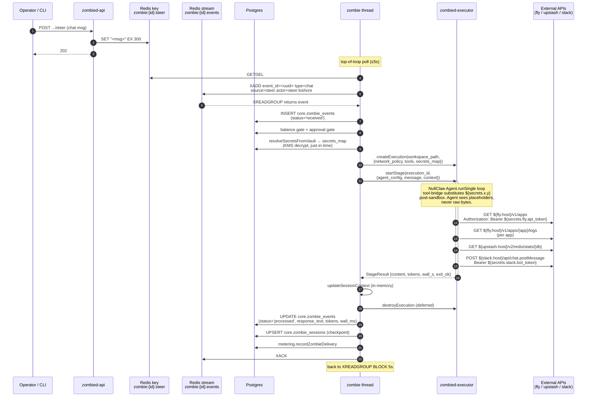

# Architecture — Zombie Event Flow

Date: Apr 23, 2026
Status: Canonical reference for how a single zombie event travels from an operator through the product, gets processed by an LLM agent, and turns into a side-effect. Specs cite this doc rather than duplicating its contents.

Worked example throughout: the `samples/platform-ops` zombie (see M37_001) — an agent that polls **fly.io** (`GET /v1/apps`, `GET /v1/apps/{app}/logs`) and **upstash redis** (`GET /v2/redis/stats/{db}`), correlates, then posts to **Slack** (`POST /api/chat.postMessage`). All four outbound calls go through one NullClaw primitive — `http_request` — with `${secrets.x.y}` placeholders substituted at the tool-bridge after sandbox entry.

---

## 1. Processes

| Process | Binary | Role |
|---|---|---|
| **zombied-api** | `zombied serve` | HTTP routes + Clerk auth. Writes `core.*` tables and `vault.secrets`. Produces `zombie:control` (on install / status change / config patch) and `zombie:{id}:events` (on webhook / slack / svix ingest). Writes `zombie:{id}:steer` on chat. Reads `core.zombie_events` for history. **Never runs LLM code.** |
| **zombied-worker** | `zombied worker` | Hosts ONE watcher thread (consumes `zombie:control`) + N zombie threads (one per active zombie, each consumes its own `zombie:{id}:events`). Owns the Redis connection and per-zombie cancel flags. Calls zombied-executor over a Unix socket. **Never runs LLM code.** |
| **zombied-executor** (sidecar) | `zombied executor` | Unix-socket RPC server. Hosts the NullClaw agent inside Landlock + cgroups + bwrap. Substitutes `${secrets.x.y}` placeholders into `http_request` tool calls at dispatch. **The only process that holds raw credential bytes post-decryption.** |

All three processes run in the control plane (Fly.io apps in prod). No edge-worker-in-tenant-network model.

---

## 2. Streams, keys, tables — producers and consumers

This table is the write-side contract. Anything not here is not a wake-up signal.

| Target | Kind | Producer(s) | Consumer(s) |
|---|---|---|---|
| `zombie:control` | Redis stream + group `zombie_workers_control` | zombied-api: `innerCreateZombie`, `innerStatusChange`, `innerConfigPatch` | zombied-worker watcher thread |
| `zombie:{id}:events` | Redis stream + group `zombie_workers` | zombied-api: webhook / slack / svix ingestors. zombied-worker: steer-inject path. (Future: NullClaw cron runtime.) | zombied-worker's zombie thread for that `id` |
| `zombie:{id}:steer` | Redis key (TTL 300s) | zombied-api: `innerSteer` on chat | zombied-worker zombie thread: polls + GETDEL at top of event loop |
| `zombie:{id}:config_rev` | Redis key | zombied-api watcher on `zombie_config_changed` | zombie thread on next loop (M35_001) |
| `core.zombies` | Postgres | zombied-api only (INSERT / UPDATE) | zombied-worker (SELECT on claim + in watcher); zombied-api (GET endpoints) |
| `core.zombie_sessions` | Postgres | zombied-worker (UPSERT on checkpoint; tracks `execution_id`) | zombied-worker (SELECT on claim + kill path) |
| `core.zombie_events` | Postgres | zombied-worker zombie thread (INSERT on receive, UPDATE on complete) | zombied-api (`GET /events`, paginated, filterable by `actor`) |
| `core.zombie_activities` | Postgres | zombied-worker (fine-grained trace); zombied-api (webhook-acceptance trace) | zombied-api SSE stream for live watch |
| `vault.secrets` | Postgres (KMS-enveloped) | zombied-api on `credential add` | zombied-worker resolves just-in-time before each `createExecution` |

**Invariant.** `core.zombies` and `vault.secrets` are the only durable sources of truth that matter for zombie behavior. Redis streams are the wake-up mechanism; their contents are at-least-once (XACK discipline, XAUTOCLAIM reclaim). On total Redis loss, zombies still exist (pg is truth); in-flight events replay once the worker rebuilds consumers.

---

## 3. Flow diagrams

Three sequence diagrams cover the lifecycle: install, a single chat turn, and kill. The platform-ops worked example uses fly / upstash / slack for the tool calls in the chat turn; substitute any three HTTP upstreams and the flow is identical.

### 3.1 Install + first wake

Shows the atomic write pattern that eliminates the create-stream race: `innerCreateZombie` does INSERT + XGROUP CREATE + XADD before returning 201, so any subsequent event finds the stream and group already present.

```mermaid
sequenceDiagram
    autonumber
    participant Op as Operator / CLI
    participant API as zombied-api
    participant PG as Postgres
    participant RC as Redis<br/>zombie:control
    participant RE as Redis<br/>zombie:{id}:events
    participant W as zombied-worker<br/>watcher thread
    participant Z as zombied-worker<br/>zombie thread

    Op->>API: POST /v1/.../zombies  (install)
    activate API
    API->>PG: INSERT core.zombies (status=active)
    API->>RE: XGROUP CREATE zombie:{id}:events<br/>zombie_workers 0 MKSTREAM
    API->>RC: XADD zombie:control<br/>type=zombie_created
    API-->>Op: 201 {zombie_id}
    deactivate API

    Note over W: blocked on<br/>XREADGROUP BLOCK 5s
    RC-->>W: zombie_created
    W->>PG: SELECT core.zombies WHERE id=$1
    W->>W: alloc cancel_flag; spawn thread
    W->>RC: XACK

    activate Z
    Z->>PG: claimZombie<br/>(config + checkpoint + instructions)
    Z->>RE: ensureZombieConsumerGroup (idempotent)
    Note over Z: blocks on<br/>XREADGROUP BLOCK 5s
    deactivate Z
```

### 3.2 Chat turn (the hot path)

Chat is the one operator-initiated input channel. CLI `zombiectl chat` and the UI chat widget both hit `/steer`. The zombie thread's top-of-loop `pollSteerAndInject` converts the steer key into a stream event (injecting the chat as if it were a webhook), then the normal event pipeline runs: claim → balance → approval → execute → finalize → XACK.

> The four `http_request` calls shown below (fly apps → fly logs → upstash stats → slack post) are an illustrative sequence for the platform-ops worked example. The agent-emitted tool-call order, count, and exact endpoints vary per prompt — read the diagram as representative, not prescriptive.



### 3.3 Kill (immediate, not 5s-delayed)

Kill must take effect NOW, not "within the next XREADGROUP cycle." The watcher does the cancel RPC synchronously on receiving the control message; the zombie thread's own cancel flag causes it to exit its loop on the next iteration, but the in-flight executor call is aborted without waiting for that.

```mermaid
sequenceDiagram
    autonumber
    participant Op as Operator / CLI
    participant API as zombied-api
    participant PG as Postgres
    participant RC as Redis<br/>zombie:control
    participant W as watcher thread
    participant Z as zombie thread
    participant X as zombied-executor

    Op->>API: POST .../kill
    API->>PG: UPDATE core.zombies SET status='killed'
    API->>RC: XADD type=zombie_status_changed<br/>status=killed
    API-->>Op: 200

    RC-->>W: status_changed
    W->>W: cancels[id].store(true)
    W->>PG: SELECT execution_id<br/>FROM core.zombie_sessions

    alt mid-stage (execution_id present)
        W->>X: cancelExecution(execution_id)
        activate X
        X->>X: session.cancelled = true
        Note over X: runner.execute aborts;<br/>agent loop → .cancelled
        deactivate X
    end
    W->>RC: XACK

    Note over Z: next loop iteration
    Z->>Z: watchShutdown sees cancel_flag=true<br/>running=false; thread returns
```

---

## 4. The 11-step walk (detailed)

This is the platform-ops dogfood end-to-end, one row per step, tracking what each process does and which Redis stream / key changes. Times are relative to step 5 (install).

| # | Action | zombied-api | `zombie:control` | `zombie:{id}:events` | zombied-worker wakes? | zombied-executor wakes? |
|---|---|---|---|---|---|---|
| 1 | Sign in via Clerk | `POST /auth/callback` → INSERT `core.users`, `core.workspaces`. Issues session. | — | — | no | no |
| 2–4 | `zombiectl credential add fly / upstash / slack` (structured `{host, api_token}` / `{host, bot_token}` fields) | `PUT /v1/.../credentials/{name}` → `crypto_store.store` (KMS envelope) → UPSERT `vault.secrets` | — | — | no | no |
| 5a | `zombiectl install --from samples/platform-ops` (CLI reads local `SKILL.md` + `TRIGGER.md`, posts JSON) | `POST /v1/.../zombies` → `innerCreateZombie`: INSERT `core.zombies` (status=`active`) | — | — | no | no |
| 5b | Same handler, two extra writes (M33_001) | (1) XGROUP CREATE `zombie:{id}:events zombie_workers 0 MKSTREAM` so stream + group exist before any producer/consumer race. (2) XADD `zombie:control` `type=zombie_created zombie_id ws_id at_ms`. Returns 201. | +1 entry | created empty, no entries | no (yet) | no |
| 6 | Watcher wakes | — | — | — | **YES** — watcher unblocks from `XREADGROUP zombie:control zombie_workers_control BLOCK 5s`. Reads `zombie_created`. SELECT `core.zombies WHERE id=$1`. Allocates `cancel_flag`, spawns zombie thread. XACK control msg. Zombie thread runs `claimZombie` (loads config + checkpoint), then blocks on `XREADGROUP zombie:{id}:events zombie_workers <consumer_id> BLOCK 5s`. | no |
| 7 | `zombiectl chat {id} "poll fly+upstash"` (thin wrapper over `/steer`) | `POST /v1/.../zombies/{id}/steer` → SET `zombie:{id}:steer "<msg>" EX 300`. 202. | — | — (written by worker next) | **YES** (within 5s) — zombie thread's top-of-loop `pollSteerAndInject` reads steer key via GETDEL, generates `event_id`, XADD `zombie:{id}:events * event_id=<uuid> type=chat source=steer actor=steer:kishore data=<msg>`. Next iteration's XREADGROUP returns it. | no |
| 8a | Zombie thread processes the event | — | — | +1 entry → consumed, in pending list under `consumer_id` | working | — |
| 8b | `processEvent`: INSERT `core.zombie_events` (`status='received'`, `actor='steer:kishore'`); balance + approval gates; `resolveSecretsFromVault` (decrypt in worker, passed over Unix socket, held in executor session only — never touches disk); `executor.createExecution(workspace_path, {network_policy, tools, secrets_map})`; `setExecutionActive`; `executor.startStage(execution_id, {agent_config, message, context})`. | — | — | still working | **YES** — `handleCreateExecution` creates session; `handleStartStage` invokes `runner.execute` → NullClaw `Agent.runSingle`. |
| 8c | Inside executor: NullClaw agent loops | — | — | — | waiting on Unix socket | working. Tool calls in order: (i) `http_request GET ${fly.host}/v1/apps` → tool-bridge substitutes `Authorization: Bearer ${secrets.fly.api_token}` **after** the agent emits the call (agent never sees raw bytes). (ii) `http_request GET ${fly.host}/v1/apps/{app}/logs` per app. (iii) `http_request GET ${upstash.host}/v2/redis/stats/{db_id}`. (iv) `http_request POST ${slack.host}/api/chat.postMessage` with `${secrets.slack.bot_token}`. Agent returns final message → handler packs `StageResult` → Unix socket → worker. |
| 8d | Zombie thread finalizes | — | — | XACK | `updateSessionContext` (in-memory); defer `destroyExecution` + `clearExecutionActive`; UPDATE `core.zombie_events` (`status='processed'`, `response_text`, `token_count`, `wall_ms`, `ttft_ms`, `completed_at`); `checkpointState` (UPSERT `core.zombie_sessions`); `metering.recordZombieDelivery`; XACK `zombie:{id}:events zombie_workers <msg_id>`. Back to XREADGROUP BLOCK. | sleeps (session destroyed) |
| 9 | `zombiectl events {id}` | `GET /v1/.../zombies/{id}/events` (paginated, filterable by `actor`) reads `core.zombie_events` | — | — | no | no |
| 10a | `zombiectl kill {id}` | `POST /v1/.../zombies/{id}/kill` → UPDATE `core.zombies SET status='killed'`; XADD `zombie:control type=zombie_status_changed status=killed`. 200. | +1 entry | — | not yet | no |
| 10b | Watcher reacts | — | — | — | **YES** — watcher reads control msg, sets `cancels[zombie_id].store(true)`, reads `execution_id` from `core.zombie_sessions`, calls `executor_client.cancelExecution(execution_id)` over Unix socket. XACK control. | **YES** (if mid-stage) — `handleCancelExecution` flips `session.cancelled=true`; any in-flight `runner.execute` breaks out of the agent loop and returns `.cancelled`. |
| 10c | Zombie thread exits | — | — | — | zombie thread's `watchShutdown` sees `cancel_flag=true` → `running=false` → event loop exits → thread returns. | sleeps |
| 11 | Credential non-leak grep | manual: grep `<test-token>` across `core.zombie_events.{request_json,response_text}`, `core.zombie_activities.detail`, zombied-api + zombied-worker logs. Expected: 0 hits. | — | — | token bytes held only in transient vars during `createExecution` RPC | token bytes held only in executor session memory + emitted inline into TCP bytes of outgoing HTTPS — never logged, never written to disk |

---

## 5. Component internals

Pseudocode for the four loops / handlers referenced by the diagrams. Tight — not API reference.

### 5.1 Watcher thread (one per zombied-worker process)

```
watcher:
  ensureConsumerGroup zombie:control zombie_workers_control      # idempotent
  on startup reconcile:
    rows = SELECT id FROM core.zombies WHERE status='active'
    for row: alloc cancel_flag; spawn zombie thread
  loop forever:
    msg = XREADGROUP GROUP zombie_workers_control <consumer> BLOCK 5s STREAMS zombie:control >
    switch msg.type:
      zombie_created        → SELECT row; alloc cancel_flag; spawn zombie thread
      zombie_status=active  → if no thread: spawn; else: no-op
      zombie_status=paused  → cancel_flag.store(true); drop entry
      zombie_status=stopped → cancel_flag.store(true); drop entry
      zombie_status=killed  → cancel_flag.store(true); look up execution_id;
                               executor.cancelExecution(execution_id)          # synchronous
      zombie_config_changed → SET zombie:{id}:config_rev = now                  # thread picks up on next event (M35_001)
    XACK zombie:control zombie_workers_control msg_id
  periodic (every 30s) pg reconcile:
    rows = SELECT id, status FROM core.zombies WHERE status IN (active, paused, stopped, killed)
    diff vs in-memory cancels map; correct any drift (missed control message)
```

Watcher is single-threaded, fail-fast on pg errors, relies on process-manager restart for supervision. Registry state is `HashMap(zombie_id → cancel_flag)` — nothing else. Thread handles tracked separately in an `ArrayList` only for shutdown `.join()`.

### 5.2 Zombie thread (one per active zombie)

```
zombieWorkerLoop(zombie_id, cancel_flag, shutdown_flag, executor_client):
  redis   = connectRedis()                                 # own client per thread
  session = claimZombie(alloc, zombie_id, pool)            # loads config + checkpoint + instructions
  ensureZombieConsumerGroup(redis, zombie_id)              # idempotent BUSYGROUP ok
  consumer_id = "worker-{pid}-{rand}"                      # unique per process
  spawn watchShutdown(cancel_flag, shutdown_flag, &running)

  while running:
    pollSteerAndInject(alloc, cfg, session)                # GETDEL zombie:{id}:steer → XADD zombie:{id}:events
    maybeReloadConfig(session)                             # compare zombie:{id}:config_rev → session's cached rev (M35_001)
    event = XREADGROUP GROUP zombie_workers <consumer_id> BLOCK 5s STREAMS zombie:{id}:events >
              OR XAUTOCLAIM (every 5 min, reclaim idle > ZOMBIE_RECLAIM_IDLE_MS)
    if event: processNext(session, event)
  # thread exits cleanly; watcher reaps on shutdown
```

### 5.3 `processNext` (per-event pipeline)

```
processNext(session, event):
  # a. Claim (stream delivery already guarantees exclusivity; INSERT makes it durable)
  INSERT core.zombie_events (id, zombie_id, workspace_id, event_id, event_type, source,
                              actor, request_json, status='received', created_at)
                              # UNIQUE(zombie_id, event_id) makes replay idempotent

  # b. Rate-limit (deferred to post-M31 per TenantRateLimiter port)
  # tenant_limiter.acquire(workspace_id) or: XACK + skip with backoff

  # c. Balance gate
  if metering.shouldBlockDelivery(pool, ws_id, z_id, balance_policy):
    UPDATE zombie_events SET status='balance_blocked'; XACK; return

  # d. Approval gate (event_loop_gate)
  gate = checkApprovalGate(session, event, pool, redis)
  if gate != passed:
    UPDATE zombie_events SET status='agent_error', gate_outcome=<label>; XACK; return

  # e. Executor RPC (M35_001 extends payload with per-session policy + secrets)
  secrets_map = resolveSecretsFromVault(session.config.credentials, workspace_id)   # decrypts just-in-time
  execution_id = executor.createExecution(workspace_path, {
      trace_id       = event.event_id,
      zombie_id, workspace_id, session_id = event.event_id,
      network_policy = session.config.firewall,
      tools          = session.config.tools,
      secrets_map,
  })
  setExecutionActive(session, execution_id, pool)                                   # for steer/kill lookup

  result = executor.startStage(execution_id, {
      agent_config = { system_prompt = session.instructions, api_key = resolveProviderKey(session) },
      message      = event.data_json,
      context      = parsed(session.context_json),
  })
  defer destroyExecution(execution_id)
  defer clearExecutionActive(session, pool)

  # f. Finalize
  updateSessionContext(session, event.event_id, result.content)                     # in-memory only
  UPDATE core.zombie_events SET status=<processed|agent_error>, response_text=result.content,
    token_count, wall_ms, ttft_ms, completed_at
  checkpointState(session, pool)                                                    # UPSERT core.zombie_sessions
  metering.recordZombieDelivery(...)
  XACK zombie:{id}:events zombie_workers msg_id
```

### 5.4 Inside the executor (NullClaw + credential-templating bridge)

```
handleStartStage(execution_id, payload):
  session = store.get(execution_id)                # has policy, secrets_map, correlation
  if session.isCancelled():   return cancelled
  if session.isLeaseExpired(): return lease_expired
  result = runner.execute(alloc, workspace_path, agent_config, tools_spec, message, context)

runner.execute:
  cfg   = Config.load() + overrides from agent_config
  tools = buildTools(tools_spec, session.policy, session.secrets_map)
    # M35_001 credential-templating wrap lives here.
    # http_request impl wraps NullClaw's own http_request with a pre-dispatch
    # header-substitution pass: find ${secrets.NAME.FIELD} in headers/body,
    # replace with secrets_map[NAME][FIELD]. Agent never sees post-substitution bytes.
  agent = Agent.fromConfig(cfg, tools, provider, observer)
  return agent.runSingle(composed_message)         # tool-use loop until stop_reason=end_turn

agent.runSingle loop:
  provider.stream(system_prompt, user_message, tools)
  while tokens arrive:
    if tool_call: tool.execute(args); feed tool_result back into provider.stream
    if stop:      break
  return { content, token_count, wall_seconds }
```

---

## 6. Invariants (hard guardrails)

| # | Invariant | Why it matters | Enforced by |
|---|---|---|---|
| 1 | `core.zombies` row exists ⇒ `zombie:{id}:events` stream and `zombie_workers` group exist | No race on first webhook. Event XADD before thread arrival still has a consumer waiting. | `innerCreateZombie` does INSERT + XGROUP CREATE + XADD atomically before 201 (M33_001) |
| 2 | Raw credential bytes never appear in LLM context, logs, or DB | Prompt injection, log exfil, replay | Substitution at tool-bridge (M35_001); grep-assert in M37_001 §2.4 |
| 3 | At-least-once delivery on `zombie:{id}:events` | Webhooks are real events from real customers | XACK only after successful UPDATE + checkpoint. Don't XACK on TransportLoss. |
| 4 | Per-event idempotency | Replay after crash must not double-post | `core.zombie_events UNIQUE(zombie_id, event_id)` |
| 5 | Kill is immediate for in-flight runs | Operators flipping status=killed mean NOW, not "within 5s" | Watcher calls `executor.cancelExecution` immediately on control msg; does not wait for the zombie thread's next XREADGROUP cycle |
| 6 | One executor session per event | Session holds policy + `secrets_map` scoped to this execution | `createExecution` + defer `destroyExecution` in every `processNext` |
| 7 | Worker restart is safe | Any failure mode recovers from pg + streams | No in-memory state is truth; watcher reconciles on startup; XAUTOCLAIM reclaims orphaned pending |
| 8 | Chat is the one operator-initiated channel | Don't grow a `/fire` `/trigger` `/invoke` API per synonym | CLI `zombie chat` + UI chat widget both hit `/steer` |

---

## 7. Debugging — where to grep, what to look at

| Question | Command / place |
|---|---|
| "Did the create-stream race happen?" | `XLEN zombie:control` (should include the create msg); `XINFO STREAM zombie:{id}:events` |
| "Is the watcher processing control messages?" | `XPENDING zombie:control zombie_workers_control` (should trend to 0) |
| "Is a specific zombie's thread alive and consuming?" | `XINFO CONSUMERS zombie:{id}:events zombie_workers` |
| "Did a message fail to ACK?" | `XPENDING zombie:{id}:events zombie_workers` (entries idle > threshold are XAUTOCLAIM candidates) |
| "What did the zombie receive and return?" | `SELECT * FROM core.zombie_events WHERE zombie_id=<id> ORDER BY created_at DESC` |
| "Is the executor alive?" | Unix socket connect + `ping` RPC (future) / process health `ps` / healthz endpoint (future) |
| "Was a credential value leaked?" | Grep seeded test token across: `core.zombie_events.{request_json,response_text}`, `core.zombie_activities.detail`, zombied-api + zombied-worker logs. Expected 0 hits outside the executor process memory. |
| "Did the agent self-schedule?" | `SELECT * FROM core.zombie_events WHERE actor LIKE 'cron:%'`; also NullClaw cron state (`cron_list` tool call in an interactive chat) |

---

## 8. Per-step ownership (M33–M39)

| Step / surface | Owner workstream |
|---|---|
| `innerCreateZombie` + XGROUP CREATE + XADD `zombie:control` | **M33_001** |
| Watcher thread | **M33_001** |
| Per-zombie cancel flag | **M33_001** |
| `WorkerState` drain primitive | **M33_001** (port from pre-M10) |
| `zombiectl chat` interactive CLI | **M33_001** |
| UI chat widget | **M33_001** (or M36_001 if tightly coupled with SSE) |
| `core.zombie_events` schema + write path + `actor` field | **M34_001** |
| `GET /v1/.../zombies/{id}/events` + `zombiectl events` + UI events tab | **M34_001** |
| `createExecution` per-session policy (network/tools/secrets) | **M35_001** |
| `http_request` credential templating at tool-bridge | **M35_001** |
| Config PATCH + `zombie_config_changed` control msg + `zombie:{id}:config_rev` | **M35_001** |
| SSE `/activity:stream` + UI live watch + CLI `zombie watch` | **M36_001** |
| Docs polish + launch-post rewrite | **M36_001** |
| `samples/platform-ops/` three files (this doc's worked example) | **M37_001** |
| `samples/homebox-audit/` three files | **M38_001** |
| Lead-collector teardown (post-flagship cleanup) | **M39_001** |
| `zombiectl install --from <path>` | **M19_003** (prerequisite for M33) |

---

## 9. Deferred / out of current scope

- **Edge-worker-in-tenant-network** (creds never reach the control plane). Rejected for v2.0-alpha; revisit post-first-customer.
- **Zig-side prose-allowlist parser + verb-policy dispatch gate.** Not needed while the flagship sample uses `http_request` only; revisit when kubectl/shell-enabled zombies ship.
- **Per-tenant rate limiting** (v1 had a `TenantRateLimiter`; port when multi-tenant load warrants).
- **pg LISTEN/NOTIFY** for control-plane change propagation. Redis stream + 30s pg reconcile is belt-and-suspenders enough for MVP.
- **Multiple zombied-worker replicas.** Single-worker suffices for pre-alpha; per-zombie Redis lease is a known v2 add.
- **Agent-driven delegation** (`delegate` tool, `subagent` runner — NullClaw primitives not yet switched on).
- **Grafana / Loki / Prometheus / Datadog** as log sources. Platform-ops uses fly.io's native `/v1/apps/{app}/logs` endpoint and upstash's `/v2/redis/stats/{db}` directly; a dedicated observability-source integration is post-alpha.
