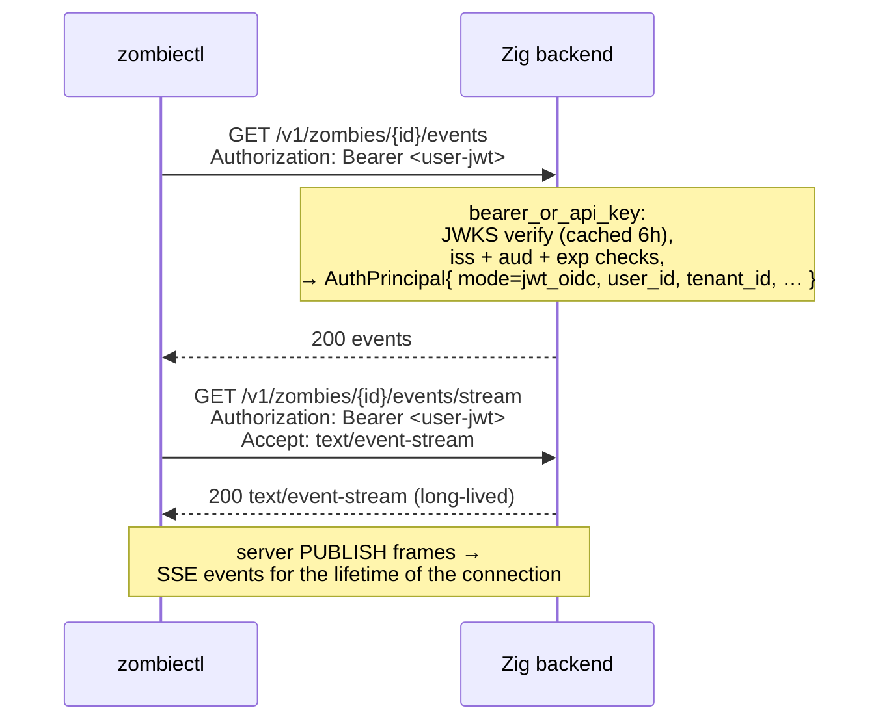
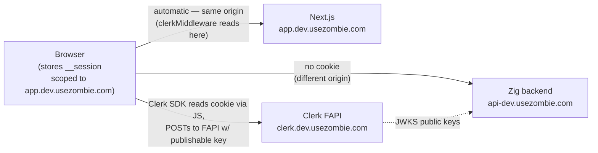
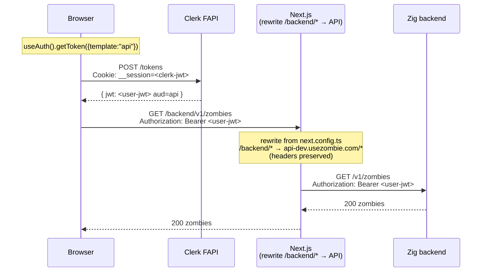
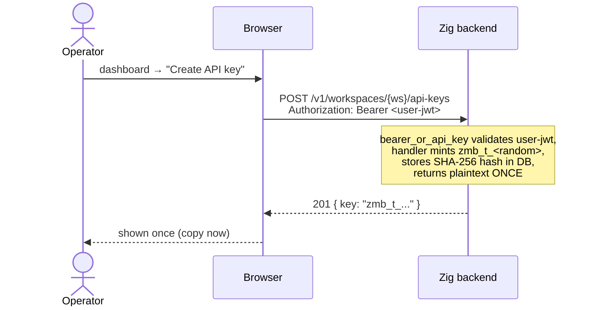
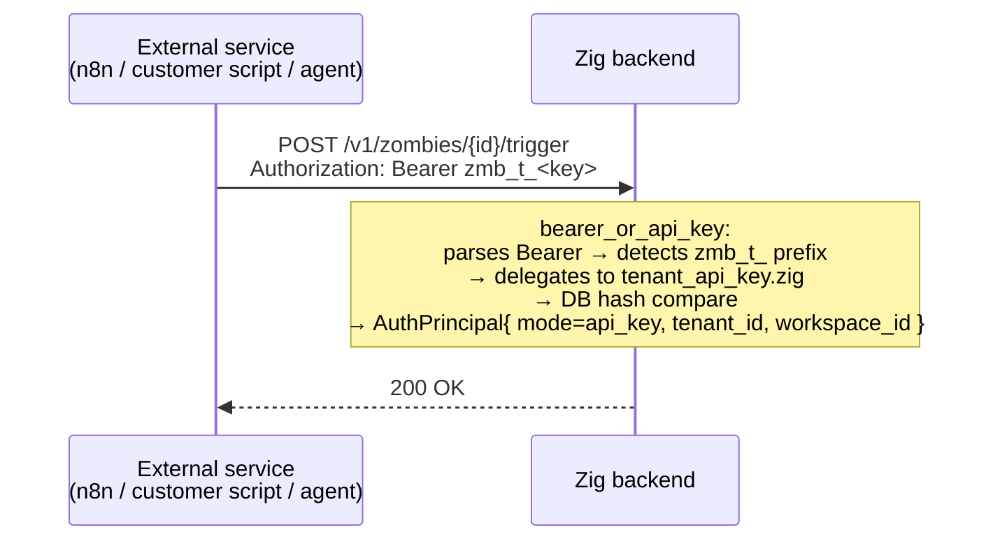
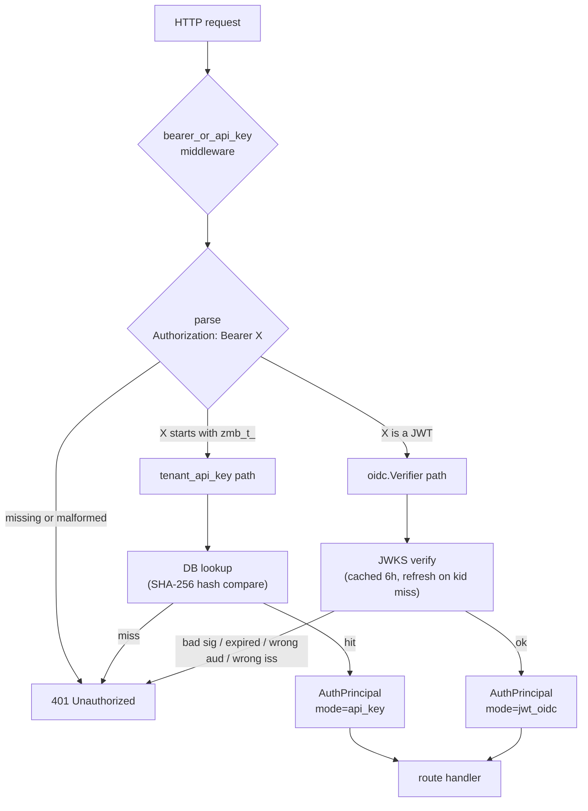

# Authentication

Three principal types reach the Zig backend. All three converge on a single credential shape at the wire:

```
Authorization: Bearer <…>
```

## The three flows at a glance

```
            ┌──────────────────────────────────────────────────────────────┐
            │                                                              │
            │  WHO IS THE ACTOR?                                           │
            │                                                              │
            │  ┌──────────────┐    ┌──────────────┐    ┌──────────────┐  │
            │  │ A human at a │    │ A human in a │    │ A machine    │  │
            │  │ terminal     │    │ browser tab  │    │ (script/bot) │  │
            │  └──────┬───────┘    └──────┬───────┘    └──────┬───────┘  │
            │         │                   │                   │           │
            │         ▼                   ▼                   ▼           │
            │   ┌─────────────┐    ┌─────────────┐    ┌─────────────┐    │
            │   │   FLOW 1    │    │   FLOW 2    │    │   FLOW 3    │    │
            │   │             │    │             │    │             │    │
            │   │ zombiectl   │    │ Dashboard   │    │ Tenant API  │    │
            │   │ login       │    │ sign-in     │    │ key         │    │
            │   │             │    │             │    │ zmb_t_…     │    │
            │   │ verification│    │ Clerk       │    │ static hash │    │
            │   │ code + ECDH │    │ __session   │    │ in DB       │    │
            │   │ + 5-min TTL │    │ cookie →    │    │ long-lived  │    │
            │   │             │    │ getToken    │    │ revocable   │    │
            │   │             │    │ ({api})     │    │             │    │
            │   └──────┬──────┘    └──────┬──────┘    └──────┬──────┘    │
            │          │                  │                  │            │
            │          └──────────────────┴──────────────────┘            │
            │                             │                                │
            │                             ▼                                │
            │              Authorization: Bearer <…>                       │
            │                             │                                │
            │                             ▼                                │
            │              bearer_or_api_key middleware                    │
            │              (zmb_t_*  → DB hash lookup)                     │
            │              (anything → JWKS verify)                        │
            │                                                              │
            └──────────────────────────────────────────────────────────────┘
```

| When to use which | Flow 1 | Flow 2 | Flow 3 |
|---|---|---|---|
| Human present at the keyboard? | ✅ required (5-min interactive flow) | ✅ required | ❌ |
| Long-lived credential? | ❌ JWT expires ~15 min; CLI re-runs `login` on 401 | ❌ minted per request | ✅ until explicitly revoked |
| Provisioned via | `zombiectl login` | Clerk sign-in form | dashboard "Create API Key" surface |
| Right answer for | a developer on a workstation; Cursor/Claude Code running locally with the developer present | someone using `app.usezombie.com` in a browser | n8n / Zapier / cron jobs / CI runners / Kubernetes / scheduled background work |
| Wrong answer for | unattended CI / cron / K8s / hosted-agent platforms — see *Human-led-only invariant* | none — this is the only browser path | interactive humans (`zmb_t_` long-lived keys carry too much standing privilege for a workstation) |

There is also a fourth surface — **agent keys** (`zmb_*` bound to a single zombie) — for narrowly-scoped webhook-driven inbound calls. It's a Flow 3 subtype: same DB-hash-lookup shape, narrower scope. See *Agent keys* below.

A fifth surface — **inbound webhooks** — does not use Bearer at all (HMAC-signed by the provider). See *Webhook auth*.

There are exactly two payload shapes inside that header:

| Payload                  | Issuer                | Validation path                    | Used by             |
| ------------------------ | --------------------- | ---------------------------------- | ------------------- |
| `<jwt>` (Clerk-signed)   | Clerk Frontend API    | JWKS verify + `aud` check + claims | CLI · UI            |
| `zmb_t_<random>`         | Backend (per-tenant)  | DB hash lookup                     | Service-to-service  |

Cookies **never reach the Zig backend**. The Clerk `__session` cookie lives on the dashboard's own host (`app.usezombie.com`) — written by the Clerk SDK on the page after sign-in. Same-origin policy means it only attaches on requests back to the dashboard, never to `api-dev.usezombie.com`. See *The two tokens at a glance* below for the full picture.

The middleware that gates almost every route is `bearer_or_api_key` (`src/auth/middleware/bearer_or_api_key.zig`). It parses the `Bearer …` prefix, then routes by sub-prefix:

- `Bearer zmb_t_*` → `tenant_api_key.zig` (DB lookup, hash compare).
- `Bearer <anything else>` → `oidc.Verifier.verifyAuthorization` (cached JWKS, RS256 signature check, `iss` + `aud` + `exp` claims, role mapping).

Both paths resolve to the same `AuthPrincipal` struct (`src/auth/principal.zig`). Handlers downstream never know which credential shape was used.

---

## The two tokens at a glance

When Sarah uses `app.usezombie.com`, two distinct Clerk-issued JSON Web Tokens (JWTs) are in play. They serve different verifiers, so they have different claim shapes. Both are minted from the same Clerk *session* (`sid=sess_…`); their lifetimes are short and parallel.

| Token | Where it lives | Audience | Has `sid`? | Has `metadata`? | Verified by |
|---|---|---|---|---|---|
| **A — default session token** | `__session` cookie on `app.usezombie.com` | (none / Clerk default) | ✅ | ❌ | `clerkMiddleware()` on Next.js |
| **B — `api`-template token** | `Authorization: Bearer …` to zombied | `https://api.usezombie.com` | ❌ | ✅ `tenant_id` + `role` | `oidc.Verifier` in zombied |

**Token A's only job: authenticate the dashboard to itself.** Every protected page (`/zombies`, `/settings`, …) runs `clerkMiddleware()` before render; the middleware reads Token A from the cookie, verifies signature, extracts `sub`. Without it, every page redirects to `/sign-in`. **Token A never reaches zombied** — different origin, the cookie is not sent.

**Token B's only job: authenticate cross-origin requests to zombied.** Browser, Next.js Route Handlers, and `zombiectl` all carry Token B as Bearer. zombied strict-checks `aud=https://api.usezombie.com` (see Backend validation §) and reads `metadata.tenant_id`. **Token B never lands in a cookie.**

The existence of two tokens is the documented Clerk recipe for **frontend on one origin + backend on another origin** — the two-token pattern. The single-token alternative ("root domain", where one cookie spans `app.*` and `api.*`) requires shared-root-domain Clerk config and zombied reading cookies; not how usezombie is wired today.

In Clerk's terms, the existence of two tokens reflects two different verifier requirements: `clerkMiddleware()` needs the `sid` (session id) claim to call Clerk's session-introspection API; zombied needs the `aud=api.usezombie.com` claim to enforce that the token wasn't minted for a different service. Per Clerk's own docs, custom JWT templates **cannot** include `sid`, and default session tokens do not include a service-specific `aud`. One token, both requirements is therefore not a configuration we can hit from a JWT template alone — hence two.

> **Naming bridge to the Mermaid diagrams below.** The diagrams predate this Token A / Token B framing. They use `<clerk-jwt>` for the cookie token (Token A) and `<user-jwt>` for the api-template Bearer (Token B). Same things, older labels.

---

## Flow 1 — CLI device flow (`zombiectl login`)

`zombiectl login` is the one credential-acquisition path that humans use from a terminal. It is a browser-mediated device flow with a **verification code** that ties the human approving in the browser to the human typing into the local terminal, and **ECDH P-256 transport encryption** that keeps the minted JWT out of every server-side surface other than process memory. The session row in Redis holds ciphertext + a keyed-HMAC of the verification code; no plaintext JWT, no plaintext code, ever.

A fresh login takes one round-trip from `zombiectl` to create a session, one browser tab to Approve, and one terminal prompt to type the code. The whole flow is bounded at five minutes; an unfinished session expires automatically.

### Where the JWT lives in plaintext (data lifecycle)

This view points in the *opposite* direction from the temporal sequence below, because the JWT is *born* in the dashboard's browser process (immediately after Clerk mints it) and *consumed* in the `zombiectl` process (after ECDH decryption). The CLI initiates the flow; the secret flows the other way.

```
┌────────────────────────────────────────────────────────────────────┐
│                                                                    │
│  Dashboard browser tab                                             │
│   ┌─────────────────────────────────────────────────────────────┐  │
│   │   Clerk mints user-JWT  ─►  AES-256-GCM encrypt(JWT)        │  │
│   │   (via FAPI /tokens)         under HKDF-SHA256-derived key  │  │
│   │                              from ECDH(dash_priv, cli_pub)   │  │
│   └─────────────────────────────────────────────────────────────┘  │
│                              │                                     │
│              PATCH /v1/auth/sessions/{id}/approve                  │
│              { dashboard_public_key, ciphertext, nonce,            │
│                verification_code }   (plaintext code over TLS;     │
│                                       API computes HMAC and        │
│                                       discards plaintext)          │
│                              │                                     │
│                              ▼                                     │
│  API process (zombied) + Redis                                     │
│   ┌─────────────────────────────────────────────────────────────┐  │
│   │   Redis row stores:                                         │  │
│   │     status, cli_public_key, dashboard_public_key,           │  │
│   │     ciphertext, nonce,                                      │  │
│   │     verification_code_hmac      ◄── HMAC-SHA256(            │  │
│   │     verification_attempts (≤5)        AUTH_SESSION_CODE_    │  │
│   │     created_at_ms, expires_at_ms      PEPPER,               │  │
│   │   ────────────────────────────         session_id ‖ code)   │  │
│   │   Nothing in this row decrypts the JWT.                     │  │
│   │   Pepper lives in zombied process memory only — never disk. │  │
│   └─────────────────────────────────────────────────────────────┘  │
│                              │                                     │
│              POST /v1/auth/sessions/{id}/verify { code }            │
│              (only after CLI presents the matching code; atomic    │
│               verification_pending → consumed in a single Lua-EVAL │
│               write that also returns the ciphertext payload)      │
│                              │                                     │
│                              ▼                                     │
│  CLI process (zombiectl)                                           │
│   ┌─────────────────────────────────────────────────────────────┐  │
│   │   shared = ECDH(cli_priv, dashboard_public_key)             │  │
│   │   key    = HKDF-SHA256(shared, info="m74-002-v1")           │  │
│   │   JWT    = AES-256-GCM-decrypt(ciphertext, key, nonce)      │  │
│   │   write { token, token_name } → credentials.json (0o600)    │  │
│   │   GET /v1/me  (validation ping; deletes credential on 401)  │  │
│   └─────────────────────────────────────────────────────────────┘  │
│                                                                    │
└────────────────────────────────────────────────────────────────────┘
```

**Honest-server assumption.** An honest API server stores `cli_public_key` and `dashboard_public_key` as the CLI and dashboard sent them. Under that assumption the API never possesses decryption capability, and a Redis dump alone does not yield the JWT — the attacker would need (a) `cli_priv` from the CLI process, and (b) the matching plaintext verification code. **An *active malicious* API server (or a TLS-terminating intermediary acting maliciously rather than passively) can swap `cli_public_key` and execute a textbook unauthenticated-Diffie-Hellman key-substitution MITM.** v2.0 explicitly does not close this; see *Threats this flow does NOT close*.

### Sequence — one-time login

```mermaid
sequenceDiagram
    actor User
    participant CLI as zombiectl
    participant UI as Dashboard<br/>(app.usezombie.com)
    participant API as Zig backend<br/>(api.usezombie.com)
    participant Clerk

    User->>CLI: zombiectl login [--token-name LABEL]
    Note over CLI: generate (cli_priv, cli_pub) via crypto.subtle<br/>default token_name = platform family<br/>("macos-cli" / "linux-cli" / "windows-cli")

    CLI->>API: POST /v1/auth/sessions<br/>{ public_key: cli_pub, token_name }
    API-->>CLI: 201 { session_id }
    CLI-->>User: open https://app.usezombie.com/cli-auth/{session_id}

    Note over CLI: poll with exp backoff (1s → 5s, ±20% jitter)<br/>+ live countdown "Session expires in MM:SS"<br/>+ single-blip tolerance

    User->>UI: open verify URL in browser
    Note over UI: Clerk session validates (__session cookie)
    UI->>API: GET /v1/auth/sessions/{id}
    API-->>UI: { status: pending, cli_public_key, token_name }
    UI-->>User: "Approve CLI login for {token_name}?"
    User->>UI: click Approve

    UI->>Clerk: POST /tokens (template: api)<br/>+ __session cookie
    Clerk-->>UI: { user-jwt }

    Note over UI: generate (dash_priv, dash_pub)<br/>shared = dash_priv × cli_pub<br/>key = HKDF-SHA256(shared, info="m74-002-v1")<br/>ciphertext = AES-256-GCM(jwt, key, nonce)<br/>verification_code = random 6 digits (CSPRNG)

    UI->>API: PATCH /v1/auth/sessions/{id}/approve<br/>{ dashboard_public_key, ciphertext, nonce, verification_code }<br/>Authorization: Bearer <user-jwt>
    Note over API: server computes verification_code_hmac<br/>= HMAC-SHA256(AUTH_SESSION_CODE_PEPPER, sid ‖ code)<br/>persists ciphertext + nonce + dash_pub + HMAC<br/>discards plaintext code<br/>state: pending → verification_pending
    API-->>UI: 200
    UI-->>User: "Type {verification_code} into your CLI"

    loop CLI poll
        CLI->>API: GET /v1/auth/sessions/{id}
        API-->>CLI: { status: verification_pending }
    end

    Note over CLI: prompt "Verification code:" (suppressed in --no-input)
    User->>CLI: types verification_code
    CLI->>API: POST /v1/auth/sessions/{id}/verify<br/>{ verification_code }
    Note over API: Lua-EVAL atomic transition:<br/>compare HMAC (constant-time);<br/>match → verification_pending → consumed<br/>in the same write; return payload
    API-->>CLI: 200 { dashboard_public_key, ciphertext, nonce }

    Note over CLI: shared = cli_priv × dashboard_public_key<br/>key = HKDF-SHA256(shared, info="m74-002-v1")<br/>jwt = AES-256-GCM-decrypt(ciphertext, key, nonce)

    CLI->>CLI: write { token, token_name } → credentials.json (0o600)
    CLI->>API: GET /v1/me   (post-write validation ping)
    API-->>CLI: 200
    CLI-->>User: "logged in as {token_name}"
```

Two facts the diagram pins:
1. **The CLI is the initiator.** Every interaction with the UI, API, or Clerk is downstream of `zombiectl login`. The user typing the verification code closes the loop back to the CLI.
2. **Clerk is involved at exactly one step** (`POST /tokens`). The API server never talks to Clerk in this flow — Clerk's involvement is JWKS-only when the CLI later uses the minted JWT against normal API endpoints.

### Session state machine

```
┌─────────┐     PATCH /approve    ┌───────────────────────┐    POST /verify (correct,    ┌──────────┐
│ pending ├──────────────────────►│ verification_pending  ├─── single Lua-EVAL atomic ──►│ consumed │
└────┬────┘                       └───────────┬───────────┘    write; payload returned)  └──────────┘
     │                                        │                                            (terminal,
     │  5 min TTL                              │  5 failed verify attempts                  60s same-
     │  OR explicit DELETE                     │  OR 5 min TTL                              fingerprint
     │  OR replaced                            │  OR explicit DELETE                        replay
     ▼                                        ▼  OR replaced                                window)
┌─────────┐                       ┌───────────────────────┐
│ expired │  (terminal)           │ aborted               │  (terminal)
└─────────┘                       └───────────────────────┘
```

| State | Enters from | Exits to |
|---|---|---|
| `pending` | initial (POST /sessions) | `verification_pending` · `expired` · `aborted` |
| `verification_pending` | `pending` | `consumed` · `expired` · `aborted` |
| `consumed` | `verification_pending` | (terminal — single-read, with 60s same-fingerprint idempotency window) |
| `expired` | `pending` · `verification_pending` | (terminal) |
| `aborted` | `pending` · `verification_pending` | (terminal) |

**Invariants.** The state machine is monotonic — no backward transitions. There is no codepath from `pending` directly to `consumed`; verification code presentation is mandatory. `verified` is not a stored state; the successful POST /verify writes `consumed` atomically.

### Endpoint trust boundaries

| Endpoint | Trusted actor | Auth |
|---|---|---|
| `POST /v1/auth/sessions` | unauthenticated CLI | rate-limited per IP (10/min) |
| `GET /v1/auth/sessions/{id}` | unauthenticated CLI poll | rate-limited per session (≥750 ms between polls) |
| `PATCH /v1/auth/sessions/{id}/approve` | dashboard JS process | Clerk JWT (`api` template) · per-Clerk-user rate limit (20/hr) |
| `POST /v1/auth/sessions/{id}/verify` | CLI with the verification code | the code IS the auth · ≤5 attempts per session |
| `DELETE /v1/auth/sessions/{id}` | dashboard JS process | Clerk JWT · must match session's `clerk_user_id` |
| `DELETE /v1/auth/sessions/all` | dashboard JS process | Clerk JWT |

### Security properties by layer

The contract. Every line of code in Flow 1 must trace to one of these properties. Any claim of "auth hardening" in the abstract should be re-read against this table.

| Layer | Property | Out of scope |
|---|---|---|
| TLS | server authenticity (cert chain to a trusted CA) + transport encryption | endpoint compromise on either side |
| Clerk session | browser-user authentication (the human at the keyboard owns the Clerk identity) | hijacked browser session · shared workstation |
| **Verification code** | **browser ↔ terminal authorization binding** — proves the human approving in the browser is the same human typing into the local terminal | user pasting attacker-supplied commands |
| `HMAC-SHA256(AUTH_SESSION_CODE_PEPPER, session_id ‖ code)` | disclosure-resistance of the verification code against passive server-side compromise. The pepper lives in zombied process memory only (Vault-loaded at boot, never on disk) — a Redis dump alone cannot recover the code via offline brute-force | compromise of the dashboard JS process where the code is displayed · compromise of the CLI process where it is typed · compromise of zombied process memory |
| ECDH P-256 | ciphertext-only session transport — no intermediate server, log, or DB row sees the JWT in plaintext | compromise of the dashboard or CLI endpoints |
| AES-256-GCM | tamper detection — any ciphertext modification produces a hard `DecryptError`, not silent corruption | — |
| Atomic `verified → consumed` | single-read ciphertext — captured response cannot be replayed against the same session | replay using a fresh session (closed by `verification_code` + rate limits) |
| Verify-attempt rate limit (≤5/session) | brute-force resistance on the 6-digit code | distributed brute force across many sessions (closed by session-creation rate limit per IP + per Clerk user) |
| `token_name` | auditability only — operator can list active sessions by label | trust signal of any kind |

### Threats this flow closes

Each line is paired: the attack in one sentence, the mechanism that thwarts it in the next.

| # | Threat | How it's thwarted |
|---|---|---|
| 1 | **Session-row plaintext disclosure** — Redis dumps, logs, queue inspections, metrics blobs, memory snapshots. | ECDH ciphertext transport. The Redis row holds `{ ciphertext, nonce, public keys, verification_code_hmac }`; nothing in that set decrypts to the JWT. |
| 2 | **Passive network observation of the JWT** — TLS-inspecting corporate proxies, captured HTTPS payload logs, intermediaries that terminate and re-issue TLS. | ECDH ciphertext transport. After this spec, intermediaries see ciphertext only — the JWT plaintext lives nowhere on the wire. |
| 3 | **Session-id phishing without terminal access** — attacker has only the `session_id` (URL sniff, browser-history sync, shoulder surf). | The `verification_code` requirement + moving ciphertext release from GET to POST /verify. An attacker without terminal access cannot present the matching code and cannot trigger ciphertext release. |
| 4 | **Verification-code disclosure via passive server compromise** — attacker reads the session row but only sees the keyed HMAC; tries to offline-brute-force the 1M-entry 6-digit space. | `HMAC-SHA256(AUTH_SESSION_CODE_PEPPER, …)` storage. The pepper lives in zombied process memory only — without it the attacker cannot compute candidate HMACs even if they own the Redis blob. |
| 5 | **Verification-code online brute force** — attacker with `session_id` tries the 1,000,000 6-digit code space against POST /verify. | ≤5 verify attempts per session, then the session transitions to `aborted` with `reason="rate_limit_exceeded"`. Attacker exhausts 0.0005% of the space before being locked out. |
| 6 | **Ciphertext replay** — attacker captures a single POST /verify response and retries the same `session_id`. | Atomic transition `verification_pending → consumed` in the same Lua-EVAL write that returns the ciphertext. Subsequent verify calls return 410 `SessionConsumed` (with a 60-second same-fingerprint idempotency window for the legitimate "consume succeeded, response lost, client retried" failure mode). |
| 7 | **Distributed brute force across many sessions** — attacker scripts 200,000 sessions × 5 codes each = 1M attempts. | Per-IP session-creation rate limit (10/min) and per-Clerk-user PATCH-approve rate limit (20/hr). Attacker cannot fan out fast enough. |

### Threats this flow does NOT close

Each line names the attack and points at where its closure lives (or why it cannot be closed by any flow this spec could produce).

| # | Threat | Why not — and where closure lives |
|---|---|---|
| 1 | **Compromised browser session** — XSS on the dashboard, malicious browser extension, session-cookie theft, injected analytics, compromised NPM dependency in the dashboard bundle. | The plaintext JWT lives momentarily in the dashboard JS process before encryption. Anything with execution access to that process sees the JWT; ECDH does not help. Future hardening: SRI + CSP + dependency supply-chain pinning (separate spec). |
| 2 | **Malware on the CLI host** — compromised `zombiectl` machine, malicious user-space process, memory scraping. | `cli_priv` lives in CLI process memory during the flow; the decrypted JWT lives in `credentials.json` after. Local malware reads either. No future milestone closes this without hardware-backed key storage (TPM / Secure Enclave) — a separate downstream spec. |
| 3 | **Attacker with simultaneous browser + terminal access** — user runs attacker-supplied software ("paste this curl into your terminal"). | The verification code cannot defend against the user actively typing the code into the attacker's tool. The human-led-only invariant is the only defense, and it is documentation, not code. |
| 4 | **Device impersonation / fake `zombiectl` binaries** — any actor can generate a valid ECDH keypair using publicly known math; any actor can ship a binary called `zombiectl`. | Possessing a valid public key proves nothing about identity. Closure: **M75_xxx Agent Identity** (persistent device keypair) or a binary-signing spec — both to be authored. |
| 5 | **Autonomous-agent authentication** — CI runners, Kubernetes workloads, hosted agent platforms calling our API. | Out of trust model. A human MUST be present at flow time to type the verification code; remove the human and the verification code property collapses into theatre. Closure: **M75_xxx Agent Identity** (persistent keypair + signed challenges + scoped credentials + server-side agent inventory). |
| 6 | **Active API or proxy key-substitution MITM** — attacker with active control over an API response path swaps `cli_public_key` in GET /sessions, intercepts the encrypted PATCH /approve, decrypts with their own key, re-encrypts to the real CLI's key. | Unauthenticated Diffie-Hellman — passing the public key through the API and trusting the API to return it honestly is the textbook setup. **v2.0 explicitly does NOT close this; tracked as the v2.1 priority.** Closure: URL fragment binding (`#cli_public_key=…` — fragments aren't sent to the server) + HKDF transcript binding (`info` parameter binds both pubkeys + session_id, so any substitution breaks decryption on the CLI). |

### Replay semantics

Six invariants. All are tested explicitly.

1. **Verification code is single-use, with a bounded same-fingerprint idempotency window.** A successful POST /verify atomically transitions to `consumed` in the same Lua-EVAL write that returns the ciphertext. Subsequent POST /verify calls within 60 seconds **from the same client fingerprint** (sha256 of `derived_client_ip ‖ user_agent ‖ session_id`) return the same payload (handles "consume succeeded, response lost, client retried"). Outside 60 seconds, or from a different fingerprint, or after the payload-retention TTL elapses → HTTP 410 `SessionConsumed`.
2. **Ciphertext is single-read per client fingerprint.** Item 1's mechanism: only the originating fingerprint can replay during the window; any other source gets 410. This narrows the replay surface to "captured-network-packet-within-60s-from-same-source", which is dominated by existing TLS + network-perimeter assumptions.
3. **Verified sessions cannot revert.** The state machine is monotonic; no path from `consumed` / `expired` / `aborted` back to any active state.
4. **PATCH /approve is single-write.** Calling it against a session already in `verification_pending` returns HTTP 409 Conflict. The dashboard MUST NOT retry PATCH /approve if it has previously succeeded for the same session.
5. **`session_id` is high-entropy.** UUIDv7; 128 bits; CSPRNG; not enumerable.
6. **`session_id` is capability-bearing** — combined with the verification code, it authorizes ciphertext release. Classified equivalent to a password-reset token. **`session_id` appears only in the primary verification URL (`https://app.usezombie.com/cli-auth/{session_id}`) and in the API route paths that consume it.** It MUST NOT appear in logs (at info/warn/error level — use the `redactSessionId()` helper), analytics, telemetry, metrics labels, secondary URLs, error response bodies routed to non-trusted surfaces, or copied diagnostic bundles. Audit-log events carry `session_id_hash` (keyed HMAC with `AUDIT_LOG_PEPPER`) + `session_id_prefix` (first 8 hex chars) — never the raw ID in default mode.

### Cryptographic primitives (pinned)

| Primitive | Value | Why pinned |
|---|---|---|
| Curve | P-256 (NIST) | `crypto.subtle` supports it natively in both Node.js ≥20 and modern browsers. |
| Key derivation | HKDF-SHA-256, output 32 bytes, `info = "m74-002-v1"`, empty salt | Versioned `info` lets a future protocol change rev without colliding. The ECDH shared secret is already high-entropy, so the salt adds nothing. |
| Authenticated encryption | AES-256-GCM, 256-bit key, 96-bit random nonce per encryption, 128-bit auth tag | — |
| Verification code | 6 random digits (CSPRNG) | Brute force closed by attempt cap, not code entropy. (Future improvement: 8 alphanumeric, ~37× entropy, segmented for human-typability.) |
| Verification-code storage | `HMAC-SHA256(AUTH_SESSION_CODE_PEPPER, session_id ‖ code)`; pepper Vault-loaded at boot, process-memory-only | Defeats offline brute force from a Redis dump (attacker needs the pepper too). Constant-time comparison via `std.crypto.utils.timingSafeEql` on the comparison side. |
| Crypto library | `crypto.subtle` on both sides (Node.js + browser Web Crypto) | Zero extra dependencies; identical API surface; avoids `tweetnacl` / `@noble/curves` drift. |

### Log and audit redaction — `session_id` is sensitive

| Surface | What can appear | What must NOT appear |
|---|---|---|
| `std.log.scoped(.auth)` info/warn/error | `request_id`, status names, error categories, sanitized error messages | full `session_id`, full verification code, ciphertext bytes, public keys (informational risk only, redact anyway) |
| `std.log.scoped(.auth)` debug/trace | `session_id` redacted to first 8 hex chars + length suffix (`abcd1234…(len=36)`) | full `session_id` |
| `std.log.scoped(.auth_audit)` | `session_id_hash` (keyed HMAC with `AUDIT_LOG_PEPPER`) + `session_id_prefix` (first 8 hex chars). Full `session_id` only when `AUTH_AUDIT_INCLUDE_FULL_IDS=true` (env-gated, dev/staging-only, startup WARN emitted). | plaintext verification code (always redact; not even hashed), `verification_code_hmac` value, ciphertext bytes, raw session_id in default mode |
| HTTP response error bodies | `request_id`, error code (`UZ-AUTH-XXX`), generic message | `session_id` (the client already knows it; echoing it back in errors routed to log-aggregators is forbidden) |
| Metrics / traces | high-cardinality labels avoided | `session_id` as a tag (cardinality explosion + capability leakage into observability surfaces) |

The `.auth_audit` log sink MUST be routed to a destination distinct from customer-visible logs (separate ACL, separate destination, tighter access controls than `.auth`). This is deploy-side discipline, not enforced by code; documented in the deploy README.

### Every subsequent CLI call

Once `credentials.json` exists, the CLI carries the JWT on every request — same as a Flow 2 browser call after `getToken({template:"api"})`.



On `401 token_expired`, the CLI re-runs `zombiectl login`. Clerk JWTs are short-lived (~15 min); JWT revocation is **not** done by `zombiectl logout` (Clerk admin API would be required; see *What's not in this doc*).

---

## Flow 2 — UI (browser dashboard) — UNCHANGED by M74_002

This flow is **unchanged** by the M74_002 device-flow work. Every property documented below — Clerk-hosted sign-in, `__session` cookie on the dashboard origin, Token B mint via `getToken({template:"api"})`, dashboard → `/backend/:path*` rewrite → zombied — continues to work byte-identically.

### Shape

```
Browser tab on app.usezombie.com                            Zig backend (api.usezombie.com)
─────────────────────────────────                            ─────────────────────────────────
__session cookie  ──┐                                                    ▲
   (Token A)        │                                                    │
                    ▼                                                    │
    clerkMiddleware()                                                    │
    (Next.js page render)                                                │
                                                                         │
    useAuth().getToken({template:"api"})                                 │
        │  POST /tokens   + __session cookie                             │
        ▼                                                                │
    Clerk FAPI ───────────► <user-jwt>                                   │
                            (Token B, aud=api)                           │
                            │                                            │
                            ▼                                            │
    fetch("/backend/v1/…", { Authorization: Bearer Token B })            │
                            │                                            │
                            └─► /backend/:path* rewrite ──────────────────┘
                                (same-origin; preserved Bearer header)
```

The browser holds the Clerk `__session` cookie. It uses Clerk's SDK to convert that cookie into a short-lived API-audience JWT, then sends the JWT to the Zig backend. Two sub-flows:

- **Normal API calls** — the browser fetches `getToken()` directly via Clerk's React hook and sends the JWT as `Authorization: Bearer …` to `/backend/...` (same-origin proxy → Zig API).
- **SSE stream** — `EventSource` cannot set headers, so a Next.js Route Handler shadows the rewrite and injects the Bearer server-side.

### Where the cookie lives



The Zig backend never sees the cookie. It only ever validates Token B (the api-template JWT), signed by Clerk's private key and verified via the JWKS that Clerk publishes.

### Normal API call



### SSE stream — Next Route Handler injects Bearer

```mermaid
sequenceDiagram
    participant Browser
    participant Next as Next.js<br/>Route Handler<br/>(/backend/v1/zombies/{id}/events/stream)
    participant Clerk as Clerk FAPI
    participant API as Zig backend

    Browser->>Next: EventSource("/backend/v1/zombies/{id}/events/stream")<br/>Cookie attached only because Next is same-origin? NO<br/>Browser→Next has its own Next-issued session if any;<br/>Clerk session lives on clerk.dev.usezombie.com
    Note over Next: Route Handler shadows the<br/>rewrite for this one path

    Next->>Clerk: auth().getToken({template:"api"})<br/>(server-side; uses request cookies<br/>+ Clerk SDK's internal session resolution)
    Clerk-->>Next: { jwt: <user-jwt> aud=api }

    Next->>API: GET /v1/zombies/{id}/events/stream<br/>Authorization: Bearer <user-jwt><br/>Accept: text/event-stream
    API-->>Next: 200 text/event-stream

    Next-->>Browser: 200 Content-Type: text/event-stream<br/>(streams upstream body through)
    Note over Browser,API: For the lifetime of the connection<br/>Next pipes server-sent events from API to Browser
```

Browser never holds an API-audience JWT in this flow. The Bearer token only ever exists between Next and the Zig backend.

> **Cookie clarification:** `clerkMiddleware()` in `proxy.ts` is what makes the Route Handler's `auth()` call work. It runs on every request to Next.js and reads Token A from the `__session` cookie, which exists on the dashboard's app domain because the Clerk SDK in the browser writes it there post-sign-in. The middleware verifies Token A's signature, decodes `sub`, and gates the page render. For Bearer-to-zombied, `auth().getToken({template:"api"})` then uses Token A's session to mint a fresh Token B via Clerk FAPI — the cookie is the input to the mint, not the output sent to zombied.

---

## Flow 3 — Tenant API key (service-to-service)

Static, long-lived, never expires by default. Provisioned in the dashboard, used directly by external services (n8n, Zapier, custom scripts, customer agents).

### Shape

```
Provisioning (one-time, via dashboard)            Usage (every subsequent call)
──────────────────────────────────────            ─────────────────────────────
Operator                                          External service (n8n/Zapier/…)
   │                                                │
   │ click "Create API key"                         │ Authorization: Bearer zmb_t_<hex>
   ▼                                                ▼
Dashboard ─► POST /v1/api-keys ─► Zig backend     Zig backend
              Authorization:        │                 │
              Bearer <user-jwt>     │                 │ bearer_or_api_key middleware:
              (Flow 2 mint)         │                 │ detects "zmb_t_" prefix
                                    │                 │ → tenant_api_key.zig
                                    │                 │ → SHA-256 hash compare in DB
                                    │                 ▼
                                    │             AuthPrincipal{ mode=api_key,
                                    │                            tenant_id, … }
                                    ▼
                            core.api_keys row
                            { hash: sha256(zmb_t_<hex>),
                              tenant_id, label, … }
                            (raw zmb_t_<hex> shown to
                             operator ONCE — never stored)
```

A tenant API key carries the same standing privilege as a long-lived JWT for the tenant — anyone who holds the raw `zmb_t_<hex>` value can act for that tenant until the key is revoked. Treat as a credential equivalent to a database password: rotate on suspected exposure, scope by workspace where the dashboard's "Create API Key" surface supports it, prefer short-lived JWTs (Flow 1 or Flow 2) for interactive use.

### Provisioning



### Every subsequent service call



API keys never touch Clerk. They live only in the backend DB, hashed at rest, and authenticate via the same `Authorization: Bearer …` header that JWTs use — the `zmb_t_` prefix tells the middleware to take the DB lookup branch instead of the JWKS verify branch.

---

## Agent keys (`zmb_*`, bound to a single zombie)

A narrower subtype of Flow 3. Same DB-hash-lookup shape; same `Authorization: Bearer …` wire format; the only differences are scope (one zombie vs. one tenant) and provisioning surface (`POST /v1/workspaces/{ws}/agent-keys` vs. `POST /v1/api-keys`).

```
core.agent_keys row
{ hash: sha256(zmb_<hex>),
  workspace_id, zombie_id, label, … }
```

Used by webhook-driven external integrations that post events to a single zombie (one customer's GitHub Actions emitting to a specific automation, etc.). The narrow scope makes the blast radius of a leaked agent key bounded to one zombie's event stream — preferred over `zmb_t_` for any caller that only needs to act on one zombie.

---

## Backend validation (the common path)



### Configuration knobs (from `src/cmd/serve.zig`)

| Knob              | Source                | Purpose                                                                         |
| ----------------- | --------------------- | ------------------------------------------------------------------------------- |
| `OIDC_JWKS_URL`   | env var → serve_cfg   | Where to fetch Clerk's signing keys. Cached for 6 h, refreshed on `kid` miss.   |
| `OIDC_ISSUER`     | env var → serve_cfg   | Required value of `iss` claim on every Bearer JWT.                              |
| `OIDC_AUDIENCE`   | env var → serve_cfg   | Required value of `aud` claim. **Strict** — see audience-mismatch note below.   |

### The audience claim — why the UI cannot send `__session` directly

The Zig backend enforces `aud=https://api.usezombie.com` on every JWT it accepts. Clerk's `__session` cookie has either no audience or a Clerk-default audience — it would 401 against this verifier. The cookie is therefore *only* an instruction to Clerk FAPI to mint a real API-audience JWT (via the "api" JWT template). The minted JWT is what the backend trusts.

This is why the UI flow has the extra Clerk hop, and why the SSE path uses a Next Route Handler instead of forwarding the cookie raw.

### Per-microservice JWT templates

`api` is the only template today, but the model is intentionally extensible. Each future microservice gets its own template + its own audience claim:

| Template | `aud` | Verified by |
|---|---|---|
| `api` *(today)* | `https://api.usezombie.com` | zombied |
| `storage` *(future)* | `https://storage.usezombie.com` | hypothetical storage service |
| `agents` *(future)* | `https://agents.usezombie.com` | hypothetical agent runtime |

Per-template audience isolation: a Token-B leak via zombied logs cannot be replayed against `storage-svc` because the `aud` doesn't match. Each microservice strict-checks only its own audience; cross-service replay is structurally prevented by the JWT verifier, not by application logic.

Templates can also be role-gated (e.g. "only users with `metadata.role=admin` can mint the `agents` template") via Clerk dashboard configuration. Adding a new microservice = create a new JWT template in Clerk + add a new strict `OIDC_AUDIENCE` value on that service. No new auth middleware code in zombied (or any sibling service); the existing `bearer_or_api_key.zig` path serves all future Bearer-audience services with config alone.

---

## Why all three flows use Bearer

The wire shape is deliberately uniform: one credential header, one middleware, two payload branches. New principal types (webhook-bound bots, third-party OAuth apps) plug in by issuing a JWT with the right `aud` or by minting a new prefixed API key — no new auth middleware required.

Cookie handling stays inside Clerk and Next.js. The Zig backend is a stateless JWT/key validator.

---

## Security model — who can mint Token B and where the secrets live

Three mint paths exist for Token B (the api-template JWT that zombied accepts), with different authorization surfaces:

| Mint path | Caller | Authorization | Used by |
|---|---|---|---|
| Browser Frontend API (FAPI) | React in `app.usezombie.com` | Sarah's `__session` cookie (Token A) | `useAuth().getToken({template:"api"})` |
| Server-side Clerk SDK | Next.js Route Handlers | Request cookie + `CLERK_SECRET_KEY` | SSE proxy, Server Actions |
| Backend admin API | Trusted servers / Continuous Integration (CI) | `CLERK_SECRET_KEY` only | e2e fixture mint, admin tooling |

**Browser-path mints don't touch the secret key.** The publishable key (`pk_test_…` / `pk_live_…`) IS sent — but it's an instance identifier, not a credential. It says "talk to Clerk instance X". Anyone with only the publishable key can do exactly one harmful thing: sign UP to the instance (creating themselves an account on it). They cannot impersonate existing users, mint tokens for other users, or read/modify metadata. Clerk's threat model treats the publishable key the same way Stripe treats `pk_…`: leaking it is non-incident, and it is intentionally inlined into the browser bundle (any `NEXT_PUBLIC_*` env var ships to the client).

**The credential that needs hard protection is `CLERK_SECRET_KEY`** (`sk_test_…` / `sk_live_…`):

| Surface | How it gets there | Exposure scope |
|---|---|---|
| 1Password | `op://ZMB_CD_DEV/clerk-dev/secret-key` (DEV) · `op://ZMB_CD_PROD/clerk/secret-key` (PROD) | Operator devices + agents acting on their behalf |
| Vercel | `vercel env add CLERK_SECRET_KEY` from vault, scoped per environment | Vercel runtime only; never in browser bundle |
| Fly | `fly secrets set CLERK_SECRET_KEY=...` from vault | Fly runtime only |
| Local dev | `~/Projects/usezombie/.env` (gitignored, symlinked into worktrees) | Operator's laptop only |
| CI | GitHub Actions secret mirrored from vault | CI workers only; not in build artifacts |

`NEXT_PUBLIC_CLERK_PUBLISHABLE_KEY` IS in the browser bundle by design (the `NEXT_PUBLIC_` prefix means "ship to client"). `CLERK_SECRET_KEY` is NOT — no `NEXT_PUBLIC_` prefix means Next.js never inlines it into client code. An accidental rename to `NEXT_PUBLIC_CLERK_SECRET_KEY` would be a catastrophic incident requiring immediate key rotation.

Compromise of `CLERK_SECRET_KEY` is total: anyone holding it can mint Token B for any user, modify any user's `publicMetadata` (which controls `tenant_id` + `role`), and impersonate the entire user base.

### Rotation procedure

Rotation does NOT invalidate existing user JWTs (Clerk signs those with its own private key, fronted by JWKS — the secret key plays no part). It DOES revoke admin-API access for any holder of the old key. So normal-rotation order:

1. Generate the new key in Clerk dashboard. Keep the old key active until step 4.
2. Update vault — `op item edit ZMB_CD_DEV/clerk-dev secret-key=<new>` (DEV) and `ZMB_CD_PROD/clerk` (PROD). One vault update per environment.
3. Redeploy consumers in this order: **Vercel** first (Next.js Server Actions + Route Handlers do server-side `getToken({template:"api"})`); **Fly** second (zombied does NOT use the secret directly today, but pick up if the rotated bundle includes other secrets); **CI** last (GitHub Actions secret mirror, used for e2e fixture mint).
4. Revoke the old key in Clerk dashboard once all consumers report green.

If rotated under suspected compromise, skip the gradual revoke — invalidate the old key immediately at step 1. Users stay signed in (their JWTs remain valid until natural expiry); admin tooling fails until step 3 completes.

---

## Test infrastructure — e2e fixture mint (admin path)

The acceptance e2e harness (`ui/packages/app/tests/e2e/acceptance/`) uses the **admin mint path** to provision two non-interactive fixture users (`regular-fixture@…`, `admin-fixture@…`) without driving Clerk's interactive sign-in form:

```text
globalSetup
  ├─ provisionUser    → idempotent: GET /v1/users by email (Clerk admin API),
  │                     create if missing.
  ├─ bootstrapTenant  → POST /v1/auth/identity-events/clerk with a locally-Svix-signed
  │                     `user.created` payload (uses CLERK_WEBHOOK_SECRET).
  │                     zombied creates the tenant + default workspace +
  │                     starter credit, then PATCHes Clerk publicMetadata
  │                     with the new tenant_id.
  └─ attachJwt        → mints Token B from a Clerk session via:
                          POST /v1/sessions/{id}/tokens/api
                        Authorized by CLERK_SECRET_KEY.

per-spec
  ├─ signInAs(page, key)  → setupClerkTestingToken(page), then
  │                         clerk.signIn({page, emailAddress})
  │                         through Clerk's browser-side sign-in path.
  └─ clientFor(key)       → fetch with Authorization: Bearer ${sessionJwt}
```

The harness mirrors production's two-verifier shape without hand-writing dashboard cookies. `signInAs` lets Clerk's JavaScript Software Development Kit (SDK) write Token A cookies (`__session`, `__client_uat`, `__clerk_db_jwt`) through the same sign-in path `clerkMiddleware()` expects. `clientFor` uses the cached Token B (`sessionJwt`) as Bearer auth for direct zombied calls such as seed, teardown, and workspace lookup. Two tokens because Pattern 2 (cross-origin frontend + backend).

The Svix bootstrap step is the local-only stand-in for Clerk's real outbound webhook: real Clerk cannot reach `localhost:3000`, so the harness signs the same payload Clerk would have sent and POSTs it directly. The signature math is identical to what zombied's `webhook_sig` middleware would verify in production — `webhook_secret` is the shared key, the `user.created` payload shape mirrors `src/http/handlers/webhooks/clerk_integration_test.zig`. zombied cannot tell the difference.

The local-zombied loop runs via `bun run test:e2e:acceptance:local` (forces `NEXT_PUBLIC_API_URL=http://localhost:3000`); the deployed-zombied loop runs the same harness against `api-dev.usezombie.com` from CI (`acceptance-e2e-dev` job in `.github/workflows/deploy-dev.yml`). The PROD smoke (`acceptance-e2e-prod` in `.github/workflows/smoke-post-deploy.yml`) targets `api.usezombie.com` after every Vercel `usezombie-app` Production deploy — see "PROD fixture identity carve-out" below for what gets created in PROD Clerk and the security guarantees around it.

### PROD fixture identity carve-out

The PROD harness creates two fixture identities in Clerk PROD on first run, then reuses them across deploys. Operators viewing the Clerk PROD user list will see them — they are **expected, not anomalies**.

| Item | Value | Notes |
|---|---|---|
| Email — regular fixture | `op://ZMB_CD_PROD/e2e-fixtures-email/regular` (DEV equivalent: `op://ZMB_CD_DEV/e2e-fixtures-email/regular`; default `regular-fixture@mailinator.com` if neither vault item resolves) | The CI job overrides via `AUTH_E2E_REGULAR_EMAIL`. Switch the vault item to a private-domain alias before enabling PROD runs if the current catch-all inbox is unacceptable. |
| Email — admin fixture | `op://ZMB_CD_PROD/e2e-fixtures-email/admin` (DEV equivalent: `op://ZMB_CD_DEV/e2e-fixtures-email/admin`; default `admin-fixture@mailinator.com` if neither vault item resolves) | Same override mechanism. |
| Password | random per `provisionUser()` call (`crypto.randomBytes(32).toString("base64url")`) | **Not persisted.** The harness mints sessions through Clerk's admin API (`POST /v1/sessions/{id}/tokens`, authenticated by `CLERK_SECRET_KEY`); the user-password flow is never used by the harness. A stable password would be a meaningful attack surface (mailinator inbox is publicly readable) — random + discarded eliminates it. |
| Clerk `publicMetadata` | `{ is_test_fixture: true, owner: "acceptance-e2e-suite", role: "regular" \| "admin" }` | Tag exists so prod ops dashboards can filter these identities out, and so a future Clerk webhook handler can refuse unsafe operations against fixture users. Backfilled on existing fixtures via `PATCH /users/{id}/metadata` in `ensureUser`. |
| Tenant in zombied PROD | `core.tenants` row created by the Svix-signed `user.created` POST, same shape as a real signup | The fixture tenant accumulates real `tenant_billing.balance_nanos` (starts at the standard starter credit) and any state created by tests. Per-spec teardown deletes zombies; the tenant itself is reused across runs. |
| `signup.spec.ts` against PROD | **skipped** (`test.skip(NEXT_PUBLIC_API_URL.includes('api.usezombie.com'))`) | Clerk PROD does not have test mode enabled, so the `+clerk_test@mailinator.com` short-circuit (DEV-only) would fail; running it would either hang on the verification screen or send a real OTP to a publicly-readable mailinator inbox. The DEV gate covers this spec instead. |
| `.fixture-jwts.json` (Token B cache) | `<worktree>/.fixture-jwts.json`, mode 0600, gitignored | Lives outside Playwright's `outputDir` and `playwright-acceptance-report/` so it does not ride out in CI artifact uploads. The cached `sessionJwt` is a real `api`-template Bearer token for 15 minutes; treat the cache file like a credential. |

### CLI fixture identity carve-out

The `cli-acceptance-{dev,prod}` jobs (`/.github/workflows/deploy-dev.yml`, `/.github/workflows/post-release.yml`) re-use the same `regular` and `admin` Clerk fixtures the dashboard suite provisions — same op:// vault items, same `is_test_fixture` metadata tag, same admin-mint posture. The CLI suite adds a few surface-specific invariants documented here so an operator looking at Clerk PROD or vault state doesn't mistake these for anomalies.

| Item | Value | Notes |
|---|---|---|
| Token B injection — `lifecycle-with-token.spec.js` | `ZOMBIE_TOKEN=<template-minted JWT>` per `runZombiectl` call | Per-call env scoping (never `process.env` mutation) — WS-E #C1. The minted JWT TTL is `SESSION_TOKEN_TTL_SECONDS = 900` (15 min), same posture as the dashboard suite. |
| Cookie cookie-mount — `lifecycle-after-login.spec.js` | Three cookies via Playwright Chromium: `__session` (default-mint cookieJwt), `__client_uat` (= `iat - 1`), `__clerk_db_jwt = "fixture-dev-browser"` | Mirrors `signInAs` in the dashboard suite verbatim. Cookie scope = dashboard host (parsed from `ZOMBIE_ACCEPTANCE_DASHBOARD_URL`). |
| Dashboard handoff page contract | `/cli-auth/{session_id}` exposes `[data-testid="cli-auth-approve"]` on the approve action | The CLI suite waits for this selector via `page.waitForSelector` and clicks it. If the dashboard renames the test-id, the spec fails loud; M65_001's dashboard PR lands the page + selector. |
| `credentials.json` mode (WS-E #C3) | `0600` enforced by `src/lib/state.js → writeJson` | Asserted at the end of `§5a handshake` via `fs.stat(credentialsPath).mode & 0o777 === 0o600`. The token field is verified to be a 3-segment JWT. |
| op:// secret load posture (WS-E #C2) | Both `cli-acceptance-dev` and `cli-acceptance-prod` jobs load Clerk credentials AFTER `bun install` / `npm i -g` | Postinstall scripts see no Clerk admin key; same shape as `auth-e2e-dev`. |
| State directory | tmpdir-scoped per spec run (`fs.mkdtemp(os.tmpdir(), "zombiectl-token-…")` or `…/zombiectl-login-…`); cleaned in `afterEach`/`after` regardless of test outcome | Never touches `~/.config/zombiectl/`. |
| ID format invariant | All CLI commands that take a positional id (`zombiectl status|kill|stop|resume|logs|delete <id>`, `workspace use|delete <id>`, `agent delete <id>`, `grant delete <id>`) validate uuidv7 client-side via `src/program/validate.js` (uses the `uuid` npm package — `validate` + `version === 7`). Backend's `id_format.zig` is the source of truth; CLI mirrors it. |

The CLI surface that maps `agent <verb>` ↔ server resource `core.agent_keys`: the CLI exposes `zombiectl agent {add,list,delete}` for ergonomics; the server's REST resource path is `/v1/workspaces/{ws}/agent-keys[/{agent_id}]`. Both refer to the same table. Re-naming for alignment is a separate spec decision.

`lifecycle-after-login.spec.js` runs only when both `ZOMBIE_ACCEPTANCE_TARGET=https://…` AND `ZOMBIE_ACCEPTANCE_DASHBOARD_URL=https://…` are set in the workflow env. The dashboard URL is intentionally absent on PROD until Clerk-PROD-test-mode posture and the dashboard's PROD `/cli-auth` page are both validated.

### External-state runbook prerequisites

These two things live outside the repo and the harness assumes both are in place. If a Clerk DEV instance is reset or rotated, re-provision both before running the suite — otherwise globalSetup fails opaquely.

| Item | Where it lives | What it must look like | What fails if missing |
|---|---|---|---|
| `api` JWT template | Clerk DEV dashboard → JWT Templates → `api` | `aud=https://api.usezombie.com`; claims include `{ "metadata": "{{user.public_metadata}}" }` so Token B carries `tenant_id` + `role` | `mintTokens` returns Token B without metadata → every API call lands at 403 UZ-AUTH-001 ("Tenant context required") |
| `regular-fixture@…` + `admin-fixture@…` (default mailinator addresses; override via `AUTH_E2E_{REGULAR,ADMIN}_EMAIL`) | Clerk DEV → Users | Email matches; password is generated fresh per `provisionUser()` call and not persisted (the harness uses admin-API mint, not the user-password flow) | `globalSetup` re-provisions automatically (idempotent on email lookup); per-create random passwords mean Clerk's complexity policy must accept 32-byte base64url strings (~256 bits entropy, all printable) |

`signInAs` calls `setupClerkTestingToken({ page })` before `clerk.signIn` so Clerk's browser-side Frontend API calls carry `__clerk_testing_token`. That testing token is what bypasses Completely Automated Public Turing test to tell Computers and Humans Apart (CAPTCHA) / Cloudflare Turnstile on the DEV instance. The dashboard session cookies themselves are then written by clerk-js, not by Playwright `addCookies`, which keeps the `azp` claim and `__client_uat` shape aligned with `@clerk/nextjs` Server Actions. `@clerk/nextjs` is pinned to its current major (`^7.x.x`) in `package.json`, and the smoke suite asserts the resolved major equals `CLERK_NEXTJS_PINNED_MAJOR` in `fixtures/constants.ts` — a `bun install` that crosses majors fails the smoke before any selector-dependent spec runs.

#### Filter query for PROD Clerk fixture identities

Two fixture users live in Clerk PROD, both tagged `public_metadata.is_test_fixture = true`. Operators triaging the Clerk PROD user list can filter them out with:

```bash
curl -sS -H "Authorization: Bearer $CLERK_PROD_SECRET" \
  "https://api.clerk.com/v1/users?limit=100" \
  | jq '[.[] | select(.public_metadata.is_test_fixture != true)]'
```

Or to enumerate ONLY the fixtures (e.g. for audit):

```bash
curl -sS -H "Authorization: Bearer $CLERK_PROD_SECRET" \
  "https://api.clerk.com/v1/users?limit=100" \
  | jq '[.[] | select(.public_metadata.is_test_fixture == true) | {id, email: .email_addresses[0].email_address, owner: .public_metadata.owner, role: .public_metadata.role}]'
```

Both queries are idempotent — `is_test_fixture: true` is the actual audit predicate, and the harness sets it on every fixture user. No need to record literal user IDs in this doc; rotate fixtures freely (delete + re-provision) without invalidating the runbook.

#### WS-A finding — password-disable not viable on Clerk admin API

`PATCH /v1/users/{id}` with `{"password_enabled": false}` returns 200 but the response body shows `password_enabled: true`. Clerk silently ignores the field. Verified live against Clerk DEV on May 11, 2026; the originally-proposed `disablePassword()` PATCH path is NOT viable. Whether some other endpoint (`DELETE /v1/users/{id}/password` or instance-level "password is optional" config) achieves the same outcome is an open follow-up, not blocking — the more important hardening (private-domain email via `AUTH_E2E_*_EMAIL`) removes the public-mailinator attack surface that motivated password-disable in the first place. Current harness posture: random 256-bit password per `provisionUser()` call, never persisted.

#### Known gaps (carried forward from full-lifecycle audit)

The full-lifecycle audit dispositioned every hardening item the harness still carries. Items below remain after the in-scope fixes landed; reactivate when their preconditions change.

| # | Vulnerability | Sev | Disposition | Reactivation condition |
|---|---|---|---|---|
| 2 | Persistent fixture user has `password_enabled: true`; Clerk admin API PATCH is a silent no-op | S2 | `ACCEPTED_RISK` | A working endpoint (`DELETE /v1/users/{id}/password` or instance-level passwordless config) emerges during a future Clerk SDK or API change. |
| 3 | Harness uses PROD webhook secret to Svix-sign synthetic `user.created` events — secret cannot be rotated without coordinating with CI | S1 | `DEFERRED` to backend milestone | Backend adds `CLERK_WEBHOOK_TEST_SECRET` with `is_test_fixture: true` tenant flagging; harness migrates to it. |
| 5 | Fixture tenants in PROD accumulate `tenant_billing.balance_nanos` and event/zombie rows forever — no teardown | S3 | `ACCEPTED_RISK` | One calendar quarter of PROD runs elapses, OR `tenant_billing.balance_nanos` for either fixture tenant rises above a threshold to be set on the ops dashboard. |
| 6 | No PR-time `auth-e2e` gate — only post-merge to `main` and post-deploy to PROD | S3 | `DEFERRED` (separate agent's territory) | Captain greenlights adding the PR-time job; estimate adds a few minutes per PR. |
| 8 (part 2) | Browser-side Clerk test token posture can drift if Clerk changes the testing-token route or Turnstile bypass semantics | S2 | `DEFERRED` | `signInAs … produces an accepted Clerk session` fails before any lifecycle spec runs; revisit `setupClerkTestingToken` / Clerk DEV instance configuration then. |
| 10 | `msg_e2e_bootstrap` Svix message IDs not deduped across rapid back-to-back `globalSetup` runs | S3 | `ACCEPTED_RISK` (data-layer idempotency is the load-bearing guarantee) | n/a — informational. |

In-scope fixes that DID land in this milestone:

- **WS-B #1** — vault items `op://ZMB_CD_{DEV,PROD}/e2e-fixtures-email/{regular,admin}` exist; workflow env wiring is the remaining merge-gate (parallel handoff).
- **WS-B #4** — vitest regression at `ui/packages/app/tests/fixture-jwt-cache-location.test.ts` asserts the cache file is outside Playwright artifact dirs.
- **WS-B #7** — `is_test_fixture` filter query documented above; the metadata tag is the audit predicate, no literal user IDs recorded (fixtures can be rotated freely).
- **WS-B #8 part 1** — `@clerk/nextjs` major pinned + `_smoke.spec.ts` asserts resolved major matches `CLERK_NEXTJS_PINNED_MAJOR`.
- **WS-B #9** — `_smoke.spec.ts` asserts `freshPassword().length ≥ 16`.
- **WS-B #11** — `mintTokens` TTL tightened from 3600s to 900s (15 min, ~2× observed p95 wall-clock).

---

## Sensitive-data classification

Every named credential / token / identifier in the auth surface, with sensitivity class, acceptable surfaces, and forbidden surfaces. Reach for this table when designing a new audit-log event, a new metric label, a new error-response body, or a new diagnostic bundle — anything that copies data out of a process and into a place where humans or external systems can read it.

| Item | Class | Lifetime | Acceptable surfaces | Forbidden surfaces |
|---|---|---|---|---|
| `__session` cookie (Token A) | secret | session-bound (Clerk-managed) | dashboard origin (`app.usezombie.com`) only | any other origin · server logs · client logs · URLs |
| Clerk-signed JWT (Token B, `api` template) | secret | ~15 min | `Authorization: Bearer …` header on `/v1/*` calls | logs · query strings · client-side storage beyond the React closure that minted it · disk (the CLI's `credentials.json` is the one exception, mode 0o600) |
| `zmb_t_*` tenant API key | secret | until explicitly revoked | `Authorization: Bearer …` header on `/v1/*` calls; vault items; operator's password manager | logs · process lists · shell history · client-side storage · disk except a secrets manager · screenshots |
| `zmb_*` agent key | secret | until explicitly revoked | `Authorization: Bearer …` header on `/v1/*` calls (specifically to the bound zombie's surface) | same as `zmb_t_*` |
| `CLERK_SECRET_KEY` | secret (catastrophic) | until rotated | Vercel runtime env · Fly runtime env · `~/Projects/usezombie/.env` (gitignored, operator laptop only) · CI runners (GitHub Actions secret) · 1Password vaults | client bundle (a rename to `NEXT_PUBLIC_*` would be a P0 incident) · logs · error bodies |
| `session_id` (M74_002 device-flow session ID) | sensitive ephemeral capability — treat as password-reset token | 5 min (or terminal state) | the primary CLI-generated verification URL (`https://app.usezombie.com/cli-auth/{session_id}`) · API route paths that consume it (`/v1/auth/sessions/{id}{,/approve,/verify}`) | `.auth` log scope at info/warn/error (use `redactSessionId()` to 8-hex-prefix) · analytics · telemetry · metrics labels · secondary URLs (deep links, redirect targets, "share this page") · error response bodies routed to non-trusted surfaces · copied diagnostic bundles · support tickets |
| `verification_code` (6 digits, M74_002) | secret ephemeral capability | 5 min (or terminal state) | dashboard JS process (display) · CLI process (prompt) · TLS-encrypted POST /approve and POST /verify bodies | server-side persistence in any form · `.auth` log scope · `.auth_audit` log scope (audit events MUST NOT carry the plaintext code, nor the `verification_code_hmac`) · metrics · error bodies |
| `AUTH_SESSION_CODE_PEPPER` | secret (catastrophic if disclosed) | until rotated | 1Password vaults (`op://ops/ZMB_CD_{PROD,DEV,LOCAL_DEV}/AUTH_SESSION_CODE_PEPPER/credential`) · zombied process memory after Vault load | disk · logs · metrics · client bundles · environment-variable dumps · `op://` URI logged in any audit trail |
| `AUDIT_LOG_PEPPER` | secret | until rotated | 1Password vaults · zombied process memory | same as `AUTH_SESSION_CODE_PEPPER` |
| Webhook secrets (per-provider HMAC keys) | secret | until rotated | vault items (`zombie:<source>` in workspace vault) · webhook_sig middleware in zombied | logs · error bodies · diagnostic bundles · operator screenshots |
| `clerk-{dev,prod}` publishable key (`pk_test_…`/`pk_live_…`) | non-credential identifier | until Clerk instance is rotated | client bundle (intentionally shipped via `NEXT_PUBLIC_…`) | (none — this is the "non-secret" one) |

---

## Deployment requirements (Flow 1)

Flow 1's protocol assumes the following deploy contract. Diverging from these turns the flow's security claims into wishes.

| Requirement | Detail |
|---|---|
| **HTTPS-only** for `/v1/auth/*` | Load balancer / reverse proxy enforces. HTTP requests promoted via HTTP 308 to HTTPS. `api.usezombie.com` already enforces this in prod. |
| **HSTS** header on every API response | `Strict-Transport-Security: max-age=31536000; includeSubDomains; preload`. Source: load balancer or `src/http/middleware/security_headers.zig`. |
| **TLS ≥ 1.2** (1.3 preferred) | Load balancer config. |
| **Redis required** | `REDIS_URL` env must resolve to a single-node Redis reachable from every API pod (acceptable for dev / single-region prod) OR a Redis Sentinel / Cluster with ≥1 reachable primary per pod. In-memory session storage is **not** acceptable under any multi-pod topology. zombied fails fast on boot if `REDIS_URL` is unset. |
| `maxmemory-policy allkeys-lfu` (recommended) | Under memory pressure, least-frequently-accessed session keys evict first. Deploy-time config, not enforced by code. |
| `TRUSTED_PROXY_IPS` env var | Comma-separated allowlist of reverse-proxy / load-balancer IPs or CIDR ranges. Used by `src/http/middleware/trusted_client_ip.zig` to derive the trusted client IP from `X-Forwarded-For` / `Forwarded` only when the TCP peer is a configured trusted proxy. Direct-internet deploys (no proxy) set this empty; the API then trusts only the raw TCP peer. Per-IP rate-limit buckets and consume-idempotency fingerprints both consume the derived IP. |
| **NTP-synced pod clocks** within ≤1s drift | Server-authoritative expiry uses a 30-second grace window over `expires_at_ms`; the CLI's countdown is informational only. Cross-pod drift >1s is a deploy bug. |
| **Two peppers in Vault** | `AUTH_SESSION_CODE_PEPPER` (defeats offline brute-force of the verification code) and `AUDIT_LOG_PEPPER` (pseudonymizes `session_id` in the `.auth_audit` log scope) — both at `op://ops/ZMB_CD_{PROD,DEV,LOCAL_DEV}/{auth-session-code,audit-log}-pepper/credential`. Boot fails fast if either is missing. Provisioning is documented in `playbooks/001_bootstrap/001_playbook.md §1.3b`. |
| **`.auth_audit` sink isolation** | The `.auth_audit` Zig log scope MUST route to a destination distinct from customer-visible logs — separate ACL, separate destination (e.g., security-team-only S3 bucket, separate Loki tenant, separate syslog facility). Deploy-side discipline, not enforced by code. |

---

## Human-led-only invariant (Flow 1)

**M74_002's Flow 1 supports only human-led agents.** A human MUST be present at flow time to (a) approve in the browser AND (b) type the verification code into the terminal. The verification code is the security property that closes the phishing-without-terminal attack; remove the human and the property collapses into theatre — an attacker who controls the agent's environment completes the flow themselves without the operator's awareness.

**Unattended use of `zombiectl login` is a spec violation, not a supported deployment shape.**

Examples that are NOT supported and MUST NOT be retrofitted as "agent auth":

- CI runners (GitHub Actions, GitLab CI, CircleCI, Jenkins, …).
- Cron jobs, systemd timers, scheduled background execution.
- Kubernetes workloads, deployments, jobs.
- Hosted agent platforms calling the API on behalf of a human.
- Headless containers running `zombiectl login` against a pre-supplied verification code.
- "Local agent" frames where the agent runs in the background without a human present at flow time.

For any of the above, see **M75_xxx Agent Identity** (to be authored): persistent agent keypair → signed challenges → scoped credentials → server-side agent inventory → revocation.

This is enforced by **discipline + documentation**, not by code. The login flow has no programmatic way to detect "is a real human present" — that is precisely why misuse must be called out as a spec violation rather than left as a runtime error.

Local coding agents that run on the same workstation where the human can complete the browser approval AND the terminal verification (Cursor, Claude Code, etc.) ARE supported by Flow 1 — the human's presence is what makes it work, not the absence of a coding agent.

---

## What's not in this doc (yet)

Each of these is a real concern, named here so future agents and security-review passes can find them without re-discovering the design tension. Each entry names the owning future work item (or, where no future spec yet exists, that fact is stated explicitly).

| # | Concern | Owning future work |
|---|---|---|
| 1 | **Autonomous agent identity** — persistent keypair, signed challenges, scoped credentials, server-side agent inventory, revocation for non-human callers. | **M75_xxx Agent Identity** (to be authored). |
| 2 | **JWT revocation** — `zombiectl logout` clears local credentials and aborts in-flight pending login sessions but does NOT revoke the active JWT (Clerk admin-API call would be needed; not free, rate-limited). | Separate Clerk-revocation-integration spec (to be authored) OR rolled into M75_xxx. |
| 3 | **Active API / proxy key-substitution MITM (Attack G)** — an active attacker on the API response path can swap `cli_public_key`, decrypt, re-encrypt. v2.0 explicitly does not close this. | **v2.1** (to be authored) — closure via URL fragment binding (`#cli_public_key=…` — fragments aren't sent to the server) + HKDF transcript binding (the `info` parameter binds both pubkeys + session_id; any substitution breaks decryption on the CLI). |
| 4 | **Verification-code entropy uplift** — 6 digits (1M entries) → 8 alphanumeric in a TOTP-style segmented format (e.g. `X4K9-TQ`). ~37× entropy improvement; human-typability preserved. Hygiene, not correctness — the 5-attempt cap + 5-min TTL already caps brute-force success at 0.0005% per session-lifetime. | Future follow-up spec (no milestone yet). |
| 5 | **Dashboard-JS-compromise hardening** — Sub-Resource Integrity (SRI) on the dashboard bundle, Content Security Policy (CSP) hardening, dependency-supply-chain pinning. Addresses Flow 1 *Threats this flow does NOT close* row 1. | Future spec (no milestone yet). |
| 6 | **API-minted scoped access tokens** instead of raw Clerk-JWT transport — long-term the dashboard should not act as a Clerk-JWT broker; the API should mint its own scoped, short-lived access tokens (derived from a verified Clerk session) and the dashboard hands those to the CLI. Lets the API revoke server-side; supports per-CLI-install scopes. | Future spec (no milestone yet). v2.0 ships raw Clerk JWT transport for delivery speed; do not fossilize the choice. |
| 7 | **Pub/sub for sub-second session-state push** — replaces the 1-5s CLI poll with a Redis pub/sub channel on `auth:session:{id}:state`. UX improvement, not behavior. | Tracked separately. |
| 8 | **Hardware-backed CLI key storage** (TPM / Secure Enclave / WebAuthn / passkey) — closes Flow 1 *Threats this flow does NOT close* row 2 (malware on the CLI host). | Future spec (no milestone yet). |

---

## Webhook auth (separate surface)

The three flows above (CLI, UI, API key) all converge on `Authorization: Bearer …`. **Inbound webhooks are a different surface entirely** — they never carry a Bearer token. Every inbound webhook MUST be HMAC-signed by the calling provider, verified by the `webhook_sig` middleware (`src/auth/middleware/webhook_sig.zig`), and rejected if the signature is missing or wrong. There is no fallback.

This is industry standard for inbound webhooks: GitHub (`X-Hub-Signature-256`), Slack (`X-Slack-Signature`), Stripe (`Stripe-Signature`), Linear (`linear-signature`), and Svix-fronted providers (Clerk, AgentMail) all ship HMAC-SHA256 over the raw body. Bearer tokens are for *outbound* API calls (where the caller authenticates itself); HMAC is for *inbound* (where the receiver verifies the body wasn't tampered with).

### Provider scheme registry

`src/zombie/webhook_verify.zig` holds the canonical `PROVIDER_REGISTRY` — one `VerifyConfig` per provider naming the signature header, prefix, and timestamp policy:

| Provider | `sig_header` | `prefix` | Includes timestamp? | Drift |
| --- | --- | --- | --- | --- |
| GitHub | `x-hub-signature-256` | `sha256=` | no | n/a |
| Slack | `x-slack-signature` | `v0=` | yes (`x-slack-request-timestamp`) | 5 min |
| Linear | `linear-signature` | (none) | no | n/a |

Adding a new provider is one new `VerifyConfig` const + one entry in the registry. No new middleware.

### Workspace-credential resolver

The middleware itself is provider-agnostic. The host supplies a `lookup_fn` (`src/cmd/serve_webhook_lookup.zig:lookup`) that, given the URL's `{zombie_id}`, returns:

1. **`signature_scheme`** — populated whenever one of the zombie's `triggers[].source` entries matches a registry entry, even if the vault credential is missing. This is what makes "credential not configured" fail closed instead of silently falling back to anything else.
2. **`signature_secret`** — the HMAC key, resolved from `vault.secrets[workspace_id, key_name=zombie:<source>]` and parsed as JSON (`{ "webhook_secret": "<key>", ... }`). The vault key name defaults to the matching trigger's `source` value but can be overridden by the zombie's `x-usezombie.triggers[].credential_name` frontmatter for the per-zombie credential-scoping case — two zombies subscribing to the same source within one workspace can each point at distinct vault rows (e.g. multi-org GitHub, multi-app Slack, multi-tenant B2B-on-usezombie).

The credential being workspace-scoped (not zombie-scoped) means rotating the secret once rotates it for every zombie in that workspace using the same source — single point of rotation, the property the architecture wants.

### Error taxonomy

The middleware emits exactly three error codes for webhook auth failures, each with a distinct operator action:

| Code | When it fires | What the operator should do |
| --- | --- | --- |
| `UZ-WH-020 webhook_credential_not_configured` (401) | Provider not recognized OR `zombie:<source>` vault row missing OR row has no `webhook_secret` field OR field is empty | `zombiectl credential add <source> --data='{"webhook_secret":"<key>"}'` in the workspace |
| `UZ-WH-010 invalid_signature` (401) | Provider + secret are both configured, but the signature header is missing OR the body's MAC doesn't match | The webhook secret stored in the workspace vault doesn't match what the provider has registered. Re-rotate. |
| `UZ-WH-011 stale_timestamp` (401) | Slack-style schemes only — request timestamp is outside the 5-minute drift window | Clock skew or replay attempt. Investigate. |

The `UZ-WH-020` vs `UZ-WH-010` split matters: the first is a recoverable misconfiguration, the second is either an attack or a real drift between provider config and our vault. Operators should respond differently to each.

### What does NOT auth a webhook

- **Bearer tokens.** Sending `Authorization: Bearer …` to any `/v1/webhooks/...` URL contributes nothing — the header is not consulted. (Generic Bearer auth applies only to the normal API surface listed in the three flows above.)
- **Session cookies.** Webhook URLs are not session-authed; cookies are ignored.
- **URL-embedded secrets** (legacy `/v1/webhooks/{zombie_id}/{secret}` form). Removed in M43 — the matcher no longer recognizes the two-segment form.

### Cross-references

- Implementation: `src/auth/middleware/webhook_sig.zig` (middleware), `src/cmd/serve_webhook_lookup.zig` (resolver), `src/zombie/webhook_verify.zig` (provider registry).
- Operator-facing data flow: `docs/architecture/data_flow.md` §B (TRIGGER), `docs/architecture/user_flow.md` §8 (the GH Actions worked example).
- Error registry: `src/errors/error_entries.zig` (HTTP status + docs URI for each code), `src/auth/middleware/errors.zig` (the auth-layer mirror that keeps `src/auth/` portable).
