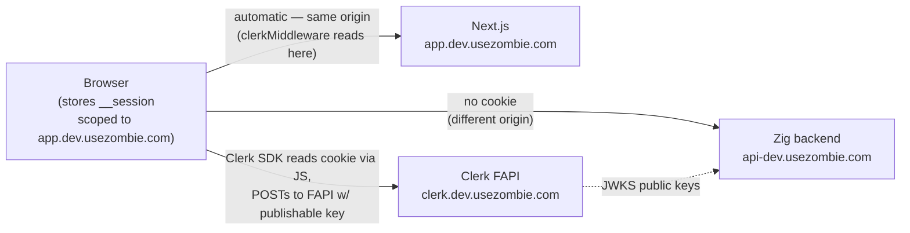
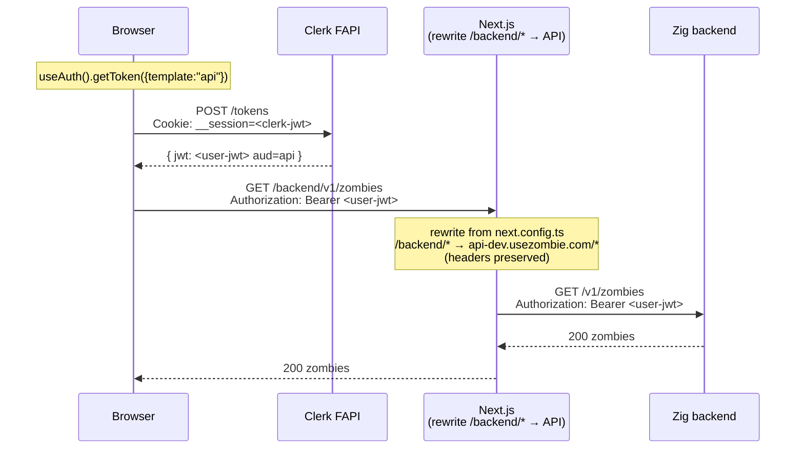
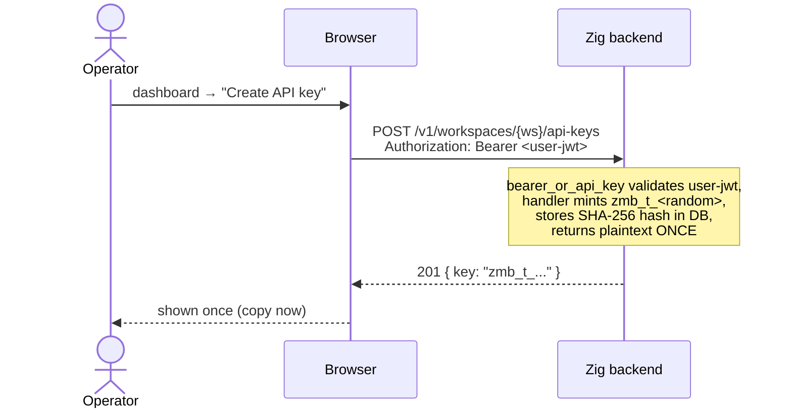
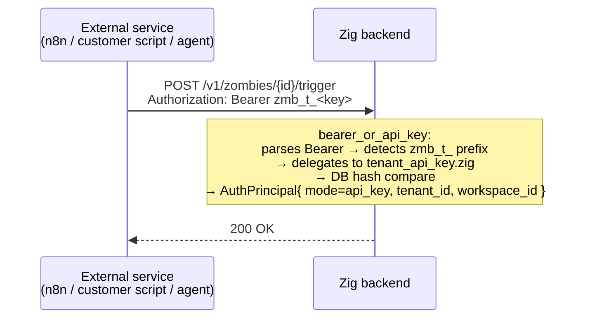
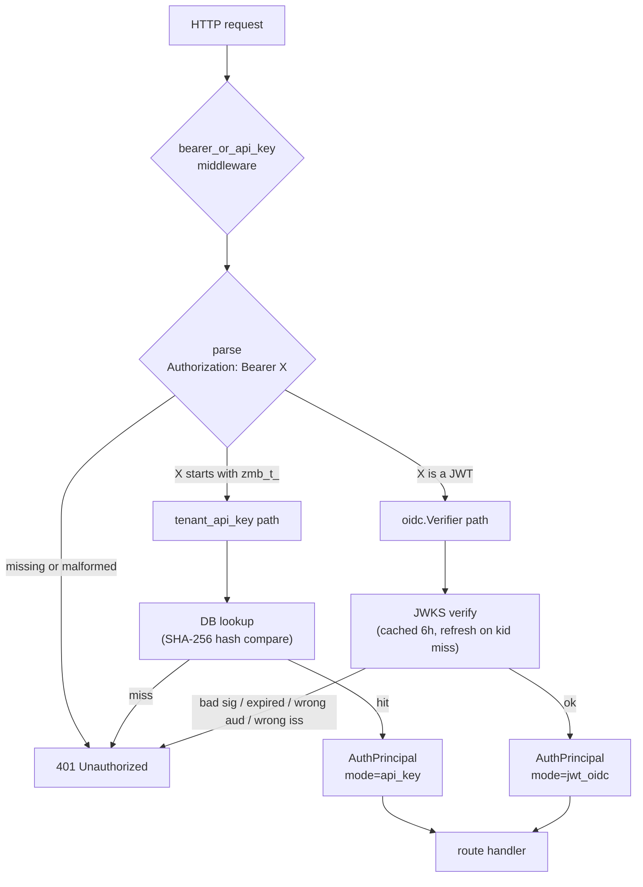

# Authentication

Three principal types reach the Zig backend. All three converge on a single credential shape at the wire:

```
Authorization: Bearer <…>
```

There are exactly two payload shapes inside that header:

| Payload                  | Issuer                | Validation path                    | Used by             |
| ------------------------ | --------------------- | ---------------------------------- | ------------------- |
| `<jwt>` (Clerk-signed)   | Clerk Frontend API    | JWKS verify + `aud` check + claims | CLI · UI            |
| `zmb_t_<random>`         | Backend (per-tenant)  | DB hash lookup                     | Service-to-service  |

Cookies **never reach the Zig backend**. The Clerk `__session` cookie lives on the dashboard's own host (`app.usezombie.com`) — written by the Clerk SDK on the page after sign-in. Same-origin policy means it only attaches on requests back to the dashboard, never to `api-dev.usezombie.com`. See *The two tokens at a glance* below for the full picture.

The middleware that gates almost every route is `bearer_or_api_key` (`src/auth/middleware/bearer_or_api_key.zig`). It parses the `Bearer …` prefix, then routes by sub-prefix:

- `Bearer zmb_t_*` → `tenant_api_key.zig` (DB lookup, hash compare).
- `Bearer <anything else>` → `oidc.Verifier.verifyAuthorization` (cached JWKS, RS256 signature check, `iss` + `aud` + `exp` claims, role mapping).

Both paths resolve to the same `AuthPrincipal` struct (`src/auth/principal.zig`). Handlers downstream never know which credential shape was used.

---

## The two tokens at a glance

When Sarah uses `app.usezombie.com`, two distinct Clerk-issued JSON Web Tokens (JWTs) are in play. They serve different verifiers, so they have different claim shapes. Both are minted from the same Clerk *session* (`sid=sess_…`); their lifetimes are short and parallel.

| Token | Where it lives | Audience | Has `sid`? | Has `metadata`? | Verified by |
|---|---|---|---|---|---|
| **A — default session token** | `__session` cookie on `app.usezombie.com` | (none / Clerk default) | ✅ | ❌ | `clerkMiddleware()` on Next.js |
| **B — `api`-template token** | `Authorization: Bearer …` to zombied | `https://api.usezombie.com` | ❌ | ✅ `tenant_id` + `role` | `oidc.Verifier` in zombied |

**Token A's only job: authenticate the dashboard to itself.** Every protected page (`/zombies`, `/settings`, …) runs `clerkMiddleware()` before render; the middleware reads Token A from the cookie, verifies signature, extracts `sub`. Without it, every page redirects to `/sign-in`. **Token A never reaches zombied** — different origin, the cookie is not sent.

**Token B's only job: authenticate cross-origin requests to zombied.** Browser, Next.js Route Handlers, and `zombiectl` all carry Token B as Bearer. zombied strict-checks `aud=https://api.usezombie.com` (see Backend validation §) and reads `metadata.tenant_id`. **Token B never lands in a cookie.**

The existence of two tokens is the documented Clerk recipe for **frontend on one origin + backend on another origin** — the two-token pattern. The single-token alternative ("root domain", where one cookie spans `app.*` and `api.*`) requires shared-root-domain Clerk config and zombied reading cookies; not how usezombie is wired today.

In Clerk's terms, the existence of two tokens reflects two different verifier requirements: `clerkMiddleware()` needs the `sid` (session id) claim to call Clerk's session-introspection API; zombied needs the `aud=api.usezombie.com` claim to enforce that the token wasn't minted for a different service. Per Clerk's own docs, custom JWT templates **cannot** include `sid`, and default session tokens do not include a service-specific `aud`. One token, both requirements is therefore not a configuration we can hit from a JWT template alone — hence two.

> **Naming bridge to the Mermaid diagrams below.** The diagrams predate this Token A / Token B framing. They use `<clerk-jwt>` for the cookie token (Token A) and `<user-jwt>` for the api-template Bearer (Token B). Same things, older labels.

---

## Flow 1 — CLI (zombiectl, used by agents)

The CLI runs a one-time **device flow** to acquire a Clerk-issued user JWT, then carries that JWT on every subsequent request. The browser is the bridge: it has the user's Clerk session cookie, so it can mint an API-audience JWT on behalf of the CLI and POST it into a short-lived session row keyed by `session_id`.

### One-time login (`zombiectl login`)


### Every subsequent CLI call (incl. `zombiectl steer` + SSE)


The CLI handles its own token refresh: if a request returns `401 token_expired`, it re-runs `zombiectl login`. The handshake row is deleted server-side once the CLI completes the poll.

---

## Flow 2 — UI (browser dashboard)

The browser holds the Clerk `__session` cookie. It uses Clerk's SDK to convert that cookie into a short-lived API-audience JWT, then sends the JWT to the Zig backend. Two sub-flows:

- **Normal API calls** — the browser fetches `getToken()` directly via Clerk's React hook and sends the JWT as `Authorization: Bearer …` to `/backend/...` (same-origin proxy → Zig API).
- **SSE stream** — `EventSource` cannot set headers, so a Next.js Route Handler shadows the rewrite and injects the Bearer server-side.

### Where the cookie lives



The Zig backend never sees the cookie. It only ever validates Token B (the api-template JWT), signed by Clerk's private key and verified via the JWKS that Clerk publishes.

### Normal API call



### SSE stream — Next Route Handler injects Bearer

```mermaid
sequenceDiagram
    participant Browser
    participant Next as Next.js<br/>Route Handler<br/>(/backend/v1/zombies/{id}/events/stream)
    participant Clerk as Clerk FAPI
    participant API as Zig backend

    Browser->>Next: EventSource("/backend/v1/zombies/{id}/events/stream")<br/>Cookie attached only because Next is same-origin? NO<br/>Browser→Next has its own Next-issued session if any;<br/>Clerk session lives on clerk.dev.usezombie.com
    Note over Next: Route Handler shadows the<br/>rewrite for this one path

    Next->>Clerk: auth().getToken({template:"api"})<br/>(server-side; uses request cookies<br/>+ Clerk SDK's internal session resolution)
    Clerk-->>Next: { jwt: <user-jwt> aud=api }

    Next->>API: GET /v1/zombies/{id}/events/stream<br/>Authorization: Bearer <user-jwt><br/>Accept: text/event-stream
    API-->>Next: 200 text/event-stream

    Next-->>Browser: 200 Content-Type: text/event-stream<br/>(streams upstream body through)
    Note over Browser,API: For the lifetime of the connection<br/>Next pipes server-sent events from API to Browser
```

Browser never holds an API-audience JWT in this flow. The Bearer token only ever exists between Next and the Zig backend.

> **Cookie clarification:** `clerkMiddleware()` in `proxy.ts` is what makes the Route Handler's `auth()` call work. It runs on every request to Next.js and reads Token A from the `__session` cookie, which exists on the dashboard's app domain because the Clerk SDK in the browser writes it there post-sign-in. The middleware verifies Token A's signature, decodes `sub`, and gates the page render. For Bearer-to-zombied, `auth().getToken({template:"api"})` then uses Token A's session to mint a fresh Token B via Clerk FAPI — the cookie is the input to the mint, not the output sent to zombied.

---

## Flow 3 — API key (service-to-service)

Static, long-lived, never expires by default. Provisioned in the dashboard, used directly by external services (n8n, Zapier, custom scripts, customer agents).

### Provisioning



### Every subsequent service call



API keys never touch Clerk. They live only in the backend DB, hashed at rest, and authenticate via the same `Authorization: Bearer …` header that JWTs use — the `zmb_t_` prefix tells the middleware to take the DB lookup branch instead of the JWKS verify branch.

---

## Backend validation (the common path)



### Configuration knobs (from `src/cmd/serve.zig`)

| Knob              | Source                | Purpose                                                                         |
| ----------------- | --------------------- | ------------------------------------------------------------------------------- |
| `OIDC_JWKS_URL`   | env var → serve_cfg   | Where to fetch Clerk's signing keys. Cached for 6 h, refreshed on `kid` miss.   |
| `OIDC_ISSUER`     | env var → serve_cfg   | Required value of `iss` claim on every Bearer JWT.                              |
| `OIDC_AUDIENCE`   | env var → serve_cfg   | Required value of `aud` claim. **Strict** — see audience-mismatch note below.   |

### The audience claim — why the UI cannot send `__session` directly

The Zig backend enforces `aud=https://api.usezombie.com` on every JWT it accepts. Clerk's `__session` cookie has either no audience or a Clerk-default audience — it would 401 against this verifier. The cookie is therefore *only* an instruction to Clerk FAPI to mint a real API-audience JWT (via the "api" JWT template). The minted JWT is what the backend trusts.

This is why the UI flow has the extra Clerk hop, and why the SSE path uses a Next Route Handler instead of forwarding the cookie raw.

### Per-microservice JWT templates

`api` is the only template today, but the model is intentionally extensible. Each future microservice gets its own template + its own audience claim:

| Template | `aud` | Verified by |
|---|---|---|
| `api` *(today)* | `https://api.usezombie.com` | zombied |
| `storage` *(future)* | `https://storage.usezombie.com` | hypothetical storage service |
| `agents` *(future)* | `https://agents.usezombie.com` | hypothetical agent runtime |

Per-template audience isolation: a Token-B leak via zombied logs cannot be replayed against `storage-svc` because the `aud` doesn't match. Each microservice strict-checks only its own audience; cross-service replay is structurally prevented by the JWT verifier, not by application logic.

Templates can also be role-gated (e.g. "only users with `metadata.role=admin` can mint the `agents` template") via Clerk dashboard configuration. Adding a new microservice = create a new JWT template in Clerk + add a new strict `OIDC_AUDIENCE` value on that service. No new auth middleware code in zombied (or any sibling service); the existing `bearer_or_api_key.zig` path serves all future Bearer-audience services with config alone.

---

## Why all three flows use Bearer

The wire shape is deliberately uniform: one credential header, one middleware, two payload branches. New principal types (webhook-bound bots, third-party OAuth apps) plug in by issuing a JWT with the right `aud` or by minting a new prefixed API key — no new auth middleware required.

Cookie handling stays inside Clerk and Next.js. The Zig backend is a stateless JWT/key validator.

---

## Security model — who can mint Token B and where the secrets live

Three mint paths exist for Token B (the api-template JWT that zombied accepts), with different authorization surfaces:

| Mint path | Caller | Authorization | Used by |
|---|---|---|---|
| Browser Frontend API (FAPI) | React in `app.usezombie.com` | Sarah's `__session` cookie (Token A) | `useAuth().getToken({template:"api"})` |
| Server-side Clerk SDK | Next.js Route Handlers | Request cookie + `CLERK_SECRET_KEY` | SSE proxy, Server Actions |
| Backend admin API | Trusted servers / Continuous Integration (CI) | `CLERK_SECRET_KEY` only | e2e fixture mint, admin tooling |

**Browser-path mints don't touch the secret key.** The publishable key (`pk_test_…` / `pk_live_…`) IS sent — but it's an instance identifier, not a credential. It says "talk to Clerk instance X". Anyone with only the publishable key can do exactly one harmful thing: sign UP to the instance (creating themselves an account on it). They cannot impersonate existing users, mint tokens for other users, or read/modify metadata. Clerk's threat model treats the publishable key the same way Stripe treats `pk_…`: leaking it is non-incident, and it is intentionally inlined into the browser bundle (any `NEXT_PUBLIC_*` env var ships to the client).

**The credential that needs hard protection is `CLERK_SECRET_KEY`** (`sk_test_…` / `sk_live_…`):

| Surface | How it gets there | Exposure scope |
|---|---|---|
| 1Password | `op://ZMB_CD_DEV/clerk-dev/secret-key` (DEV) · `op://ZMB_CD_PROD/clerk/secret-key` (PROD) | Operator devices + agents acting on their behalf |
| Vercel | `vercel env add CLERK_SECRET_KEY` from vault, scoped per environment | Vercel runtime only; never in browser bundle |
| Fly | `fly secrets set CLERK_SECRET_KEY=...` from vault | Fly runtime only |
| Local dev | `~/Projects/usezombie/.env` (gitignored, symlinked into worktrees) | Operator's laptop only |
| CI | GitHub Actions secret mirrored from vault | CI workers only; not in build artifacts |

`NEXT_PUBLIC_CLERK_PUBLISHABLE_KEY` IS in the browser bundle by design (the `NEXT_PUBLIC_` prefix means "ship to client"). `CLERK_SECRET_KEY` is NOT — no `NEXT_PUBLIC_` prefix means Next.js never inlines it into client code. An accidental rename to `NEXT_PUBLIC_CLERK_SECRET_KEY` would be a catastrophic incident requiring immediate key rotation.

Compromise of `CLERK_SECRET_KEY` is total: anyone holding it can mint Token B for any user, modify any user's `publicMetadata` (which controls `tenant_id` + `role`), and impersonate the entire user base.

### Rotation procedure

Rotation does NOT invalidate existing user JWTs (Clerk signs those with its own private key, fronted by JWKS — the secret key plays no part). It DOES revoke admin-API access for any holder of the old key. So normal-rotation order:

1. Generate the new key in Clerk dashboard. Keep the old key active until step 4.
2. Update vault — `op item edit ZMB_CD_DEV/clerk-dev secret-key=<new>` (DEV) and `ZMB_CD_PROD/clerk` (PROD). One vault update per environment.
3. Redeploy consumers in this order: **Vercel** first (Next.js Server Actions + Route Handlers do server-side `getToken({template:"api"})`); **Fly** second (zombied does NOT use the secret directly today, but pick up if the rotated bundle includes other secrets); **CI** last (GitHub Actions secret mirror, used for e2e fixture mint).
4. Revoke the old key in Clerk dashboard once all consumers report green.

If rotated under suspected compromise, skip the gradual revoke — invalidate the old key immediately at step 1. Users stay signed in (their JWTs remain valid until natural expiry); admin tooling fails until step 3 completes.

---

## Test infrastructure — e2e fixture mint (admin path)

The authenticated e2e harness (`ui/packages/app/tests/e2e/auth/`) uses the **admin mint path** to provision two non-interactive fixture users (`regular-fixture@…`, `admin-fixture@…`) without driving Clerk's interactive sign-in form:

```text
globalSetup
  ├─ provisionUser    → idempotent: GET /v1/users by email (Clerk admin API),
  │                     create if missing.
  ├─ bootstrapTenant  → POST /v1/webhooks/clerk with a locally-Svix-signed
  │                     `user.created` payload (uses CLERK_WEBHOOK_SECRET).
  │                     zombied creates the tenant + default workspace +
  │                     starter credit, then PATCHes Clerk publicMetadata
  │                     with the new tenant_id.
  └─ attachJwt        → mints two tokens from the same Clerk session via:
                          POST /v1/sessions/{id}/tokens         → Token A (cookie)
                          POST /v1/sessions/{id}/tokens/api     → Token B (Bearer)
                        Both authorized by CLERK_SECRET_KEY.

per-spec
  ├─ signInAs(page, key)  → context.addCookies({name:"__session", value: cookieJwt})
  └─ clientFor(key)       → fetch with Authorization: Bearer ${sessionJwt}
```

The harness mirrors production exactly: `cookieJwt` for cookie validation by `clerkMiddleware()`, `sessionJwt` for Bearer to zombied. Two tokens because Pattern 2 (cross-origin frontend + backend).

The Svix bootstrap step is the local-only stand-in for Clerk's real outbound webhook: real Clerk cannot reach `localhost:3000`, so the harness signs the same payload Clerk would have sent and POSTs it directly. The signature math is identical to what zombied's `webhook_sig` middleware would verify in production — `webhook_secret` is the shared key, the `user.created` payload shape mirrors `src/http/handlers/webhooks/clerk_integration_test.zig`. zombied cannot tell the difference.

The local-zombied loop runs via `bun run test:e2e:auth:local` (forces `NEXT_PUBLIC_API_URL=http://localhost:3000`); the deployed-zombied loop runs the same harness against `api-dev.usezombie.com` from CI. No production-target invocation exists.

---

## Webhook auth (separate surface)

The three flows above (CLI, UI, API key) all converge on `Authorization: Bearer …`. **Inbound webhooks are a different surface entirely** — they never carry a Bearer token. Every inbound webhook MUST be HMAC-signed by the calling provider, verified by the `webhook_sig` middleware (`src/auth/middleware/webhook_sig.zig`), and rejected if the signature is missing or wrong. There is no fallback.

This is industry standard for inbound webhooks: GitHub (`X-Hub-Signature-256`), Slack (`X-Slack-Signature`), Stripe (`Stripe-Signature`), Linear (`linear-signature`), and Svix-fronted providers (Clerk, AgentMail) all ship HMAC-SHA256 over the raw body. Bearer tokens are for *outbound* API calls (where the caller authenticates itself); HMAC is for *inbound* (where the receiver verifies the body wasn't tampered with).

### Provider scheme registry

`src/zombie/webhook_verify.zig` holds the canonical `PROVIDER_REGISTRY` — one `VerifyConfig` per provider naming the signature header, prefix, and timestamp policy:

| Provider | `sig_header` | `prefix` | Includes timestamp? | Drift |
| --- | --- | --- | --- | --- |
| GitHub | `x-hub-signature-256` | `sha256=` | no | n/a |
| Slack | `x-slack-signature` | `v0=` | yes (`x-slack-request-timestamp`) | 5 min |
| Linear | `linear-signature` | (none) | no | n/a |

Adding a new provider is one new `VerifyConfig` const + one entry in the registry. No new middleware.

### Workspace-credential resolver

The middleware itself is provider-agnostic. The host supplies a `lookup_fn` (`src/cmd/serve_webhook_lookup.zig:lookup`) that, given the URL's `{zombie_id}`, returns:

1. **`signature_scheme`** — populated whenever the zombie's `trigger.source` matches a registry entry, even if the vault credential is missing. This is what makes "credential not configured" fail closed instead of silently falling back to anything else.
2. **`signature_secret`** — the HMAC key, resolved from `vault.secrets[workspace_id, key_name=zombie:<source>]` and parsed as JSON (`{ "webhook_secret": "<key>", ... }`). The vault key name defaults to the source value but can be overridden by the zombie's `x-usezombie.trigger.credential_name` frontmatter for the rare multi-org case where one workspace integrates with two GitHub orgs.

The credential being workspace-scoped (not zombie-scoped) means rotating the secret once rotates it for every zombie in that workspace using the same source — single point of rotation, the property the architecture wants.

### Error taxonomy

The middleware emits exactly three error codes for webhook auth failures, each with a distinct operator action:

| Code | When it fires | What the operator should do |
| --- | --- | --- |
| `UZ-WH-020 webhook_credential_not_configured` (401) | Provider not recognized OR `zombie:<source>` vault row missing OR row has no `webhook_secret` field OR field is empty | `zombiectl credential add <source> --data='{"webhook_secret":"<key>"}'` in the workspace |
| `UZ-WH-010 invalid_signature` (401) | Provider + secret are both configured, but the signature header is missing OR the body's MAC doesn't match | The webhook secret stored in the workspace vault doesn't match what the provider has registered. Re-rotate. |
| `UZ-WH-011 stale_timestamp` (401) | Slack-style schemes only — request timestamp is outside the 5-minute drift window | Clock skew or replay attempt. Investigate. |

The `UZ-WH-020` vs `UZ-WH-010` split matters: the first is a recoverable misconfiguration, the second is either an attack or a real drift between provider config and our vault. Operators should respond differently to each.

### What does NOT auth a webhook

- **Bearer tokens.** Sending `Authorization: Bearer …` to any `/v1/webhooks/...` URL contributes nothing — the header is not consulted. (Generic Bearer auth applies only to the normal API surface listed in the three flows above.)
- **Session cookies.** Webhook URLs are not session-authed; cookies are ignored.
- **URL-embedded secrets** (legacy `/v1/webhooks/{zombie_id}/{secret}` form). Removed in M43 — the matcher no longer recognizes the two-segment form.

### Cross-references

- Implementation: `src/auth/middleware/webhook_sig.zig` (middleware), `src/cmd/serve_webhook_lookup.zig` (resolver), `src/zombie/webhook_verify.zig` (provider registry).
- Operator-facing data flow: `docs/architecture/data_flow.md` §B (TRIGGER), `docs/architecture/user_flow.md` §8 (the GH Actions worked example).
- Error registry: `src/errors/error_entries.zig` (HTTP status + docs URI for each code), `src/auth/middleware/errors.zig` (the auth-layer mirror that keeps `src/auth/` portable).
