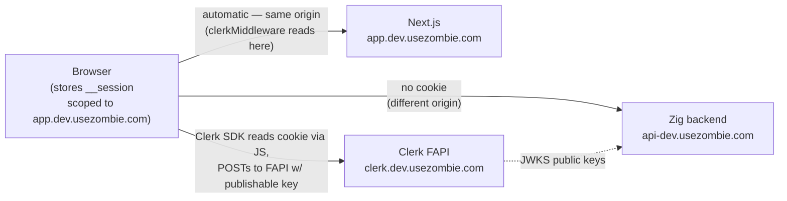
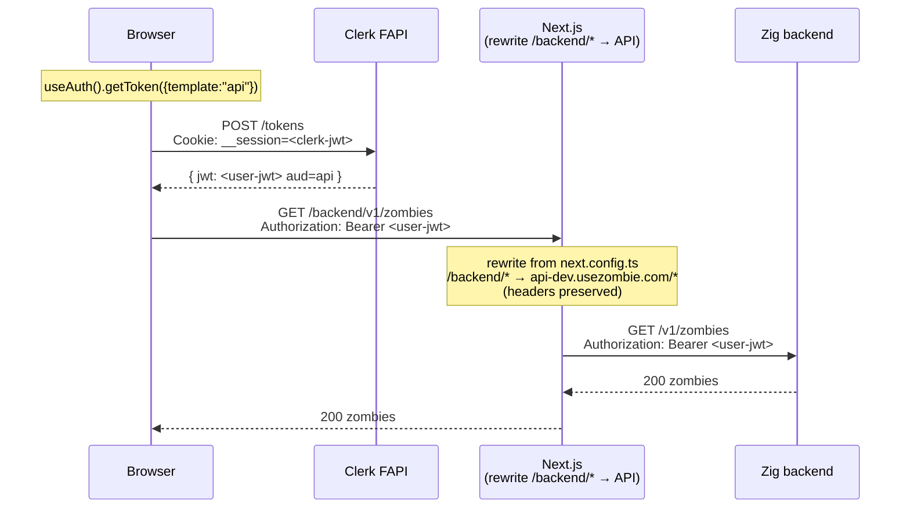
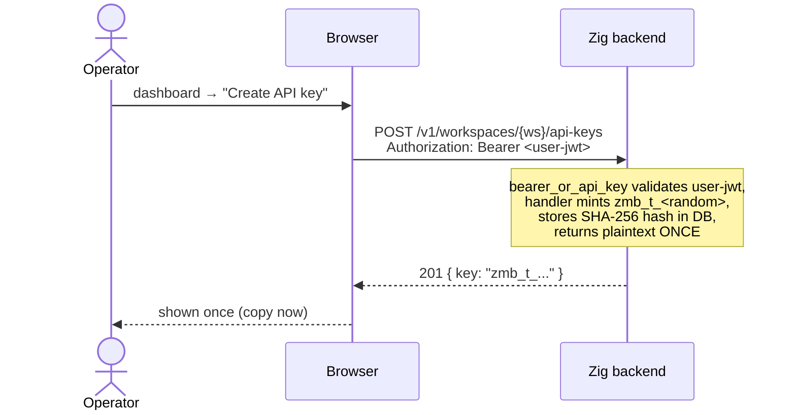
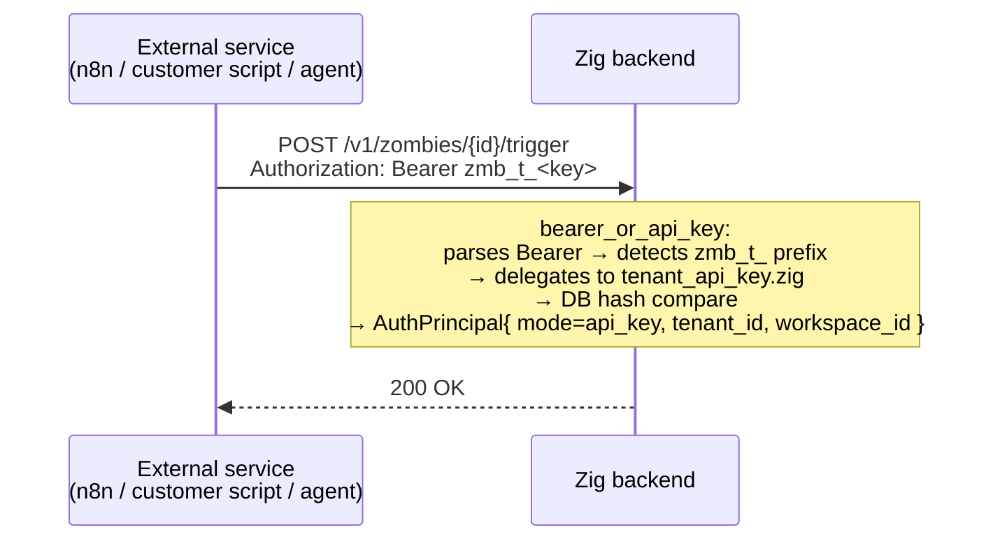
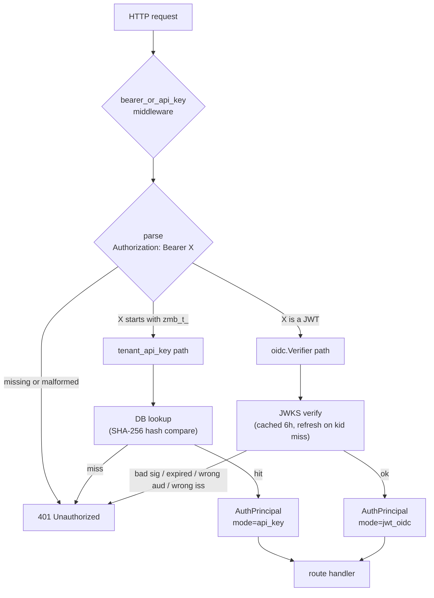

# Authentication

Three principal types reach the Zig backend. All three converge on a single credential shape at the wire:

```
Authorization: Bearer <…>
```

## The three flows at a glance

```
            ┌──────────────────────────────────────────────────────────────┐
            │                                                              │
            │  WHO IS THE ACTOR?                                           │
            │                                                              │
            │  ┌──────────────┐    ┌──────────────┐    ┌──────────────┐  │
            │  │ A human at a │    │ A human in a │    │ A machine    │  │
            │  │ terminal     │    │ browser tab  │    │ (script/bot) │  │
            │  └──────┬───────┘    └──────┬───────┘    └──────┬───────┘  │
            │         │                   │                   │           │
            │         ▼                   ▼                   ▼           │
            │   ┌─────────────┐    ┌─────────────┐    ┌─────────────┐    │
            │   │   FLOW 1    │    │   FLOW 2    │    │   FLOW 3    │    │
            │   │             │    │             │    │             │    │
            │   │ zombiectl   │    │ Dashboard   │    │ Tenant API  │    │
            │   │ login       │    │ sign-in     │    │ key         │    │
            │   │             │    │             │    │ zmb_t_…     │    │
            │   │ verification│    │ Clerk       │    │ static hash │    │
            │   │ code + ECDH │    │ __session   │    │ in DB       │    │
            │   │ + 5-min TTL │    │ cookie →    │    │ long-lived  │    │
            │   │             │    │ getToken    │    │ revocable   │    │
            │   │             │    │ ({api})     │    │             │    │
            │   └──────┬──────┘    └──────┬──────┘    └──────┬──────┘    │
            │          │                  │                  │            │
            │          └──────────────────┴──────────────────┘            │
            │                             │                                │
            │                             ▼                                │
            │              Authorization: Bearer <…>                       │
            │                             │                                │
            │                             ▼                                │
            │              bearer_or_api_key middleware                    │
            │              (zmb_t_*  → DB hash lookup)                     │
            │              (anything → JWKS verify)                        │
            │                                                              │
            └──────────────────────────────────────────────────────────────┘
```

| When to use which | Flow 1 | Flow 2 | Flow 3 |
|---|---|---|---|
| Human present at the keyboard? | ✅ required (5-min interactive flow) | ✅ required | ❌ |
| Long-lived credential? | ❌ JWT expires ~15 min; CLI re-runs `login` on 401 | ❌ minted per request | ✅ until explicitly revoked |
| Provisioned via | `zombiectl login` | Clerk sign-in form | dashboard "Create API Key" surface |
| Right answer for | a developer on a workstation; Cursor/Claude Code running locally with the developer present | someone using `app.usezombie.com` in a browser | n8n / Zapier / cron jobs / CI runners / Kubernetes / scheduled background work |
| Wrong answer for | unattended CI / cron / K8s / hosted-agent platforms — see [`AUTH_DEVICE_LOGIN.md`](./AUTH_DEVICE_LOGIN.md) *Human-led-only invariant* | none — this is the only browser path | interactive humans (`zmb_t_` long-lived keys carry too much standing privilege for a workstation) |

There is also a fourth surface — **agent keys** (`zmb_*` bound to a single zombie) — for narrowly-scoped webhook-driven inbound calls. It's a Flow 3 subtype: same DB-hash-lookup shape, narrower scope. See *Agent keys* below.

A fifth surface — **inbound webhooks** — does not use Bearer at all (HMAC-signed by the provider). See *Webhook auth*.

A sixth surface — the **runner token** (`zrn_`) — is the first *machine* principal: a host-resident `zombie-runner` that holds no tenant identity at all. Same Bearer wire shape and DB-hash lookup, but a separate middleware and trust plane. See *Runner token* below.

Cookies **never reach the Zig backend**. The Clerk `__session` cookie lives on the dashboard's own host (`app.usezombie.com`) — written by the Clerk SDK on the page after sign-in. Same-origin policy means it only attaches on requests back to the dashboard, never to `api-dev.usezombie.com`. See *Flow 2 — UI* below for the cookie-vs-Bearer picture.

The middleware that gates almost every route is `bearer_or_api_key` (`src/auth/middleware/bearer_or_api_key.zig`). It parses the `Bearer …` prefix, then routes by sub-prefix:

- `Bearer zmb_t_*` → `tenant_api_key.zig` (DB lookup, hash compare).
- `Bearer <anything else>` → `oidc.Verifier.verifyAuthorization` (cached JWKS, RS256 signature check, `iss` + `aud` + `exp` claims, role mapping).

Both paths resolve to the same `AuthPrincipal` struct (`src/auth/principal.zig`). Handlers downstream never know which credential shape was used.

---

## Auth model in one screen

Six principal surfaces, one wire shape (`Authorization: Bearer …`), and a prefix that routes to the right validator.

| Principal | Credential | Issuer | Validation | Middleware |
|---|---|---|---|---|
| Human at a terminal (CLI) | Clerk JWT (`api` template) | Clerk | JWKS verify + `aud`/`iss`/`exp` | `bearer_or_api_key` → OIDC |
| Human in a browser (dashboard) | Clerk session JWT | Clerk | JWKS verify + `aud` | `bearer_or_api_key` → OIDC |
| Service / automation | `zmb_t_<hex>` tenant api key | backend | SHA-256 hash lookup | `bearer_or_api_key` → `tenant_api_key` |
| One-zombie webhook caller | `zmb_<hex>` agent key | backend | SHA-256 hash lookup | bespoke, handler-local today — see *Agent keys* |
| Host runner (machine) | `zrn_<hex>` runner token | backend (via `register`) | SHA-256 hash lookup in `fleet.runners` | `runnerBearer` on `/v1/runners/me/*` |
| Inbound webhook (provider) | HMAC signature (no Bearer) | provider | per-provider HMAC | `webhook_sig` |

Routing in `bearer_or_api_key.zig`: `zmb_t_` → tenant-key DB lookup; anything else → OIDC/JWKS verify; no token → 401. The runner plane is deliberately a separate middleware (`runnerBearer`, `zrn_` only) so a runner token cannot satisfy a tenant route and vice versa.

Authorization is **role-based** today: `AuthRole = user < operator < admin` (`src/auth/rbac.zig`), enforced by `RequireRole`. Scope-based authz (`fleet:write`, finer tenant scopes) is a v2.1 item — see [`architecture/roadmap.md`](./architecture/roadmap.md).

Everything below is per-surface detail. For the CLI device-flow threat model + crypto, see [`AUTH_DEVICE_LOGIN.md`](./AUTH_DEVICE_LOGIN.md).

---

## Flow 1 — CLI device flow (`zombiectl login`)

The one credential path humans use from a terminal: a browser-mediated device flow with a **verification code** binding the human approving in the browser to the human typing into the terminal, and **ECDH P-256 transport encryption** that keeps the minted JWT off every server-side surface but process memory. Bounded at five minutes; unfinished sessions expire. Once `credentials.json` (mode `0o600`) exists, the CLI carries the JWT on every request — same as a Flow 2 browser call after `getToken({template:"api"})`; on `401 token_expired` it re-runs `zombiectl login`.

The full data lifecycle, sequence, session state machine, threat model, pinned crypto primitives, deploy contract, and the human-led-only invariant live in **[`AUTH_DEVICE_LOGIN.md`](./AUTH_DEVICE_LOGIN.md)**.

---

## Flow 2 — UI (browser dashboard)

> **Post-Stage-1 reconciliation (M74_002 §9 shipped).** The Token A / Token B description in this section is the **historical pre-Stage-1 shape**, kept for context on *why* the split existed. **Current shape:** the dashboard rides **one** token — the customized session token (`auth().getToken()`, no template arg). The browser holds no token of its own: reads run in React Server Components, mutations in Server Actions (both server-side), and the SSE route handler mints server-side. The single remaining client-held token — the `token` prop on the zombie-detail thread, serialized into hydration data — is closed by **M77_001** (`docs/v2/active/M77_001_P1_UI_AUTH_CLIENT_TOKEN_REMOVAL.md`). For where this is headed, see [`architecture/roadmap.md`](./architecture/roadmap.md).

### Shape

```
Browser tab on app.usezombie.com                            Zig backend (api.usezombie.com)
─────────────────────────────────                            ─────────────────────────────────
__session cookie  ──┐                                                    ▲
   (Token A)        │                                                    │
                    ▼                                                    │
    clerkMiddleware()                                                    │
    (Next.js page render)                                                │
                                                                         │
    useAuth().getToken({template:"api"})                                 │
        │  POST /tokens   + __session cookie                             │
        ▼                                                                │
    Clerk FAPI ───────────► <user-jwt>                                   │
                            (Token B, aud=api)                           │
                            │                                            │
                            ▼                                            │
    fetch("/backend/v1/…", { Authorization: Bearer Token B })            │
                            │                                            │
                            └─► /backend/:path* rewrite ──────────────────┘
                                (same-origin; preserved Bearer header)
```

The browser holds the Clerk `__session` cookie. It uses Clerk's SDK to convert that cookie into a short-lived API-audience JWT, then sends the JWT to the Zig backend. Two sub-flows:

- **Normal API calls** — the browser fetches `getToken()` directly via Clerk's React hook and sends the JWT as `Authorization: Bearer …` to `/backend/...` (same-origin proxy → Zig API).
- **SSE stream** — `EventSource` cannot set headers, so a Next.js Route Handler shadows the rewrite and injects the Bearer server-side.

### Where the cookie lives



The Zig backend never sees the cookie. It only ever validates Token B (the api-template JWT), signed by Clerk's private key and verified via the JWKS that Clerk publishes.

### Normal API call



### SSE stream — Next Route Handler injects Bearer

```mermaid
sequenceDiagram
    participant Browser
    participant Next as Next.js<br/>Route Handler<br/>(/backend/v1/zombies/{id}/events/stream)
    participant Clerk as Clerk FAPI
    participant API as Zig backend

    Browser->>Next: EventSource("/backend/v1/zombies/{id}/events/stream")<br/>Cookie attached only because Next is same-origin? NO<br/>Browser→Next has its own Next-issued session if any;<br/>Clerk session lives on clerk.dev.usezombie.com
    Note over Next: Route Handler shadows the<br/>rewrite for this one path

    Next->>Clerk: auth().getToken({template:"api"})<br/>(server-side; uses request cookies<br/>+ Clerk SDK's internal session resolution)
    Clerk-->>Next: { jwt: <user-jwt> aud=api }

    Next->>API: GET /v1/zombies/{id}/events/stream<br/>Authorization: Bearer <user-jwt><br/>Accept: text/event-stream
    API-->>Next: 200 text/event-stream

    Next-->>Browser: 200 Content-Type: text/event-stream<br/>(streams upstream body through)
    Note over Browser,API: For the lifetime of the connection<br/>Next pipes server-sent events from API to Browser
```

Browser never holds an API-audience JWT in this flow. The Bearer token only ever exists between Next and the Zig backend.

> **Cookie clarification:** `clerkMiddleware()` in `proxy.ts` is what makes the Route Handler's `auth()` call work. It runs on every request to Next.js and reads Token A from the `__session` cookie, which exists on the dashboard's app domain because the Clerk SDK in the browser writes it there post-sign-in. The middleware verifies Token A's signature, decodes `sub`, and gates the page render. For Bearer-to-zombied, `auth().getToken({template:"api"})` then uses Token A's session to mint a fresh Token B via Clerk FAPI — the cookie is the input to the mint, not the output sent to zombied.

---

## Flow 3 — Tenant API key (service-to-service)

Static, long-lived, never expires by default. Provisioned in the dashboard, used directly by external services (n8n, Zapier, custom scripts, customer agents).

### Shape

```
Provisioning (one-time, via dashboard)            Usage (every subsequent call)
──────────────────────────────────────            ─────────────────────────────
Operator                                          External service (n8n/Zapier/…)
   │                                                │
   │ click "Create API key"                         │ Authorization: Bearer zmb_t_<hex>
   ▼                                                ▼
Dashboard ─► POST /v1/api-keys ─► Zig backend     Zig backend
              Authorization:        │                 │
              Bearer <user-jwt>     │                 │ bearer_or_api_key middleware:
              (Flow 2 mint)         │                 │ detects "zmb_t_" prefix
                                    │                 │ → tenant_api_key.zig
                                    │                 │ → SHA-256 hash compare in DB
                                    │                 ▼
                                    │             AuthPrincipal{ mode=api_key,
                                    │                            tenant_id, … }
                                    ▼
                            core.api_keys row
                            { hash: sha256(zmb_t_<hex>),
                              tenant_id, label, … }
                            (raw zmb_t_<hex> shown to
                             operator ONCE — never stored)
```

A tenant API key carries the same standing privilege as a long-lived JWT for the tenant — anyone who holds the raw `zmb_t_<hex>` value can act for that tenant until the key is revoked. Treat as a credential equivalent to a database password: rotate on suspected exposure, scope by workspace where the dashboard's "Create API Key" surface supports it, prefer short-lived JWTs (Flow 1 or Flow 2) for interactive use.

### Provisioning



### Every subsequent service call



API keys never touch Clerk. They live only in the backend DB, hashed at rest, and authenticate via the same `Authorization: Bearer …` header that JWTs use — the `zmb_t_` prefix tells the middleware to take the DB lookup branch instead of the JWKS verify branch.

---

## Agent keys (`zmb_*`, bound to a single zombie)

A narrower subtype of Flow 3. Same DB-hash-lookup shape; same `Authorization: Bearer …` wire format; the only differences are scope (one zombie vs. one tenant) and provisioning surface (`POST /v1/workspaces/{ws}/agent-keys` vs. `POST /v1/api-keys`).

```
core.agent_keys row
{ hash: sha256(zmb_<hex>),
  workspace_id, zombie_id, label, … }
```

Used by webhook-driven external integrations that post events to a single zombie (one customer's GitHub Actions emitting to a specific automation, etc.). The narrow scope makes the blast radius of a leaked agent key bounded to one zombie's event stream — preferred over `zmb_t_` for any caller that only needs to act on one zombie.

**Today this is a side door.** Agent keys authenticate via a bespoke handler-local lookup (`integration_grants/handler.zig::authenticateZombie`), not `bearer_or_api_key`, and never become an `AuthPrincipal` (there is no `AuthMode.agent_key`). The v2.1 revamp makes them a first-class principal — a dedicated middleware branch + `AuthMode.agent_key` — aligning with the reference design at `~/Projects/oss/auth.md`. See [`architecture/roadmap.md`](./architecture/roadmap.md).

---

## Runner token (`zrn_`) — the machine principal

Flows 1–3 and agent keys all act *on behalf of* a human or a tenant. The **runner token** is the first principal that represents infrastructure the platform runs — a host-resident `zombie-runner` (see [`architecture/runner_fleet.md`](./architecture/runner_fleet.md)) — and carries **no tenant identity of its own**.

### Provisioning (register)

A runner has no credential until someone with an *existing* credential registers it. `register` is authed by a Clerk JWT (an operator at the dashboard/CLI) or a `zmb_t_` api_key (an automated provisioner) — there is no enrollment token and no separate admin endpoint.

```
Operator / provisioner                              zombied
   │ POST /v1/runners
   │   Authorization: Bearer <Clerk-JWT | zmb_t_>
   │   { host_id, sandbox_tier, labels[] }
   ▼
   bearer_or_api_key validates the caller; the handler mints zrn_<random>,
   stores ONLY sha256(zrn_) in fleet.runners, returns the raw token ONCE
   │
   ◄── 201 { runner_id, runner_token: "zrn_…" }
   the operator installs zrn_ on the host (env ZOMBIE_RUNNER_TOKEN)
```

`fleet.runners` is a dedicated schema — runner identity must not share a trust boundary with tenant data in `core`. Rotation swaps `token_hash`; revocation sets `status='revoked'`.

### Validation — a separate middleware, on purpose

Every later call carries `Bearer zrn_` and hits a dedicated `runnerBearer` middleware wired **only** onto `/v1/runners/me/*`:

```
parse Bearer → require "zrn_" prefix          (else 401 — no JWKS fall-through)
SELECT id, status FROM fleet.runners WHERE token_hash = sha256(token)   (timing-safe)
  status='active' → AuthPrincipal{ mode=runner, runner_id, tenant_id=null }
  miss / revoked  → 401
```

This is the deliberate exception to "new principal types need no new middleware." A runner token must never satisfy a tenant route, and a user/tenant token must never satisfy a runner route — so the runner plane gets its own middleware rather than a `zrn_` branch in `bearer_or_api_key`. The boundary is enforced by *which middleware guards the route*, not by per-handler checks. The lookup is read-only; liveness (`last_seen_at`) is written by the heartbeat handler, not on every call.

### Least privilege

A runner principal authorizes exactly four self-scoped verbs — heartbeat, lease, report, activity — for the one runner the token identifies (`me`). It cannot enumerate tenants, read tenant data, or reach any `/v1` data-plane route. It receives a tenant's `secrets_map` inline in a lease only because `zombied` *placed* that tenant's work on it — a trust decision made when an operator registered a trusted-fleet runner, not authority the token carries. **Secret delivery is placement, not a standing grant.** `tenant_id=null` on the principal is the signal that this credential holds no tenant authority.

### What ships when

M80_001 freezes the protocol, the `fleet.runners` schema, and the error codes — and, per the keystone's single-PR delivery, ships the working `register` handler, the `runnerBearer` middleware, and `AuthPrincipal.runner_id`. They land here rather than later because the `/v1/runners/*` routes are registered always-on: a real `lease`/`report` handler on `none` middleware would be a live, unauthenticated endpoint handing a tenant's `secrets_map` to any caller. M80_005 narrows to Transport-Layer-Security (TLS) hardening and the operator-assigned-trust authz fields (`trust_class`, `allowed_workspace_ids`).

---

## Backend validation (the common path)



### Configuration knobs (from `src/cmd/serve.zig`)

| Knob              | Source                | Purpose                                                                         |
| ----------------- | --------------------- | ------------------------------------------------------------------------------- |
| `OIDC_JWKS_URL`   | env var → serve_cfg   | Where to fetch Clerk's signing keys. Cached for 6 h, refreshed on `kid` miss.   |
| `OIDC_ISSUER`     | env var → serve_cfg   | Required value of `iss` claim on every Bearer JWT.                              |
| `OIDC_AUDIENCE`   | env var → serve_cfg   | Required value of `aud` claim. **Strict** — see audience-mismatch note below.   |

### The audience claim — why the UI cannot send `__session` directly

The Zig backend enforces `aud=https://api.usezombie.com` on every JWT it accepts. Clerk's `__session` cookie has either no audience or a Clerk-default audience — it would 401 against this verifier. The cookie is therefore *only* an instruction to Clerk FAPI to mint a real API-audience JWT (via the "api" JWT template). The minted JWT is what the backend trusts.

This is why the UI flow has the extra Clerk hop, and why the SSE path uses a Next Route Handler instead of forwarding the cookie raw.

### Per-microservice JWT templates

`api` is the only template today, but the model is intentionally extensible. Each future microservice gets its own template + its own audience claim:

| Template | `aud` | Verified by |
|---|---|---|
| `api` *(today)* | `https://api.usezombie.com` | zombied |
| `storage` *(future)* | `https://storage.usezombie.com` | hypothetical storage service |
| `agents` *(future)* | `https://agents.usezombie.com` | hypothetical agent runtime |

Per-template audience isolation: a Token-B leak via zombied logs cannot be replayed against `storage-svc` because the `aud` doesn't match. Each microservice strict-checks only its own audience; cross-service replay is structurally prevented by the JWT verifier, not by application logic.

Templates can also be role-gated (e.g. "only users with `metadata.role=admin` can mint the `agents` template") via Clerk dashboard configuration. Adding a new microservice = create a new JWT template in Clerk + add a new strict `OIDC_AUDIENCE` value on that service. No new auth middleware code in zombied (or any sibling service); the existing `bearer_or_api_key.zig` path serves all future Bearer-audience services with config alone.

---

## Why all three flows use Bearer

The wire shape is deliberately uniform: one credential header, one middleware, two payload branches. New principal types (webhook-bound bots, third-party OAuth apps) plug in by issuing a JWT with the right `aud` or by minting a new prefixed API key — no new auth middleware required.

Cookie handling stays inside Clerk and Next.js. The Zig backend is a stateless JWT/key validator.

---

## Security model — who can mint Token B and where the secrets live

Three mint paths exist for Token B (the api-template JWT that zombied accepts), with different authorization surfaces:

| Mint path | Caller | Authorization | Used by |
|---|---|---|---|
| Browser Frontend API (FAPI) | React in `app.usezombie.com` | Sarah's `__session` cookie (Token A) | `useAuth().getToken({template:"api"})` |
| Server-side Clerk SDK | Next.js Route Handlers | Request cookie + `CLERK_SECRET_KEY` | SSE proxy, Server Actions |
| Backend admin API | Trusted servers / Continuous Integration (CI) | `CLERK_SECRET_KEY` only | e2e fixture mint, admin tooling |

**Browser-path mints don't touch the secret key.** The publishable key (`pk_test_…` / `pk_live_…`) IS sent — but it's an instance identifier, not a credential. It says "talk to Clerk instance X". Anyone with only the publishable key can do exactly one harmful thing: sign UP to the instance (creating themselves an account on it). They cannot impersonate existing users, mint tokens for other users, or read/modify metadata. Clerk's threat model treats the publishable key the same way Stripe treats `pk_…`: leaking it is non-incident, and it is intentionally inlined into the browser bundle (any `NEXT_PUBLIC_*` env var ships to the client).

**The credential that needs hard protection is `CLERK_SECRET_KEY`** (`sk_test_…` / `sk_live_…`):

| Surface | How it gets there | Exposure scope |
|---|---|---|
| 1Password | `op://ZMB_CD_DEV/clerk-dev/secret-key` (DEV) · `op://ZMB_CD_PROD/clerk/secret-key` (PROD) | Operator devices + agents acting on their behalf |
| Vercel | `vercel env add CLERK_SECRET_KEY` from vault, scoped per environment | Vercel runtime only; never in browser bundle |
| Fly | `fly secrets set CLERK_SECRET_KEY=...` from vault | Fly runtime only |
| Local dev | `~/Projects/usezombie/.env` (gitignored, symlinked into worktrees) | Operator's laptop only |
| CI | GitHub Actions secret mirrored from vault | CI workers only; not in build artifacts |

`NEXT_PUBLIC_CLERK_PUBLISHABLE_KEY` IS in the browser bundle by design (the `NEXT_PUBLIC_` prefix means "ship to client"). `CLERK_SECRET_KEY` is NOT — no `NEXT_PUBLIC_` prefix means Next.js never inlines it into client code. An accidental rename to `NEXT_PUBLIC_CLERK_SECRET_KEY` would be a catastrophic incident requiring immediate key rotation.

Compromise of `CLERK_SECRET_KEY` is total: anyone holding it can mint Token B for any user, modify any user's `publicMetadata` (which controls `tenant_id` + `role`), and impersonate the entire user base.

### Rotation procedure

Rotation does NOT invalidate existing user JWTs (Clerk signs those with its own private key, fronted by JWKS — the secret key plays no part). It DOES revoke admin-API access for any holder of the old key. So normal-rotation order:

1. Generate the new key in Clerk dashboard. Keep the old key active until step 4.
2. Update vault — `op item edit ZMB_CD_DEV/clerk-dev secret-key=<new>` (DEV) and `ZMB_CD_PROD/clerk` (PROD). One vault update per environment.
3. Redeploy consumers in this order: **Vercel** first (Next.js Server Actions + Route Handlers do server-side `getToken({template:"api"})`); **Fly** second (zombied does NOT use the secret directly today, but pick up if the rotated bundle includes other secrets); **CI** last (GitHub Actions secret mirror, used for e2e fixture mint).
4. Revoke the old key in Clerk dashboard once all consumers report green.

If rotated under suspected compromise, skip the gradual revoke — invalidate the old key immediately at step 1. Users stay signed in (their JWTs remain valid until natural expiry); admin tooling fails until step 3 completes.

---

## Sensitive-data classification

Every named credential / token / identifier in the auth surface, with sensitivity class, acceptable surfaces, and forbidden surfaces. Reach for this table when designing a new audit-log event, a new metric label, a new error-response body, or a new diagnostic bundle — anything that copies data out of a process and into a place where humans or external systems can read it.

| Item | Class | Lifetime | Acceptable surfaces | Forbidden surfaces |
|---|---|---|---|---|
| `__session` cookie (Token A) | secret | session-bound (Clerk-managed) | dashboard origin (`app.usezombie.com`) only | any other origin · server logs · client logs · URLs |
| Clerk-signed JWT (Token B, `api` template) | secret | ~15 min | `Authorization: Bearer …` header on `/v1/*` calls | logs · query strings · client-side storage beyond the React closure that minted it · disk (the CLI's `credentials.json` is the one exception, mode 0o600) |
| `zmb_t_*` tenant API key | secret | until explicitly revoked | `Authorization: Bearer …` header on `/v1/*` calls; vault items; operator's password manager | logs · process lists · shell history · client-side storage · disk except a secrets manager · screenshots |
| `zmb_*` agent key | secret | until explicitly revoked | `Authorization: Bearer …` header on `/v1/*` calls (specifically to the bound zombie's surface) | same as `zmb_t_*` |
| `CLERK_SECRET_KEY` | secret (catastrophic) | until rotated | Vercel runtime env · Fly runtime env · `~/Projects/usezombie/.env` (gitignored, operator laptop only) · CI runners (GitHub Actions secret) · 1Password vaults | client bundle (a rename to `NEXT_PUBLIC_*` would be a P0 incident) · logs · error bodies |
| `session_id` (M74_002 device-flow session ID) | sensitive ephemeral capability — treat as password-reset token | 5 min (or terminal state) | the primary CLI-generated verification URL (`https://app.usezombie.com/cli-auth/{session_id}`) · API route paths that consume it (`/v1/auth/sessions/{id}{,/approve,/verify}`) | `.auth` log scope at info/warn/error (use `redactSessionId()` to 8-hex-prefix) · analytics · telemetry · metrics labels · secondary URLs (deep links, redirect targets, "share this page") · error response bodies routed to non-trusted surfaces · copied diagnostic bundles · support tickets |
| `verification_code` (6 digits, M74_002) | secret ephemeral capability | 5 min (or terminal state) | dashboard JS process (display) · CLI process (prompt) · TLS-encrypted POST /approve and POST /verify bodies | server-side persistence in any form · `.auth` log scope · `.auth_audit` log scope (audit events MUST NOT carry the plaintext code, nor the `verification_code_hmac`) · metrics · error bodies |
| `AUTH_SESSION_CODE_PEPPER` | secret (catastrophic if disclosed) | until rotated | 1Password vaults (`op://ops/ZMB_CD_{PROD,DEV,LOCAL_DEV}/AUTH_SESSION_CODE_PEPPER/credential`) · zombied process memory after Vault load | disk · logs · metrics · client bundles · environment-variable dumps · `op://` URI logged in any audit trail |
| `AUDIT_LOG_PEPPER` | secret | until rotated | 1Password vaults · zombied process memory | same as `AUTH_SESSION_CODE_PEPPER` |
| Webhook secrets (per-provider HMAC keys) | secret | until rotated | vault items (`zombie:<source>` in workspace vault) · webhook_sig middleware in zombied | logs · error bodies · diagnostic bundles · operator screenshots |
| `clerk-{dev,prod}` publishable key (`pk_test_…`/`pk_live_…`) | non-credential identifier | until Clerk instance is rotated | client bundle (intentionally shipped via `NEXT_PUBLIC_…`) | (none — this is the "non-secret" one) |

---

## What's not in this doc (yet)

Each of these is a real concern, named here so future agents and security-review passes can find them without re-discovering the design tension. Each entry names the owning future work item (or, where no future spec yet exists, that fact is stated explicitly).

| # | Concern | Owning future work |
|---|---|---|
| 1 | **Autonomous agent identity** — persistent keypair, signed challenges, scoped credentials, server-side agent inventory, revocation for non-human callers. | **M75_xxx Agent Identity** (to be authored). |
| 2 | **JWT revocation** — `zombiectl logout` clears local credentials and aborts in-flight pending login sessions but does NOT revoke the active JWT (Clerk admin-API call would be needed; not free, rate-limited). | Separate Clerk-revocation-integration spec (to be authored) OR rolled into M75_xxx. |
| 3 | **Active API / proxy key-substitution MITM (Attack G)** — an active attacker on the API response path can swap `cli_public_key`, decrypt, re-encrypt. v2.0 explicitly does not close this. | **v2.1** (to be authored) — closure via URL fragment binding (`#cli_public_key=…` — fragments aren't sent to the server) + HKDF transcript binding (the `info` parameter binds both pubkeys + session_id; any substitution breaks decryption on the CLI). |
| 4 | **Verification-code entropy uplift** — 6 digits (1M entries) → 8 alphanumeric in a TOTP-style segmented format (e.g. `X4K9-TQ`). ~37× entropy improvement; human-typability preserved. Hygiene, not correctness — the 5-attempt cap + 5-min TTL already caps brute-force success at 0.0005% per session-lifetime. | Future follow-up spec (no milestone yet). |
| 5 | **Dashboard-JS-compromise hardening** — Sub-Resource Integrity (SRI) on the dashboard bundle, Content Security Policy (CSP) hardening, dependency-supply-chain pinning. Addresses Flow 1 *Threats this flow does NOT close* row 1. | Future spec (no milestone yet). |
| 6 | **API-minted scoped access tokens** instead of raw Clerk-JWT transport — long-term the dashboard should not act as a Clerk-JWT broker; the API should mint its own scoped, short-lived access tokens (derived from a verified Clerk session) and the dashboard hands those to the CLI. Lets the API revoke server-side; supports per-CLI-install scopes. | Future spec (no milestone yet). v2.0 ships raw Clerk JWT transport for delivery speed; do not fossilize the choice. |
| 7 | **Pub/sub for sub-second session-state push** — replaces the 1-5s CLI poll with a Redis pub/sub channel on `auth:session:{id}:state`. UX improvement, not behavior. | Tracked separately. |
| 8 | **Hardware-backed CLI key storage** (TPM / Secure Enclave / WebAuthn / passkey) — closes Flow 1 *Threats this flow does NOT close* row 2 (malware on the CLI host). | Future spec (no milestone yet). |

---

## Webhook auth (separate surface)

The three flows above (CLI, UI, API key) all converge on `Authorization: Bearer …`. **Inbound webhooks are a different surface entirely** — they never carry a Bearer token. Every inbound webhook MUST be HMAC-signed by the calling provider, verified by the `webhook_sig` middleware (`src/auth/middleware/webhook_sig.zig`), and rejected if the signature is missing or wrong. There is no fallback.

This is industry standard for inbound webhooks: GitHub (`X-Hub-Signature-256`), Slack (`X-Slack-Signature`), Stripe (`Stripe-Signature`), Linear (`linear-signature`), and Svix-fronted providers (Clerk, AgentMail) all ship HMAC-SHA256 over the raw body. Bearer tokens are for *outbound* API calls (where the caller authenticates itself); HMAC is for *inbound* (where the receiver verifies the body wasn't tampered with).

### Provider scheme registry

`src/zombie/webhook_verify.zig` holds the canonical `PROVIDER_REGISTRY` — one `VerifyConfig` per provider naming the signature header, prefix, and timestamp policy:

| Provider | `sig_header` | `prefix` | Includes timestamp? | Drift |
| --- | --- | --- | --- | --- |
| GitHub | `x-hub-signature-256` | `sha256=` | no | n/a |
| Slack | `x-slack-signature` | `v0=` | yes (`x-slack-request-timestamp`) | 5 min |
| Linear | `linear-signature` | (none) | no | n/a |

Adding a new provider is one new `VerifyConfig` const + one entry in the registry. No new middleware.

### Workspace-credential resolver

The middleware itself is provider-agnostic. The host supplies a `lookup_fn` (`src/cmd/serve_webhook_lookup.zig:lookup`) that, given the URL's `{zombie_id}`, returns:

1. **`signature_scheme`** — populated whenever one of the zombie's `triggers[].source` entries matches a registry entry, even if the vault credential is missing. This is what makes "credential not configured" fail closed instead of silently falling back to anything else.
2. **`signature_secret`** — the HMAC key, resolved from `vault.secrets[workspace_id, key_name=zombie:<source>]` and parsed as JSON (`{ "webhook_secret": "<key>", ... }`). The vault key name defaults to the matching trigger's `source` value but can be overridden by the zombie's `x-usezombie.triggers[].credential_name` frontmatter for the per-zombie credential-scoping case — two zombies subscribing to the same source within one workspace can each point at distinct vault rows (e.g. multi-org GitHub, multi-app Slack, multi-tenant B2B-on-usezombie).

The credential being workspace-scoped (not zombie-scoped) means rotating the secret once rotates it for every zombie in that workspace using the same source — single point of rotation, the property the architecture wants.

### Error taxonomy

The middleware emits exactly three error codes for webhook auth failures, each with a distinct operator action:

| Code | When it fires | What the operator should do |
| --- | --- | --- |
| `UZ-WH-020 webhook_credential_not_configured` (401) | Provider not recognized OR `zombie:<source>` vault row missing OR row has no `webhook_secret` field OR field is empty | `zombiectl credential add <source> --data='{"webhook_secret":"<key>"}'` in the workspace |
| `UZ-WH-010 invalid_signature` (401) | Provider + secret are both configured, but the signature header is missing OR the body's MAC doesn't match | The webhook secret stored in the workspace vault doesn't match what the provider has registered. Re-rotate. |
| `UZ-WH-011 stale_timestamp` (401) | Slack-style schemes only — request timestamp is outside the 5-minute drift window | Clock skew or replay attempt. Investigate. |

The `UZ-WH-020` vs `UZ-WH-010` split matters: the first is a recoverable misconfiguration, the second is either an attack or a real drift between provider config and our vault. Operators should respond differently to each.

### What does NOT auth a webhook

- **Bearer tokens.** Sending `Authorization: Bearer …` to any `/v1/webhooks/...` URL contributes nothing — the header is not consulted. (Generic Bearer auth applies only to the normal API surface listed in the three flows above.)
- **Session cookies.** Webhook URLs are not session-authed; cookies are ignored.
- **URL-embedded secrets** (legacy `/v1/webhooks/{zombie_id}/{secret}` form). Removed in M43 — the matcher no longer recognizes the two-segment form.

### Cross-references

- Implementation: `src/auth/middleware/webhook_sig.zig` (middleware), `src/cmd/serve_webhook_lookup.zig` (resolver), `src/zombie/webhook_verify.zig` (provider registry).
- Operator-facing data flow: `docs/architecture/data_flow.md` §B (TRIGGER), `docs/architecture/user_flow.md` §8 (the GH Actions worked example).
- Error registry: `src/errors/error_entries.zig` (HTTP status + docs URI for each code), `src/auth/middleware/errors.zig` (the auth-layer mirror that keeps `src/auth/` portable).
