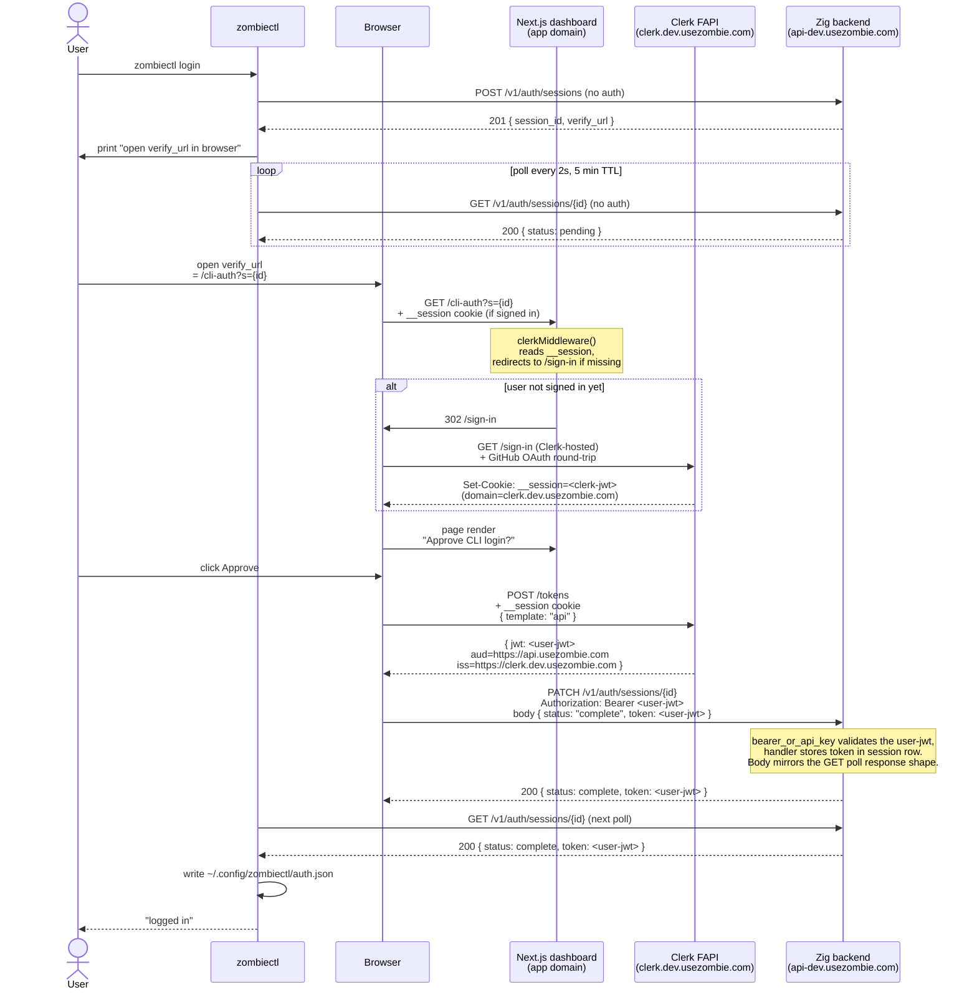
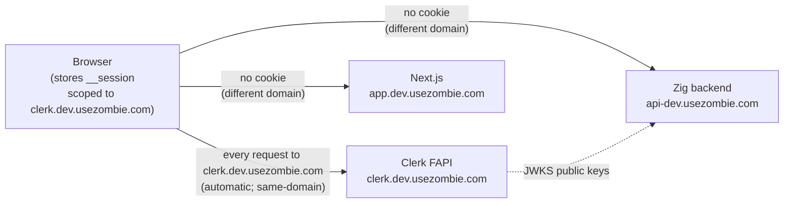
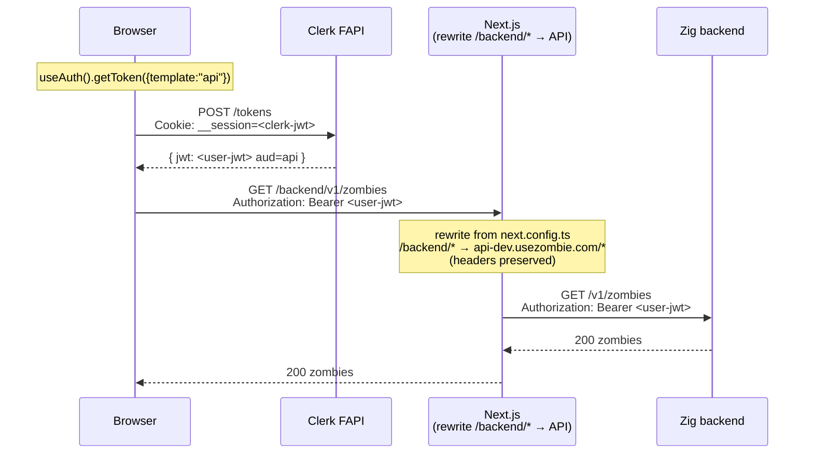
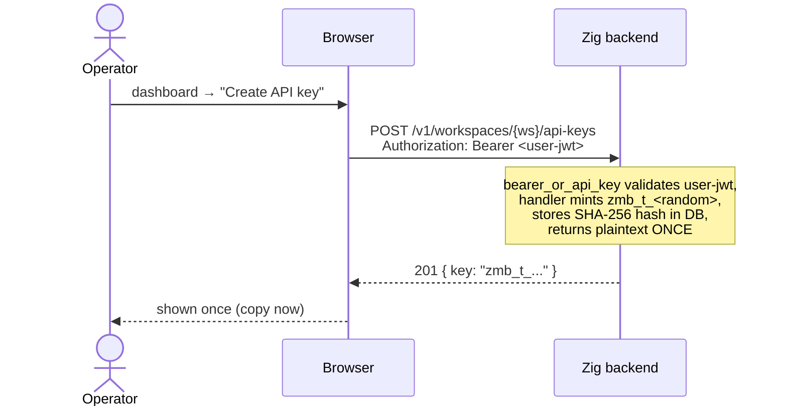
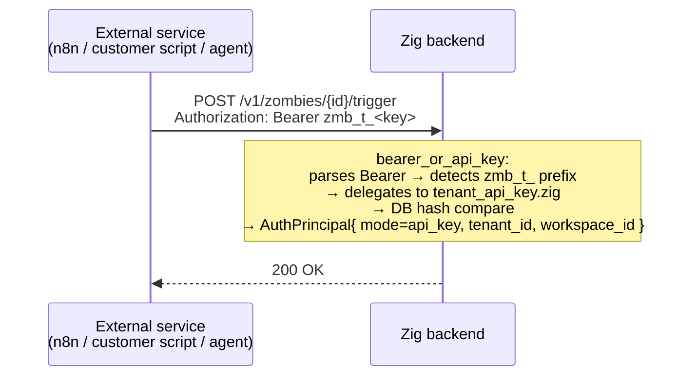
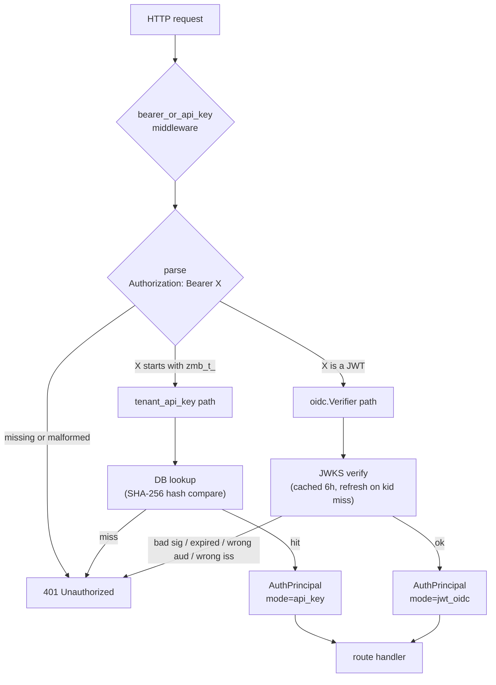

# Authentication

Three principal types reach the Zig backend. All three converge on a single credential shape at the wire:

```
Authorization: Bearer <…>
```

There are exactly two payload shapes inside that header:

| Payload                  | Issuer                | Validation path                    | Used by             |
| ------------------------ | --------------------- | ---------------------------------- | ------------------- |
| `<jwt>` (Clerk-signed)   | Clerk Frontend API    | JWKS verify + `aud` check + claims | CLI · UI            |
| `zmb_t_<random>`         | Backend (per-tenant)  | DB hash lookup                     | Service-to-service  |

Cookies **never reach the Zig backend**. The Clerk `__session` cookie lives on `clerk.dev.usezombie.com` (Clerk's Frontend API domain). The browser's same-origin policy means it only attaches that cookie on requests *to Clerk*, never on requests to `api-dev.usezombie.com` or to the Next.js dashboard host.

The middleware that gates almost every route is `bearer_or_api_key` (`src/auth/middleware/bearer_or_api_key.zig`). It parses the `Bearer …` prefix, then routes by sub-prefix:

- `Bearer zmb_t_*` → `tenant_api_key.zig` (DB lookup, hash compare).
- `Bearer <anything else>` → `oidc.Verifier.verifyAuthorization` (cached JWKS, RS256 signature check, `iss` + `aud` + `exp` claims, role mapping).

Both paths resolve to the same `AuthPrincipal` struct (`src/auth/principal.zig`). Handlers downstream never know which credential shape was used.

---

## Flow 1 — CLI (zombiectl, used by agents)

The CLI runs a one-time **device flow** to acquire a Clerk-issued user JWT, then carries that JWT on every subsequent request. The browser is the bridge: it has the user's Clerk session cookie, so it can mint an API-audience JWT on behalf of the CLI and POST it into a short-lived session row keyed by `session_id`.

### One-time login (`zombiectl login`)



### Every subsequent CLI call (incl. `zombiectl steer` + SSE)


The CLI handles its own token refresh: if a request returns `401 token_expired`, it re-runs `zombiectl login`. The handshake row is deleted server-side once the CLI completes the poll.

---

## Flow 2 — UI (browser dashboard)

The browser holds the Clerk `__session` cookie. It uses Clerk's SDK to convert that cookie into a short-lived API-audience JWT, then sends the JWT to the Zig backend. Two sub-flows:

- **Normal API calls** — the browser fetches `getToken()` directly via Clerk's React hook and sends the JWT as `Authorization: Bearer …` to `/backend/...` (same-origin proxy → Zig API).
- **SSE stream** — `EventSource` cannot set headers, so a Next.js Route Handler shadows the rewrite and injects the Bearer server-side.

### Where the cookie lives



The Zig backend never sees the cookie. It only ever validates JWTs signed by the JWKS that Clerk publishes.

### Normal API call



### SSE stream — Next Route Handler injects Bearer

```mermaid
sequenceDiagram
    participant Browser
    participant Next as Next.js<br/>Route Handler<br/>(/backend/v1/zombies/{id}/events/stream)
    participant Clerk as Clerk FAPI
    participant API as Zig backend

    Browser->>Next: EventSource("/backend/v1/zombies/{id}/events/stream")<br/>Cookie attached only because Next is same-origin? NO<br/>Browser→Next has its own Next-issued session if any;<br/>Clerk session lives on clerk.dev.usezombie.com
    Note over Next: Route Handler shadows the<br/>rewrite for this one path

    Next->>Clerk: auth().getToken({template:"api"})<br/>(server-side; uses request cookies<br/>+ Clerk SDK's internal session resolution)
    Clerk-->>Next: { jwt: <user-jwt> aud=api }

    Next->>API: GET /v1/zombies/{id}/events/stream<br/>Authorization: Bearer <user-jwt><br/>Accept: text/event-stream
    API-->>Next: 200 text/event-stream

    Next-->>Browser: 200 Content-Type: text/event-stream<br/>(streams upstream body through)
    Note over Browser,API: For the lifetime of the connection<br/>Next pipes server-sent events from API to Browser
```

Browser never holds an API-audience JWT in this flow. The Bearer token only ever exists between Next and the Zig backend.

> **Cookie clarification:** `clerkMiddleware()` in `proxy.ts` is what makes the Route Handler's `auth()` call work. The middleware runs on every request to Next, reads whatever cookies arrive (Next's own session cookies — Clerk's `__session` does in fact get sent here when the app domain is configured as a Clerk "satellite" or when set on a parent domain). For the SDK's purposes, `auth()` returns a stub on the request that knows how to call Clerk FAPI to mint a fresh JWT.

---

## Flow 3 — API key (service-to-service)

Static, long-lived, never expires by default. Provisioned in the dashboard, used directly by external services (n8n, Zapier, custom scripts, customer agents).

### Provisioning



### Every subsequent service call



API keys never touch Clerk. They live only in the backend DB, hashed at rest, and authenticate via the same `Authorization: Bearer …` header that JWTs use — the `zmb_t_` prefix tells the middleware to take the DB lookup branch instead of the JWKS verify branch.

---

## Backend validation (the common path)



### Configuration knobs (from `src/cmd/serve.zig`)

| Knob              | Source                | Purpose                                                                         |
| ----------------- | --------------------- | ------------------------------------------------------------------------------- |
| `OIDC_JWKS_URL`   | env var → serve_cfg   | Where to fetch Clerk's signing keys. Cached for 6 h, refreshed on `kid` miss.   |
| `OIDC_ISSUER`     | env var → serve_cfg   | Required value of `iss` claim on every Bearer JWT.                              |
| `OIDC_AUDIENCE`   | env var → serve_cfg   | Required value of `aud` claim. **Strict** — see audience-mismatch note below.   |

### The audience claim — why the UI cannot send `__session` directly

The Zig backend enforces `aud=https://api.usezombie.com` on every JWT it accepts. Clerk's `__session` cookie has either no audience or a Clerk-default audience — it would 401 against this verifier. The cookie is therefore *only* an instruction to Clerk FAPI to mint a real API-audience JWT (via the "api" JWT template). The minted JWT is what the backend trusts.

This is why the UI flow has the extra Clerk hop, and why the SSE path uses a Next Route Handler instead of forwarding the cookie raw.

---

## Why the three flows converge on Bearer

The substrate is deliberately uniform: one credential shape at the wire, one middleware, two payload branches. New principal types (e.g. webhook-bound bots, third-party OAuth apps) plug in by issuing a JWT with the right `aud` or by minting a new prefixed API key — no new auth middleware required.

The cookie complexity is contained inside Clerk and Next.js. The Zig backend stays a stateless JWT/key validator.

---

## Webhook auth (separate surface)

The three flows above (CLI, UI, API key) all converge on `Authorization: Bearer …`. **Inbound webhooks are a different surface entirely** — they never carry a Bearer token. Every inbound webhook MUST be HMAC-signed by the calling provider, verified by the `webhook_sig` middleware (`src/auth/middleware/webhook_sig.zig`), and rejected if the signature is missing or wrong. There is no fallback.

This is industry standard for inbound webhooks: GitHub (`X-Hub-Signature-256`), Slack (`X-Slack-Signature`), Stripe (`Stripe-Signature`), Linear (`linear-signature`), and Svix-fronted providers (Clerk, AgentMail) all ship HMAC-SHA256 over the raw body. Bearer tokens are for *outbound* API calls (where the caller authenticates itself); HMAC is for *inbound* (where the receiver verifies the body wasn't tampered with).

### Provider scheme registry

`src/zombie/webhook_verify.zig` holds the canonical `PROVIDER_REGISTRY` — one `VerifyConfig` per provider naming the signature header, prefix, and timestamp policy:

| Provider | `sig_header` | `prefix` | Includes timestamp? | Drift |
| --- | --- | --- | --- | --- |
| GitHub | `x-hub-signature-256` | `sha256=` | no | n/a |
| Slack | `x-slack-signature` | `v0=` | yes (`x-slack-request-timestamp`) | 5 min |
| Linear | `linear-signature` | (none) | no | n/a |

Adding a new provider is one new `VerifyConfig` const + one entry in the registry. No new middleware.

### Workspace-credential resolver

The middleware itself is provider-agnostic. The host supplies a `lookup_fn` (`src/cmd/serve_webhook_lookup.zig:lookup`) that, given the URL's `{zombie_id}`, returns:

1. **`signature_scheme`** — populated whenever the zombie's `trigger.source` matches a registry entry, even if the vault credential is missing. This is what makes "credential not configured" fail closed instead of silently falling back to anything else.
2. **`signature_secret`** — the HMAC key, resolved from `vault.secrets[workspace_id, key_name=zombie:<source>]` and parsed as JSON (`{ "webhook_secret": "<key>", ... }`). The vault key name defaults to the source value but can be overridden by the zombie's `x-usezombie.trigger.credential_name` frontmatter for the rare multi-org case where one workspace integrates with two GitHub orgs.

The credential being workspace-scoped (not zombie-scoped) means rotating the secret once rotates it for every zombie in that workspace using the same source — single point of rotation, the property the architecture wants.

### Error taxonomy

The middleware emits exactly three error codes for webhook auth failures, each with a distinct operator action:

| Code | When it fires | What the operator should do |
| --- | --- | --- |
| `UZ-WH-020 webhook_credential_not_configured` (401) | Provider not recognized OR `zombie:<source>` vault row missing OR row has no `webhook_secret` field OR field is empty | `zombiectl credential add <source> --data='{"webhook_secret":"<key>"}'` in the workspace |
| `UZ-WH-010 invalid_signature` (401) | Provider + secret are both configured, but the signature header is missing OR the body's MAC doesn't match | The webhook secret stored in the workspace vault doesn't match what the provider has registered. Re-rotate. |
| `UZ-WH-011 stale_timestamp` (401) | Slack-style schemes only — request timestamp is outside the 5-minute drift window | Clock skew or replay attempt. Investigate. |

The `UZ-WH-020` vs `UZ-WH-010` split matters: the first is a recoverable misconfiguration, the second is either an attack or a real drift between provider config and our vault. Operators should respond differently to each.

### What does NOT auth a webhook

- **Bearer tokens.** Sending `Authorization: Bearer …` to any `/v1/webhooks/...` URL contributes nothing — the header is not consulted. (Generic Bearer auth applies only to the normal API surface listed in the three flows above.)
- **Session cookies.** Webhook URLs are not session-authed; cookies are ignored.
- **URL-embedded secrets** (legacy `/v1/webhooks/{zombie_id}/{secret}` form). Removed in M43 — the matcher no longer recognizes the two-segment form.

### Cross-references

- Implementation: `src/auth/middleware/webhook_sig.zig` (middleware), `src/cmd/serve_webhook_lookup.zig` (resolver), `src/zombie/webhook_verify.zig` (provider registry).
- Operator-facing data flow: `docs/architecture/data_flow.md` §B (TRIGGER), `docs/architecture/user_flow.md` §8 (the GH Actions worked example).
- Error registry: `src/errors/error_entries.zig` (HTTP status + docs URI for each code), `src/auth/middleware/errors.zig` (the auth-layer mirror that keeps `src/auth/` portable).
