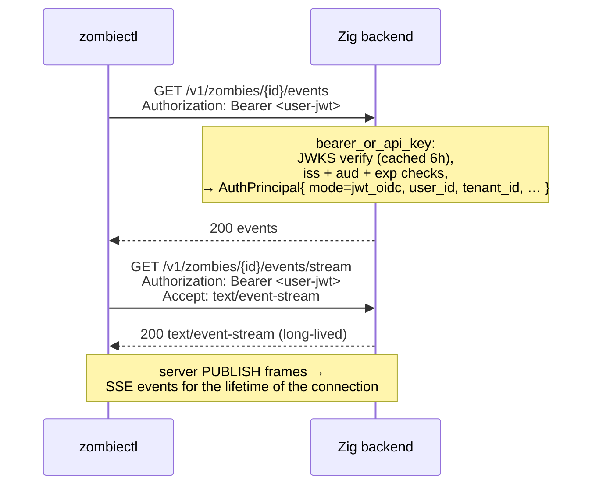

# CLI device login — security model (Flow 1)

> Relocated from [`AUTH.md`](./AUTH.md) so the canonical auth reference stays the *model*, not the depth. This is the M74_002 device-flow security design: data lifecycle, sequence, threat model, pinned crypto, the non-interactive token-seeding path, deploy contract, and the human-led invariant. For the auth model overview and the other principals, start at [`AUTH.md`](./AUTH.md) → *Flow 1*.

The one credential path humans use from a terminal: a browser-mediated device flow with a **verification code** binding the human approving in the browser to the human typing into the terminal, and **ECDH P-256 transport encryption** that keeps the minted JWT off every server-side surface but process memory. Bounded at five minutes; unfinished sessions expire. Once `credentials.json` (mode `0o600`) exists, the CLI carries the JWT on every request — same as a Flow 2 browser call after `getToken({template:"api"})`; on `401 token_expired` it re-runs `zombiectl login`.

## Non-interactive token seeding (no device flow)

When a usable bearer token already exists, `zombiectl login` can persist it directly, skipping the browser entirely. The resolution order is `--token <pat>` → the `ZOMBIE_TOKEN` env var → piped stdin (non-TTY); the first hit is validated against the same `/v1/me` ping the device flow uses and, **only on success**, written to `credentials.json` (`0o600`, `session_id: null`) — an invalid token leaves the file untouched. This is the only login path available without an interactive terminal (a non-TTY context — Continuous Integration runners, containers): the verification code requires a human at the keyboard, so a non-TTY shell with no token fails fast rather than hanging. **The device flow itself is unchanged and terminal-only** — this path does not mint a new credential, it only stores one the caller already holds (a Flow 3 tenant key or a previously-minted JWT), so the human-led binding of the device flow is untouched.

## Where the JWT lives in plaintext (data lifecycle)

This view points in the *opposite* direction from the temporal sequence below, because the JWT is *born* in the dashboard's browser process (immediately after Clerk mints it) and *consumed* in the `zombiectl` process (after ECDH decryption). The CLI initiates the flow; the secret flows the other way.

```
┌────────────────────────────────────────────────────────────────────┐
│                                                                    │
│  Dashboard browser tab                                             │
│   ┌─────────────────────────────────────────────────────────────┐  │
│   │   Clerk mints user-JWT  ─►  AES-256-GCM encrypt(JWT)        │  │
│   │   (via FAPI /tokens)         under HKDF-SHA256-derived key  │  │
│   │                              from ECDH(dash_priv, cli_pub)   │  │
│   └─────────────────────────────────────────────────────────────┘  │
│                              │                                     │
│              PATCH /v1/auth/sessions/{id}/approve                  │
│              { dashboard_public_key, ciphertext, nonce,            │
│                verification_code }   (plaintext code over TLS;     │
│                                       API computes HMAC and        │
│                                       discards plaintext)          │
│                              │                                     │
│                              ▼                                     │
│  API process (zombied) + Redis                                     │
│   ┌─────────────────────────────────────────────────────────────┐  │
│   │   Redis row stores:                                         │  │
│   │     status, cli_public_key, dashboard_public_key,           │  │
│   │     ciphertext, nonce,                                      │  │
│   │     verification_code_hmac      ◄── HMAC-SHA256(            │  │
│   │     verification_attempts (≤5)        AUTH_SESSION_CODE_    │  │
│   │     created_at_ms, expires_at_ms      PEPPER,               │  │
│   │   ────────────────────────────         session_id ‖ code)   │  │
│   │   Nothing in this row decrypts the JWT.                     │  │
│   │   Pepper lives in zombied process memory only — never disk. │  │
│   └─────────────────────────────────────────────────────────────┘  │
│                              │                                     │
│              POST /v1/auth/sessions/{id}/verify { code }            │
│              (only after CLI presents the matching code; atomic    │
│               verification_pending → consumed in a single Lua-EVAL │
│               write that also returns the ciphertext payload)      │
│                              │                                     │
│                              ▼                                     │
│  CLI process (zombiectl)                                           │
│   ┌─────────────────────────────────────────────────────────────┐  │
│   │   shared = ECDH(cli_priv, dashboard_public_key)             │  │
│   │   key    = HKDF-SHA256(shared, info="m74-002-v1")           │  │
│   │   JWT    = AES-256-GCM-decrypt(ciphertext, key, nonce)      │  │
│   │   write { token, token_name } → credentials.json (0o600)    │  │
│   │   GET /v1/me  (validation ping; deletes credential on 401)  │  │
│   └─────────────────────────────────────────────────────────────┘  │
│                                                                    │
└────────────────────────────────────────────────────────────────────┘
```

**Honest-server assumption.** An honest API server stores `cli_public_key` and `dashboard_public_key` as the CLI and dashboard sent them. Under that assumption the API never possesses decryption capability, and a Redis dump alone does not yield the JWT — the attacker would need (a) `cli_priv` from the CLI process, and (b) the matching plaintext verification code. **An *active malicious* API server (or a TLS-terminating intermediary acting maliciously rather than passively) can swap `cli_public_key` and execute a textbook unauthenticated-Diffie-Hellman key-substitution MITM.** v2.0 explicitly does not close this; see *Threats this flow does NOT close*.

## Sequence — one-time login

```mermaid
sequenceDiagram
    actor User
    participant CLI as zombiectl
    participant UI as Dashboard<br/>(app.usezombie.com)
    participant API as Zig backend<br/>(api.usezombie.com)
    participant Clerk

    User->>CLI: zombiectl login [--token <pat>] [--token-name LABEL]
    Note over CLI: idempotencyCheck — refuse to overwrite an existing<br/>credential without --force. A non-TTY stdin counts as<br/>--no-input: it fails loudly rather than consuming a piped<br/>token as the replace-prompt answer.

    alt direct token — resolveDirectToken: --token flag > ZOMBIE_TOKEN env > piped stdin (non-TTY)
        Note over CLI: first source wins; no browser, no session_id
        CLI->>API: GET /v1/me   (validate-first — before any write)
        alt token valid
            API-->>CLI: 200
            CLI->>CLI: write { token, token_name } → credentials.json<br/>(0o600, session_id: null)
            CLI-->>User: "logged in" (no browser)
        else token invalid
            API-->>CLI: 4xx
            CLI-->>User: error — exit ≠ 0, credentials.json untouched
        end
    else interactive device flow — TTY, no direct token
        Note over CLI: generate (cli_priv, cli_pub) via crypto.subtle<br/>default token_name = platform family<br/>("macos-cli" / "linux-cli" / "windows-cli")

        CLI->>API: POST /v1/auth/sessions<br/>{ public_key: cli_pub, token_name }
        API-->>CLI: 201 { session_id }
        CLI-->>User: open https://app.usezombie.com/cli-auth/{session_id}

        Note over CLI: prompt "Verification code:" immediately — no polling.<br/>Possessing the code implies the dashboard approved.<br/>6-digit shape validated client-side (bad input re-prompts,<br/>no round-trip); SIGINT / EOF → exit 130, nothing persisted.

        User->>UI: open verify URL in browser
        Note over UI: Clerk session validates (__session cookie)
        UI->>API: GET /v1/auth/sessions/{id}
        API-->>UI: { status: pending, cli_public_key, token_name }
        UI-->>User: "Approve CLI login for {token_name}?"
        User->>UI: click Approve

        UI->>Clerk: POST /tokens (template: api)<br/>+ __session cookie
        Clerk-->>UI: { user-jwt }

        Note over UI: generate (dash_priv, dash_pub)<br/>shared = dash_priv × cli_pub<br/>key = HKDF-SHA256(shared, info="m74-002-v1")<br/>ciphertext = AES-256-GCM(jwt, key, nonce)<br/>verification_code = random 6 digits (CSPRNG)

        UI->>API: PATCH /v1/auth/sessions/{id}/approve<br/>{ dashboard_public_key, ciphertext, nonce, verification_code }<br/>Authorization: Bearer <user-jwt>
        Note over API: server computes verification_code_hmac<br/>= HMAC-SHA256(AUTH_SESSION_CODE_PEPPER, sid ‖ code)<br/>persists ciphertext + nonce + dash_pub + HMAC<br/>discards plaintext code<br/>state: pending → verification_pending
        API-->>UI: 200
        UI-->>User: "Type {verification_code} into your CLI"

        User->>CLI: types verification_code into the waiting prompt
        CLI->>API: POST /v1/auth/sessions/{id}/verify<br/>{ verification_code }
        Note over API: Lua-EVAL atomic transition:<br/>compare HMAC (constant-time);<br/>match → verification_pending → consumed<br/>in the same write; return payload
        API-->>CLI: 200 { dashboard_public_key, ciphertext, nonce }

        Note over CLI: shared = cli_priv × dashboard_public_key<br/>key = HKDF-SHA256(shared, info="m74-002-v1")<br/>jwt = AES-256-GCM-decrypt(ciphertext, key, nonce)

        CLI->>CLI: write { token, token_name } → credentials.json (0o600)
        CLI->>API: GET /v1/me   (post-write validation ping)
        alt ping ok
            API-->>CLI: 200
            CLI-->>User: "logged in as {token_name}"
        else 401 / network error
            API-->>CLI: 401
            CLI->>CLI: rollback — delete credentials.json
            CLI-->>User: error — exit ≠ 0
        end
    end
```

Two facts the diagram pins:
1. **The CLI is the initiator.** Every interaction with the UI, API, or Clerk is downstream of `zombiectl login`. The user typing the verification code closes the loop back to the CLI.
2. **Clerk is involved at exactly one step** (`POST /tokens`). The API server never talks to Clerk in this flow — Clerk's involvement is JWKS-only when the CLI later uses the minted JWT against normal API endpoints.

## Session state machine

```
┌─────────┐     PATCH /approve    ┌───────────────────────┐    POST /verify (correct,    ┌──────────┐
│ pending ├──────────────────────►│ verification_pending  ├─── single Lua-EVAL atomic ──►│ consumed │
└────┬────┘                       └───────────┬───────────┘    write; payload returned)  └──────────┘
     │                                        │                                            (terminal,
     │  5 min TTL                              │  5 failed verify attempts                  60s same-
     │  OR explicit DELETE                     │  OR 5 min TTL                              fingerprint
     │  OR replaced                            │  OR explicit DELETE                        replay
     ▼                                        ▼  OR replaced                                window)
┌─────────┐                       ┌───────────────────────┐
│ expired │  (terminal)           │ aborted               │  (terminal)
└─────────┘                       └───────────────────────┘
```

| State | Enters from | Exits to |
|---|---|---|
| `pending` | initial (POST /sessions) | `verification_pending` · `expired` · `aborted` |
| `verification_pending` | `pending` | `consumed` · `expired` · `aborted` |
| `consumed` | `verification_pending` | (terminal — single-read, with 60s same-fingerprint idempotency window) |
| `expired` | `pending` · `verification_pending` | (terminal) |
| `aborted` | `pending` · `verification_pending` | (terminal) |

**Invariants.** The state machine is monotonic — no backward transitions. There is no codepath from `pending` directly to `consumed`; verification code presentation is mandatory. `verified` is not a stored state; the successful POST /verify writes `consumed` atomically.

## Endpoint trust boundaries

| Endpoint | Trusted actor | Auth |
|---|---|---|
| `POST /v1/auth/sessions` | unauthenticated CLI | rate-limited at edge — Cloudflare WAF, 10 / IP / min (L2) |
| `GET /v1/auth/sessions/{id}` | unauthenticated dashboard fetch (renders the approve page) | no CLI poll — M74_003 dropped CLI polling; the CLI prompts for the code immediately. The dashboard reads the session once to show `token_name` |
| `PATCH /v1/auth/sessions/{id}/approve` | dashboard JS process | Clerk JWT (`api` template) · per-Clerk-user backstop deferred post-launch — Clerk-edge per-IP on sign-in / sign-up (L1) bounds upstream identity supply |
| `POST /v1/auth/sessions/{id}/verify` | CLI with the verification code | the code IS the auth · ≤5 attempts per session (Lua-internal, L3) |
| `DELETE /v1/auth/sessions/{id}` | dashboard JS process | Clerk JWT · must match session's `clerk_user_id` |
| `DELETE /v1/auth/sessions/all` | dashboard JS process | Clerk JWT |

## Security properties by layer

The contract. Every line of code in Flow 1 must trace to one of these properties. Any claim of "auth hardening" in the abstract should be re-read against this table.

| Layer | Property | Out of scope |
|---|---|---|
| TLS | server authenticity (cert chain to a trusted CA) + transport encryption | endpoint compromise on either side |
| Clerk session | browser-user authentication (the human at the keyboard owns the Clerk identity) | hijacked browser session · shared workstation |
| **Verification code** | **browser ↔ terminal authorization binding** — proves the human approving in the browser is the same human typing into the local terminal | user pasting attacker-supplied commands |
| `HMAC-SHA256(AUTH_SESSION_CODE_PEPPER, session_id ‖ code)` | disclosure-resistance of the verification code against passive server-side compromise. The pepper lives in zombied process memory only (Vault-loaded at boot, never on disk) — a Redis dump alone cannot recover the code via offline brute-force | compromise of the dashboard JS process where the code is displayed · compromise of the CLI process where it is typed · compromise of zombied process memory |
| ECDH P-256 | ciphertext-only session transport — no intermediate server, log, or DB row sees the JWT in plaintext | compromise of the dashboard or CLI endpoints |
| AES-256-GCM | tamper detection — any ciphertext modification produces a hard `DecryptError`, not silent corruption | — |
| Atomic `verified → consumed` | single-read ciphertext — captured response cannot be replayed against the same session | replay using a fresh session (closed by `verification_code` + rate limits) |
| Verify-attempt rate limit (≤5/session, L3 — Lua-internal) | brute-force resistance on the 6-digit code | distributed brute force across many sessions (closed by L1 Clerk-edge per-IP on sign-in / sign-up + L2 Cloudflare WAF per-IP on session creation — see *Rate-limit layers* below) |
| `token_name` | auditability only — operator can list active sessions by label | trust signal of any kind |

## Rate-limit layers

Rate limiting decomposes across three layers. Only L3 lives inside zombied.

| Layer | Owner | Surface | Limit |
|---|---|---|---|
| **L1** | Clerk edge | Sign-in / sign-up | 3 attempts / 10 s, 5 creates / 10 s per IP — bounds upstream Clerk-identity supply |
| **L2** | Cloudflare WAF in front of `api.usezombie.com` | `POST /v1/auth/sessions` | 10 / IP / minute — request never reaches origin on block |
| **L3** | zombied — `verifyAndConsume` Lua (already shipped) | `POST /v1/auth/sessions/{id}/verify` | 5 attempts per session → `auth.session.aborted` reason `rate_limit_exceeded` |

No in-app rate-limit middleware in zombied. The per-IP and per-Clerk-user counters that an earlier revision of the M74_002 spec described inside zombied are not authored — per-IP belongs at edge (L2), per-Clerk-user backstop is deferred post-launch (L1 already throttles the upstream Clerk identity supply). See `docs/v2/active/M74_002_*.md` Captain decision Q10 for the full rationale and the dead-code sweep that landed alongside this decision.

## Threats this flow closes

Each line is paired: the attack in one sentence, the mechanism that thwarts it in the next.

| # | Threat | How it's thwarted |
|---|---|---|
| 1 | **Session-row plaintext disclosure** — Redis dumps, logs, queue inspections, metrics blobs, memory snapshots. | ECDH ciphertext transport. The Redis row holds `{ ciphertext, nonce, public keys, verification_code_hmac }`; nothing in that set decrypts to the JWT. |
| 2 | **Passive network observation of the JWT** — TLS-inspecting corporate proxies, captured HTTPS payload logs, intermediaries that terminate and re-issue TLS. | ECDH ciphertext transport. After this spec, intermediaries see ciphertext only — the JWT plaintext lives nowhere on the wire. |
| 3 | **Session-id phishing without terminal access** — attacker has only the `session_id` (URL sniff, browser-history sync, shoulder surf). | The `verification_code` requirement + moving ciphertext release from GET to POST /verify. An attacker without terminal access cannot present the matching code and cannot trigger ciphertext release. |
| 4 | **Verification-code disclosure via passive server compromise** — attacker reads the session row but only sees the keyed HMAC; tries to offline-brute-force the 1M-entry 6-digit space. | `HMAC-SHA256(AUTH_SESSION_CODE_PEPPER, …)` storage. The pepper lives in zombied process memory only — without it the attacker cannot compute candidate HMACs even if they own the Redis blob. |
| 5 | **Verification-code online brute force** — attacker with `session_id` tries the 1,000,000 6-digit code space against POST /verify. | ≤5 verify attempts per session, then the session transitions to `aborted` with `reason="rate_limit_exceeded"`. Attacker exhausts 0.0005% of the space before being locked out. |
| 6 | **Ciphertext replay** — attacker captures a single POST /verify response and retries the same `session_id`. | Atomic transition `verification_pending → consumed` in the same Lua-EVAL write that returns the ciphertext. Subsequent verify calls return 410 `SessionConsumed` (with a 60-second same-fingerprint idempotency window for the legitimate "consume succeeded, response lost, client retried" failure mode). |
| 7 | **Distributed brute force across many sessions** — attacker scripts 200,000 sessions × 5 codes each = 1M attempts. | Per-IP session-creation rate limit (10/min) and per-Clerk-user PATCH-approve rate limit (20/hr). Attacker cannot fan out fast enough. |

## Threats this flow does NOT close

Each line names the attack and points at where its closure lives (or why it cannot be closed by any flow this spec could produce).

| # | Threat | Why not — and where closure lives |
|---|---|---|
| 1 | **Compromised browser session** — XSS on the dashboard, malicious browser extension, session-cookie theft, injected analytics, compromised NPM dependency in the dashboard bundle. | The plaintext JWT lives momentarily in the dashboard JS process before encryption. Anything with execution access to that process sees the JWT; ECDH does not help. Future hardening: SRI + CSP + dependency supply-chain pinning (separate spec). |
| 2 | **Malware on the CLI host** — compromised `zombiectl` machine, malicious user-space process, memory scraping. | `cli_priv` lives in CLI process memory during the flow; the decrypted JWT lives in `credentials.json` after. Local malware reads either. No future milestone closes this without hardware-backed key storage (TPM / Secure Enclave) — a separate downstream spec. |
| 3 | **Attacker with simultaneous browser + terminal access** — user runs attacker-supplied software ("paste this curl into your terminal"). | The verification code cannot defend against the user actively typing the code into the attacker's tool. The human-led-only invariant is the only defense, and it is documentation, not code. |
| 4 | **Device impersonation / fake `zombiectl` binaries** — any actor can generate a valid ECDH keypair using publicly known math; any actor can ship a binary called `zombiectl`. | Possessing a valid public key proves nothing about identity. Closure: **M75_xxx Agent Identity** (persistent device keypair) or a binary-signing spec — both to be authored. |
| 5 | **Autonomous-agent authentication** — CI runners, Kubernetes workloads, hosted agent platforms calling our API. | Out of trust model. A human MUST be present at flow time to type the verification code; remove the human and the verification code property collapses into theatre. Closure: **M75_xxx Agent Identity** (persistent keypair + signed challenges + scoped credentials + server-side agent inventory). |
| 6 | **Active API or proxy key-substitution MITM** — attacker with active control over an API response path swaps `cli_public_key` in GET /sessions, intercepts the encrypted PATCH /approve, decrypts with their own key, re-encrypts to the real CLI's key. | Unauthenticated Diffie-Hellman — passing the public key through the API and trusting the API to return it honestly is the textbook setup. **v2.0 explicitly does NOT close this; tracked as the v2.1 priority.** Closure: URL fragment binding (`#cli_public_key=…` — fragments aren't sent to the server) + HKDF transcript binding (`info` parameter binds both pubkeys + session_id, so any substitution breaks decryption on the CLI). |

## Replay semantics

Six invariants. All are tested explicitly.

1. **Verification code is single-use, with a bounded same-fingerprint idempotency window.** A successful POST /verify atomically transitions to `consumed` in the same Lua-EVAL write that returns the ciphertext. Subsequent POST /verify calls within 60 seconds **from the same client fingerprint** (sha256 of `derived_client_ip ‖ user_agent ‖ session_id`) return the same payload (handles "consume succeeded, response lost, client retried"). Outside 60 seconds, or from a different fingerprint, or after the payload-retention TTL elapses → HTTP 410 `SessionConsumed`.
2. **Ciphertext is single-read per client fingerprint.** Item 1's mechanism: only the originating fingerprint can replay during the window; any other source gets 410. This narrows the replay surface to "captured-network-packet-within-60s-from-same-source", which is dominated by existing TLS + network-perimeter assumptions.
3. **Verified sessions cannot revert.** The state machine is monotonic; no path from `consumed` / `expired` / `aborted` back to any active state.
4. **PATCH /approve is single-write.** Calling it against a session already in `verification_pending` returns HTTP 409 Conflict. The dashboard MUST NOT retry PATCH /approve if it has previously succeeded for the same session.
5. **`session_id` is high-entropy.** UUIDv7; 128 bits; CSPRNG; not enumerable.
6. **`session_id` is capability-bearing** — combined with the verification code, it authorizes ciphertext release. Classified equivalent to a password-reset token. **`session_id` appears only in the primary verification URL (`https://app.usezombie.com/cli-auth/{session_id}`) and in the API route paths that consume it.** It MUST NOT appear in logs (at info/warn/error level — use the `redactSessionId()` helper), analytics, telemetry, metrics labels, secondary URLs, error response bodies routed to non-trusted surfaces, or copied diagnostic bundles. Audit-log events carry `session_id_hash` (keyed HMAC with `AUDIT_LOG_PEPPER`) + `session_id_prefix` (first 8 hex chars) — never the raw ID in default mode.

## Cryptographic primitives (pinned)

| Primitive | Value | Why pinned |
|---|---|---|
| Curve | P-256 (NIST) | `crypto.subtle` supports it natively in both Node.js ≥20 and modern browsers. |
| Key derivation | HKDF-SHA-256, output 32 bytes, `info = "m74-002-v1"`, empty salt | Versioned `info` lets a future protocol change rev without colliding. The ECDH shared secret is already high-entropy, so the salt adds nothing. |
| Authenticated encryption | AES-256-GCM, 256-bit key, 96-bit random nonce per encryption, 128-bit auth tag | — |
| Verification code | 6 random digits (CSPRNG) | Brute force closed by attempt cap, not code entropy. (Future improvement: 8 alphanumeric, ~37× entropy, segmented for human-typability.) |
| Verification-code storage | `HMAC-SHA256(AUTH_SESSION_CODE_PEPPER, session_id ‖ code)`; pepper Vault-loaded at boot, process-memory-only | Defeats offline brute force from a Redis dump (attacker needs the pepper too). Constant-time comparison via `std.crypto.utils.timingSafeEql` on the comparison side. |
| Crypto library | `crypto.subtle` on both sides (Node.js + browser Web Crypto) | Zero extra dependencies; identical API surface; avoids `tweetnacl` / `@noble/curves` drift. |

## Log and audit redaction — `session_id` is sensitive

| Surface | What can appear | What must NOT appear |
|---|---|---|
| `std.log.scoped(.auth)` info/warn/error | `request_id`, status names, error categories, sanitized error messages | full `session_id`, full verification code, ciphertext bytes, public keys (informational risk only, redact anyway) |
| `std.log.scoped(.auth)` debug/trace | `session_id` redacted to first 8 hex chars + length suffix (`abcd1234…(len=36)`) | full `session_id` |
| `std.log.scoped(.auth_audit)` | `session_id_hash` (keyed HMAC with `AUDIT_LOG_PEPPER`) + `session_id_prefix` (first 8 hex chars). Plus per-event client-IP attribution: raw `X-Forwarded-For` (`xff`), raw `Fly-Client-IP` (`fly_client_ip`), derived `client_ip_source` enum (`xff` / `fly_client_ip` / `tcp_peer`), and `client_ip_divergent` bool flagging XFF/Fly disagreement (forgery signal). | plaintext verification code (always redact; not even hashed), `verification_code_hmac` value, ciphertext bytes, raw `session_id` (no env override exists) |
| HTTP response error bodies | `request_id`, error code (`UZ-AUTH-XXX`), generic message | `session_id` (the client already knows it; echoing it back in errors routed to log-aggregators is forbidden) |
| Metrics / traces | high-cardinality labels avoided | `session_id` as a tag (cardinality explosion + capability leakage into observability surfaces) |

The `.auth_audit` log sink MUST be routed to a destination distinct from customer-visible logs (separate ACL, separate destination, tighter access controls than `.auth`). This is deploy-side discipline, not enforced by code; documented in the deploy README.

## Every subsequent CLI call

Once `credentials.json` exists, the CLI carries the JWT on every request — same as a Flow 2 browser call after `getToken({template:"api"})`.



On `401 token_expired`, the CLI re-runs `zombiectl login`. Clerk JWTs are short-lived (~15 min); JWT revocation is **not** done by `zombiectl logout` (Clerk admin API would be required; see [`AUTH.md`](./AUTH.md) → *What's not in this doc*).

---

## Deployment requirements

Flow 1's protocol assumes the following deploy contract. Diverging from these turns the flow's security claims into wishes.

| Requirement | Detail |
|---|---|
| **HTTPS-only** for `/v1/auth/*` | Load balancer / reverse proxy enforces. HTTP requests promoted via HTTP 308 to HTTPS. `api.usezombie.com` already enforces this in prod. |
| **HSTS** header on every API response | `Strict-Transport-Security: max-age=31536000; includeSubDomains; preload`. Source: load balancer or `src/http/middleware/security_headers.zig`. |
| **TLS ≥ 1.2** (1.3 preferred) | Load balancer config. |
| **Redis required** | `REDIS_URL` env must resolve to a single-node Redis reachable from every API pod (acceptable for dev / single-region prod) OR a Redis Sentinel / Cluster with ≥1 reachable primary per pod. In-memory session storage is **not** acceptable under any multi-pod topology. zombied fails fast on boot if `REDIS_URL` is unset. |
| `maxmemory-policy allkeys-lfu` (recommended) | Under memory pressure, least-frequently-accessed session keys evict first. Deploy-time config, not enforced by code. |
| Client-IP attribution | `src/auth/middleware/trusted_client_ip.zig` derives the client IP from two header signals — `X-Forwarded-For` (industry-standard, default attribution source) and `Fly-Client-IP` (Fly's authoritative single-value header, the trust anchor since Fly's proxy is the only path to zombied in any non-dev deploy and Fly strips client-supplied copies of its own header). When both are present we compare; agree → use XFF, disagree → flip to `Fly-Client-IP` + stamp `client_ip_divergent=true` in audit events (forgery signal). Local-dev / direct-internet → neither header → fall back to raw TCP peer. **No env / no allowlist** (Captain decision May 18 2026 — Q8 in spec). Per-IP rate-limit buckets and consume-idempotency fingerprints both consume the derived IP. |
| **NTP-synced pod clocks** within ≤1s drift | Server-authoritative expiry uses a 30-second grace window over `expires_at_ms`; expiry surfaces to the CLI at `POST /verify` (410), since M74_003 the CLI no longer polls or shows a countdown. Cross-pod drift >1s is a deploy bug. |
| **Two peppers in Vault** | `AUTH_SESSION_CODE_PEPPER` (defeats offline brute-force of the verification code) and `AUDIT_LOG_PEPPER` (pseudonymizes `session_id` in the `.auth_audit` log scope) — both at `op://ops/ZMB_CD_{PROD,DEV,LOCAL_DEV}/{auth-session-code,audit-log}-pepper/credential`. Boot fails fast if either is missing. Provisioning is documented in `playbooks/founding/01_bootstrap/001_playbook.md §1.3b`. |
| **`.auth_audit` sink isolation** | The `.auth_audit` Zig log scope MUST route to a destination distinct from customer-visible logs — separate ACL, separate destination (e.g., security-team-only S3 bucket, separate Loki tenant, separate syslog facility). Deploy-side discipline, not enforced by code. |

---

## Human-led-only invariant

**M74_002's Flow 1 supports only human-led agents.** A human MUST be present at flow time to (a) approve in the browser AND (b) type the verification code into the terminal. The verification code is the security property that closes the phishing-without-terminal attack; remove the human and the property collapses into theatre — an attacker who controls the agent's environment completes the flow themselves without the operator's awareness.

**Unattended use of `zombiectl login` is a spec violation, not a supported deployment shape.**

Examples that are NOT supported and MUST NOT be retrofitted as "agent auth":

- CI runners (GitHub Actions, GitLab CI, CircleCI, Jenkins, …).
- Cron jobs, systemd timers, scheduled background execution.
- Kubernetes workloads, deployments, jobs.
- Hosted agent platforms calling the API on behalf of a human.
- Headless containers running `zombiectl login` against a pre-supplied verification code.
- "Local agent" frames where the agent runs in the background without a human present at flow time.

For any of the above, see **M75_xxx Agent Identity** (to be authored): persistent agent keypair → signed challenges → scoped credentials → server-side agent inventory → revocation.

This is enforced by **discipline + documentation**, not by code. The login flow has no programmatic way to detect "is a real human present" — that is precisely why misuse must be called out as a spec violation rather than left as a runtime error.

Local coding agents that run on the same workstation where the human can complete the browser approval AND the terminal verification (Cursor, Claude Code, etc.) ARE supported by Flow 1 — the human's presence is what makes it work, not the absence of a coding agent.

