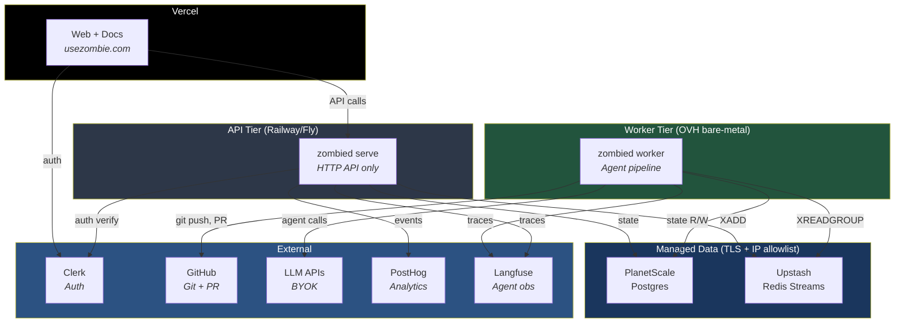

# Deployment — UseZombie v1

Date: Mar 3, 2026
Status: v1 bootstrap for Human + Agent deployment
Merged from: `INSTALLATION.md` + deployment execution prompt

---

## Goal

Bring up UseZombie with a non-hyperscaler stack so humans and autonomous agents can use the same control-plane APIs and deployment can be repeated by an agent without guesswork.

## Architecture Split

1. `Vercel`: `/`, `/agents`, `/pricing`, `/docs`, machine-readable public assets.
2. `zombied`: One Zig binary — `@import("nullclaw")` for agent runtime, Zap for HTTP API, state machine, policy engine. Two modes: `zombied serve` (API) and `zombied worker` (pipeline). M1 runs both in one process.
3. `Agents`: NullClaw called natively via library API. 3 sequential calls: Echo → Scout → Warden.
4. `Data`: PlanetScale Postgres (state), Upstash Redis Streams (dispatch), object storage (artifacts).
5. `Telemetry`: PostHog (human product events) + Langfuse/OTel (agent run events).

## Deployment Overview



**One binary, two modes:** `zombied serve` (HTTP API) and `zombied worker` (agent pipeline). M1 runs both in one process. M2+ splits them across separate hosts.

## Recommended M1 Baseline

1. Web and docs: Vercel.
2. Auth: Clerk (humans + machine auth for agents).
3. Primary DB: PlanetScale Postgres.
4. Control API runtime: Single static Zig binary. Deploys to any Linux host (bare metal, VM, Railway, Fly.io, Render). No build step — copy binary + set env vars.
5. Agent execution: NullClaw imported as Zig library (`@import("nullclaw")`). Native calls, not subprocess. Isolation via Landlock/Bubblewrap.
6. Product analytics: PostHog.
7. Agent observability: Langfuse + OpenTelemetry envelope.
8. Billing: Dodo behind feature flag; launch free/waitlist first.

## Required Accounts/Services

1. Vercel project/org.
2. Clerk instance (separate dev + prod).
3. PlanetScale Postgres.
4. Redis instance (Upstash, Railway Redis, or self-hosted).
5. Control-plane host account (Railway/Fly/Render).
6. OVH bare-metal node(s) or discounted server pool (M2+).
7. PostHog project (separate dev + prod).
8. Langfuse project (or approved alternative).
9. Dodo account (optional for initial free launch).

## Required Local Tooling

```bash
for c in git zig curl jq gh; do
  command -v "$c" >/dev/null 2>&1 && echo "OK  $c" || echo "MISSING  $c"
done
```

## Environment Variables

Create `.env` from `.env.example` and fill values.

```dotenv
# App
APP_BASE_URL=https://<your-domain>

# Clerk
CLERK_PUBLISHABLE_KEY=
CLERK_SECRET_KEY=
CLERK_WEBHOOK_SECRET=
CLERK_M2M_ISSUER=
CLERK_M2M_AUDIENCE=

# Database (Postgres)
DATABASE_URL=postgres://<user>:<pass>@<host>:<port>/<db>

# Redis (dispatch queue)
REDIS_URL=rediss://<token>@<host>:<port>

# Control plane API (single public URL, load-balanced in M2+)
CONTROL_PLANE_BASE_URL=https://api.<your-domain>

# Artifact storage (S3-compatible)
ARTIFACTS_ENDPOINT=
ARTIFACTS_BUCKET=
ARTIFACTS_ACCESS_KEY_ID=
ARTIFACTS_SECRET_ACCESS_KEY=
ARTIFACTS_REGION=

# Product analytics (humans)
POSTHOG_KEY=
POSTHOG_HOST=

# Agent observability
LANGFUSE_PUBLIC_KEY=
LANGFUSE_SECRET_KEY=
OTEL_EXPORTER_OTLP_ENDPOINT=
OTEL_EXPORTER_OTLP_HEADERS=

# Payments (optional feature-flagged)
DODO_API_KEY=
DODO_WEBHOOK_SECRET=
FEATURE_PAYMENTS_ENABLED=false

# GitHub App (primary auth — per-workspace installation tokens)
GITHUB_APP_ID=
GITHUB_APP_PRIVATE_KEY=    # PEM contents or path to .pem file
GITHUB_CLIENT_ID=
GITHUB_CLIENT_SECRET=

# Agent config directory (contains echo.json, scout.json, warden.json, system prompts)
AGENT_CONFIG_DIR=./config
```

## Service Key Setup (CLI-first)

All keys stored in per-environment Proton Pass vaults (`CLW_LOCAL`, `CLW_DEV`, `CLW_PROD`).
Switch: `export AGENT_ENV=local|dev|prod` then `load-zombie-env`. Update a key:

```bash
pass-cli item update --vault-name CLW_<ENV> --item-title <KEY> --field "password=<VALUE>"
```

### 1) Clerk — separate instances for dev + prod
```bash
# https://dashboard.clerk.com → Create "usezombie-dev" + "usezombie-prod" apps
# API Keys page → copy publishable + secret keys
pass-cli item update --vault-name CLW_DEV --item-title CLERK_PUBLISHABLE_KEY --field "password=pk_test_..."
pass-cli item update --vault-name CLW_DEV --item-title CLERK_SECRET_KEY --field "password=sk_test_..."
# Webhooks → Create endpoint → signing secret
pass-cli item update --vault-name CLW_DEV --item-title CLERK_WEBHOOK_SECRET --field "password=whsec_..."
# Machine tokens → Settings
pass-cli item update --vault-name CLW_DEV --item-title CLERK_M2M_ISSUER --field "password=https://your-dev.clerk.accounts.dev"
pass-cli item update --vault-name CLW_DEV --item-title CLERK_M2M_AUDIENCE --field "password=usezombie-dev"
# Repeat for _PROD with pk_live_/sk_live_
```

### 2) PostHog — separate projects for dev + prod
```bash
# https://us.posthog.com → Create "usezombie-dev" + "usezombie-prod" projects
# Settings → Project API Key (phc_...)
pass-cli item update --vault-name CLW_LOCAL --item-title POSTHOG_KEY --field "password=phc_..."
pass-cli item update --vault-name CLW_DEV   --item-title POSTHOG_KEY --field "password=phc_..."
pass-cli item update --vault-name CLW_PROD  --item-title POSTHOG_KEY --field "password=phc_..."
# Host pre-set to https://us.i.posthog.com — change if EU
```

### 3) Resend — transactional email
```bash
# https://resend.com/signup → API Keys → Create (re_...)
pass-cli item update --vault-name CLW_DEV  --item-title RESEND_API_KEY --field "password=re_..."
pass-cli item update --vault-name CLW_PROD --item-title RESEND_API_KEY --field "password=re_..."
```

### 4) Discord — webhook notifications
```bash
# Server Settings → Integrations → Webhooks → New Webhook → copy URL
pass-cli item update --vault-name CLW_DEV  --item-title DISCORD_WEBHOOK_URL --field "password=https://discord.com/api/webhooks/..."
pass-cli item update --vault-name CLW_PROD --item-title DISCORD_WEBHOOK_URL --field "password=https://discord.com/api/webhooks/..."
```

### 5) Slack — webhook notifications
```bash
# https://api.slack.com/apps → Create New App → Incoming Webhooks → Activate
pass-cli item update --vault-name CLW_DEV  --item-title SLACK_WEBHOOK_URL --field "password=https://hooks.slack.com/services/T.../B.../..."
pass-cli item update --vault-name CLW_PROD --item-title SLACK_WEBHOOK_URL --field "password=https://hooks.slack.com/services/T.../B.../..."
```

### 6) Mintlify — docs
```bash
# https://dashboard.mintlify.com/settings/organization/api-keys
pass-cli item update --vault-name CLW_DEV  --item-title MINTLIFY_API_KEY    --field "password=mint_..."
pass-cli item update --vault-name CLW_DEV  --item-title MINTLIFY_PROJECT_ID --field "password=..."
pass-cli item update --vault-name CLW_PROD --item-title MINTLIFY_API_KEY    --field "password=mint_..."
pass-cli item update --vault-name CLW_PROD --item-title MINTLIFY_PROJECT_ID --field "password=..."
```

### 7) Vercel — frontend hosting
```bash
# Login: bunx vercel login
# Link:  cd /path/to/usezombie && bunx vercel link
# Deploy preview: bunx vercel
# Deploy prod:    bunx vercel --prod
# Uses git integration for CI/CD — no API tokens needed
```

### 8) Cloudflare — DNS
```bash
# https://dash.cloudflare.com/profile/api-tokens → Create Token
pass-cli item update --vault-name CLW_DEV  --item-title CLOUDFLARE_API_TOKEN --field "password=..."
pass-cli item update --vault-name CLW_PROD --item-title CLOUDFLARE_API_TOKEN --field "password=..."
```

### 9) GitHub App — repo access for agents (primary)

Per-workspace GitHub App installation is the primary auth path. Each workspace gets its own installation with granular repo permissions and short-lived tokens (1hr expiry). See ARCHITECTURE.md "Credential Model" for the full flow.

```bash
# Register UseZombie as a GitHub App:
# https://github.com/settings/apps/new
# - Set callback URL: https://api.<your-domain>/v1/github/callback
# - Permissions: Contents (read/write), Pull Requests (read/write), Metadata (read)
# - Subscribe to events: installation, push

# Store App credentials:
pass-cli item update --vault-name CLW_DEV  --item-title GITHUB_APP_ID         --field "password=<app_id>"
pass-cli item update --vault-name CLW_DEV  --item-title GITHUB_APP_PRIVATE_KEY --field "password=$(cat private-key.pem)"
pass-cli item update --vault-name CLW_DEV  --item-title GITHUB_CLIENT_ID      --field "password=<client_id>"
pass-cli item update --vault-name CLW_DEV  --item-title GITHUB_CLIENT_SECRET  --field "password=<client_secret>"
# Repeat for _PROD
```


## Deployment Steps

### 1) Deploy website routes on Vercel
1. Import repository in Vercel.
2. Set framework/runtime settings.
3. Add env vars needed by frontend (`APP_BASE_URL`, Clerk public key, PostHog public keys).
4. Deploy preview, then production.
5. Verify routes:
```bash
curl -I https://<your-domain>/
curl -I https://<your-domain>/agents
curl -I https://<your-domain>/pricing
curl -I https://<your-domain>/docs
```

### 2) Provision authentication in Clerk
1. Enable human authentication methods for dashboard/web.
2. Configure machine-to-machine auth for agent clients.
3. Register webhook endpoint for identity events.
4. Add Clerk secret values to control plane env.

### 3) Provision Postgres
1. Create one production database.
2. Create separate non-prod database.
3. Apply schema migrations for: `specs`, `runs`, `run_transitions`, `artifacts`, `policy_events`.
4. Set `DATABASE_URL` in control plane runtime.

#### Data service security

Both PlanetScale (Postgres) and Upstash (Redis) are managed services accessed over the public internet via TLS. This is the standard model — same as RDS, Cloud SQL, Neon, etc.

| Service | Transport | Auth | Access control |
|---------|-----------|------|---------------|
| PlanetScale Postgres | TLS (mandatory, enforced) | Connection string credentials | IP allowlist |
| Upstash Redis | TLS (mandatory, enforced) | Token in connection string | IP allowlist + Redis ACLs |

**Required hardening (all milestones):**
1. **IP allowlist on both services** — In PlanetScale and Upstash dashboards, restrict connections to known IPs: API node IPs + worker node IPs. Reject all others.
2. **Separate credentials** — Create distinct Postgres roles for API nodes (read/write `runs`, `specs`, `policy_events`) and workers (read/write `runs`, `run_transitions`, `usage_ledger`). Create separate Upstash Redis ACL tokens: API can only `XADD`, workers can only `XREADGROUP`/`XACK`/`XAUTOCLAIM`.
3. **Credential rotation** — `DATABASE_URL` and `REDIS_URL` stored in Proton Pass vaults (`CLW_DEV`, `CLW_PROD`). Rotate quarterly or on any suspected leak.

**Defense-in-depth (when compliance requires it):** Upstash Pro offers VPC Peering and AWS PrivateLink. PlanetScale offers similar. Alternatively, add all nodes to a [Tailscale](https://tailscale.com) mesh — workers connect to data services via Tailscale exit node, zero config, no gateway VM. Upgrade when compliance requires zero public-internet DB/Redis traffic. Not needed for M1/M2.

### 3b) Provision Redis (Upstash)
1. Create an Upstash Redis database (choose region closest to your API nodes and workers).
2. Enable TLS (on by default).
3. Set IP allowlist to API node IPs + worker node IPs.
4. Create Redis ACL tokens: one for API (XADD only), one for workers (XREADGROUP/XACK/XAUTOCLAIM).
5. Set `REDIS_URL` in control plane and worker env.

### 4) Deploy control plane binary

The binary is a single static Zig executable (~2-3MB). No runtime dependencies, no build step on the host, no package manager. Deploy by copying a file.

#### M1: Combined mode (single node)
1. Copy the `zombied` binary to target host (PaaS like Railway/Fly/Render, or VM).
2. Set all env vars from `.env`.
3. Run: `./zombied serve` — starts Zap HTTP server + worker loop in one process.
4. Health endpoint: `GET /healthz`.
5. Expose HTTPS via reverse proxy (nginx/caddy) or PaaS routing.
6. Single URL: `https://api.<your-domain>` → this node.

#### M2+: Split mode (API nodes + worker nodes)

**API nodes** (stateless, on PaaS):
1. Copy `zombied` binary to each API host.
2. Run: `./zombied serve` — HTTP API only, no worker loop.
3. Load-balance behind a single URL: `https://api.<your-domain>`.
4. Scale horizontally — each instance is stateless, reads/writes Postgres.

**Worker nodes** (on OVH bare-metal or VMs):
1. Copy `zombied` binary to each worker host.
2. Set env vars: `DATABASE_URL`, `REDIS_URL`, `AGENT_CONFIG_DIR`, LLM API keys, GitHub App credentials.
3. Run: `./zombied worker` — blocks on Redis stream, executes agent pipeline when work arrives.
4. Workers need **outbound-only** networking: Upstash Redis, PlanetScale Postgres, LLM APIs, GitHub.
5. No public DNS or inbound HTTP required. Optional `/healthz` on a private port for monitoring.
6. Workers are stateless — if one dies, the unacked Redis message is reclaimed by another worker via `XAUTOCLAIM`.

**Topology:** API nodes and workers never communicate directly. Redis is dispatch, Postgres is state. API inserts run to Postgres + pushes `run_id` to Redis stream → worker pops from Redis → worker reads/writes Postgres for state → pushes to git.

### 5) Configure agent configs
1. NullClaw is built into the `zombied` binary via `@import("nullclaw")` — no separate download.
2. Create agent configs: `echo.json`, `scout.json`, `warden.json` with NullClaw vtable config format.
3. System prompts as markdown files: `echo-prompt.md`, `scout-prompt.md`, `warden-prompt.md`.
4. Place configs in `./config/` directory (or path specified by `AGENT_CONFIG_DIR` env var).
5. Verify: `zombied doctor` — checks Postgres connectivity, git access, agent config validity, LLM key (BYOK).

### 6) Configure analytics and observability
1. PostHog: initialize frontend capture for human product events; capture page and CTA events for `/`, `/agents`, `/pricing`.
2. Langfuse/OTel: emit run lifecycle events, policy decisions, cost/runtime snapshots.

### 7) Payments mode (optional initially)
1. Keep `FEATURE_PAYMENTS_ENABLED=false` for free/waitlist launch.
2. Integrate Dodo checkout/webhooks behind feature flag.
3. Flip flag only after webhook and entitlement checks pass.

## Smoke Tests

### API contract checks
```bash
curl -sS https://<control-plane-domain>/healthz
curl -sS -X POST https://<control-plane-domain>/v1/runs \
  -H "Content-Type: application/json" \
  -d '{"workspace_id": "<workspace_id>", "spec_id": "<spec_id>"}'
curl -sS https://<control-plane-domain>/v1/runs/<run_id>
curl -sS -X POST https://<control-plane-domain>/v1/runs/<run_id>:retry
curl -sS -X POST https://<control-plane-domain>/v1/workspaces/<workspace_id>:pause
curl -sS "https://<control-plane-domain>/v1/specs?workspace_id=<workspace_id>"
curl -sS -X POST "https://<control-plane-domain>/v1/workspaces/<workspace_id>:sync"
```

### Machine-readable surface checks
```bash
curl -sS https://<your-domain>/openapi.json | jq '.paths | keys'
curl -sS https://<your-domain>/llms.txt
curl -sS https://<your-domain>/agent-manifest.json
curl -sS https://<your-domain>/skill.md
```

### Observability checks
```bash
echo "Check PostHog events for web CTA + route views"
echo "Check Langfuse/OTel stream for run_id event timeline"
```

## What Else Is Needed (Missing Pieces)

1. Artifact object storage lifecycle policy (retention + checksum enforcement).
2. Secret management and rotation policy for all runtime keys.
3. Alerting destination (PagerDuty/Slack/email) tied to blocked runs and SLO breaches.
4. Backup and restore drills for Postgres and artifacts.
5. Incident runbook for worker compromise and credential rotation.
6. Rate limits and abuse controls for agent APIs.
7. Cost guardrails (per-workspace quotas and kill-switches).
8. `zombied doctor` should check `REDIS_URL` connectivity and TLS (implementation TODO).

## Control Plane Provider Selection (Quick Rule)

**API nodes** (stateless HTTP, auto-scaling):
1. Choose `Railway` if fastest path to first deploy is priority.
2. Choose `Fly.io` if you need stronger region and runtime placement control early.
3. Choose `Render` if your team already operates Render services.

**Worker nodes** (long-running agent execution, CPU/memory-bound):
1. OVH bare-metal for best cost/performance ratio on sustained compute.
2. Any VM provider works — workers just need outbound access to Postgres, LLM APIs, and GitHub.
3. Workers run independently. No shared filesystem, no inbound routing, no service mesh.

**Rule:** API nodes and worker nodes are always separate hosts. Even in M1 combined mode, plan for the split — it's the same binary, different subcommand.

## Sources

1. https://vercel.com/docs
2. https://planetscale.com/docs
3. https://planetscale.com/blog/announcing-planetscale-for-postgres
4. https://clerk.com/docs
5. https://clerk.com/docs/machine-authentication/m2m-tokens
6. https://docs.dodopayments.com/
7. https://docs.railway.com/
8. https://fly.io/docs/
9. https://render.com/docs
10. https://posthog.com/docs
11. https://langfuse.com/docs
12. https://www.ovhcloud.com/en/bare-metal/
