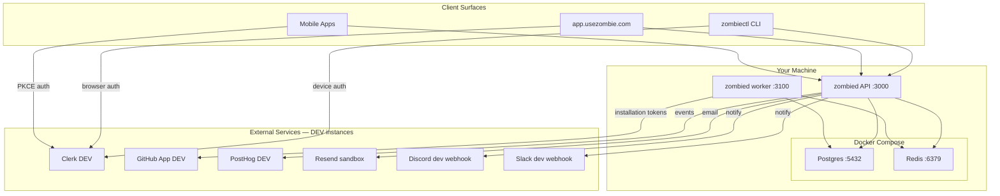

# Deployment Guide — UseZombie v1

Date: Mar 4, 2026
Status: Active v1 deployment contract

## Goal

Deploy a CLI-first UseZombie control plane where API and worker roles are deterministic, Redis-backed, and secure by default. v1 uses NullClaw built-in sandbox and hardened git CLI. v2 adds Firecracker isolation and libgit2.

## 0. Control-Plane Hosting Decision

**Decision Date:** Mar 5, 2026  
**Decision:** Use **Railway.app** for `zombied` control-plane Docker deployment  
**Status:** Approved for v1

### Rationale

| Platform | Small Workload (1 vCPU, 1GB) | Medium Workload | Scaling Model |
|----------|------------------------------|-----------------|---------------|
| **Railway** ⭐ | ~$5-15/mo | ~$30-60/mo | Auto-scale to zero, pay-per-second |
| Fly.io | ~$8-13/mo | ~$40-80/mo | Per-second billing, 40% discount with reservations |
| Render | $0-7/mo | $25-85/mo | Fixed tiers, instances sleep on free tier |

Railway selected for:
1. **Best cost efficiency** for variable control-plane workloads (scales to zero when idle)
2. **True auto-scaling** without manual tier upgrades
3. **Superior DX** with modern dashboard and instant Git/Docker deploys
4. **$5 free trial** then only $1/month base (Hobby plan)

### Trade-offs
- Railway: Best for variable workloads, less mature than Fly.io
- Fly.io: Better for global edge deployment (35+ regions)
- Render: Free tier available but unsuitable for always-on control plane

## 1. Prerequisites

- `zig` 0.15.2+, `git`, `curl`, `jq`, `gh`
- `pass-cli` (Proton Pass CLI) — for vault-based secret injection
- Docker + Docker Compose — for local Postgres and Redis
- `bun` or `node` 22+ — for `zombiectl` CLI and website
- Tailscale tailnet configured for dev/prod control-plane and worker hosts
- GitHub App credentials and installation flow configured
- Clerk application configured (device flow for CLI, JWT verification for API)
- Cloudflare DNS for `usezombie.com`, `usezombie.sh`, `api.usezombie.com`, `docs.usezombie.com`

## 2. Environment Setup

Canonical runtime env contract for `zombied` and `zombiectl`:
- `docs/RUNTIME_ENV_CONTRACT.md`

### 2.1 Local development topology

All three client surfaces (CLI, web, mobile) connect to `zombied` running on the developer's machine. Postgres and Redis run in Docker. External services use their **DEV instances**.



**Key principle:** LOCAL and DEV share the same external service instances (Clerk DEV, GitHub App DEV, PostHog DEV project, notification DEV webhooks). The only difference is infrastructure — local runs Postgres/Redis in Docker, DEV/PROD use managed services.

### 2.2 Secrets management (`pass-cli inject`)

Secrets are stored in three Proton Pass vaults and injected into `.env` via `pass-cli inject`. No scripts needed — the `.env.{local,dev,prod}.tpl` templates ARE the manifest.

| Vault | Purpose |
|-------|---------|
| `ZOMBIE_LOCAL` | DEV instance credentials for local development |
| `ZOMBIE_DEV` | DEV infra (managed DB, Upstash Redis) + DEV services |
| `ZOMBIE_PROD` | Production everything |

```bash
# Generate .env from ZOMBIE_LOCAL vault (default)
make env

# Generate from ZOMBIE_DEV vault
ENV=dev make env

# Generate from ZOMBIE_PROD vault
ENV=prod make env
```

This runs `pass-cli inject -i .env.{ENV}.tpl -o .env -f`, resolving all `{{ pass://ZOMBIE_*/... }}` references. Generated `.env` is gitignored and `chmod 600`.

#### Vault items per environment

| Item | LOCAL | DEV | PROD | Purpose |
|------|:-----:|:---:|:----:|---------|
| `CLERK_PUBLISHABLE_KEY` | ✅ | ✅ | ✅ | Auth (all clients) |
| `CLERK_SECRET_KEY` | ✅ | ✅ | ✅ | API JWT verification |
| `CLERK_WEBHOOK_SECRET` | ✅ | ✅ | ✅ | Webhook validation |
| `CLERK_M2M_ISSUER` | ✅ | ✅ | ✅ | Agent/CI auth |
| `CLERK_M2M_AUDIENCE` | ✅ | ✅ | ✅ | Agent/CI auth |
| `GITHUB_APP_ID` | ✅ | ✅ | ✅ | GitHub App |
| `GITHUB_APP_PRIVATE_KEY` | ✅ | ✅ | ✅ | GitHub App |
| `GITHUB_CLIENT_ID` | ✅ | ✅ | ✅ | OAuth callback |
| `GITHUB_CLIENT_SECRET` | ✅ | ✅ | ✅ | OAuth callback |
| `POSTHOG_KEY` | ✅ | ✅ | ✅ | Product analytics |
| `RESEND_API_KEY` | ✅ | ✅ | ✅ | Email notifications |
| `DISCORD_WEBHOOK_URL` | ✅ | ✅ | ✅ | Notifications |
| `SLACK_WEBHOOK_URL` | ✅ | ✅ | ✅ | Notifications |
| `DATABASE_URL*`, `REDIS_URL*`, `ENCRYPTION_MASTER_KEY` | — | ✅ | ✅ | Runtime contract keys (see `docs/RUNTIME_ENV_CONTRACT.md`) |
| `CHECKLY_API_KEY` | — | — | ✅ | Monitoring |
| `CHECKLY_ACCOUNT_ID` | — | — | ✅ | Monitoring |
| `CLOUDFLARE_API_TOKEN` | — | — | ✅ | DNS management |
| `MINTLIFY_API_KEY` | — | — | ✅ | Docs deployment |
| `MINTLIFY_PROJECT_ID` | — | — | ✅ | Docs deployment |

LOCAL uses hardcoded defaults for DB (`postgres://...@localhost`), Redis (`redis://localhost`), and encryption key (dev placeholder). These are baked into `.env.local.tpl`.

Vault ownership and scope:
- Runtime vault is `vault.secrets` inside UseZombie Postgres (created by migrations, maintained by UseZombie).
- Proton Pass stores operator environment secrets; it is not the runtime `vault.secrets` data plane.
- Current v1 callback implementation runs inside API process. If `/v1/github/callback` writes `github_app_installation_id`, the API DB credential must have vault write access for this path (or callback must be split to a dedicated `callback_accessor` process).

### 2.3 Network policy baseline (Tailscale)

1. Join API and worker nodes to the same Tailscale tailnet.
2. Configure Tailscale ACLs:
   - API nodes → Postgres (5432), Redis (6379), GitHub API (443)
   - Worker nodes → Postgres (5432), Redis (6379), GitHub API (443), LLM providers (443)
   - External → API only (443 via load balancer)
   - External → Postgres, Redis, Worker: DENIED
3. For managed Postgres/Redis: set IP allowlists to Tailscale exit node IPs.

### 2.4 Redis setup

1. Create Redis stream and consumer group:
   ```
   XGROUP CREATE run_queue workers 0 MKSTREAM
   ```
2. Configure ACLs:
   ```
   ACL SETUSER api_user on >api_password ~run_queue +xadd +xgroup +ping
   ACL SETUSER worker_user on >worker_password ~run_queue +xreadgroup +xack +xautoclaim +xgroup +ping +xinfo
   ACL SETUSER default off
   ```

### 2.5 DNS (Cloudflare)

| Record | Type | Target |
|---|---|---|
| `usezombie.com` | CNAME | Vercel (static website) |
| `usezombie.sh` | CNAME | Vercel (static website) |
| `api.usezombie.com` | CNAME | Railway (zombied API) — see Section 0 for decision rationale |
| `docs.usezombie.com` | CNAME | Mintlify |
| `app.usezombie.com` | — | v2 (not configured for v1) |

### 2.6 Local Redis TLS (for `rediss://`)

This project supports Redis over TLS for Upstash (`rediss://`) and local development.

#### Generate local CA + server cert

```bash
mkdir -p docker/redis/tls

# 1. Local CA
openssl req -x509 -nodes -newkey rsa:2048 \
  -keyout docker/redis/tls/ca.key \
  -out docker/redis/tls/ca.crt \
  -days 3650 \
  -subj "/CN=usezombie-local-ca"

# 2. Server key + CSR (SAN includes redis + localhost)
openssl req -nodes -newkey rsa:2048 \
  -keyout docker/redis/tls/server.key \
  -out docker/redis/tls/server.csr \
  -subj "/CN=redis" \
  -addext "subjectAltName=DNS:redis,DNS:localhost,IP:127.0.0.1"

# 3. Sign server cert with local CA
openssl x509 -req \
  -in docker/redis/tls/server.csr \
  -CA docker/redis/tls/ca.crt \
  -CAkey docker/redis/tls/ca.key \
  -CAcreateserial \
  -out docker/redis/tls/server.crt \
  -days 365 \
  -copy_extensions copy
```

#### Configure environment

For local host runs:

```dotenv
REDIS_URL=rediss://localhost:6379
REDIS_TLS_CA_CERT_FILE=/absolute/path/to/usezombie/docker/redis/tls/ca.crt
```

For Docker Compose service-to-service (`zombied -> redis`), compose already sets:

- `REDIS_URL=rediss://redis:6379`
- `REDIS_TLS_CA_CERT_FILE=/app/docker/redis/tls/ca.crt`

#### Verify

```bash
REDIS_URL=rediss://localhost:6379 REDIS_TLS_CA_CERT_FILE=$PWD/docker/redis/tls/ca.crt zig build run -- doctor
```

**Notes:**
- `tls-auth-clients no` is correct for this setup because we are not doing mTLS client-certificate auth.
- Upstash uses server-auth TLS with password auth in URL (for example `rediss://default:<password>@...:6379`).

## 3. Environment Matrix

### 3.1 Environment Local

Purpose: local development and API/worker contract testing.

```bash
# Generate .env and start services
make env
make up
```

In scope:
- `zombiectl` CLI development (Node.js 22)
- `zombied` API + worker (Zig binary)
- Postgres 18.2 (docker container)
- Redis 7 (docker container with ACL config)
- `docker-compose.yml` for local service orchestration
- External services (Clerk, GitHub App, PostHog, Resend, Discord, Slack) use DEV instances

Out of scope for local:
- Vercel website (test with `npm run dev` locally)
- Firecracker isolation (macOS has no KVM)
- Full Tailscale network policy

Local notes:
1. Run API/worker/Postgres/Redis via Docker Compose.
2. Generate `.env` with `make env` (injects from `ZOMBIE_LOCAL` vault via `pass-cli inject`).
3. Clerk: reuse dev instance for auth E2E. Skip for pure API development (use `API_KEY` fallback).
4. NullClaw sandbox may use bubblewrap on Linux Docker or degrade gracefully on macOS.
5. Website: `cd website && npm run dev` for local preview.

### 3.2 Environment Development

Purpose: integration environment for team testing and reliability checks.

Components:
- Website on Vercel: `dev.usezombie.com` (preview deployment)
- Database: `usezombie-dev` (Postgres 18.2 — PlanetScale or Neon)
- Cache: `usezombie-dev` (Upstash Redis, TLS required)
- Clerk: development instance (`clerk.dev.usezombie.com`)
- Worker nodes: OVH VM/bare-metal low-cost pool
- Control-plane host: Railway (see Section 0 for decision rationale)
- PostHog project: development

Development expectations:
1. Redis stream semantics (`XADD`, `XREADGROUP`, `XACK`, `XAUTOCLAIM`) fully operational.
2. Tailscale + IP allowlisting enforced before team access.
3. Clerk JWT auth enforced (no `API_KEY` fallback in dev).
4. NullClaw sandbox active with Landlock backend on Linux workers.

### 3.3 Environment Production

Purpose: customer-facing execution environment.

Components:
- Website: `usezombie.com` + `usezombie.sh` on Vercel
- Database: `usezombie` (Postgres 18.2 — production instance)
- Cache: `usezombie-cache` (Upstash Redis, TLS required)
- Clerk: production instance (`clerk.usezombie.com`)
- Control-plane host: Railway (see Section 0 for decision rationale)
- Worker nodes: OVH bare-metal/discounted server pool (M2+ class)
- PostHog project: production
- Docs: `docs.usezombie.com` (Mintlify)

Production expectations:
1. All security hardening from M3_005 enforced.
2. Clerk JWT auth required for all API access.
3. Database role separation (api_accessor / worker_accessor) enforced.
4. Redis ACLs enforced (separate API/worker credentials).
5. Secrets rotation and audit reporting required before customer workloads.
6. v2 additions (Firecracker, libgit2) required before multi-tenant customer workloads.

## 4. Client Surface Testing

Three client surfaces consume the same `zombied` API. Each follows the same local → dev → prod promotion path.

### zombiectl (CLI)

| Stage | API target | Auth | How to run |
|-------|-----------|------|------------|
| LOCAL | `http://localhost:3000` | Clerk DEV device flow or `API_KEY` | `bun run cli` / `npx zombiectl` |
| DEV | `https://api.dev.usezombie.com` | Clerk DEV device flow | `npx zombiectl --api https://api.dev.usezombie.com` |
| PROD | `https://api.usezombie.com` | Clerk PROD device flow | `npx zombiectl` |

### app.usezombie.com (Web)

| Stage | API target | Auth | How to run |
|-------|-----------|------|------------|
| LOCAL | `http://localhost:3000` | Clerk DEV browser flow | `cd website && npm run dev` |
| DEV | `https://api.dev.usezombie.com` | Clerk DEV browser flow | Vercel preview deploy |
| PROD | `https://api.usezombie.com` | Clerk PROD browser flow | Vercel production deploy |

### Mobile (Swift / Android)

| Stage | API target | Auth | How to run |
|-------|-----------|------|------------|
| LOCAL | `http://localhost:3000` | Clerk DEV PKCE flow | Simulator / emulator |
| DEV | `https://api.dev.usezombie.com` | Clerk DEV PKCE flow | TestFlight / internal track |
| PROD | `https://api.usezombie.com` | Clerk PROD PKCE flow | App Store / Play Store |

## 5. Deploy

Deploy in sequence.

### Step 1: DNS + Website

1. Configure Cloudflare DNS records per section 2.5.
2. Deploy static website to Vercel from `website/` directory.
3. Verify `usezombie.com` and `usezombie.sh` load correctly.
4. Verify `usezombie.sh/openapi.json` and `usezombie.sh/agent-manifest.json` return valid responses.

### Step 2: Data plane (Postgres + Redis)

1. Provision Postgres 18.2 database for current environment.
2. Provision Redis 7 with TLS enabled.
3. Create Postgres roles (`api_accessor`, `worker_accessor`, `callback_accessor`) with grants per M3_000.
4. Apply all DB migrations in `schema/` (currently `001_initial.sql` through `005_side_effect_outbox.sql`).
5. Create Redis stream and consumer group. Configure Redis ACLs per section 2.4.

### Step 3: Authentication (Clerk)

1. Configure Clerk application with device flow (CLI) and JWT verification (API).
2. Set environment variables: `CLERK_SECRET_KEY`, `CLERK_JWKS_URL`.
3. Configure GitHub App callback URL: `https://api.usezombie.com/v1/github/callback`.
4. Canonical auth/install/runtime token flow lives in `docs/USECASE.md` section `0. GitHub Auth + Installation + Runtime Token Flow`.

### Step 4: Control-plane API (`zombied serve`)

1. Deploy API instance(s) on selected host.
2. Configure env vars:
   - Set required keys per `docs/RUNTIME_ENV_CONTRACT.md`.
   - Keep role-separated DB/Redis URLs and Redis TLS (`rediss://`) requirements exactly as documented there.
   - Keep operational knobs aligned (`API_HTTP_THREADS`, `API_HTTP_WORKERS`, `API_MAX_CLIENTS`, `API_MAX_IN_FLIGHT_REQUESTS`).
3. Configure migration startup policy explicitly:
   - `MIGRATE_ON_START=0` (default/fail-closed): `serve` refuses startup if migrations are pending.
   - `MIGRATE_ON_START=1`: `serve` acquires DB migration advisory lock and applies pending migrations before serving traffic.
4. Fail-closed safety behavior (deterministic restart contract):
   - If `schema_migration_failures` has records, `serve` exits immediately until operator runs `zombied migrate` successfully.
   - If migration lock is busy, `serve` exits immediately (`migration in progress`) and should be restarted after lock holder completes.
   - If DB schema version is newer than binary's canonical migrations, `serve` exits (binary/schema mismatch).
5. Verify `/healthz` and `/readyz` endpoints.
6. Security hardening guardrail:
   - `DATABASE_URL_API` and `DATABASE_URL_WORKER` must both be set and must differ.
   - `REDIS_URL_API` and `REDIS_URL_WORKER` must both be set, must differ, and must use `rediss://`.
   - Shared fallback URLs are rejected at startup (fail closed).

### Step 5: Worker (`zombied worker`)

1. Deploy worker on Linux host (Tailscale-connected).
2. Configure env vars:
   - Set required worker/runtime keys per `docs/RUNTIME_ENV_CONTRACT.md`.
   - `NULLCLAW_API_KEY` (default LLM key, or rely on BYOK per workspace).
3. Verify worker joins Redis consumer group and claims queued runs.

### Step 6: CLI distribution

1. Publish `zombiectl` to npm: `npm publish --access public`.
2. Verify: `npx zombiectl login` → device auth → token stored.
3. Verify: `npx zombiectl doctor` → all checks pass.

## 6. Verify and Smoke Tests

```bash
# API liveness/readiness
curl -sS https://api.usezombie.com/healthz
curl -sS https://api.usezombie.com/readyz

# /readyz must report queue_dependency=true; fail closed on Redis degradation
curl -sS https://api.usezombie.com/readyz | jq '.queue_dependency,.ready'

# CLI auth
npx zombiectl login
npx zombiectl doctor

# Workspace setup
npx zombiectl workspace add https://github.com/indykish/terraform-provider-e2e

# Submit a run
npx zombiectl specs sync docs/spec/
npx zombiectl run

# Check run state
npx zombiectl run status <run_id>
```

Redis coordination checks:
```bash
redis-cli -u "$REDIS_URL" XINFO STREAM run_queue
redis-cli -u "$REDIS_URL" XPENDING run_queue workers
```

### Smoke test checklist (all surfaces)

1. `zombiectl login` → Clerk device auth completes → token stored.
2. `zombiectl workspace add` → GitHub App installed → workspace created.
3. `zombiectl specs sync` → specs synced to workspace.
4. Submit spec via CLI and confirm run enters `SPEC_QUEUED`.
5. Confirm worker claims run from Redis and writes state transitions.
6. Force one validation failure and verify retry loop re-enqueues via Redis.
7. Confirm successful run creates PR and marks `DONE`.
8. Kill one worker mid-run and verify `XAUTOCLAIM` reclaims the stale message.
9. PostHog event appears in DEV project dashboard.
10. Notification fires to Discord/Slack DEV channel.

**Acceptance test repo:** `https://github.com/indykish/terraform-provider-e2e`

## 7. Third-Party Services (v1)

| Service | v1 | v2 | Purpose | Notes |
|---|---|---|---|---|
| GitHub App | Yes | Yes | Repo access + PR creation | Installation tokens, not PATs |
| Postgres 18.2 | Yes | Yes | System of record | Role separation (api/worker/callback) |
| Redis 7 (Upstash) | Yes | Yes | Queue + coordination | Stream + consumer-group + ACLs |
| Tailscale | Yes | Yes | Network allowlisting | Restrict service reachability |
| Clerk | Yes | Yes | AuthN/AuthZ | Device flow (CLI), JWT (API), M2M (agents) |
| Cloudflare | Yes | Yes | DNS + CDN | All domains |
| Vercel | Yes | Yes | Static website hosting | usezombie.com + usezombie.sh |
| Mintlify | Yes | Yes | Docs portal | docs.usezombie.com |
| PostHog | Yes | Yes | Product analytics | DEV project for local+dev, PROD project for prod |
| Resend | Yes | Yes | Email notifications | Sandbox for local+dev |
| Firecracker | No | Yes | Execution isolation | v2 — KVM required |
| Langfuse | Pending | Pending | Agent tracing | Decide before production hardening |
| Dodo | Optional | Optional | Billing | Feature-flagged for initial free launch |

## 8. Pending: Langfuse Project

Decision needed before production launch:

1. Approve Langfuse as tracing backend, or
2. Select alternative (Helicone/OpenTelemetry collector + warehouse).

Minimum requirement either way: run-level traceability by `run_id` and attempt.

## 9. Dodo Account

Dodo is optional for initial free launch.

1. Keep billing disabled (`FEATURE_PAYMENTS_ENABLED=false`) for early release.
2. Integrate Dodo only after entitlement and webhook verification pass.

## 10. docs.usezombie.com (Mintlify)

Source:
- `https://github.com/usezombie/docs`
- local path: `~/Projects/docs`

Deployment expectations:
1. Keep API and CLI contracts in sync with public docs.
2. Publish architecture and deployment updates before changing runtime behavior.
3. Link machine-readable assets (`openapi.json`, `agent-manifest.json`, `llms.txt`, `skill.md`) from docs.

## 11. Security Hardening Checklist

Before production launch, verify all items from M3_005:

- [ ] Tailscale ACLs configured — workers unreachable from external networks
- [ ] Postgres role separation — `api_accessor` cannot read `vault.secrets`
- [ ] Redis ACLs — API user cannot XREADGROUP, worker user cannot write arbitrary keys
- [ ] GitHub tokens — installation-scoped, 1-hour lifetime, never stored
- [ ] Clerk JWT — all API requests authenticated (no `API_KEY` in production)
- [ ] TLS on all Postgres and Redis connections
- [ ] `ENCRYPTION_MASTER_KEY` in memory only, never logged
- [ ] `zombied doctor` reports security posture
