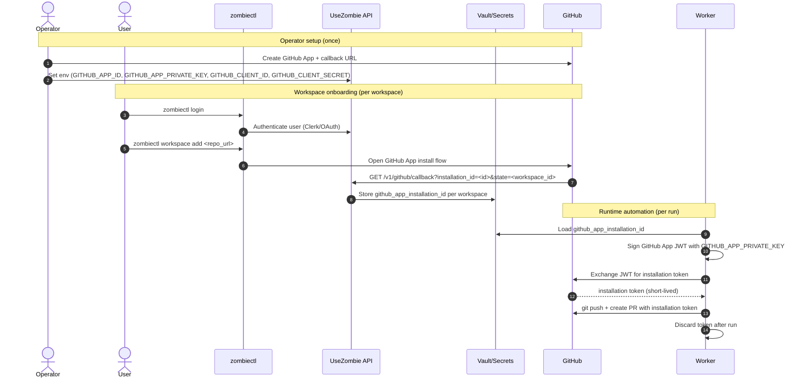

# UseZombie Use Cases

Date: Mar 3, 2026

---

## 0. GitHub Auth + Installation + Runtime Token Flow

This is the end-to-end credential and control-plane flow used by UseZombie.



```text
                    +----------------------+
                    |      Operator        |
                    +----------+-----------+
                               |
                               | set app/env config
                               v
+---------+      login/add     +----------------------+      install/callback      +---------+
|  User   +------------------->+       zombiectl       +--------------------------->+ GitHub  |
+----+----+                    +-----------+----------+                            +----+----+
     |                                     |                                            |
     |                                     | auth / workspace API                        | callback with installation_id
     |                                     v                                            v
     |                          +----------------------+                       +----------------------+
     |                          |     UseZombie API    +---------------------->+    Vault/Secrets     |
     |                          +----------------------+  store installation_id +----------------------+
     |                                                                                     ^
     |                                                                                     |
     |                                            load installation_id                      |
     |                                  +----------------------+                           |
     +--------------------------------->+       Worker         +---------------------------+
                                        +----------+-----------+
                                                   |
                                                   | mint app JWT -> exchange token
                                                   v
                                              +----+----+
                                              | GitHub  |
                                              +----+----+
                                                   ^
                                                   |
                                         push branch + create PR
```

### A) Operator setup (once per environment)

1. Register UseZombie as a GitHub App with callback URL `https://api.usezombie.com/v1/github/callback`.
2. Configure runtime env:
   - `GITHUB_APP_ID`
   - `GITHUB_APP_PRIVATE_KEY`
   - `GITHUB_CLIENT_ID`
   - `GITHUB_CLIENT_SECRET`

`GITHUB_APP_PRIVATE_KEY` is app-level (shared for that GitHub App), not per workspace.

### B) User onboarding (per user/workspace)

1. User authenticates to UseZombie (`zombiectl login` / Clerk).
2. User runs `zombiectl workspace add <repo_url>`.
3. Browser opens GitHub App installation flow.
4. GitHub redirects to `/v1/github/callback?installation_id=<id>&state=<workspace_id>`.
5. Callback stores `github_app_installation_id` in vault for that workspace.

### C) Runtime automation (per run)

1. Worker loads workspace `github_app_installation_id` from vault.
2. Worker creates GitHub App JWT (`RS256`) using `GITHUB_APP_PRIVATE_KEY`.
3. Worker exchanges JWT for short-lived installation access token.
4. Worker uses installation token for `git push` and PR API calls.
5. Token is kept in memory only and discarded after use.

### D) Why both OAuth and App tokens

- OAuth/Clerk is for user identity + selecting/connecting repos.
- GitHub App installation token is for automation execution (repo-scoped, short-lived, non-human credential).
- No long-lived PAT is required for worker runtime.

---

## 1. Solo Builder

**Profile:** Individual developer with 3 active repos. Wants to ship features faster without context-switching between planning, coding, and review.

### Setup

```bash
npx zombiectl login
# → Browser opens → Clerk login → token saved

npx zombiectl workspace add https://github.com/alice/webapp
npx zombiectl workspace add https://github.com/alice/api-server
npx zombiectl workspace add https://github.com/alice/docs-site
# → Each opens GitHub App install flow → grants repo access
```

### Workflow

1. Alice writes a spec file: `docs/spec/PENDING_add_dark_mode.md` — plain markdown describing what she wants.
2. She syncs the spec:
   ```bash
   npx zombiectl specs sync docs/spec/
   # → Synced 1 spec to workspace ws_abc123
   ```
3. She triggers a run:
   ```bash
   npx zombiectl run
   # → Run started: run_xyz789
   # → Echo planning... done (12s)
   # → Scout building... done (45s)
   # → Warden validating... PASS
   # → PR opened: https://github.com/alice/webapp/pull/42
   ```
4. Alice reviews the PR on GitHub. Merges or requests changes.

### Outcome

- Alice writes intent (spec), UseZombie writes code (PR).
- Each spec → one PR. No back-and-forth in Slack. No waiting for a teammate.
- She queues specs for all 3 repos and reviews PRs over coffee.

---

## 2. Small Team (5 Engineers)

**Profile:** Startup with 5 engineers, 2 main repos, weekly sprint cycle. Engineers have more specs than coding bandwidth.

### Setup

```bash
# Team lead connects the repos once
npx zombiectl workspace add https://github.com/acme/platform
npx zombiectl workspace add https://github.com/acme/mobile-api
```

### Workflow

1. Each engineer writes specs and drops them in `docs/spec/`:
   ```
   docs/spec/PENDING_001_fix_auth_timeout.md      # Bob
   docs/spec/PENDING_002_add_search_filters.md     # Carol
   docs/spec/PENDING_003_refactor_payment_flow.md  # Dave
   ```
2. Engineers sync their specs:
   ```bash
   npx zombiectl specs sync docs/spec/
   # → Synced 3 specs to workspace ws_platform
   ```
3. UseZombie processes specs in order. Each spec → plan → code → validation → PR.
4. Engineers review PRs asynchronously. Warden catches regressions before humans see the PR.

### Outcome

- 5 engineers produce specs. UseZombie produces PRs. Engineers review and merge.
- Sprint velocity increases — the bottleneck moves from "who's coding this" to "who's reviewing this PR."
- Warden catches common issues (broken tests, missing error handling) before human review.

---

## 3. Agent-to-Agent

**Profile:** An AI PM agent collects user feedback, triages it, and writes implementation specs. UseZombie implements the specs and opens PRs. The PM agent reviews PR summaries and reports back.

### Setup

The AI PM agent authenticates via Clerk machine-to-machine tokens. It uses the UseZombie HTTP API directly (no CLI needed).

### Workflow

```
User feedback
    │
    ▼
AI PM Agent
    ├── Triages feedback into implementation specs
    ├── Writes PENDING_*.md files
    ├── POST /v1/workspaces/{id}:sync → syncs specs
    └── POST /v1/runs → triggers execution
         │
         ▼
    UseZombie Pipeline
    ├── Echo plans
    ├── Scout builds
    ├── Warden validates
    └── PR opened on GitHub
         │
         ▼
    AI PM Agent
    ├── GET /v1/runs/{id} → checks run status
    ├── Reads PR summary from artifacts
    └── Reports back to user: "Feature shipped, PR #42 ready for review"
```

### Outcome

- Zero human involvement from feedback to PR. Human reviews and merges.
- The PM agent writes *what* to build. UseZombie writes *how* to build it.
- Full audit trail: feedback → spec → plan → code → validation → PR.

---

## 4. LLM Agent Discovery (usezombie.sh)

**Profile:** An autonomous LLM agent browsing the web to find tools that can help it complete a coding task. It discovers UseZombie through `usezombie.sh`.

### Discovery Flow

1. Agent browses `https://usezombie.sh` (the `/agents` route).
2. Finds `agent-manifest.json` — JSON-LD describing UseZombie's capabilities.
3. Reads `skill.md` at `usezombie.sh/skill.md` — markdown onboarding instructions.
4. Discovers: UseZombie takes spec files → produces validated PRs via an API.

### Onboarding Flow

```
LLM Agent
    │
    ├── GET https://usezombie.sh/agent-manifest.json
    │   → Discovers: 6 API endpoints, action classes, capabilities
    │
    ├── GET https://usezombie.sh/skill.md
    │   → Reads: onboarding steps, zombiectl commands, spec format
    │
    ├── npx zombiectl login
    │   → Authenticates via Clerk device flow
    │
    ├── npx zombiectl workspace add <repo_url>
    │   → Installs GitHub App, creates workspace
    │
    └── npx zombiectl specs sync + run
        → Syncs spec, triggers run, monitors progress
```

### Outcome

- No human setup needed. The agent self-discovers, self-onboards, and self-operates.
- `agent-manifest.json` provides machine-readable API surface. `skill.md` provides LLM-readable instructions.
- The agent can use UseZombie as a tool in its own pipeline — write a spec, trigger a run, wait for PR.

---

## Summary

| Scenario | Who writes specs | Who triggers runs | Who reviews PRs |
|----------|-----------------|-------------------|-----------------|
| Solo builder | Human | Human (zombiectl) | Human |
| Small team | Humans | Humans (zombiectl) | Humans |
| Agent-to-agent | AI PM agent | AI PM agent (API) | Human |
| LLM discovery | LLM agent | LLM agent (zombiectl) | Human or agent |

In every scenario, a human approves the final merge. UseZombie produces the PR — humans (or their designated agents) decide what ships.
