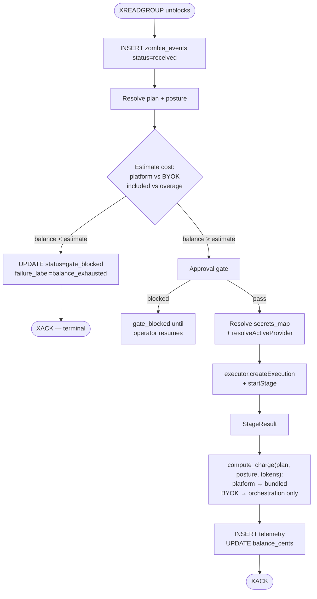

# Billing and Bring-Your-Own-Key

> Parent: [`README.md`](./README.md)

How operators pay for what they run, and how the runtime stays neutral between two cost realities: us paying the language-model provider, or the operator paying the language-model provider directly.

This is a cross-cutting topic. The data model lives in the tenant provider records, the runtime hooks live in the executor + worker path, and the install-time path lives in the install skill. The end-to-end walkthroughs are in [`scenarios/`](./scenarios/). This file is the canonical concept reference.

---

## 1. The two postures

Two personas carry the worked examples through this doc and the scenarios:

- **John Doe** — solo operator on a small repo. Starts on Free, upgrades to Team when he runs out of credits, never touches Bring-Your-Own-Key. He is the platform-managed path, end to end.
- **Jane Doe** — small-team operator with a Fireworks AI account already in place. Goes straight to Team, points her tenant at her Fireworks key. She is the Bring-Your-Own-Key path, end to end.

A tenant is in exactly one of two postures at any moment. The posture is tenant-scoped (single value per tenant; not per workspace, not per zombie):

- **Platform-managed.** UseZombie holds the language-model provider key. The operator pays UseZombie a single bundled per-event fee that covers inference, orchestration, storage, and egress.
- **Bring Your Own Key (BYOK).** The operator stores their own provider credential — Anthropic, OpenAI, Fireworks, Together, Groq, Moonshot, OpenRouter, etc. — in the vault under a name they choose (`account-fireworks-byok`, `anthropic-prod`, etc.). The tenant's `core.tenant_providers` row points at that name through `credential_ref`. UseZombie's executor uses that key to call the provider's API. The operator pays the provider directly for inference; UseZombie charges a smaller orchestration-only fee per event.

The posture flip lives in `core.tenant_providers.mode` (`platform` or `byok`). Switching is a single command (`zombiectl tenant provider set --credential <name>` / `zombiectl tenant provider reset`) or a single dashboard toggle. **Absence of a `tenant_providers` row is equivalent to `mode=platform`** — the resolver synthesises the platform default for tenants who have never explicitly configured a provider. New tenants do not get an eager row; the row appears only when the operator touches provider config.

---

## 2. What gets metered

The bill differs because the cost structure differs. Two cost functions, one gate.

### Platform-managed

| Cost component | Source of truth | Charged to operator |
|---|---|---|
| Language-model tokens (input + output) | `StageResult.tokens` from the executor | Bundled into the per-event price |
| Egress / storage | Hosting provider | Bundled |
| Orchestration (worker + executor + Postgres + Redis) | UseZombie infrastructure | Bundled |

One per-event price covers all three. The bundled rate has margin over our wholesale language-model cost.

### Bring Your Own Key

| Cost component | Source of truth | Charged to operator |
|---|---|---|
| Language-model tokens | The operator's provider account (Fireworks, Anthropic, etc.) | The provider bills the operator directly |
| Egress / storage | UseZombie hosting | Bundled |
| Orchestration | UseZombie infrastructure | A smaller per-event orchestration fee |

The operator pays the provider for inference. UseZombie charges a smaller per-event fee that covers our infrastructure cost, with margin — but no language-model markup.

**Both postures hit the same balance gate.** Earlier drafts said "BYOK skips balance gate." That is wrong. The gate stays on for both; only the cost function differs.

---

## 3. Plans

Three plans. Tenant-scoped, billed monthly. Either posture can be used under any paid plan.

| Plan | Monthly | Included events / month | Per-event overage (platform) | Per-event overage (BYOK) | Notes |
|---|---|---|---|---|---|
| **Free** | $0 | 50 | n/a — gate trips at zero balance | n/a — BYOK requires a paid plan | Single workspace. Eval-only. |
| **Team** | $99 | 2,000 | $0.05 | $0.01 | Multi-workspace per tenant. BYOK enabled. |
| **Scale** | $499 | 15,000 | $0.03 | $0.005 | All Team features plus priority support and longer retention. |

Pricing is illustrative; the architectural shape is what matters. **What "an event" is for billing:** one entry on `zombie:{id}:events` that the worker dispatches into `executor.startStage`. Steer, webhook, cron, and continuation each count as one event. Gate-blocked events count as zero (they never reach the executor; we charged nothing).

Free plan does not allow Bring Your Own Key. Free is the evaluation tier; giving free orchestration to operators with their own language-model key would be a vector for abuse.

---

## 4. The balance gate — code path

In `processEvent`, before the executor call:



The gate runs once, before the executor. The estimate is conservative (the overage rate, not the actual token count, since we don't know it yet). Mid-event balance crossing zero is fine: in-flight events run to completion. The next event hits the gate.

---

## 5. The credit-exhausted user experience

When the gate blocks, the operator's surfaces show:

- **`zombiectl events {id}`** — the gate-blocked row appears with `status='gate_blocked'`, `failure_label='balance_exhausted'`. The CLI prints a one-line suggestion: *Tenant balance exhausted. Upgrade or top up: `zombiectl plan upgrade`.*
- **Dashboard `/zombies/{id}/events`** — the row renders with a red *Blocked: balance* chip and an inline upgrade call-to-action.
- **Slack** (optional, if the SKILL.md author wired it) — the SKILL.md prose can include an "if I can't run, post to #ops-billing" instruction. Out-of-the-box samples don't include this; it's an authoring choice.
- **Email** (optional follow-up surface) — a daily digest "you blocked N events yesterday, upgrade?".

The blocked row is **terminal** (XACKed, immutable narrative). When the operator tops up, **no automatic replay.** If they want the missed events processed, they either re-trigger from the source (push another commit, send another steer) or use the resume affordance, which writes an `actor=continuation:<original>` event referencing `resumes_event_id=<blocked_row>`.

The reasoning is that a balance-exhausted event is usually evidence the operator was already off the rails (runaway loop, mis-configured cron). Auto-replay would compound the bill.

---

## 6. Switching posture mid-month

An operator can switch between platform and BYOK at any time. Effects:

- **Platform → BYOK** (operator runs out of platform credit, brings own Fireworks key): `zombiectl tenant provider set --credential <name>` flips `tenant_providers.mode=byok` immediately. The next event uses the BYOK overage rate. In-flight events finish at the platform rate they were claimed under.
- **BYOK → platform** (operator stops paying their provider): `zombiectl tenant provider reset` flips `mode=platform`. The next event uses the platform overage rate. If the operator's UseZombie balance is now too low for platform pricing, the gate trips on the next event.
- **Mid-event change**: the snapshot taken at claim time wins. Provider posture is resolved exactly once, before `createExecution`.

The "in-flight events" question matters because Bring Your Own Key and platform have very different per-event costs. We never want a request that the operator started under one posture to bill at another.

The `tenant provider set` PUT validates eagerly on structure (body shape, plan eligibility, credential presence, JSON shape, and model-caps catalogue membership). It does **not** make a synthetic call to the LLM provider to verify the key works — auth-validity surfaces at the first event as `provider_auth_failed`. The CLI prints a one-line *"Tip: run a test event to verify the key works"* hint after a successful set.

---

## 7. The BYOK credential and the api_key visibility boundary

### 7.1 The credential body — operator-named, opaque

Vault credentials are opaque JSON objects keyed by name (M45 contract). The BYOK record uses an **operator-chosen name**: Jane picks `account-fireworks-byok`, another operator might pick `anthropic-prod` or `openai-team-shared`. The name is whatever makes sense to the operator; the schema does not impose a convention.

```json
{
  "provider": "fireworks",
  "api_key":  "fw_LIVE_xxxxxxxxxxxxxxxx",
  "model":    "accounts/fireworks/models/kimi-k2.6"
}
```

`provider` is one of the names NullClaw's provider catalogue recognises (`anthropic`, `openai`, `fireworks`, `together`, `groq`, `moonshot`, `kimi`, `openrouter`, `cerebras`, …). `model` is the provider's model identifier. `api_key` is the operator's credential.

The `tenant_providers` row points at the credential by name through `credential_ref`. Multi-credential tenants are supported (an operator can store `anthropic-prod` AND `fireworks-staging` in vault and flip between them with `zombiectl tenant provider set --credential <other>`); only one is *active* at a time per tenant.

**`context_cap_tokens` is not in the credential body.** The cap is resolved separately, at `tenant provider set` time, from the public model-caps endpoint (§9), and pinned into `tenant_providers.context_cap_tokens`. Splitting the two lets the cap be re-resolved when the model changes without touching the vault.

### 7.2 The api_key visibility boundary

The api_key — platform OR BYOK — crosses one boundary cleanly. It exists only in places that need to call the provider's API; it never appears in any user-facing surface.

**The api_key MAY exist in:**

- `core.vault` rows (encrypted at rest via M45's tenant-scoped data key).
- Server-side process memory — return value of `tenant_provider.resolveActiveProvider`, the executor session, the per-call HTTP client.
- Outbound HTTPS request headers to the LLM provider (e.g. `Authorization: Bearer …`).

**The api_key MUST NEVER appear in:**

- HTTP response bodies — `zombiectl doctor --json` output, `GET /v1/tenants/me/provider`, any other JSON the operator sees.
- Logs — worker, executor, structured logs, request logs.
- The agent's tool context — placeholders are substituted *after* sandbox entry by the tool bridge; the provider key is on a different path entirely (`executor.startStage`, not `secrets_map`).
- Persisted event rows — `core.zombie_events`, `zombie_execution_telemetry`, anything else under `core.*`.
- User-facing artefacts — frontmatter, the dashboard, CLI table output, status-page bodies.

The boundary is "process-internal vs user-facing," not "in memory vs not in memory." A grep across the event log, worker logs, executor logs, and HTTP responses for the api_key bytes after a BYOK run is a CI-level invariant (M48 acceptance criteria).

---

## 8. Provider routing — what makes Fireworks + Kimi 2.6 work today

NullClaw already speaks the OpenAI-compatible wire format. From `nullclaw/src/providers/factory.zig`:

| Provider name | Endpoint | Wire format |
|---|---|---|
| `fireworks` / `fireworks-ai` | `https://api.fireworks.ai/inference/v1` | OpenAI-compatible |
| `together` / `together-ai` | `https://api.together.xyz` | OpenAI-compatible |
| `groq` | `https://api.groq.com/openai/v1` | OpenAI-compatible |
| `moonshot` / `kimi` | `https://api.moonshot.cn/v1` | OpenAI-compatible |
| `kimi-intl` / `moonshot-intl` | `https://api.moonshot.ai/v1` | OpenAI-compatible |
| `openai` | `https://api.openai.com` | Native OpenAI |
| `anthropic` | `https://api.anthropic.com` | Native Anthropic |
| `openrouter` | `https://openrouter.ai/api/v1` | OpenAI-compatible (multi-provider gateway) |

For Bring Your Own Key with Fireworks + Kimi 2.6 (also known as Kimi K2-Instruct):

```
provider: "fireworks"
model:    "accounts/fireworks/models/kimi-k2.6"
```

The OpenAI-compatible client routes the call to `https://api.fireworks.ai/inference/v1/chat/completions`. No provider-specific code needed in this repo. The same path opens up every other compatible provider in NullClaw's catalogue without further work.

---

## 9. The model-caps endpoint (cryptic-prefix, public-but-unguessable)

The single source of truth for the model → context-window mapping. Both postures resolve through it:

- **Platform-managed.** The install-skill calls it once at install time and pins the cap into the generated SKILL.md frontmatter.
- **Bring Your Own Key.** `zombiectl provider set` calls it once and writes the cap into `core.tenant_providers`.

Endpoint shape:

```
GET https://api.usezombie.com/_um/da5b6b3810543fe108d816ee972e4ff8/model-caps.json
GET https://api.usezombie.com/_um/da5b6b3810543fe108d816ee972e4ff8/model-caps.json?model=<urlencoded>

200 {
  "version": "2026-04-29",
  "models": [
    { "id": "claude-opus-4-7",                          "context_cap_tokens": 1000000 },
    { "id": "claude-sonnet-4-6",                        "context_cap_tokens": 200000  },
    { "id": "claude-haiku-4-5-20251001",                "context_cap_tokens": 200000  },
    { "id": "gpt-5.5",                                  "context_cap_tokens": 256000  },
    { "id": "gpt-5.4",                                  "context_cap_tokens": 256000  },
    { "id": "kimi-k2.6",                                "context_cap_tokens": 256000  },
    { "id": "accounts/fireworks/models/kimi-k2.6",      "context_cap_tokens": 256000  },
    { "id": "accounts/fireworks/models/deepseek-v4-pro","context_cap_tokens": 256000  },
    { "id": "glm-5.1",                                  "context_cap_tokens": 128000  }
  ]
}
```

The provider hosting a given model is encoded in the `model_id` itself (`accounts/fireworks/...` is Fireworks; bare `kimi-k2.6` is Moonshot; `claude-*` is Anthropic; `gpt-*` is OpenAI; `glm-*` is Zhipu). Operators pick their provider via their `llm` credential body, not via this catalogue — so the catalogue does not carry a `default_provider` field.

Properties:

- **Cryptic path key.** The `/_um/da5b6b3810543fe108d816ee972e4ff8/` prefix is sixty-four bits of entropy. Random scanning to find this URL is cost-prohibitive. The key is obscurity, not secrecy — the install-skill repository references it publicly. The threat model is opportunistic crawlers, not deliberate readers.
- **Hard-coded in clients.** `zombiectl` and the install-skill embed the URL at build time. Rotation is a coordinated CLI + skill release, on a quarterly cadence or sooner if abuse is detected. Old keys serve `410 Gone` for ~30 days, then `404`.
- **Cloudflare in front.** `Cache-Control: public, max-age=86400, s-maxage=604800, immutable` per release URL. Per-IP rate limit (one request per second sustained, burst of ten) at the edge.
- **Implementation roadmap.** v2.0 ships a static JSON file checked into the API repository and served by a route handler. Later, an admin-only zombie owned by `nkishore@megam.io` wakes hourly, queries each provider's models endpoint where one exists (Anthropic, OpenAI, Moonshot, OpenRouter), reconciles against the table, and opens a pull request with deltas. Humans review and merge. The endpoint stays the same; the data gets fresher.
- **Resolved at install or provider-set time, never at trigger time.** Triggers must not depend on a network call to a sibling endpoint — the cap is pinned in either `tenant_providers` (BYOK) or frontmatter (platform).

---

## 10. Open questions deferred to v3 or later

- Pre-paid credits versus post-paid invoicing for Team and Scale. v2 starts pre-paid only — simpler dunning, no accounts-receivable risk.
- Per-workspace soft caps inside a tenant ("the staging workspace can spend at most $10/day even if the tenant balance is $1,000"). Needs a new gate at the workspace level.
- Refunds for events that completed but produced obviously broken output. Manual support process in v2.
- Volume discounts beyond Scale (Enterprise tier). Sales-led, off-list pricing.
- Metering BYOK spend for cost reporting. Operators check their provider's dashboard today.
- Auto-fallback from BYOK to platform on provider error. Errors surface to the operator; no silent fallback (it would charge them without consent).
