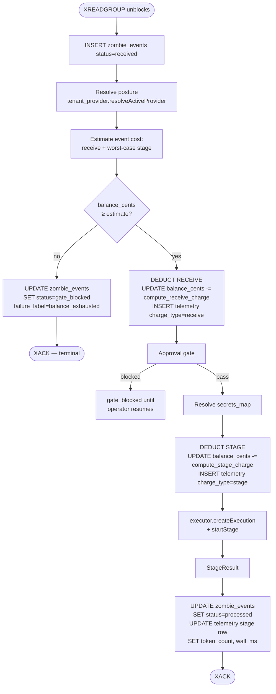

# Billing and Bring-Your-Own-Key

> Parent: [`README.md`](./README.md)

How operators pay for what they run, and how the runtime stays neutral between two cost realities: us paying the language-model provider, or the operator paying the language-model provider directly.

This is a cross-cutting topic. The data model lives in the tenant provider records, the runtime hooks live in the executor + worker path, and the install-time path lives in the install skill. The end-to-end walkthroughs are in [`scenarios/`](./scenarios/). This file is the canonical concept reference.

The billing model is **credit-based, Amp-style**: every tenant has a single credit balance in cents; events deduct credits at two points (receive + stage); when the balance hits zero the gate trips. There are no plan tiers in the cost function and no "included events" tier ladder — credits flow in (one-time starter grant in v2.0; Stripe purchase in v2.1+) and credits flow out per event. Posture (platform vs BYOK) changes the per-event cost, not the structure of the gate.

---

## 1. The two postures

Two personas carry the worked examples through this doc and the scenarios:

- **John Doe** — solo operator on a small repo. Stays on the default platform-managed posture. Drains credits at the platform rate (token-based). The platform-managed path, end to end.
- **Jane Doe** — small-team operator with a Fireworks AI account already in place. Activates BYOK with her Fireworks key. Drains credits at the BYOK rate (flat orchestration only). The Bring-Your-Own-Key path, end to end.

A tenant is in exactly one of two postures at any moment. The posture is tenant-scoped (single value per tenant; not per workspace, not per zombie):

- **Platform-managed.** UseZombie holds the language-model provider key. The operator pays UseZombie a per-event fee that bundles inference (token-based, model-rate-driven), orchestration, storage, and egress.
- **Bring Your Own Key (BYOK).** The operator stores their own provider credential — Anthropic, OpenAI, Fireworks, Together, Groq, Moonshot, OpenRouter, etc. — in the vault under a name they choose (`account-fireworks-byok`, `anthropic-prod`, etc.). The tenant's `core.tenant_providers` row points at that name through `credential_ref`. UseZombie's executor uses that key to call the provider's API. The operator pays the provider directly for inference; UseZombie charges a smaller flat orchestration fee per event with no token markup.

The posture flip lives in `core.tenant_providers.mode` (`platform` or `byok`). Switching is a single command (`zombiectl tenant provider set --credential <name>` / `zombiectl tenant provider reset`) or a single dashboard toggle. **Absence of a `tenant_providers` row is equivalent to `mode=platform`** — the resolver synthesises the platform default for tenants who have never explicitly configured a provider. New tenants do not get an eager row; the row appears only when the operator touches provider config.

---

## 2. Pure credits, one-time starter grant

Every tenant has exactly one balance: `core.tenant_billing.balance_cents`. The gate compares this column against the estimated event cost. Deductions are SQL `UPDATE … SET balance_cents = balance_cents - <cents>`. There is no second column for "free vs paid," no replenishing bucket, no included-events quota. One number, drains over time, refills only when the operator buys credits.

### 2.1 The starter grant

Each new tenant receives a **one-time starter grant of 1000 cents (USD $10)** at tenant-create time. The grant is inserted into `tenant_billing.balance_cents` synchronously when the tenant row is created. There is no replenish; the $10 is a one-time onboarding allowance, not a recurring stipend.

At platform rates the grant covers roughly two hundred Sonnet-class events (model rates × stage overhead — exact count varies by token usage per event). At BYOK rates the grant covers roughly five hundred events (flat orchestration only). The exact ratio depends on per-model pricing in §10.

### 2.2 What happens when the starter grant runs out

When `balance_cents` cannot cover the next event's estimated cost, the gate trips. The event is dead-lettered with `failure_label='balance_exhausted'`. The CLI prints a one-line pointer at the dashboard billing page; the dashboard shows the empty-balance state. **Stripe-backed Purchase Credits is deferred to v2.1.** In v2.0, an operator whose grant runs out either contacts us (manual top-up via support) or stops using the platform. The pricing model and the schema both anticipate Stripe — they just don't ship the integration in v2.0.

### 2.3 Plan tiers

There are no plan tiers in the cost function. The flat-rate `compute_receive_charge` and `compute_stage_charge` functions in §4 do not take a plan parameter. If we ever introduce paid plans (v2.1+), they will manifest as larger one-time grants, recurring Stripe charges that top up `balance_cents`, or volume discounts on per-event rates — but not as a branch inside `compute_charge`.

---

## 3. The two debit points

Every event triggers two debits, in this order, from the same `tenant_billing.balance_cents` column:

| # | Debit | When | Amount | Posture-dependent? |
|---|---|---|---|---|
| 1 | **Receive** | Right after `INSERT zombie_events (status='received')` and the gate passes | `compute_receive_charge(posture)` | Yes — platform receive > BYOK receive |
| 2 | **Stage** | Right before `executor.startStage` is invoked | `compute_stage_charge(posture, model, in_tok, out_tok)` | Yes — platform is token-based; BYOK is flat |

Why two points and not one:

- **Receive captures the orchestration cost of accepting the event.** Queue ingest, gate evaluation, telemetry row setup, persistence overhead. Even an event whose stage decides to do nothing useful (zero-tool-call response, agent declines) has cost us this overhead. We deduct for it regardless.
- **Stage captures the cost of running NullClaw.** Under platform that's token rate × tokens (we paid Anthropic / OpenAI / Fireworks for the tokens). Under BYOK that's flat orchestration overhead (the operator paid the provider; we did the executor RPC, the sandbox setup, the StageResult plumbing).

Each debit produces its own row in `core.zombie_execution_telemetry` with a `charge_type` discriminator (`'receive'` or `'stage'`). One event → two telemetry rows. This is auditable: a quarterly question like "what fraction of last month's revenue came from receive overhead vs LLM markup" is a one-line SQL query.

The stage debit happens **before** `startStage` returns. We deduct on the conservative side — using the worst-case input-token estimate from the prompt size — and then the post-execution telemetry update reconciles to the actual token count. If the actual usage is lower than the estimate, the difference is *not* refunded in v2.0; the conservative estimate is the charge. (Refund-on-actual is a v3 candidate; today it would add reconciliation complexity for marginal accuracy gains.)

---

## 4. `compute_receive_charge` and `compute_stage_charge`

Two functions, both in `src/state/tenant_billing.zig`. Both take `posture`. Neither takes plan.

### 4.1 Receive charge

```zig
pub const Posture = enum { platform, byok };

const RECEIVE_PLATFORM_CENTS: u32 = 1;   // platform-managed event ingest
const RECEIVE_BYOK_CENTS:     u32 = 0;   // BYOK ingest folded into stage overhead

pub fn compute_receive_charge(posture: Posture) u32 {
    return switch (posture) {
        .platform => RECEIVE_PLATFORM_CENTS,
        .byok     => RECEIVE_BYOK_CENTS,
    };
}
```

Receive is one cent under platform, zero cents under BYOK in v2.0. The asymmetry is deliberate: under BYOK the operator is already paying for the LLM elsewhere, and we'd rather take our margin in one transparent place (the stage flat fee) than nickel-and-dime them across two debit points. Under platform we charge the receive cent because the bundled rate already presumes we're pricing the orchestration alongside inference; the receive cent is the separable orchestration share.

The numbers are illustrative — see §10's caveat about pricing controversy. The function shape is what matters: posture-dependent, plan-independent, plumbed through `processEvent`.

### 4.2 Stage charge

```zig
const STAGE_OVERHEAD_PLATFORM_CENTS: u32 = 1;   // executor RPC + sandbox + plumbing
const STAGE_OVERHEAD_BYOK_CENTS:     u32 = 1;   // same overhead, charged flat under BYOK

pub fn compute_stage_charge(
    posture:       Posture,
    model:         []const u8,        // "claude-sonnet-4-6", "kimi-k2.6", …
    input_tokens:  u32,
    output_tokens: u32,
) u32 {
    return switch (posture) {
        .platform => blk: {
            const rate = lookup_model_rate(model) orelse @panic("unknown model");
            const in_cents  = (rate.input_cents_per_mtok  * input_tokens)  / 1_000_000;
            const out_cents = (rate.output_cents_per_mtok * output_tokens) / 1_000_000;
            break :blk STAGE_OVERHEAD_PLATFORM_CENTS + in_cents + out_cents;
        },
        .byok => STAGE_OVERHEAD_BYOK_CENTS,
    };
}
```

Under platform: a fixed overhead (1¢) plus token cost driven by the per-model rates from the model-caps endpoint (§10). Under BYOK: just the overhead — flat 1¢ per stage, regardless of model or token count, because we did not pay for the tokens.

`lookup_model_rate` reads from a process-local cache populated on API server start (and refreshed when the model-caps endpoint updates). The model-caps endpoint is the single source of truth; the API server caches it to keep `compute_stage_charge` synchronous and free of network calls in the hot path.

`@panic("unknown model")` under platform is correct: a model that's not in the catalogue should never reach `processEvent` — it would have been rejected at `tenant provider set` time (`400 model_not_in_caps_catalogue`) or at install-skill frontmatter generation. Reaching `compute_stage_charge` with an unknown model is an internal inconsistency; we want to crash the worker, alert, and investigate, not silently use a default.

### 4.3 Worked example — John on platform, claude-sonnet-4-6, 800 in / 1040 out

```
compute_receive_charge(.platform)
  = 1¢

compute_stage_charge(.platform, "claude-sonnet-4-6", 800, 1040)
  rate(claude-sonnet-4-6) = { input: 300, output: 1500 } cents/mtok
  in_cents  = (300  × 800)  / 1_000_000 = 0¢ (rounds to 0; under 1¢)
  out_cents = (1500 × 1040) / 1_000_000 = 1¢
  = STAGE_OVERHEAD_PLATFORM (1¢) + 0¢ + 1¢ = 2¢

Total event cost: 1¢ + 2¢ = 3¢
```

(Numbers illustrative; the actual rates ride the model-caps endpoint and may differ. The shape of the math is the contract.)

### 4.4 Worked example — Jane on BYOK, accounts/fireworks/models/kimi-k2.6, 800 in / 1320 out

```
compute_receive_charge(.byok)
  = 0¢

compute_stage_charge(.byok, "accounts/fireworks/models/kimi-k2.6", 800, 1320)
  posture is BYOK → no rate lookup, no token math
  = STAGE_OVERHEAD_BYOK (1¢)

Total event cost: 0¢ + 1¢ = 1¢
```

Jane's $10 starter grant covers ~1000 BYOK events. John's covers ~300 platform-Sonnet events. Different drain rates, same balance column.

---

## 5. The balance gate — code path

`processEvent` runs both the gate and both debits. Single code path for both postures.



Properties:

- **Single-pass gate.** One `balance_cents < estimate` check at the start. If the operator can't cover one event's worst-case, the event is rejected at the gate. The estimate is conservative — uses the worst-case-tokens estimate from the prompt size for the stage portion.
- **Two deductions, two telemetry rows, in transaction.** Receive deduct + telemetry insert is one transaction; stage deduct + telemetry insert is another. If the worker crashes between them, the receive-row is the durable record that the receive overhead was charged; on retry the gate re-runs and either passes (still in credit) or blocks (not enough left for the stage portion).
- **Mid-event balance crossing zero is fine.** In-flight events run to completion under the snapshot taken at receive time. The next event hits the gate cleanly.
- **Concurrent events on near-zero balance.** Two events claim simultaneously, both pass the gate (balance was sufficient for one), both deduct → balance can briefly go negative. We accept the small overshoot rather than serialise all events behind a row lock. Recovery: next event sees `balance_cents < 0`, gate trips.

---

## 6. The credit-exhausted user experience

When the gate blocks, the operator's surfaces show:

- **`zombiectl events {id}`** — the gate-blocked row appears with `status='gate_blocked'`, `failure_label='balance_exhausted'`. The CLI prints a one-line pointer: *Credits exhausted. See https://app.usezombie.com/settings/billing.*
- **`zombiectl billing show`** — balance reads `0¢ ($0.00)`; below it, the most recent N event rows showing where the credits went.
- **Dashboard `/zombies/{id}/events`** — the row renders with a red *Blocked: balance* chip linking to the billing page.
- **Dashboard `/settings/billing`** — empty-balance hero state. The Purchase Credits button is visible but disabled in v2.0 with a tooltip *"Coming in v2.1 — contact support for a top-up."*. The Usage tab still shows the historical drain.

The blocked row is **terminal** (XACKed, immutable narrative). When the operator's balance is later topped up (manually by us in v2.0, or via Stripe in v2.1+), there is **no automatic replay**. If they want the missed events processed, they either re-trigger from the source (push another commit, send another steer) or use the resume affordance, which writes an `actor=continuation:<original>` event referencing `resumes_event_id=<blocked_row>`.

The reasoning is that a balance-exhausted event is usually evidence the operator was already off the rails (runaway loop, mis-configured cron). Auto-replay would compound the bill.

---

## 7. Switching posture mid-stream

An operator can switch between platform and BYOK at any time. Effects on subsequent billing:

- **Platform → BYOK** (operator runs out of platform credit, brings own Fireworks key): `zombiectl tenant provider set --credential <name>` flips `tenant_providers.mode=byok` immediately. The next event's receive + stage debits use the BYOK constants and rate path. In-flight events finish under the platform snapshot they were claimed under.
- **BYOK → platform** (operator stops paying their provider): `zombiectl tenant provider reset` flips `mode=platform`. The next event uses platform rates. If the credit balance is now too low for platform pricing, the gate trips on the next event.
- **Mid-event change.** The snapshot taken at claim time wins. Provider posture is resolved exactly once, at gate time, before the receive deduct.

The "in-flight events" question matters because BYOK and platform have different per-event costs. We never want a request that the operator started under one posture to bill at another.

The `tenant provider set` PUT validates eagerly on structure (body shape, credential presence, JSON shape, model-caps catalogue membership). It does **not** make a synthetic call to the LLM provider to verify the key works — auth-validity surfaces at the first event as `provider_auth_failed`. The CLI prints a one-line *"Tip: run a test event to verify the key works"* hint after a successful set.

---

## 8. The BYOK credential and the api_key visibility boundary

### 8.1 The credential body — operator-named, opaque

Vault credentials are opaque JSON objects keyed by name (M45 contract). The BYOK record uses an **operator-chosen name**: Jane picks `account-fireworks-byok`, another operator might pick `anthropic-prod` or `openai-team-shared`. The name is whatever makes sense to the operator; the schema does not impose a convention.

```json
{
  "provider": "fireworks",
  "api_key":  "fw_LIVE_xxxxxxxxxxxxxxxx",
  "model":    "accounts/fireworks/models/kimi-k2.6"
}
```

`provider` is one of the names NullClaw's provider catalogue recognises (`anthropic`, `openai`, `fireworks`, `together`, `groq`, `moonshot`, `kimi`, `openrouter`, `cerebras`, …). `model` is the provider's model identifier. `api_key` is the operator's credential.

The `tenant_providers` row points at the credential by name through `credential_ref`. Multi-credential tenants are supported (an operator can store `anthropic-prod` AND `fireworks-staging` in vault and flip between them with `zombiectl tenant provider set --credential <other>`); only one is *active* at a time per tenant.

**`context_cap_tokens` is not in the credential body.** The cap is resolved separately, at `tenant provider set` time, from the public model-caps endpoint (§10), and pinned into `tenant_providers.context_cap_tokens`. Splitting the two lets the cap be re-resolved when the model changes without touching the vault.

### 8.2 The api_key visibility boundary

The api_key — platform OR BYOK — crosses one boundary cleanly. It exists only in places that need to call the provider's API; it never appears in any user-facing surface.

**The api_key MAY exist in:**

- `core.vault` rows (encrypted at rest via M45's tenant-scoped data key).
- Server-side process memory — return value of `tenant_provider.resolveActiveProvider`, the executor session, the per-call HTTP client.
- Outbound HTTPS request headers to the LLM provider (e.g. `Authorization: Bearer …`).

**The api_key MUST NEVER appear in:**

- HTTP response bodies — `zombiectl doctor --json` output, `GET /v1/tenants/me/provider`, any other JSON the operator sees.
- Logs — worker, executor, structured logs, request logs.
- The agent's tool context — placeholders are substituted *after* sandbox entry by the tool bridge; the provider key is on a different path entirely (`executor.startStage`, not `secrets_map`).
- Persisted event rows — `core.zombie_events`, `zombie_execution_telemetry`, anything else under `core.*`.
- User-facing artefacts — frontmatter, the dashboard, CLI table output, status-page bodies.

The boundary is "process-internal vs user-facing," not "in memory vs not in memory." A grep across the event log, worker logs, executor logs, and HTTP responses for the api_key bytes after a BYOK run is a CI-level invariant (M48 acceptance criteria).

---

## 9. Provider routing — what makes Fireworks + Kimi 2.6 work today

NullClaw already speaks the OpenAI-compatible wire format. From `nullclaw/src/providers/factory.zig`:

| Provider name | Endpoint | Wire format |
|---|---|---|
| `fireworks` / `fireworks-ai` | `https://api.fireworks.ai/inference/v1` | OpenAI-compatible |
| `together` / `together-ai` | `https://api.together.xyz` | OpenAI-compatible |
| `groq` | `https://api.groq.com/openai/v1` | OpenAI-compatible |
| `moonshot` / `kimi` | `https://api.moonshot.cn/v1` | OpenAI-compatible |
| `kimi-intl` / `moonshot-intl` | `https://api.moonshot.ai/v1` | OpenAI-compatible |
| `openai` | `https://api.openai.com` | Native OpenAI |
| `anthropic` | `https://api.anthropic.com` | Native Anthropic |
| `openrouter` | `https://openrouter.ai/api/v1` | OpenAI-compatible (multi-provider gateway) |

For Bring Your Own Key with Fireworks + Kimi 2.6 (also known as Kimi K2-Instruct):

```
provider: "fireworks"
model:    "accounts/fireworks/models/kimi-k2.6"
```

The OpenAI-compatible client routes the call to `https://api.fireworks.ai/inference/v1/chat/completions`. No provider-specific code needed in this repo. The same path opens up every other compatible provider in NullClaw's catalogue without further work.

---

## 10. The model-caps endpoint (cryptic-prefix, public-but-unguessable)

The single source of truth for model context caps **and per-model token rates**. Both postures resolve through it:

- **Platform-managed context cap.** The install-skill reads the resolved cap via `zombiectl doctor --json`'s `tenant_provider` block; the platform-side resolver hardcodes the synth-default values for tenants with no `tenant_providers` row.
- **BYOK context cap.** `zombiectl tenant provider set` calls the endpoint and writes the cap into `core.tenant_providers.context_cap_tokens`.
- **Per-model token rates.** The API server reads the endpoint at boot and on a periodic refresh; `compute_stage_charge` consults the cached rates.

Endpoint shape (extended in M48 with token-rate columns):

```
GET https://api.usezombie.com/_um/da5b6b3810543fe108d816ee972e4ff8/model-caps.json
GET https://api.usezombie.com/_um/da5b6b3810543fe108d816ee972e4ff8/model-caps.json?model=<urlencoded>

200 {
  "version": "2026-05-01",
  "models": [
    { "id": "claude-opus-4-7",
      "context_cap_tokens": 1000000,
      "input_cents_per_mtok":  1500,
      "output_cents_per_mtok": 7500 },
    { "id": "claude-sonnet-4-6",
      "context_cap_tokens": 200000,
      "input_cents_per_mtok":  300,
      "output_cents_per_mtok": 1500 },
    { "id": "claude-haiku-4-5-20251001",
      "context_cap_tokens": 200000,
      "input_cents_per_mtok":  100,
      "output_cents_per_mtok":  500 },
    { "id": "gpt-5.5",
      "context_cap_tokens": 256000,
      "input_cents_per_mtok":  500,
      "output_cents_per_mtok": 2000 },
    { "id": "kimi-k2.6",
      "context_cap_tokens": 256000,
      "input_cents_per_mtok":  150,
      "output_cents_per_mtok":  600 },
    { "id": "accounts/fireworks/models/kimi-k2.6",
      "context_cap_tokens": 256000,
      "input_cents_per_mtok":  150,
      "output_cents_per_mtok":  600 },
    { "id": "accounts/fireworks/models/deepseek-v4-pro",
      "context_cap_tokens": 256000,
      "input_cents_per_mtok":  200,
      "output_cents_per_mtok":  800 },
    { "id": "glm-5.1",
      "context_cap_tokens": 128000,
      "input_cents_per_mtok":  100,
      "output_cents_per_mtok":  400 }
  ]
}
```

The provider hosting a given model is encoded in the `model_id` itself (`accounts/fireworks/...` is Fireworks; bare `kimi-k2.6` is Moonshot; `claude-*` is Anthropic; `gpt-*` is OpenAI; `glm-*` is Zhipu). Operators pick their provider via their BYOK credential body, not via this catalogue — so the catalogue does not carry a `default_provider` field.

Properties:

- **Cryptic path key.** The `/_um/da5b6b3810543fe108d816ee972e4ff8/` prefix is sixty-four bits of entropy. Random scanning to find this URL is cost-prohibitive. The key is obscurity, not secrecy — the install-skill repository references it publicly. The threat model is opportunistic crawlers, not deliberate readers.
- **Pricing visibility caveat.** The token-rate columns are in the same public-but-unguessable response. Anyone who finds the URL can read our platform margins. Acknowledged-controversial — the alternative (auth-required pricing endpoint) breaks the "hot, unauthenticated, cacheable" property that lets `tenant provider set` resolve at low latency. We accept the trade-off for now and revisit if a competitor uses our pricing strategically.
- **Hard-coded in clients.** `zombiectl` and the install-skill embed the URL at build time. Rotation is a coordinated CLI + skill release, on a quarterly cadence or sooner if abuse is detected. Old keys serve `410 Gone` for ~30 days, then `404`.
- **Cloudflare in front.** `Cache-Control: public, max-age=86400, s-maxage=604800, immutable` per release URL. Per-IP rate limit (one request per second sustained, burst of ten) at the edge.
- **Implementation roadmap.** v2.0 ships a static JSON file checked into the API repository and served by a route handler. Later, an admin-only zombie owned by `nkishore@megam.io` wakes hourly, queries each provider's models endpoint where one exists (Anthropic, OpenAI, Moonshot, OpenRouter), reconciles against the table, and opens a pull request with deltas. Humans review and merge. The endpoint stays the same; the data gets fresher.
- **Resolved at install or provider-set time, never at trigger time.** The context cap is pinned in either `tenant_providers` (BYOK) or the synth-default constant (platform). The token-rate cache is refreshed on API boot and on a slow background timer; the hot path never makes a network call.

---

## 11. Dashboard `/settings/billing` (Amp-style, read-only in v2.0)

The billing dashboard mirrors Amp's settings page in shape. Layout and what ships in v2.0 vs later:

### 11.1 Balance card

- Large display: `$X.XX USD` (the balance_cents value formatted as dollars).
- Subtitle: `Covers all your zombie events.`
- **Purchase Credits** button — present, **disabled in v2.0** with a tooltip *"Coming in v2.1 — contact support for a top-up."* The button moves to enabled in v2.1 once the Stripe integration ships.

### 11.2 Tabs — Usage / Invoices / Payment Method

- **Usage** (default tab, shipped in v2.0). Per-event credit drain history filterable by zombie / time range. Each row shows event_id, zombie, timestamp, posture, model (under platform), tokens (under platform), receive cents, stage cents, total cents. Sortable and exportable to CSV.
- **Invoices** (shipped as empty state in v2.0). Renders *"No invoices yet — invoicing arrives with Purchase Credits in v2.1."*
- **Payment Method** (shipped as empty state in v2.0). Renders *"No payment method on file — coming in v2.1."*

### 11.3 Auto Top Up card

Hidden entirely in v2.0. Re-introduced in v2.1 alongside Stripe.

### 11.4 What gets read by this page

Everything on the page is sourced from rows the runtime already writes:
- `core.tenant_billing.balance_cents` for the headline.
- `core.zombie_execution_telemetry` (filtered by tenant_id, with the `charge_type` discriminator) for the Usage tab.
- No Stripe, no purchase tables, no invoicing tables — those land in v2.1.

---

## 12. CLI billing surface — `zombiectl billing show`

One read-only subcommand in v2.0:

```
zombiectl billing show [--limit N]
```

Output:

```
Tenant balance:    $4.71 (471¢)
Last 10 events drained credits:
  EVENT_ID            POSTURE  MODEL                        IN_TOK  OUT_TOK  RECEIVE  STAGE  TOTAL
  evt_01HXG2K4…       platform claude-sonnet-4-6              800    1040       1¢     2¢     3¢
  evt_01HXG3M2…       byok     accounts/.../kimi-k2.6         800    1320       0¢     1¢     1¢
  …
ⓘ Out of credits? See https://app.usezombie.com/settings/billing
   Or run zombiectl billing show --json | jq for machine-readable output.
```

No `purchase` / `topup` / `configure` subcommands in v2.0. The CLI's job is to surface state, not to drive Stripe — that lives in the dashboard once it ships in v2.1.

When the gate trips, every event-emitting CLI command (e.g. `zombiectl steer`) prints a one-line pointer at the dashboard billing page. The CLI never blocks the operator from making the next call (you can still issue another `steer` even with zero balance) — the gate is server-side, and the CLI surfaces the eventual rejection through `zombiectl events`.

---

## 13. Open questions deferred to v2.1+ and v3

- **Stripe Purchase Credits flow.** v2.1. Adds `core.credit_purchases` table, Stripe webhook handler, dashboard button enablement, CLI subcommand if/when warranted.
- **Auto Top Up.** v2.1, alongside Stripe. Adds threshold + reload-amount config on the tenant.
- **Plan tiers as recurring grants.** v2.1+ if onboarding metrics suggest it. Encoded as recurring Stripe charges that top up `balance_cents`, not as branches in `compute_charge`.
- **Refund-on-actual-tokens.** v3. Today the conservative estimate at stage-debit time is the charge; reconciling to actual tokens after `StageResult` would add bookkeeping for marginal accuracy gains.
- **Per-workspace soft caps inside a tenant** ("the staging workspace can spend at most $10/day even if the tenant balance is $100"). v3 — needs a new gate at the workspace level.
- **Volume discounts beyond a threshold.** v3, sales-led.
- **Metering BYOK spend for cost reporting.** Operators check their provider's dashboard today.
- **Auto-fallback from BYOK to platform on provider error.** Errors surface to the operator; no silent fallback (it would charge them without consent).
