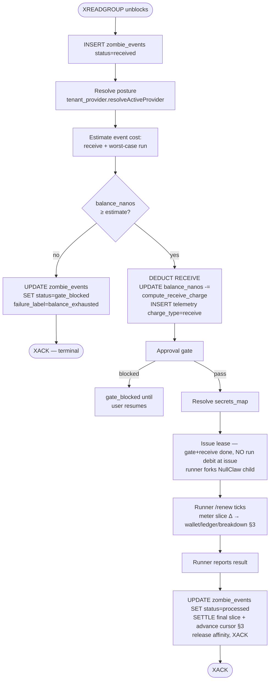

# Billing and self-managed provider key

> Parent: [`README.md`](./README.md)

How users pay for what they run, and how the runtime stays neutral between two cost realities: us paying the language-model provider, or the user paying the language-model provider directly.

This is a cross-cutting topic. The data model lives in the tenant provider records, the runtime hooks live in the control plane's lease path (`zombied`) and the runner's NullClaw child, and the install-time path lives in the install skill. The end-to-end walkthroughs are in [`scenarios/`](./scenarios/). This file is the canonical concept reference.

The billing model is **credit-based, Amp-style**: every tenant has a single credit balance in nanos (1 USD = 1,000,000,000 nanos); events deduct credits at two points (receive + run); when the balance hits zero the gate trips. There are no plan tiers in the cost function and no "included events" tier ladder — credits flow in (one-time starter grant in v2.0; Stripe purchase in v2.1+) and credits flow out per event. Receive is a fixed amount in both postures; **run** is posture-dispatched and is the friction-reducing gradient (platform default subsidises inference; self-managed runs cheaper because the user is paying their own provider for tokens). This file is the **concept reference** — it describes shape and behaviour.

> **Where the live values are.** [`https://agentsfleet.net/#pricing`](https://agentsfleet.net/#pricing) is the canonical source of truth for current rates, starter-grant value, and any active promotional window (e.g. a free-trial period). This doc and the scenarios in this directory deliberately do not quote dollar amounts or windows — they go stale the moment a rate moves. For implementers: server-authoritative constants live in `src/state/tenant_billing.zig` (pin-tested), mirrored to `ui/packages/website/src/lib/rates.ts` and `~/Projects/docs/snippets/rates.mdx`. Identifier names match across Zig/TS/JS so a rate bump is a coordinated PR.

---

## 1. The two postures

One persona carries the worked examples through this doc and the scenarios: **John Doe** — first-time user who installs an agent on the default platform-managed posture, runs for a while, then activates self-managed with his own Fireworks key so he stops paying usezombie for tokens. He's the same user across every scenario; only his posture changes over time. Both postures share the same code path; the only thing that differs is the per-event drain rate, so a single persona is enough to demonstrate the full surface.

A tenant is in exactly one of two postures at any moment. The posture is tenant-scoped (single value per tenant; not per workspace, not per agent):

- **Platform-managed (v2.0 default = Fireworks Kimi K2.6).** usezombie routes platform-managed inference through the **admin tenant's self-managed credential**. The `usezombie-admin` user (one global account per environment, bootstrapped via [`playbooks/operations/admin_bootstrap/001_playbook.md`](../../playbooks/operations/admin_bootstrap/001_playbook.md)) signs up like a normal user, gets promoted to `role=admin` in Clerk, stores a Fireworks credential in their own workspace's `vault.secrets` (same M45 crypto_store path any user's self-managed uses), then registers it as the active platform default via `PUT /v1/admin/platform-keys`. The `core.platform_llm_keys` table records only a pointer `(provider, source_workspace_id)` — no key material lives there. At lease time the control plane (`zombied`) follows the pointer into the admin workspace's vault to fetch the api_key on-demand. There is no `PLATFORM_FIREWORKS_KEY` constant, no separate platform vault, no env-var fallback. The user pays usezombie a per-event fee that bundles inference (token-based, retail-rate-driven through the model-caps endpoint) plus orchestration, storage, and egress.
- **Self-managed provider keys.** The user stores their own provider credential — Fireworks, Anthropic, OpenAI, Together, Groq, Moonshot, OpenRouter, etc. — in the vault under a name they choose (`account-fireworks-key`, `anthropic-prod`, etc.). The tenant's `core.tenant_providers` row points at that name through `credential_ref`. The runner's NullClaw child uses that key to call the provider's API. The user pays their provider directly for inference; usezombie charges a smaller flat orchestration fee per event with no token markup.

**Why Fireworks Kimi K2.6 is the v2.0 platform default.** Kimi K2.6 is a strong general-purpose model with a 256K context window at significantly cheaper wholesale than Anthropic Sonnet or OpenAI GPT-class. Fireworks is OpenAI-compatible (NullClaw routes through `compatible.zig`), so the same code path serves both postures — under platform it dials Fireworks with the api_key the admin tenant provisioned via `PUT /v1/admin/platform-keys`; under self-managed it dials Fireworks (or any other provider in the catalogue) with the user's own key. The runtime is uniform; only which workspace's vault holds the key (and the cost-function-vs-flat-fee distinction) differs.

The posture flip lives in `core.tenant_providers.mode` (`platform` or `self_managed`). Switching is a single command (`zombiectl tenant provider set --credential <name>` / `zombiectl tenant provider reset`) or a single dashboard toggle. **Absence of a `tenant_providers` row is equivalent to `mode=platform`** — the resolver synthesises the platform default for tenants who have never explicitly configured a provider. New tenants do not get an eager row; the row appears only when the user touches provider config.

---

## 2. Pure credits, one-time starter grant

Every tenant has exactly one balance: `core.tenant_billing.balance_nanos` (`BIGINT NOT NULL CHECK (balance_nanos >= 0)`, holds 9 decimal places of USD precision; i64 caps a single tenant at ~$9.2B, headroom for sub-cent rates without another unit change). The gate compares this column against the estimated event cost. Deductions are SQL `UPDATE … SET balance_nanos = balance_nanos - <nanos>`. There is no second column for "free vs paid," no replenishing bucket, no included-events quota. One number, drains over time, refills only when the user buys credits.

### 2.1 The starter grant

Each new tenant receives a **one-time starter credit** at tenant-create time, named `STARTER_CREDIT_NANOS` in `src/state/tenant_billing.zig`. The credit is inserted into `tenant_billing.balance_nanos` synchronously when the tenant row is created. There is no replenish; it's a one-time onboarding allowance, not a recurring stipend. Read the source for the current dollar amount; it sits behind a pin test that fails if it drifts from the Mintlify display snippet.

Under M80_010's metering the grant drains at the run fee (`RUN_NANOS_PER_SEC` × runtime) under self-managed, and at the run fee plus the three-tier per-token cost under platform — so a quiet long run stretches the grant further than a token-heavy one, and platform spend depends on the model (see §4.2). The grant is sized so a new user comfortably covers a few thousand runs on either posture without thinking about top-ups.

### 2.2 What happens when the starter grant runs out

When `balance_nanos` cannot cover the next event's estimated cost, the gate trips. The event is dead-lettered with `failure_label='balance_exhausted'`. The CLI prints a one-line pointer at the dashboard billing page; the dashboard shows the empty-balance state. **Stripe-backed Purchase Credits is deferred to v2.1.** In v2.0, a user whose grant runs out either contacts us (manual top-up via support) or stops using the platform. The pricing model and the schema both anticipate Stripe — they just don't ship the integration in v2.0.

### 2.3 Promotional windows (free-trial mechanism)

Promotional windows (e.g. a launch free-trial) are **timestamp-gated, not feature-flagged**: a cutoff constant (`FREE_TRIAL_END_MS` in `src/state/tenant_billing.zig`) drives `compute_stage_charge` to return `0` while `now_ms < cutoff`, then falls through to the standard rate constants automatically. No env var, no `is_free_trial_enabled` toggle, no database column — time passes, the window closes.

While the window is active: the starter grant still inserts on tenant create and accumulates (users carry unused balance into the post-window period); telemetry rows still INSERT and still record posture + token counts but with `credit_deducted_nanos = 0` (accurate audit history; zero revenue while we gather traction). **Metering never stops — the window zeroes the money column, not the audit row.** The pure charge functions (`computeStageChargeAt`) inject `now_ms` rather than reading the system clock, so pre-window / mid-window / post-window behaviour is all pin-tested deterministically in `tenant_billing_test.zig`.

**Gate behaviour while the window is open.** Because run charge is `0` for every posture during the window, the balance gate (`balanceCoversEstimate`) **cannot refuse** any tenant at either money checkpoint — `0 balance ≥ 0 charge` always covers. Both the lease-issue gate and the M80_006 per-lease **renewal** gate are therefore open for all tenants until the cutoff. The instant the clock passes `FREE_TRIAL_END_MS` (no deploy — time-gated), real per-posture charges apply and the gate begins to bite: lease-issue blocks an exhausted tenant (`balance_exhausted`), and renewal refuses one (`UZ-RUN-012`; the run ends at its current deadline, never extended). The HTTP-path gate integration tests skip while the window is open — the refusal they assert is unreachable until then — while the charge math they rely on is covered now by the injected-`now_ms` unit tests above.

Whether a window is currently active, and how it's presented to users, is canonical on [`agentsfleet.net/#pricing`](https://agentsfleet.net/#pricing). Two consumer-visible reads surface the raw state for clients: `zombiectl doctor --json` → `billing.free_trial: { active: bool, ends_at_ms: int }`, and the dashboard billing panel — both let consumers decide how to render.

### 2.4 Plan tiers

There are no plan tiers in the cost function. The flat-rate `compute_receive_charge` and `compute_stage_charge` functions in §4 do not take a plan parameter. If we ever introduce paid plans (v2.1+), they will manifest as larger one-time grants, recurring Stripe charges that top up `balance_nanos`, or volume discounts on per-event rates — but not as a branch inside `compute_charge`.

---

## 3. The two debit points

Every event triggers two debits, in this order, from the same `tenant_billing.balance_nanos` column:

> **The run debit is metered incrementally, not estimated once.** On every `/renew` the runner reports cumulative token counts; the server charges the slice's delta and records it in **three places**, all inside M80_006's fenced renewal CTE (a `guard` arm gates every write — a lost/capped renewal writes none; `FOR UPDATE` on the lease+slot serialises same-lease renewals so a retry-in-flight charges ≈0). §4.2 is the charge function.
>
> ```
>  ONE event → the agent runs in a sandbox, renewing as it works:
>    t0 ─renew─ renew ─renew─ … ─report(settle)─►   each tick meters the slice since the last:
>      slice = run_fee + token_cost
>        run_fee    = (now − last_metered_at) × RUN_NANOS_PER_SEC / 1000   (both postures, ms-precision)
>        token_cost = Δin·r_in + Δcached·r_cache + Δout·r_out              (platform only)
>
>    charged = LEAST(slice, balance)   the actual debit; == slice unless this slice exhausts the wallet
>    THREE guard-gated writes per slice (atomic in the renewal CTE):
>      ① WALLET     balance_nanos := GREATEST(0, balance_nanos − slice)       clamp, never negative (= −charged)
>      ② LEDGER     telemetry 'stage' row(event_id) += charged / Δtokens / Δt per-EVENT total (Usage tab)
>      ③ BREAKDOWN  INSERT fleet.metering_periods(event_id, slice_seq, …)     per-RENEWAL detail (new table)
>
>    self_managed: run_fee only (tokens recorded, not charged — tenant paid the provider)
>    dormant agent: not renewed → not charged (serverless). credit exhausted → next /renew refused (UZ-RUN-012)
>    idempotent: cumulative-token diff vs the lease cursor → a fail-safe retry charges ≈0
> ```

| # | Debit | When | Amount | Posture-dependent? |
|---|---|---|---|---|
| 1 | **Receive** | Right after `INSERT zombie_events (status='received')` and the gate passes | `computeReceiveCharge(posture)` = `EVENT_NANOS` | No today — both postures use the same `EVENT_NANOS` constant. Function signature keeps `posture` so a future ratchet can re-introduce asymmetry without touching callers. |
| 2 | **Run** | Metered **incrementally** across the run — a delta on every `/renew`, settled at report (M80_010 replaced the one-shot lease-issue estimate) | `computeStageCharge` over the per-slice deltas (run fee + token delta) | Yes — platform: per-second run fee (`RUN_NANOS_PER_SEC`) + per-token cost (input/cached-input/output) from the model-caps cache. self-managed: the run fee only (tokens recorded, not charged). |

Why two debit points and not one:

- **Receive is kept in the path for shape stability, not for revenue today.** The two-debit shape lets the telemetry writer, the gate, and the recovery path stay uniform across rate-table changes — receive can be zero today and non-zero post-GA without re-plumbing.
- **Run captures the cost of running NullClaw.** Under platform that's our flat overhead plus the token rate × tokens we paid Anthropic / OpenAI / Fireworks for. Under self-managed that's just the flat overhead — the user paid the provider for tokens; we did the lease/report round-trip, the runner's sandbox setup, and the result plumbing.

**Telemetry rows (M80_010).** `core.zombie_execution_telemetry` is keyed `(event_id, charge_type)` — one `receive` row, and **one `run` row that M80_010 accumulates** across the run's renewals (the `UNIQUE (event_id, charge_type)` constraint means the run row is updated in place, never multiplied). The **per-renewal breakdown** lives separately in the new `fleet.metering_periods` table (one row per `/renew`/settle). So one event → 1 `receive` + 1 accumulated `run` telemetry row + N metering-period rows. Auditable two ways: revenue-by-charge-type is a one-line query on telemetry; *how* a single run debit accrued (slice by slice) is a join on `metering_periods`.

**Run metering — three layers.** The run debit follows the real run instead of a one-shot estimate. On every `/renew` the runner reports its **cumulative** `(input, cached_input, output)` token counts; the server charges the **delta** since the lease's last-metered cursor — `run_fee = (now − last_metered_at) × RUN_NANOS_PER_SEC / 1000` (ms-precision) plus (platform only) the per-token cost of the token delta — and applies three guard-gated writes (① debit the **wallet** `balance_nanos`, clamped at 0; ② accumulate the per-event `run` **ledger** row; ③ INSERT the per-renewal `fleet.metering_periods` **breakdown** row), advancing the cursor, all atomically inside M80_006's fenced renewal CTE. The breakdown's `slice_seq` (the per-event slice number) comes from a `meter_slice_seq` counter **on the affinity slot** — `+1`, written back in the same fenced statement — not from a `MAX(slice_seq)` read of `metering_periods`: the slot row is `FOR UPDATE`-locked, so a blocked concurrent renew re-reads the committed counter (EvalPlanQual) and the next slice is monotonic, whereas an unlocked `MAX` subquery reads a stale statement snapshot and two racing renews would collide on the same `slice_seq`. The ledger ② and breakdown ③ record `charged = LEAST(slice, balance)` — the actual debit — so the audit rows equal the wallet drain even on the slice that exhausts the wallet. A final settle at report closes the last partial slice, so the credit drained equals **exactly** runtime × rate + actual tokens; that settle is **fused into the report claim** — the lease's `active→reported` flip and the final-slice charge ride ONE fenced CTE under `FOR UPDATE OF l, a`, so a reclaim racing the report cannot strand the final slice on the `MAX_RUNTIME` cap path. Properties: same-lease renewals are serialised (`FOR UPDATE` on the lease+slot), so a fail-safe retry re-sends the same cumulatives and charges ≈0 (cumulative-diff idempotency); a negative Δ clamps to 0 (never credits); the wallet debit is `GREATEST(0, …)` (never negative) and a balance that can no longer fund the run refuses the **next** renewal (`UZ-RUN-012`, run terminates); a lost/fenced-out renewal writes none of the three.

---

## 4. `computeReceiveCharge` and `computeStageCharge`

Two functions, both in `src/state/tenant_billing.zig`. Both take `posture`. Neither takes plan. Receive is posture-independent in the current rate table; the signature keeps `posture` so a future ratchet can re-introduce asymmetry without a fn-shape change.

### 4.0 Worked examples up front

Two events for John, taken at different points in his journey, drive the worked examples below. Both run against Kimi K2.6 — only the posture differs:

- **John on platform-managed.** A typical webhook event under `mode=platform`: 800 input tokens / 1040 output tokens against `accounts/fireworks/models/kimi-k2.6`. usezombie holds the Fireworks key; we pay Fireworks for the tokens and bill John at the retail rate from the model-caps endpoint plus orchestration overhead.
- **John on self-managed.** Same workload, `mode=self_managed`: 800 input / 1040 output against `accounts/fireworks/models/kimi-k2.6`. John holds the Fireworks key; he pays Fireworks directly. usezombie bills the flat orchestration overhead, no token markup.

### 4.1 Receive charge

Function shape:

```zig
pub const Posture = enum { platform, self_managed };

pub fn computeReceiveCharge(posture: Posture) i64 {
    _ = posture;
    return EVENT_NANOS;
}
```

Receive is a single named constant, `EVENT_NANOS`, defined in `src/state/tenant_billing.zig`. Both postures currently resolve to the same value via this function; the `posture` parameter stays on the signature so a future ratchet can re-introduce asymmetry without touching callers. The function shape is what matters: posture-aware, plan-independent, plumbed through the lease path (`leaseNext` / `runBilling`). Live value lives in the source — read it there; pin tests lock it.

### 4.2 Run charge

Function shape:

Function shape (M80_010) — **deltas** in, run fee + three-tier token cost out; the cumulative→delta subtraction happens in the renewal CTE, so this function never sees cumulative counts:

```zig
pub fn computeStageCharge(
    provider:   []const u8,    // composite-key half — "anthropic", "pioneer", … (§9)
    posture:    Posture,
    model:      []const u8,    // "accounts/fireworks/models/kimi-k2.6", "kimi-k2.6", …
    elapsed_ms: i64,           // active wall time of the slice
    d_input:    u32,           // per-slice token deltas (CTE-computed max(0, cumulative − metered))
    d_cached:   u32,
    d_output:   u32,
) i64 {
    // ms-precision: divide AFTER multiplying, so a 20_500 ms slice bills the full
    // 20.5 s, not a second-truncated 20 s (the per-slice debits then sum to the
    // real runtime × rate — never under-bill across N renewals).
    const run = @divTrunc(elapsed_ms * RUN_NANOS_PER_SEC, 1000);   // both postures
    return switch (posture) {
        .platform => blk: {
            const rate = model_rate_cache.lookup_model_rate(provider, model) orelse
                std.debug.panic("compute_stage_charge: model '{s}' (provider '{s}') not in cached caps catalogue", .{ model, provider });
            const in_n     = @divTrunc(rate.input_nanos_per_mtok        * @as(i64, d_input),  1_000_000);
            const cached_n = @divTrunc(rate.cached_input_nanos_per_mtok * @as(i64, d_cached), 1_000_000);
            const out_n    = @divTrunc(rate.output_nanos_per_mtok       * @as(i64, d_output), 1_000_000);
            break :blk run + in_n + cached_n + out_n;
        },
        .self_managed => run,   // tokens recorded by the caller, not charged
    };
}
```

One named constant drives the run fee — `RUN_NANOS_PER_SEC`, in `src/state/tenant_billing.zig`, applied identically to **both** postures. Under platform: the run fee plus a three-tier per-token component (input / cached-input / output) from the model-caps cache (§10). Under self-managed: the run fee only — we did not pay for the tokens, only for running the agent.

Posture changes only whether the per-token component is added (platform) or not (self-managed); the run fee is the same. That gradient is the friction-reducing signal: on-ramp on platform without a key, graduate to self-managed once the cost-vs-convenience tradeoff tilts. `RUN_NANOS_PER_SEC` is pinned across the four rate files (`tenant_billing.zig` + `rates.ts` + `app/lib/types.ts` + `zombiectl/.../billing.ts`) by `audit-cross-tier-rates.sh` so a bump surfaces immediately.

`lookup_model_rate` reads from a process-local cache populated on API server start (and refreshed when the model-caps endpoint updates). The model-caps endpoint is the single source of truth; the API server caches it to keep `computeStageCharge` synchronous and free of network calls in the hot path.

`std.debug.panic` under platform is correct: a model that's not in the catalogue should never reach the lease path's billing — it would have been rejected at `tenant provider set` time (`400 model_not_in_caps_catalogue`) or at install-skill frontmatter generation. Reaching `computeStageCharge` with an unknown model is an internal inconsistency; we want `zombied` to fail the lease loudly, alert, and investigate, not silently use a default.

### 4.3 What an event costs — by shape, not by number

A worked example with hardcoded dollar amounts goes stale the moment a rate moves. Instead, here is the *cost shape* a caller can reason about without consulting the doc again after a rate ratchet — under M80_010 the run is summed across the run's `/renew` slices (Σ over slices), each slice metered on its own deltas:

**Platform posture, single event (M80_010):**

```
total_nanos = EVENT_NANOS                              // receive
            + Σ_slices [ (elapsed_ms/1000) × RUN_NANOS_PER_SEC            // run fee
                       + (Δinput  × rate.input_nanos_per_mtok)        / 1_000_000
                       + (Δcached × rate.cached_input_nanos_per_mtok) / 1_000_000
                       + (Δoutput × rate.output_nanos_per_mtok)       / 1_000_000 ]
```

The token component dominates a token-heavy run; the run fee dominates a long, quiet one. `rate` is the row for the active model in the model-caps cache (§10).

**Self-managed posture, single event (M80_010):**

```
total_nanos = EVENT_NANOS                              // receive
            + Σ_slices [ (elapsed_ms/1000) × RUN_NANOS_PER_SEC ]         // run fee only, no token math
```

`RUN_NANOS_PER_SEC` is the one run rate for both postures (receive stays `EVENT_NANOS`); platform additionally layers the three-tier token cost. The live dollar amounts are canonical on [`agentsfleet.net/#pricing`](https://agentsfleet.net/#pricing); implementers read the pin-tested constants in `src/state/tenant_billing.zig` and the model-caps response for the per-token rates.

---

## 5. The balance gate — code path

`runBilling` (on the lease path, in `zombied`) runs both the gate and both debits. Single code path for both postures.



> **The run debit is metered across the run, not deducted once at issue.** Lease issue runs the *entry gate* (a one-shot coverage check), the receive deduct, and the approval gate — but **no run debit**. The run is charged as a per-slice Δ-debit on the runner's `/renew` ticks plus a settle at report (§3). The receive deduct and the entry gate are unchanged.

Properties:

- **Single-pass gate.** One `balance_nanos < estimate` check at the start. If the user can't cover one event's worst-case, the event is rejected at the gate. The estimate is conservative — uses the worst-case-tokens estimate from the prompt size for the run portion.
- **Receive deduct at issue + incremental run metering.** The receive deduct + its telemetry insert is one transaction at lease issue. The run half is metered incrementally — a per-`/renew` accumulate plus a settle at report (one `receive` row + one *accumulated* `run` row + N `metering_periods` rows — see §3). If `zombied` crashes between writes, the receive row is the durable record that the receive overhead was charged; each settled metering slice is likewise durable (committed in the renewal CTE), so reclaim meters forward from the cursor.
- **Mid-event balance crossing zero is fine.** In-flight events run to completion under the snapshot taken at receive time. The next event hits the gate cleanly.
- **Concurrent events on near-zero balance.** Two events claim simultaneously, both pass the gate (balance was sufficient for one), both deduct → balance can briefly go negative. We accept the small overshoot rather than serialise all events behind a row lock. Recovery: next event sees `balance_nanos < 0`, gate trips.

---

## 6. The credit-exhausted user experience

When the gate blocks, the user's surfaces show:

- **`zombiectl events {id}`** — the gate-blocked row appears with `status='gate_blocked'`, `failure_label='balance_exhausted'`. The CLI prints a one-line pointer: *Credits exhausted. See https://app.usezombie.com/settings/billing.*
- **`zombiectl billing show`** — balance reads `$0.00`; below it, the most recent N event rows showing where the credits went.
- **Dashboard `/zombies/{id}/events`** — the row renders with a red *Blocked: balance* chip linking to the billing page.
- **Dashboard `/settings/billing`** — empty-balance hero state. The Purchase Credits button is visible but disabled in v2.0 with a tooltip *"Coming in v2.1 — contact support for a top-up."*. The Usage tab still shows the historical drain.

The blocked row is **terminal** (XACKed, immutable narrative). When the user's balance is later topped up (manually by us in v2.0, or via Stripe in v2.1+), there is **no automatic replay**. If they want the missed events processed, they either re-trigger from the source (push another commit, send another steer) or use the resume affordance, which writes an `actor=continuation:<original>` event referencing `resumes_event_id=<blocked_row>`.

The reasoning is that a balance-exhausted event is usually evidence the user was already off the rails (runaway loop, mis-configured cron). Auto-replay would compound the bill.

---

## 7. Switching posture mid-stream

A user can switch between platform and self-managed at any time. Effects on subsequent billing:

- **Platform → self-managed** (user runs out of platform credit, brings own Fireworks key): `zombiectl tenant provider set --credential <name>` flips `tenant_providers.mode=self_managed` immediately. The next event's receive + run debits use the self-managed constants and rate path. In-flight events finish under the platform snapshot they were claimed under.
- **self-managed → platform** (user stops paying their provider): `zombiectl tenant provider reset` flips `mode=platform`. The next event uses platform rates. If the credit balance is now too low for platform pricing, the gate trips on the next event.
- **Mid-event change.** The snapshot taken at claim time wins. Provider posture is resolved exactly once, at gate time, before the receive deduct.

The "in-flight events" question matters because self-managed and platform have different per-event costs. We never want a request that the user started under one posture to bill at another.

The `tenant provider set` PUT validates eagerly on structure (body shape, credential presence, JSON shape, model-caps catalogue membership). It does **not** make a synthetic call to the LLM provider to verify the key works — auth-validity surfaces at the first event as `provider_auth_failed`. The CLI prints a one-line *"Tip: run a test event to verify the key works"* hint after a successful set.

---

## 8. The self-managed credential and the api_key visibility boundary

### 8.1 The credential body — user-named, opaque

Vault credentials are opaque JSON objects keyed by name (M45 contract). The self-managed record uses an **user-chosen name**: John picks `account-fireworks-key`, another user might pick `anthropic-prod` or `openai-team-shared`. The name is whatever makes sense to the user; the schema does not impose a convention.

```json
{
  "provider": "fireworks",
  "api_key":  "fw_LIVE_xxxxxxxxxxxxxxxx",
  "model":    "accounts/fireworks/models/kimi-k2.6"
}
```

`provider` is one of the names NullClaw's provider catalogue recognises (`anthropic`, `openai`, `fireworks`, `together`, `groq`, `moonshot`, `kimi`, `openrouter`, `cerebras`, …). `model` is the provider's model identifier. `api_key` is the user's credential.

The `tenant_providers` row points at the credential by name through `credential_ref`. Multi-credential tenants are supported (a user can store `anthropic-prod` AND `fireworks-staging` in vault and flip between them with `zombiectl tenant provider set --credential <other>`); only one is *active* at a time per tenant.

**Vault scope: workspace-keyed; tenant→workspace bridge.** `vault.secrets` is keyed by `(workspace_id, key_name)` per the M45 schema. Tenant-scoped lookups (the self-managed resolver, the `zombiectl credential set` write path) bridge through `tenant_provider_resolver.resolvePrimaryWorkspace(tenant_id)` which picks the earliest-named workspace owned by the tenant. Single-workspace tenants (the v2.0 default) work transparently. Multi-workspace tenants implicitly pin **all** self-managed credentials to the earliest-named workspace; per-workspace credential isolation — and a fully tenant-keyed vault — is post-v2.0 work. Until then, the bridge is the contract.

**`context_cap_tokens` is not in the credential body.** The cap is resolved separately, at `tenant provider set` time, from the public model-caps endpoint (§10), and pinned into `tenant_providers.context_cap_tokens`. Splitting the two lets the cap be re-resolved when the model changes without touching the vault.

### 8.2 The api_key visibility boundary

The api_key — platform OR self-managed — crosses one boundary cleanly. It exists only in places that need to call the provider's API; it never appears in any user-facing surface.

**The api_key MAY exist in:**

- `core.vault` rows (encrypted at rest via M45's tenant-scoped data key).
- Server-side process memory — `zombied`'s process (the return value of `tenant_provider.resolveActiveProvider`) **and** the runner's NullClaw session + per-call HTTP client. `zombied` resolves the key on the lease path (fresh + reclaim) and delivers it inline on `ExecutionPolicy.provider` + `ExecutionPolicy.api_key`; the runner injects it into the engine for the inference call and `secureZero`s it after use. The key rides the same trusted-fleet inline envelope as `secrets_map` and is zeroed by `zombied` once the lease serializes.
- Outbound HTTPS request headers to the LLM provider (e.g. `Authorization: Bearer …`).

**The api_key MUST NEVER appear in:**

- HTTP response bodies — `zombiectl doctor --json` output, `GET /v1/tenants/me/provider`, any other JSON the user sees.
- Logs — `zombied`, runner, structured logs, request logs.
- The agent's tool context — placeholders are substituted *after* sandbox entry by the tool bridge; the provider key is on a different path entirely (the runner's NullClaw uses it for the inference call only, never via `secrets_map`).
- Persisted event rows — `core.zombie_events`, `zombie_execution_telemetry`, anything else under `core.*`.
- User-facing artefacts — frontmatter, the dashboard, CLI table output, status-page bodies.

The boundary is "process-internal vs user-facing," not "in memory vs not in memory." A grep across the event log, `zombied` logs, runner logs, and HTTP responses for the api_key bytes after a self-managed run is a CI-level invariant (M48 acceptance criteria).

---

## 9. Provider routing — what makes Fireworks + Kimi 2.6 work today

NullClaw already speaks the OpenAI-compatible wire format. From `nullclaw/src/providers/factory.zig`:

| Provider name | Endpoint | Wire format |
|---|---|---|
| `fireworks` / `fireworks-ai` | `https://api.fireworks.ai/inference/v1` | OpenAI-compatible |
| `together` / `together-ai` | `https://api.together.xyz` | OpenAI-compatible |
| `groq` | `https://api.groq.com/openai/v1` | OpenAI-compatible |
| `moonshot` / `kimi` | `https://api.moonshot.cn/v1` | OpenAI-compatible |
| `kimi-intl` / `moonshot-intl` | `https://api.moonshot.ai/v1` | OpenAI-compatible |
| `openai` | `https://api.openai.com` | Native OpenAI |
| `anthropic` | `https://api.anthropic.com` | Native Anthropic |
| `openrouter` | `https://openrouter.ai/api/v1` | OpenAI-compatible (multi-provider gateway) |

For self-managed provider key with Fireworks + Kimi 2.6 (also known as Kimi K2-Instruct):

```
provider: "fireworks"
model:    "accounts/fireworks/models/kimi-k2.6"
```

The OpenAI-compatible client routes the call to `https://api.fireworks.ai/inference/v1/chat/completions`. No provider-specific code needed in this repo. The same path opens up every other compatible provider in NullClaw's catalogue without further work.

---

## 10. The model-caps endpoint (cryptic-prefix, public-but-unguessable)

The single source of truth for model context caps **and per-model token rates**. The install-time vs trigger-time resolution flow — which posture reads what, when, and how the frontmatter overlay works — is documented in [`user_flow.md` §8.7](./user_flow.md#87-model-and-context-cap-origin-platform-vs-self-managed); this section covers what the endpoint *is* and how it is hosted.

For billing specifically: the API server reads the endpoint at boot and on a periodic refresh; `computeStageCharge` consults the cached per-model token rates — never makes a network call on the hot path.

Endpoint shape. **Live values are the source of truth** — the snippet below shows the response *shape*, not canonical values. Specific nanos-per-million figures change as upstream provider pricing moves and the admin-agent reconciles. Always consult the URL for current rates; do not hardcode them in code or paraphrase them in docs.

```
GET https://api.usezombie.com/_um/da5b6b3810543fe108d816ee972e4ff8/model-caps.json
GET https://api.usezombie.com/_um/da5b6b3810543fe108d816ee972e4ff8/model-caps.json?model=<urlencoded>

200 {
  "version":      "<ISO date — bumped on every catalogue change>",
  "models": [
    {
      "id":                    "<model identifier as the provider expects it>",
      "context_cap_tokens":    <int — context window in tokens>,
      "input_nanos_per_mtok":        <int — retail rate per 1M input tokens, in nanos>,
      "cached_input_nanos_per_mtok": <int — retail rate per 1M cached-input tokens, in nanos (M80_010)>,
      "output_nanos_per_mtok":       <int — retail rate per 1M output tokens, in nanos>
    },
    …one row per supported model…
  ]
}
```

The full live catalogue includes Anthropic Claude (Opus / Sonnet / Haiku), OpenAI GPT-class, Fireworks Kimi K2.6 + DeepSeek + Llama, Moonshot Kimi, Zhipu GLM, OpenRouter passthrough rows, and so on. Adding a model is a row append; the admin-agent keeps it fresh against upstream provider pages. Operators don't need to know the row contents — `tenant provider set` validates membership, the API server caches all rates at boot, and this doc deliberately quotes shape, not numbers, so a rate ratchet doesn't make it stale.

The provider hosting a given model is encoded in the `model_id` itself (`accounts/fireworks/...` is Fireworks; bare `kimi-k2.6` is Moonshot; `claude-*` is Anthropic; `gpt-*` is OpenAI; `glm-*` is Zhipu). Users pick their provider via their self-managed credential body, not via this catalogue — so the catalogue does not carry a `default_provider` field.

Properties:

- **Cryptic path key.** The `/_um/da5b6b3810543fe108d816ee972e4ff8/` prefix is sixty-four bits of entropy. Random scanning to find this URL is cost-prohibitive. The key is obscurity, not secrecy — the install-skill repository references it publicly. The threat model is opportunistic crawlers, not deliberate readers.
- **Pricing visibility caveat.** The token-rate columns are in the same public-but-unguessable response. Anyone who finds the URL can read our platform margins. Acknowledged-controversial — the alternative (auth-required pricing endpoint) breaks the "hot, unauthenticated, cacheable" property that lets `tenant provider set` resolve at low latency. We accept the trade-off for now and revisit if a competitor uses our pricing strategically.
- **Hard-coded in clients.** `zombiectl` and the install-skill embed the URL at build time. Rotation is a coordinated CLI + skill release, on a quarterly cadence or sooner if abuse is detected. Old keys serve `410 Gone` for ~30 days, then `404`.
- **Cloudflare in front.** `Cache-Control: public, max-age=86400, s-maxage=604800, immutable` per release URL. Per-IP rate limit (one request per second sustained, burst of ten) at the edge.
- **Implementation roadmap.** v2.0 ships a static JSON file checked into the API repository and served by a route handler. Later, an admin-only agent owned by `nkishore@megam.io` wakes hourly, queries each provider's models endpoint where one exists (Anthropic, OpenAI, Moonshot, OpenRouter), reconciles against the table, and opens a pull request with deltas. Humans review and merge. The endpoint stays the same; the data gets fresher.
- **Resolved at install or provider-set time, never at trigger time.** The context cap is pinned in either `tenant_providers` (self-managed) or the synth-default constant (platform). The token-rate cache is refreshed on API boot and on a slow background timer; the hot path never makes a network call.

---

## 11. Dashboard `/settings/billing` (Amp-style, read-only in v2.0)

The billing dashboard mirrors Amp's settings page in shape. Layout and what ships in v2.0 vs later:

### 11.1 Balance card

- Large display: `$X.XX USD` (the balance_nanos value formatted as dollars).
- Subtitle: `Covers all your agent events.`
- **Purchase Credits** button — present, **disabled in v2.0** with a tooltip *"Coming in v2.1 — contact support for a top-up."* The button moves to enabled in v2.1 once the Stripe integration ships.

### 11.2 Tabs — Usage / Invoices / Payment Method

- **Usage** (default tab, shipped in v2.0). Per-event credit drain history filterable by agent / time range. Each row shows event_id, agent, timestamp, posture, model (under platform), tokens (under platform), receive nanos, run nanos, total nanos (rendered as dollars via the website's `formatDollars` helper). Sortable and exportable to CSV.
- **Invoices** (shipped as empty state in v2.0). Renders *"No invoices yet — invoicing arrives with Purchase Credits in v2.1."*
- **Payment Method** (shipped as empty state in v2.0). Renders *"No payment method on file — coming in v2.1."*

### 11.3 Auto Top Up card

Hidden entirely in v2.0. Re-introduced in v2.1 alongside Stripe.

### 11.4 What gets read by this page

Everything on the page is sourced from rows the runtime already writes:
- `core.tenant_billing.balance_nanos` for the headline.
- `core.zombie_execution_telemetry` (filtered by tenant_id, with the `charge_type` discriminator) for the Usage tab.
- No Stripe, no purchase tables, no invoicing tables — those land in v2.1.

---

## 12. CLI billing surface — `zombiectl billing show`

One read-only subcommand in v2.0:

```
zombiectl billing show [--limit N]
```

Output (shape — actual dollar columns reflect current rates):

```
Tenant balance:    $X.XX
Last 10 events drained credits:
  EVENT_ID       POSTURE       MODEL                                IN_TOK  OUT_TOK  RECEIVE  STAGE     TOTAL
  evt_01HXG2K4…  platform      accounts/fireworks/models/kimi-k2.6    800    1040    $0      $0.001…   $0.001…
  evt_01HXG3M2…  self_managed  accounts/fireworks/models/kimi-k2.6    800    1320    $0      $0.0001   $0.0001
  …
ⓘ Out of credits? See https://app.usezombie.com/settings/billing
   Or run zombiectl billing show --json | jq for machine-readable output.
```

No `purchase` / `topup` / `configure` subcommands in v2.0. The CLI's job is to surface state, not to drive Stripe — that lives in the dashboard once it ships in v2.1.

When the gate trips, every event-emitting CLI command (e.g. `zombiectl steer`) prints a one-line pointer at the dashboard billing page. The CLI never blocks the user from making the next call (you can still issue another `steer` even with zero balance) — the gate is server-side, and the CLI surfaces the eventual rejection through `zombiectl events`.

---

## 13. Open questions deferred to v2.1+ and v3

- **Stripe Purchase Credits flow.** v2.1. Adds `core.credit_purchases` table, Stripe webhook handler, dashboard button enablement, CLI subcommand if/when warranted.
- **Auto Top Up.** v2.1, alongside Stripe. Adds threshold + reload-amount config on the tenant.
- **Plan tiers as recurring grants.** v2.1+ if onboarding metrics suggest it. Encoded as recurring Stripe charges that top up `balance_nanos`, not as branches in `compute_charge`.
- **Refund-on-actual-tokens.** **Superseded by M80_010** (incremental per-renewal metering). The run debit follows the real run via per-`/renew` deltas + a settle at report, so the credit drained equals actual runtime × rate + actual tokens — there is nothing to reconcile or refund after the fact.
- **Per-workspace soft caps inside a tenant** ("the staging workspace can spend at most $10/day even if the tenant balance is $100"). v3 — needs a new gate at the workspace level.
- **Volume discounts beyond a threshold.** v3, sales-led.
- **Metering self-managed spend for cost reporting.** Users check their provider's dashboard today.
- **Auto-fallback from self-managed to platform on provider error.** Errors surface to the user; no silent fallback (it would charge them without consent).
