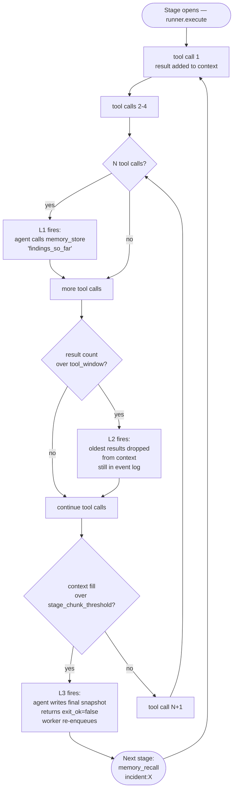

# Capabilities — what the zombie has, what the platform guarantees

> Parent: [`ARCHITECHTURE.md`](../ARCHITECHTURE.md)

A zombie's capabilities split into two layers: what the language model is told it can do (a soft layer the model can ignore or get wrong), and what the platform actually enforces (a hard layer the model cannot escape from inside the sandbox). Both matter; the second is what makes the first safe.

---

## 1. Reasoning + tool inventory (declared in the zombie's own files)

| File | What it carries | Enforced by |
|---|---|---|
| `SKILL.md` | Natural-language reasoning prompt: how to think, what's safe, what to gather, when to ask for approval. Free-form prose. | The language model reading its own prompt — soft enforcement only. The model can drift; the platform-level guarantees below contain the consequences. |
| `TRIGGER.md` (or merged frontmatter under `x-usezombie:` in a single SKILL.md file) | The `tools:` list, `credentials:` list, `network.allow:` list, `budget:` caps, `trigger.type:` (webhook / chat / cron), and `context:` budget knobs | Code-enforced at the executor sandbox boundary — the language model cannot escape these |

The split matters. `SKILL.md` is *advisory* — the model reads it and tries to comply. `TRIGGER.md` is *binding* — the executor refuses tool calls that would violate it, regardless of what the model wants.

---

## 2. The platform tools the zombie can call

These are the tool primitives NullClaw exposes. The zombie's `tools:` allowlist gates which of them are reachable for a given zombie.

| Tool | Purpose | Visible to the zombie's agent |
|---|---|---|
| `http_request` | GET / POST to allow-listed hosts. Placeholders like `${secrets.NAME.FIELD}` are substituted at the tool bridge after sandbox entry. | The agent sees placeholders only; it never sees raw secret bytes. |
| `memory_store` / `memory_recall` | Durable scratchpad keyed by string. Survives stage boundaries and full restart. The "where I am" snapshot mechanism. | Yes — the agent reads and writes. |
| `cron_add` / `cron_list` / `cron_remove` | Self-schedule future invocations. Each fire arrives as a synthetic event with `actor=cron:<schedule>`. | Yes. |
| `shell` (future, gated) | Read-only commands like `docker ps`, `kubectl get`. Not in v1 platform-ops. | Yes (when wired). |

---

## 3. Platform-level guarantees (the substrate that wraps every tool call)

| Capability | What it does | Owner spec |
|---|---|---|
| Worker control stream | A watcher thread on `zombie:control` claims new zombies, spawns per-zombie threads, and propagates kill within milliseconds (not on the 5-second `XREADGROUP` cycle). | Worker substrate (M40) |
| Per-execution policy | Each `executor.createExecution` carries `secrets_map`, `network_policy`, `tools` list, and `context` knobs. The tool bridge substitutes secrets at the sandbox boundary. | Context Layering (M41) |
| Event stream + history | Every steer / webhook / cron event lands on `zombie:{id}:events` with actor provenance. `core.zombie_events` row is `INSERT`ed at receive, `UPDATE`d at completion. | Streaming substrate (M42) |
| Webhook ingest (GitHub Actions in v1) | The HTTP receiver verifies the hash-based-message-authentication signature, normalises the payload, and writes a synthetic event with `actor=webhook:github`. | Webhook ingest (M43) |
| Credential vault | Stores opaque-JSON-object credentials, encrypted with a tenant-scoped data key sealed by the cloud key-management-service. The tool bridge substitutes at sandbox entry. | Vault (M45) |
| Provider config (BYOK) | Per-tenant choice between platform-managed inference and Bring Your Own Key. Lives in `core.tenant_providers`; the worker resolves it on every event. See [`billing_and_byok.md`](./billing_and_byok.md). | BYOK Provider (M48) |
| Approval gating | Risky actions block until a human clicks Approve in the dashboard or a Slack DM. The state machine survives worker restarts. | Approval inbox (M47) |
| Budget caps | Daily and monthly dollar hard caps; further runs are blocked at the first trip. Configured per-zombie in `TRIGGER.md` / `x-usezombie.budget`. | Already enforced via the M37 sample shape |
| Per-stage context lifecycle | Rolling tool-result window, memory-store nudge, stage chunking, and continuation events. See §4. | Context Layering (M41) |

---

## 4. Context lifecycle — keeping a long incident reasoning past the model's working-memory limit

Every zombie reasoning loop lives inside a single `runner.execute` call. As the agent makes tool calls, each result lands in the language model's context window. On a long-running incident (thirty-plus tool calls), this can exhaust the window. The platform layers three independent mechanisms — defence in depth, not override — to keep the zombie reasoning past the limit.

### The three knobs

```yaml
# In the zombie's SKILL.md frontmatter under x-usezombie:
x-usezombie:
  context:
    tool_window: auto              # rolling tool-result window size
    memory_checkpoint_every: 5     # call memory_store every N tool calls
    stage_chunk_threshold: 0.75    # % context fill that triggers chunking
    context_cap_tokens: 200000     # the active model's context window
                                    # (resolved at install time from the
                                    #  model-caps endpoint — see user_flow.md
                                    #  §8.7 and billing_and_byok.md)
```

### How the three layers compose (defence-in-depth, not override)



### What each layer catches

- **Layer 1 — `memory_checkpoint_every`.** Runs periodically as the agent works. Forces the agent to write a durable snapshot of "what I've learned so far" via `memory_store` every N tool calls. Cheap and always safe — even if subsequent layers drop context, the snapshot survives.
- **Layer 2 — `tool_window`.** Runs continuously. Bounds context growth by dropping the oldest tool results once the count exceeds the cap. Old results stay in `core.zombie_events`; they just leave the active language-model context.
- **Layer 3 — `stage_chunk_threshold`.** The failsafe. When context fill exceeds the threshold (a percentage of the active model's context cap), the agent writes a final snapshot, returns `{exit_ok: false, content: "needs continuation", checkpoint_id: ...}`, and the worker re-enqueues the same incident as a synthetic event with `actor=continuation`. The next stage starts fresh and immediately calls `memory_recall` to load the snapshot.

The order is failure-mode escalation: Layer 1 keeps your work safe, Layer 2 keeps your context bounded, Layer 3 saves the incident from collapse. They never conflict.

### Defaults — the user shouldn't have to do token math

The runtime ships with model-tier-aware defaults the user inherits without any configuration:

- `memory_checkpoint_every: 5` and `stage_chunk_threshold: 0.75` for every model — checkpoint cadence and chunk-trigger fraction don't meaningfully change with context size.
- `tool_window: auto` resolves at install time based on the active model's context cap: **30** when the cap is at least one million tokens, **20** for caps between two-hundred-thousand and three-hundred-thousand tokens, **10** for caps at or below two-hundred-thousand tokens.

The model's context cap is **not** baked into the runtime. It's resolved at install time (platform-managed posture) or at provider-set time (Bring Your Own Key posture) from the model-caps endpoint. See [`user_flow.md`](./user_flow.md) §8.7 and [`billing_and_byok.md`](./billing_and_byok.md).

### When a user does want to override (rare)

| Goal | What to change | How to think about it |
|---|---|---|
| "My zombie loses important findings mid-incident" | `memory_checkpoint_every: 3` | Checkpoint more often. Cheap. Always safe. |
| "My zombie hits context limits and chunks too aggressively" | `tool_window: 10` | Drop old results sooner so newer stuff fits. May lose context recency. |
| "My zombie chunks too late and produces partial diagnoses" | `stage_chunk_threshold: 0.6` | Chunk earlier. More handoffs but less risk of being cut off mid-thought. |
| "I'm on Kimi 2.6 (256k) and incidents are big" | `tool_window: 8` + `memory_checkpoint_every: 3` | Smaller windows + more checkpoints. Standard tight-context discipline. |

### The 80/20 rule

Eighty percent of users use the defaults forever and never see context errors. Twenty percent who run very deep incidents tweak `tool_window` once and forget. Almost nobody touches `stage_chunk_threshold`.

---

## 5. What the platform never does

- Never logs raw secret bytes
- Never echoes secrets in the agent's context
- Never persists secrets in `core.zombie_events`
- Never lets the agent reach a host outside its `network.allow` list
- Never lets the agent exceed its `budget` caps without trip-blocking
