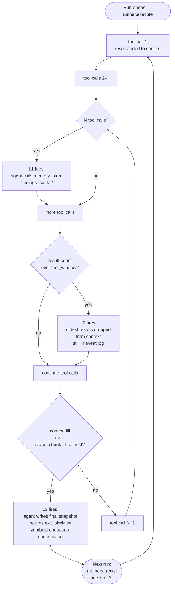

# Capabilities — what the agent has, what the platform guarantees

> Parent: [`README.md`](./README.md)
>
> **Scope:** the platform *guarantees* below are binding and unchanged by the M80_002 cutover. The *mechanism* now runs on the split — `zombied` (control plane) assigns work + resolves policy on `lease`; the host-resident `zombie-runner`'s sandboxed child enforces the hard layer. See [`runner_fleet.md`](./runner_fleet.md) and [`data_flow.md`](./data_flow.md).

An agent's capabilities split into two layers: what the language model is told it can do (a soft layer the model can ignore or get wrong), and what the platform actually enforces (a hard layer the model cannot escape from inside the sandbox). Both matter; the second is what makes the first safe.

---

## 1. Reasoning + tool inventory (declared in the agent's own files)

| File | What it carries | Enforced by |
|---|---|---|
| `SKILL.md` | Natural-language reasoning prompt: how to think, what's safe, what to gather, when to ask for approval. Free-form prose. | The language model reading its own prompt — soft enforcement only. The model can drift; the platform-level guarantees below contain the consequences. |
| `TRIGGER.md` | The `tools:` list, `credentials:` list, `network.allow:` list, `budget:` caps, `trigger.type:` (`webhook` / `api` / `cron` / `chain`), and `context:` budget knobs | Code-enforced inside the runner's sandboxed child — the language model cannot escape these |

The split matters. `SKILL.md` is *advisory* — the model reads it and tries to comply. `TRIGGER.md` is *binding* — the runner's sandboxed child refuses tool calls that would violate it, regardless of what the model wants.

### 1.1 `trigger.type` vs `event_type` — orthogonal fields, common confusion

These are two different fields on two different tables. Mixing them up is the most common source of new-contributor confusion in this area:

| Field | Where it lives | Values | What it tags |
|---|---|---|---|
| `trigger.type` | `TRIGGER.md` frontmatter (static config) | `webhook` / `api` / `cron` / `chain` | **How an agent gets triggered** — the wiring at install time. |
| `event_type` | `core.zombie_events` column (per delivery) | `chat` / `webhook` / `cron` / `continuation` | **What an individual event on the stream is** — the runtime label per delivery. |

A `trigger.type: api` agent typically receives `event_type: chat` events from the steer/chat API. A `trigger.type: webhook` agent receives `event_type: webhook`. A continuation `zombied` enqueues under context chunking produces `event_type: continuation` regardless of the original `trigger.type`. The two fields are orthogonal — never the same value, never the same table.

Source of truth: `src/zombie/config_helpers.zig` (`parseZombieTrigger`) for `trigger.type`; `src/lib/contract/event_envelope.zig` (`EventType`) for `event_type`.

---

## 2. The platform tools the agent can call

These are the tool primitives NullClaw exposes. The agent's `tools:` allowlist gates which of them are reachable for a given agent.

| Tool | Purpose | Visible to the agent (host) |
|---|---|---|
| `http_request` | GET / POST to allow-listed hosts. Placeholders like `${secrets.NAME.FIELD}` are substituted at the tool bridge after sandbox entry. | The agent sees placeholders only; it never sees raw secret bytes. |
| `memory_store` / `memory_recall` | Durable scratchpad keyed by string. Survives run boundaries and full restart. The "where I am" snapshot mechanism. | Yes — the agent reads and writes. |
| `cron_add` / `cron_list` / `cron_remove` | Self-schedule future invocations. Each fire arrives as a synthetic event with `actor=cron:<schedule>`. | Yes. |
| `shell` (gated) | Read-only commands like `docker ps`, `kubectl get`. Not part of the initial platform-ops surface. | Yes, when explicitly enabled. |

---

## 3. Platform-level guarantees (the substrate that wraps every tool call)

| Capability | What it does | Primary owner |
|---|---|---|
| Work assignment + kill | `zombied` assigns the next event on `lease` (atomic affinity claim + monotonic fencing token; status/config resolved fresh from Postgres per lease), and propagates kill via heartbeat-carried lease revocation. | zombied control plane |
| Per-lease policy | Each `lease` reply carries an `ExecutionPolicy` — `secrets_map`, `network_policy`, `tools` list, and `context` knobs. The tool bridge substitutes secrets inside the runner's sandboxed child. `network_policy` is `deny_all` (no egress) or network-enabled, where egress is constrained to an operator-declared host allowlist (see [`runner_fleet.md` §Egress model](./runner_fleet.md)). | Lease ExecutionPolicy |
| Event stream + history | Every steer / webhook / cron event lands on `zombie:{id}:events` with actor provenance. `core.zombie_events` rows are opened at receive and closed at completion. | Event ingest + history path |
| Webhook ingest (GitHub Actions in v1) | The HTTP receiver verifies the hash-based-message-authentication signature, normalises the payload, and writes a synthetic event with `actor=webhook:github`. | Webhook receiver |
| Credential vault | Stores opaque-JSON-object credentials, encrypted with a tenant-scoped data key sealed by the cloud key-management-service. The tool bridge substitutes at sandbox entry. | Vault + secret resolution |
| Provider config (self-managed) | Per-tenant posture choice between platform-managed inference and self-managed provider key. Tenant-scoped `core.tenant_providers` row carries `mode / provider / model / context_cap_tokens / credential_ref`; the user-named credential pointed to by `credential_ref` carries `{provider, api_key, model}`. The api_key crosses one boundary cleanly (vault → resolver → lease `ExecutionPolicy` → runner's sandboxed child → outbound HTTPS) and never appears in any user-facing surface. See [`billing_and_provider_keys.md`](./billing_and_provider_keys.md) §8.2. | Provider resolution path |
| Approval gating | Risky actions block until a human clicks Approve in the dashboard or a Slack DM. The state machine survives control-plane and runner restarts (it is durable in Postgres, gated at `lease`). | Approval workflow |
| Budget caps | Daily and monthly dollar hard caps; further runs are blocked at the first trip. Configured per-agent in `TRIGGER.md`. | Billing gate |
| Per-run context lifecycle | Rolling tool-result window, memory-store nudge, run chunking, and continuation events. See §4. | Context lifecycle |

---

## 4. Context lifecycle — keeping a long incident reasoning past the model's working-memory limit

Every agent reasoning loop lives inside a single `runner.execute` call. As the agent makes tool calls, each result lands in the language model's context window. On a long-running incident (thirty-plus tool calls), this can exhaust the window. The platform layers three independent mechanisms — defence in depth, not override — to keep the agent reasoning past the limit.

### The three knobs

```yaml
# In the agent's TRIGGER.md frontmatter under x-usezombie:
x-usezombie:
  model: accounts/fireworks/models/kimi-k2.6   # opaque pass-through; the control
                                                # plane forwards it into the lease
                                                # ExecutionPolicy (the engine's
                                                # ContextBudget.model). Empty
                                                # string ("") = self-managed overlay
                                                # sentinel: zombied resolves
                                                # the real model from
                                                # core.tenant_providers at
                                                # lease time.
  context:
    tool_window: auto              # rolling tool-result window size; "auto"
                                    # (bare YAML string) and 0 are equivalent
                                    # — both mean "let the runtime pick".
    memory_checkpoint_every: 5     # call memory_store every N tool calls
    stage_chunk_threshold: 0.75    # % context fill that triggers chunking
    context_cap_tokens: 200000     # the active model's context window
                                    # (resolved at install time from the
                                    #  model-caps endpoint — see user_flow.md
                                    #  §8.7 and billing_and_provider_keys.md). 0 is the
                                    # self-managed overlay sentinel — same shape as
                                    # the empty `model` value above.
```

**Wire-shape parser status.** Both `x-usezombie.model` and the four
`x-usezombie.context.*` knobs are parsed into `ZombieConfig`, carried in the
lease `ExecutionPolicy`, and applied by the engine's `ContextBudget` on every
run. Operator overrides take effect; absent or zero fields fall through to
the runtime defaults below via `applyContextDefaults`.

### How the three layers compose (defence-in-depth, not override)



### What each layer catches

- **Layer 1 — `memory_checkpoint_every`.** Runs periodically as the agent works. Forces the agent to write a durable snapshot of "what I've learned so far" via `memory_store` every N tool calls. Cheap and always safe — even if subsequent layers drop context, the snapshot survives.
- **Layer 2 — `tool_window`.** Runs continuously. Bounds context growth by dropping the oldest tool results once the count exceeds the cap. Old results stay in `core.zombie_events`; they just leave the active language-model context.
- **Layer 3 — `stage_chunk_threshold`.** The failsafe. When context fill exceeds the threshold (a percentage of the active model's context cap), the agent writes a final snapshot and reports `{outcome: continue, checkpoint_id: ...}`; `zombied` persists the checkpoint and enqueues a continuation event chained by `resumes_event_id` (`actor=continuation:<original_actor>`). The next lease starts a fresh run and immediately calls `memory_recall` to load the snapshot — possibly on a different runner.

The order is failure-mode escalation: Layer 1 keeps your work safe, Layer 2 keeps your context bounded, Layer 3 saves the chain from collapse. They never conflict.

### The chain-cap escape hatch — `chunk_chain_escalate_human`

A pathological agent can in principle chunk forever. The runtime caps each chain at **10 continuations**. On the 11th attempt: `zombied` stops enqueueing continuations, writes `failure_label = chunk_chain_escalate_human` on the originating event row (visible via `zombiectl events <zombie_id>`, the dashboard Events tab, and the terminal `event_complete` SSE frame). Only this chain is forfeit; the agent itself stays alive and processes future webhooks, cron fires, and steers as fresh chains with their own 10-chunk budgets.

Notification today is silent — observability only. Resume by steering a fresh message that calls `memory_recall` against whatever snapshot key the agent's own SKILL.md prose chose (the runtime never invents the key shape).

### Defaults — the user shouldn't have to do token math

The runtime ships with model-tier-aware defaults the user inherits without any configuration:

- `memory_checkpoint_every: 5` and `stage_chunk_threshold: 0.75` for every model — checkpoint cadence and chunk-trigger fraction don't meaningfully change with context size.
- `tool_window: auto` resolves at install time based on the active model's context cap: **30** when the cap is at least one million tokens, **20** for caps between two-hundred-thousand and three-hundred-thousand tokens, **10** for caps at or below two-hundred-thousand tokens.

The model's context cap is **not** baked into the runtime. It's resolved at install time (platform-managed posture) or at provider-set time (self-managed provider key posture) from the model-caps endpoint. See [`user_flow.md`](./user_flow.md) §8.7 and [`billing_and_provider_keys.md`](./billing_and_provider_keys.md).

### When a user does want to override (rare)

| Goal | What to change | How to think about it |
|---|---|---|
| "My agent loses important findings mid-incident" | `memory_checkpoint_every: 3` | Checkpoint more often. Cheap. Always safe. |
| "My agent hits context limits and chunks too aggressively" | `tool_window: 10` | Drop old results sooner so newer stuff fits. May lose context recency. |
| "My agent chunks too late and produces partial diagnoses" | `stage_chunk_threshold: 0.6` | Chunk earlier. More handoffs but less risk of being cut off mid-thought. |
| "I'm on Kimi 2.6 (256k) and incidents are big" | `tool_window: 8` + `memory_checkpoint_every: 3` | Smaller windows + more checkpoints. Standard tight-context discipline. |

### The 80/20 rule

Eighty percent of users use the defaults forever and never see context errors. Twenty percent who run very deep incidents tweak `tool_window` once and forget. Almost nobody touches `stage_chunk_threshold`.

---

## 5. What the platform never does

- Never logs raw secret bytes
- Never echoes secrets in the agent's context
- Never persists secrets in `core.zombie_events`
- Never lets the agent reach a host outside its `network.allow` list
- Never lets the agent exceed its `budget` caps without trip-blocking
