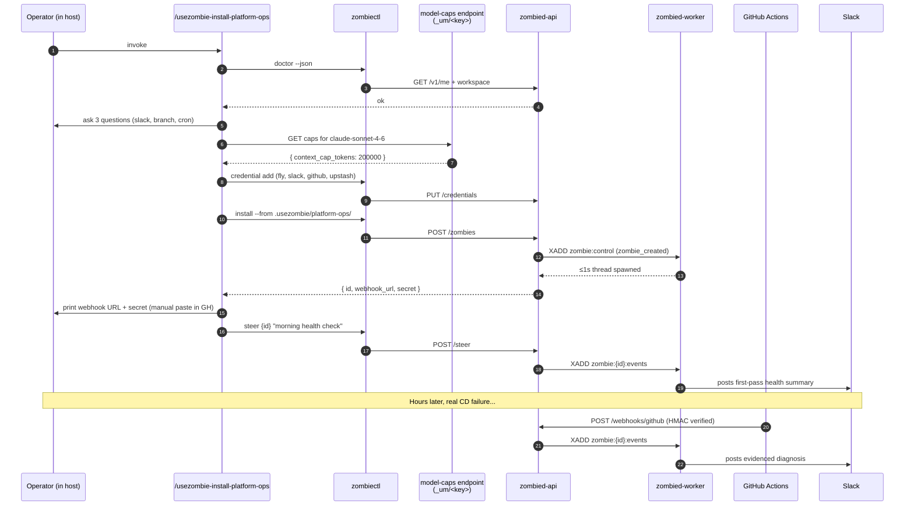

# Scenario 01 — Default install, platform-managed key, free tier

**Persona:** First-time operator. Has a GitHub repo with a CD pipeline. Wants a zombie that wakes on deploy failures and posts diagnoses to Slack. No own LLM key, no paid plan yet.

**Outcome under test:** From cold start (`zombiectl` not installed) to the first webhook-driven Slack diagnosis in under 10 minutes, with zero manual JSON-editing.

This scenario is the wedge demo. If this path doesn't work end-to-end, nothing else matters.



---

## 1. Cold install (operator's laptop)

The operator is already inside their host (Claude Code, Amp, Codex CLI, or OpenCode). They invoke:

```
/usezombie-install-platform-ops
```

The skill's first action is host-neutral: it reads its own `variables:` frontmatter and asks at most four questions through whatever question primitive the host provides (or falls back to inline natural-language Q&A on hosts that have none).

### 1.1 Skill steps

1. **Doctor preflight.** `zombiectl doctor --json` runs. If the CLI isn't installed, the skill prints the one-line install command and stops. If it's installed but unauthenticated, the skill prints `zombiectl auth login` and stops. Doctor is the only sanctioned readiness check; the skill never duplicates the logic.
2. **Repo detection.** The skill reads `.github/workflows/*.yml`, `fly.toml`, `Dockerfile`, `pyproject.toml`, and `package.json`. If no GH workflow is present, it bails clearly: "GitHub Actions detection required — non-GH CI is in a future version."
3. **Three gating questions.** `slack_channel`, `prod_branch_glob`, `cron_opt_in`. The skill never asks about model or BYOK in this scenario — both default to platform-managed.
4. **Tool credentials.** For each of `fly`, `slack`, `github`, optional `upstash`:
   - try `op read 'op://Personal/<name>/api-token'`
   - else read env `ZOMBIE_CRED_<NAME>_API_TOKEN`
   - else interactive masked prompt
   then `zombiectl credential add <name> --data '<opaque-json>'` per credential.
5. **Model-cap lookup (one-shot at install time).** The skill GETs:
   ```
   GET https://api.usezombie.com/_um/da5b6b3810543fe108d816ee972e4ff8/model-caps.json
   ```
   The endpoint returns a small JSON catalog (model name → context_cap_tokens, default tool_window, default checkpoint cadence). The skill picks the row for the platform-default model (e.g. `claude-sonnet-4-6`) and pins the cap into the generated frontmatter.

   The URL is **deliberately cryptic** — the random `/_um/<key>/` prefix is unguessable to random scanners and reduces the DDoS surface against a hot, unauthenticated lookup. The path key ships hard-coded in `zombiectl` and the install-skill; rotation is a coordinated CLI + skill release on a quarterly cadence. Cloudflare in front, aggressive caching (`Cache-Control: public, max-age=86400, immutable` per release), per-IP rate limit beyond that. Adding a new model is a row in the table, not a usezombie release. See [`scenarios/02_byok.md`](./02_byok.md) §5 for the full endpoint shape.
6. **Frontmatter generation.** The skill writes `.usezombie/platform-ops/SKILL.md` substituting variables and the cap. Refuses to overwrite without `--force`.
   ```yaml
   ---
   name: platform-ops
   x-usezombie:
     trigger:
       types: [chat, webhook:github, cron]
       cron: "*/30 * * * *"          # only if cron_opt_in
     model: claude-sonnet-4-6
     context:
       context_cap_tokens: 200000   # ← from /_um/da5b6b3810543fe108d816ee972e4ff8/model-caps.json
       tool_window: auto
       memory_checkpoint_every: 5
       stage_chunk_threshold: 0.75
     credentials: [fly, slack, github, upstash]
     network:
       allow:
         - api.github.com
         - api.fly.io
         - "*.upstash.io"
         - slack.com
     budget:
       daily_usd: 5
       monthly_usd: 100
   ---
   <SKILL.md prose body — operational behaviour in plain English>
   ```
7. **Install.** `zombiectl install --from .usezombie/platform-ops/`. The CLI POSTs `{name, config_json, source_markdown}`; the API persists the row, atomically `XGROUP CREATE`s the events stream and `XADD`s `zombie:control` (Invariant 1). Worker watcher claims within ≤1s, spawns the per-zombie thread, no worker restart.
8. **Webhook URL + secret.** API returns `{zombie_id, webhook_url, webhook_secret}`. The skill prints them inline:
   ```
   Add this webhook to your repo:
     URL:    https://api.usezombie.com/v1/.../webhooks/github?zombie_id={id}
     Secret: <one-time HMAC-SHA256 secret — copy now, won't be shown again>
     Events: workflow_run
   ```
   Manual step the skill can't automate without a GitHub App — explicitly called out, takes ~30 seconds in the GH UI. (A GitHub App that auto-configures the webhook is a follow-up; v2 keeps the manual step.)
9. **First steer (smoke test).** The skill runs `zombiectl steer {id} "morning health check"` and streams the response inline.

### 1.2 What the first steer actually returns

The "morning health check" is **not** a canned ack. It enters the same reasoning loop as any other event — actor `steer:<user>`, type `chat`, into `zombie:{id}:events`. The SKILL.md prose body teaches the agent to handle this input by:

- fetching the latest GH Actions runs on `prod_branch_glob`
- fetching Fly app status / last deploy
- fetching Upstash Redis ping if configured
- posting a one-line "all healthy at HH:MM Z" or a real diagnosis to Slack

So the operator sees a **real first-pass evidence sweep**, not a "hello world." This is the install-time proof that everything (creds, network, executor, slack) is wired correctly. If any of the four `http_request` calls fails, the operator sees the failure inline and can fix it before any real production webhook arrives.

The webhook-driven path (next section) and this steer path are the **same reasoning loop**. The asymmetry is purely in the input: the webhook brings a `workflow_run` payload; the steer brings the operator's text. The SKILL.md prose decides what to do with whichever input arrives. There is no "install-time mode" vs. "production mode" branch — the runtime never sees that distinction.

---

## 2. First production webhook fires

A few hours later, the operator pushes a commit. CD fails on a Fly OOM. GitHub Actions fires `workflow_run.conclusion=failure`. The webhook receiver:

1. Verifies HMAC-SHA256 against the per-zombie secret stored at install.
2. Normalises payload → synthetic event envelope (actor=`webhook:github`, type=`webhook`).
3. `XADD zombie:{id}:events *` with the envelope.
4. Returns 202 to GitHub.

The per-zombie thread unblocks from `XREADGROUP` within ≤5s. `processEvent`:

1. INSERT `core.zombie_events` (`status='received'`, `actor='webhook:github'`, `request_json=<normalised payload>`).
2. PUBLISH `zombie:{id}:activity` (`event_received`).
3. **Balance gate fires.** Tenant is on Free plan, balance > 0 → pass. (See `scenarios/03_balance_gate_paid.md` for the depleted case.)
4. Approval gate (Free tier, no destructive tools) → pass.
5. Resolve `secrets_map` from vault for `fly`, `slack`, `github`, `upstash`.
6. **Resolve provider config:** `tenant_provider.resolveActiveProvider(tenant_id)` returns `{mode: "platform", provider: "anthropic", api_key: <platform_key>, model: "claude-sonnet-4-6"}`. The cap from frontmatter (`200_000`) wins because `mode=platform` (the worker prefers the install-time pinned cap when available; see §11).
7. `executor.createExecution(workspace_path, {network_policy, tools, secrets_map, context: {context_cap_tokens=200000, tool_window=auto, memory_checkpoint_every=5, stage_chunk_threshold=0.75}, model: "claude-sonnet-4-6"})`.
8. `executor.startStage(execution_id, message=<webhook payload as text>)`.

NullClaw runs the SKILL.md prose against the webhook payload. The agent makes its calls — `http_request GET .../actions/runs/{run_id}/logs`, `http_request GET ${fly.host}/v1/apps/{app}/logs`, etc. — credentials substituted at the tool bridge after sandbox entry. Posts a remediation diagnosis to Slack.

`StageResult{content, tokens=1840, wall_ms=8210, ttft_ms=320, exit_ok=true}` returns over the Unix socket.

Worker:
- UPDATE `core.zombie_events` (`status='processed'`, `response_text`, `completed_at`).
- INSERT `zombie_execution_telemetry` (immutable; `event_id UNIQUE`; `token_count=1840`, `credit_deducted_cents=4`, `plan_tier='free'`).
- UPSERT `core.zombie_sessions` (advance bookmark, clear execution handle).
- PUBLISH `event_complete`.
- XACK.

The operator reads the diagnosis in Slack; later opens `zombiectl events {id}` to see the full evidence trail.

---

## 3. What this scenario proves

- The install-skill is the only place where repo detection, ≤4 question discipline, and credential resolution live. The runtime stays prompt-driven.
- The model→cap lookup is **one external GET per install**, pinned into frontmatter. Adding a new model never requires a usezombie release.
- The first steer and the first production webhook hit the **same reasoning loop**. Asymmetry would mean a code-path the SKILL.md author can't reason about — the architecture forbids it.
- Free-tier credit deduction goes through the same `zombie_execution_telemetry` insert as any paid plan. Plan tier is metadata on the row, not a separate code path.

---

## 4. What is NOT in this scenario

- No BYOK. See `scenarios/02_byok.md`.
- No balance trip. See `scenarios/03_balance_gate_paid.md`.
- No customer-facing statuspage / external comms. That's the bastion direction (architecture §13).
- No GitHub App for auto-webhook config. Manual step in v2.
