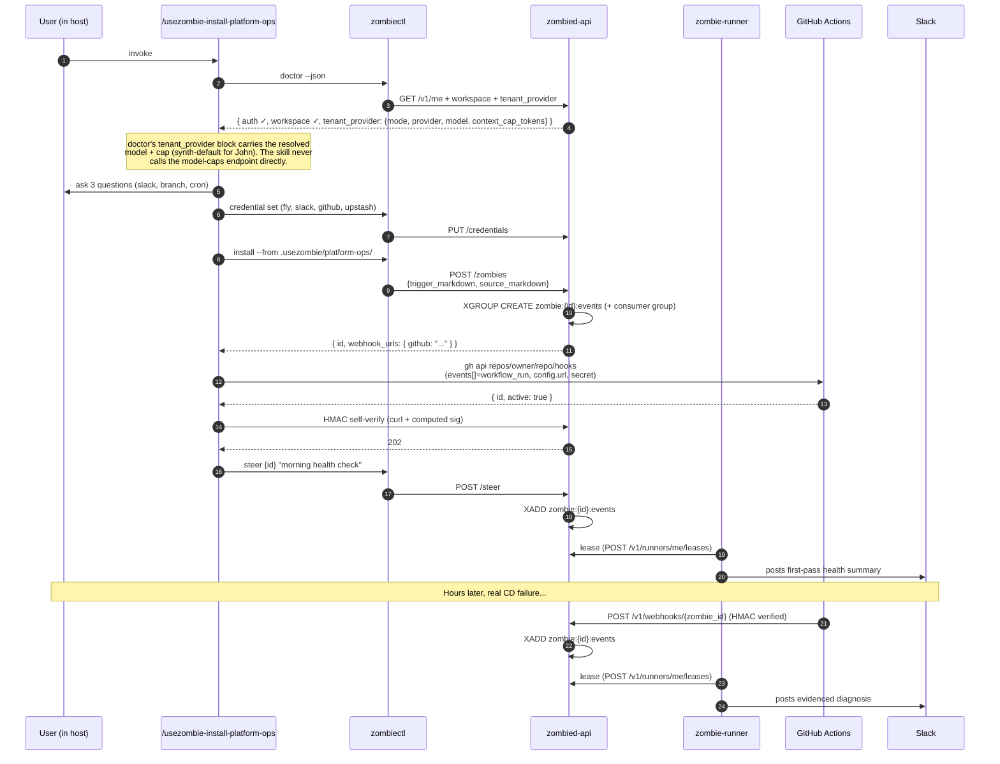

# Scenario 01 — Default install, platform-managed key

**Persona — John Doe.** First-time user. Has a GitHub repo with a CD pipeline. Wants a zombie that wakes on deploy failures and posts diagnoses to Slack. No own LLM key. Brand-new tenant — running on the one-time starter credit grant. Tenant carries no `core.tenant_providers` row — the resolver synthesises the platform default for him.

> **Rate snapshot.** Through 2026-07-31 UTC every event and every stage execution is free (`FREE_TRIAL_STAGE_NANOS = 0`); the gate and telemetry rows still run but `credit_deducted_nanos = 0`. After the cutoff, the rates in `src/state/tenant_billing.zig` apply. Cent-and-token arithmetic in steps 4–8 below was authored against an earlier rate table — the *flow* is unchanged, but every deduction is 0 during the trial. **For the live, customer-facing rate table, always consult [`https://usezombie.com/#pricing`](https://usezombie.com/#pricing).** The architecture description here covers shape and behaviour; numbers change. Code-level pin: [`../billing_and_provider_keys.md`](../billing_and_provider_keys.md) §2.3.

> **Important framing.** There is no separate "Free tier" in v2.0. Every tenant has the same credit-pool billing model and the same cost functions; new tenants just start with a one-time grant. John in this scenario, John in Scenario 02 (after he flips to self-managed), and any future tenant who tops up via support all run through identical code paths and identical billing math. "Free" is a marketing word for "starting credits not yet exhausted," not a code-path concept. See [`../billing_and_provider_keys.md`](../billing_and_provider_keys.md) §2.

**Outcome under test:** From cold start (`zombiectl` not installed) to the first webhook-driven Slack diagnosis in under 10 minutes, with zero manual JSON-editing.

This scenario is the wedge demo. If this path doesn't work end-to-end, nothing else matters.



---

## 1. Cold install (user's laptop)

The user is already inside their host (Claude Code, Amp, Codex CLI, or OpenCode). They invoke:

```
/usezombie-install-platform-ops
```

The skill's first action is host-neutral: it reads its own `variables:` frontmatter and asks at most four questions through whatever question primitive the host provides (or falls back to inline natural-language Q&A on hosts that have none).

### 1.1 Skill steps

1. **Preconditions.** The skill runs `which zombiectl && which gh && zombiectl doctor --json`. Any miss → it prints the exact one-liner to fix (`npm install -g @usezombie/zombiectl`, `npx skills add usezombie/usezombie`, `zombiectl auth login`, or `gh auth login -s admin:repo_hook`) and stops. Doctor is the only sanctioned readiness check; the skill never duplicates the logic.
2. **Repo detection.** The skill reads `.github/workflows/*.yml`, `fly.toml`, `Dockerfile`, `pyproject.toml`, and `package.json`. If no GH workflow is present, it bails clearly: "GitHub Actions detection required — non-GH CI is in a future version." It also runs `gh repo view --json nameWithOwner -q .nameWithOwner` to capture the upstream repo for step 9.
3. **Three gating questions.** `slack_channel`, `prod_branch_glob`, `cron_schedule` (blank to skip). The skill never asks about model or self-managed in this scenario — both default to platform-managed.
4. **Tool credentials.** For each of `fly`, `slack`, `github`, optional `upstash`:
   - try `op read 'op://Personal/<name>/api-token'`
   - else read env `ZOMBIE_CRED_<NAME>_API_TOKEN`
   - else interactive masked prompt
   then `zombiectl credential set <name> --data @-` per credential (upsert; same surface used for the self-managed credential in Scenario 02). JSON is piped on stdin so secret bytes do not appear in shell history or process argv.

   For the `github` credential the body is `{ "api_token": "<PAT>", "webhook_secret": "<base64 32 bytes>" }`. The skill generates `webhook_secret` locally via `openssl rand -base64 32` on first install for the workspace; subsequent installs skip-if-exists per M45's upsert default (one secret per workspace, all GitHub-sourced zombies share it; rotation rotates everywhere).
5. **Model and cap from doctor.** The skill reads `zombiectl doctor --json`'s `tenant_provider` block, which carries the resolved model + cap regardless of posture. For John (no row): the synthesised platform default — `model: "accounts/fireworks/models/kimi-k2.6"`, `context_cap_tokens: 256000`, `provider: "fireworks"`. The platform-side resolver hardcodes the synth-default values; doctor never has to call the model-caps endpoint at runtime.

   The model-caps endpoint at `https://api.usezombie.com/_um/da5b6b3810543fe108d816ee972e4ff8/model-caps.json` is the source of truth, but it is consumed by the platform-side resolver (for the synth-default constants) and by `zombiectl tenant provider set` (Scenario 02), **not** by the install-skill directly. The skill stays simple: read doctor, branch on mode, write resolved-or-sentinel into frontmatter. See [`../billing_and_provider_keys.md`](../billing_and_provider_keys.md) §9 for the endpoint design.
6. **File generation.** The skill writes `.usezombie/platform-ops/SKILL.md` and `.usezombie/platform-ops/TRIGGER.md` substituting variables and the cap. Refuses to overwrite without `--force`.
   ```yaml
   ---
   name: platform-ops
   x-usezombie:
     triggers:
       - type: webhook
         source: github
         events: ["workflow_run"]
         signature:
           secret_ref: github
           header: x-hub-signature-256
           prefix: "sha256="
       - type: cron                 # omitted entirely when cron_schedule is blank
         schedule: "*/30 * * * *"
     model: accounts/fireworks/models/kimi-k2.6
     context:
       context_cap_tokens: 256000   # ← from /_um/da5b6b3810543fe108d816ee972e4ff8/model-caps.json
       tool_window: auto
       memory_checkpoint_every: 5
       stage_chunk_threshold: 0.75
     credentials: [fly, slack, github, upstash]
     network:
       allow:
         - api.github.com
         - api.fly.io
         - "*.upstash.io"
         - slack.com
     budget:
       daily_usd: 5
       monthly_usd: 100
   ---
   <SKILL.md prose body — operational behaviour in plain English>
   ```
7. **Install.** `zombiectl install --from .usezombie/platform-ops/ --json`. The CLI POSTs `{trigger_markdown, source_markdown}`; the API parses frontmatter server-side, derives `name` + `config_json`, persists the row, and atomically `XGROUP CREATE`s the `zombie:{id}:events` stream + consumer group before returning. No restart and no watcher thread (the `zombie:control` watcher was retired at the cutover): a later trigger `XADD`s to `zombie:{id}:events`, and the control plane hands that event to whichever `zombie-runner` leases next. The 201 response carries `{ zombie_id, name, status, webhook_urls: { github: "https://api.usezombie.com/v1/webhooks/{id}/github" } }`. The dashboard install form exercises the same wire shape.
8. **Parse rendered TRIGGER.md.** The skill reads its own freshly-written `.usezombie/platform-ops/TRIGGER.md`, extracts `triggers[]`, captures each webhook entry's `source` + `events[]` for the next step.
9. **Register webhook(s) on the provider via the user's local `gh`.** For each webhook trigger in `triggers[]`, the skill runs:
   ```bash
   gh api -X POST "repos/${GH_REPO}/hooks" \
     --field name=web --field active=true \
     --field 'events[]=workflow_run' \
     --field "config[url]=https://api.usezombie.com/v1/webhooks/{id}/github" \
     --field 'config[content_type]=json' \
     --field "config[secret]=${WEBHOOK_SECRET}"
   ```
   The user's `gh auth` does the work — the platform never holds the user's PAT for this step. Failure modes: `403`/`401` → skill prints `gh auth refresh -s admin:repo_hook` and stops; `404` → repo or token wrong, prints response verbatim and stops; `422 Hook already exists` → idempotent (skill `gh api repos/.../hooks`, matches on `config.url`, advances).
10. **Self-verify the webhook end-to-end.** The skill computes HMAC-SHA256 over a synthetic payload using the stored `webhook_secret`, curls the receiver with the signed payload + `X-GitHub-Event: workflow_run` + `X-Hub-Signature-256` headers. Expects 202. Anything else → prints response verbatim and stops *before* declaring success. The user never finds out hours later that HMAC is wrong.
11. **Post-install summary.** Prints zombie id, registered hook id per source, HMAC-verified status, and the credentials stored — no manual paste prose. No GitHub web UI step.
12. **First steer (smoke test).** The skill runs `zombiectl steer {id} "morning health check"` in batch mode and streams the response inline.

### 1.2 What the first steer actually returns

The "morning health check" is **not** a canned ack. It enters the same reasoning loop as any other event — actor `steer:<user>`, type `chat`, into `zombie:{id}:events`. The SKILL.md prose body teaches the agent to handle this input by:

- fetching the latest GH Actions runs on `prod_branch_glob`
- fetching Fly app status / last deploy
- fetching Upstash Redis ping if configured
- posting a one-line "all healthy at HH:MM Z" or a real diagnosis to Slack

So the user sees a **real first-pass evidence sweep**, not a "hello world." This is the install-time proof that everything (creds, network, sandbox, slack) is wired correctly. If any of the four `http_request` calls fails, the user sees the failure inline and can fix it before any real production webhook arrives.

The webhook-driven path (next section) and this steer path are the **same reasoning loop**. The asymmetry is purely in the input: the webhook brings a `workflow_run` payload; the steer brings the user's text. The SKILL.md prose decides what to do with whichever input arrives. There is no "install-time mode" vs. "production mode" branch — the runtime never sees that distinction.

---

## 2. First production webhook fires

A few hours later, the user pushes a commit. CD fails on a Fly OOM. GitHub Actions fires `workflow_run.conclusion=failure`. The webhook receiver:

1. Verifies HMAC-SHA256 against the workspace credential `github.webhook_secret` stored during install.
2. Normalises payload → synthetic event envelope (actor=`webhook:github`, type=`webhook`).
3. `XADD zombie:{id}:events *` with the envelope.
4. Returns 202 to GitHub.

A `zombie-runner` leases the event within ≤5s. The lease path (in `zombied`) walks the credit-pool gate path (the same code path that scenario 03 walks more deeply):

1. INSERT `core.zombie_events` (`status='received'`, `actor='webhook:github'`, `request_json=<normalised payload>`).
2. PUBLISH `zombie:{id}:activity` (`event_received`).
3. **Resolve provider posture.** `tenant_provider.resolveActiveProvider(tenant_id)` returns the synth-default for John (no row): `{mode: "platform", provider: "fireworks", api_key: <fetched from admin workspace vault via platform_llm_keys pointer>, model: "accounts/fireworks/models/kimi-k2.6", context_cap_tokens: 256000}`.
4. **Balance gate.** Estimate = `compute_receive_charge(.platform)` (1¢) + worst-case `compute_stage_charge(.platform, accounts/fireworks/models/kimi-k2.6, ESTIMATE_FLOOR, ESTIMATE_FLOOR)` (~2¢) = ~3¢. John has $10 starter (`balance_nanos=1000`); 1000 ≥ 3 → pass. (See [`./03_balance_gate.md`](./03_balance_gate.md) for the gate-trip case.)
5. **Receive deduct.** UPDATE `tenant_billing` SET `balance_nanos = 1000 - 1 = 999`. INSERT `zombie_execution_telemetry` (`event_id`, `posture='platform'`, `model='accounts/fireworks/models/kimi-k2.6'`, `charge_type='receive'`, `credit_deducted_cents=1`). One transaction.
6. Approval gate (no destructive tools wired in this zombie) → pass.
7. Resolve `secrets_map` from vault for `fly`, `slack`, `github`, `upstash`. The platform api_key is **not** in `secrets_map` — it travels separately from resolveActiveProvider's return value to the runner's inference call.
8. **Stage deduct (conservative estimate).** UPDATE `tenant_billing` SET `balance_nanos = 999 - 2 = 997`. INSERT `zombie_execution_telemetry` (`event_id`, `posture='platform'`, `model='accounts/fireworks/models/kimi-k2.6'`, `charge_type='stage'`, `credit_deducted_cents=2`, `token_count_input=NULL`, `token_count_output=NULL`). Same transaction shape.
9. `zombied` issues the lease with `policy = ExecutionPolicy{network_policy, tools, secrets_map, context: {context_cap_tokens: 256000, tool_window: auto, memory_checkpoint_every: 5, stage_chunk_threshold: 0.75, model: "accounts/fireworks/models/kimi-k2.6"}}`. The platform provider key (fetched from the admin workspace vault via the `platform_llm_keys` pointer) is resolved by `zombied` and used by the runner's NullClaw child for the inference call only — not carried in `secrets_map`.
10. The runner forks a sandboxed NullClaw child and runs the event (the webhook payload as the message).

NullClaw runs the SKILL.md prose against the webhook payload. The agent makes its calls — `http_request GET .../actions/runs/{run_id}/logs`, `http_request GET ${fly.host}/v1/apps/{app}/logs`, etc. — credentials substituted at the tool bridge after sandbox entry. Posts a remediation diagnosis to Slack.

`StageResult{content, token_count_input=820, token_count_output=1040, wall_ms=8210, ttft_ms=320, exit_ok=true}` returns over the Unix socket.

Worker:
- UPDATE `core.zombie_events` (`status='processed'`, `response_text`, `completed_at`).
- UPDATE `zombie_execution_telemetry` stage row (the one INSERTed at step 8) SET `token_count_input=820`, `token_count_output=1040`, `wall_ms=8210`. The `credit_deducted_nanos` column does NOT change — the conservative estimate at step 8 is the charge (v3 may add refund-on-actual; see [`../billing_and_provider_keys.md`](../billing_and_provider_keys.md) §3).
- UPSERT `core.zombie_sessions` (advance bookmark, clear execution handle).
- PUBLISH `event_complete`.
- XACK.

After this event: `balance_nanos = 997`. Two telemetry rows (`charge_type='receive'` + `charge_type='stage'`), both with `posture='platform'`. The user reads the diagnosis in Slack; later opens `zombiectl events {id}` (or the dashboard) to see the full evidence trail and the per-charge-type breakdown.

---

## 3. Terminal transcript — what John Doe sees

This is the verbatim end-to-end CLI experience. The skill drives most of it; John's only typed inputs are the three variable answers and the GitHub webhook paste.

### 3.1 Skill invocation through to first steer

```text
$ /usezombie-install-platform-ops

▸ Preconditions …
  zombiectl   ✓ on PATH
  gh          ✓ on PATH, scope admin:repo_hook present
  doctor      ✓ auth + workspace + tenant_provider OK
              tenant_provider: { mode: platform,
                provider: fireworks,
                model: accounts/fireworks/models/kimi-k2.6,
                context_cap_tokens: 256000 }
              billing: { free_trial: { active: true,
                ends_at_ms: 1785542400000 } }
              → Free until 2026-07-31 (UTC); stages charged 0 nanos.

▸ Detecting repo … github.com/john-doe/widgetly
  .github/workflows/deploy.yml present
  fly.toml present

▸ Three quick questions:
  Slack channel for diagnoses?     #platform-ops
  Production branch glob?          main
  Cron schedule (blank to skip)?   (blank)

▸ Resolving tool credentials (op → env → prompt fallback) …
  fly       ✓ via op
  slack     ✓ via op
  github    ✓ via env (ZOMBIE_CRED_GITHUB_API_TOKEN)
            ✓ generated webhook_secret locally (32 bytes, base64);
              stored in vault credential `github`, never re-displayed
  upstash   skipped (not detected)

▸ Writing .usezombie/platform-ops/SKILL.md, TRIGGER.md
   triggers: [ webhook:github events=[workflow_run] ]
   model: accounts/fireworks/models/kimi-k2.6
   context_cap_tokens: 256000     ← from doctor's tenant_provider block

▸ Installing …
  zombie_id   = zmb_01HX9N3K…
  webhook_urls = { github: https://api.usezombie.com/v1/webhooks/zmb_01HX9N3K…/github }

▸ Registering webhook on john-doe/widgetly via gh api …
  POST repos/john-doe/widgetly/hooks
       events=[workflow_run]
       config.url=https://api.usezombie.com/v1/webhooks/zmb_01HX9N3K…/github
       config.secret=$WEBHOOK_SECRET
  ✓ hook 482389123 registered, active=true

▸ Self-verifying webhook (HMAC-SHA256 + curl) …
  POST .../v1/webhooks/zmb_01HX9N3K…/github → 202

▸ Running first steer ("morning health check") …
  GH Actions runs on main: 12 in last 24h, all green
  Fly app widgetly-prod: healthy, last deploy 6h ago, 2 instances
  Posted to #platform-ops at 09:14 UTC.

✓ Setup complete. To steer manually:  zombiectl steer zmb_01HX9N3K… "<msg>"
  Webhook ready. Next failed workflow_run on john-doe/widgetly will
  wake the zombie automatically.
```

### 3.2 First production webhook fires (a few hours later)

```text
$ zombiectl events zmb_01HX9N3K…
EVENT_ID                 ACTOR             STATUS     STARTED              TOKENS  CREDIT
evt_01HX9P7M…           webhook:github    processed  2026-05-01T13:42:01  1840    4¢
evt_01HX9N4P…           steer:john        processed  2026-05-01T09:14:22  1610    4¢
```

John clicks into `evt_01HX9P7M…` in the dashboard and sees the agent's evidence trail — the `http_request` calls to GitHub run logs and Fly app status, the diagnosis posted to Slack. The credential names appear (`github`, `fly`, `slack`); their secret bytes do not.

### 3.3 Provider posture confirmed by `tenant provider get`

```text
$ zombiectl tenant provider get
Mode:                platform   (synthesised default — no explicit row)
Provider:            fireworks
Model:               accounts/fireworks/models/kimi-k2.6
Context cap tokens:  256000

ⓘ This is the platform default. To bring your own LLM key:
   op read 'op://<vault>/<item>/api_key' |
     jq -Rn '{provider:"fireworks", api_key: input, model:"accounts/fireworks/models/kimi-k2.6"}' |
     zombiectl credential set <name> --data @-
   zombiectl tenant provider set --credential <name>
```

No `core.tenant_providers` row exists for John's tenant; `tenant provider get` reads through the resolver and surfaces the synthesised default, plus an inline pointer at the self-managed setup commands.

---

## 4. What this scenario proves

- The install-skill is the only place where repo detection, ≤4 question discipline, and credential resolution live. The runtime stays prompt-driven.
- The model→cap lookup is **one external GET per install**, pinned into frontmatter. Adding a new model never requires a usezombie release.
- The first steer and the first production webhook hit the **same reasoning loop**. Asymmetry would mean a code-path the SKILL.md author can't reason about — the architecture forbids it.
- Credit deduction goes through the same `zombie_execution_telemetry` insert path under both postures. There is no plan-tier branching — same code path for John (synth-default platform) and any future user on Stripe-purchased credits.

---

## 5. What is NOT in this scenario

- No self-managed. See `scenarios/02_self_managed.md`.
- No balance trip. See `scenarios/03_balance_gate.md`.
- No customer-facing statuspage / external comms. That's the bastion direction documented in [`../bastion.md`](../bastion.md).
- No GitHub App for auto-webhook config. Manual step in v2.
