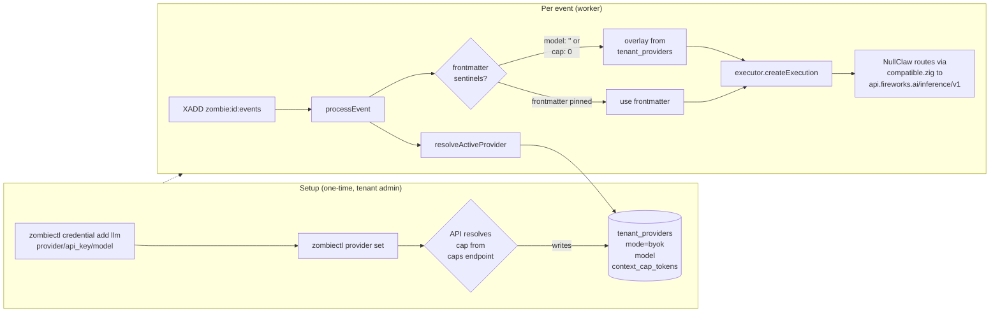

# Scenario 02 — Bring Your Own Key (BYOK), Fireworks + Kimi 2.6

**Persona:** Operator with their own Fireworks AI account. Wants the orchestration substrate (durable runtime, webhook ingest, audit trail, sandbox, approval gating) but pays Fireworks directly for inference. Common reasons: cost control, model choice (Kimi K2 / 2.6 isn't on the platform-managed pool), data-locality preference, existing enterprise procurement with a specific provider.

**Outcome under test:** A tenant flips to BYOK with a Fireworks key + Kimi 2.6 model. All zombie runs across every workspace under that tenant route inference through the operator's Fireworks account. UseZombie still mediates the sandbox, the event log, and the orchestration-fee billing — but the LLM tokens hit Fireworks's quota, not ours.

---

## 1. Why Fireworks + Kimi 2.6 is the worked example

NullClaw's `providers/factory.zig` already maps Fireworks as an OpenAI-compatible provider:

| Provider name | Wire shape | Endpoint |
|---|---|---|
| `fireworks` / `fireworks-ai` | OpenAI-compatible (`/chat/completions`) | `https://api.fireworks.ai/inference/v1` |

Kimi K2 (Moonshot's Kimi 2.6) is hosted on Fireworks at the model id `accounts/fireworks/models/kimi-k2.6`. The OpenAI-compatible client in `nullclaw/src/providers/compatible.zig` handles the wire shape; no provider-specific code needed in this repo.

The operator can also pick Moonshot's own endpoint (`provider: "kimi"` → `https://api.moonshot.cn/v1`) if they have a Moonshot account directly. Same wire shape; same code path.

This scenario uses Fireworks because it's the most-likely real choice (Western payment, CDN-fronted, multi-model catalogue including Kimi K2, Llama, DeepSeek, etc.).



---

## 2. Setup — one credential, one provider config

The operator runs two CLI commands:

```bash
zombiectl credential add llm --data '{
  "provider": "fireworks",
  "api_key":  "fw_LIVE_xxxxxxxxxxxxxxxx",
  "model":    "accounts/fireworks/models/kimi-k2.6"
}'

zombiectl provider set
```

What each does:

- **`credential add llm`** — vault stores an opaque JSON object keyed by the literal name `llm` (per M45's structured-credentials model). The JSON body is the provider's identity and key. **Note: `context_cap_tokens` is NOT in the credential body** — it's resolved separately at provider-set time from the public model-caps endpoint.
- **`provider set`** — flips `core.tenant_providers.mode` to `byok`. As part of the PUT, the API:
  1. Reads the `llm` credential to learn the model (`accounts/fireworks/models/kimi-k2.6`).
  2. GETs `https://api.usezombie.com/_um/da5b6b3810543fe108d816ee972e4ff8/model-caps.json?model=<urlencoded-model>` to resolve the cap (cryptic-prefix endpoint — see §5).
  3. Writes `tenant_providers.context_cap_tokens` (e.g. `256000` for Kimi K2, which has a 256k context window).

If the model isn't in the public catalogue, the API returns `400 model_not_in_caps_catalogue` with a hint on how to add it (PR to the catalogue source, or wait for the admin-zombie's next sweep — see §5).

The same setup works through the dashboard at `/settings/provider`: a Provider dropdown populated from the catalogue, an Add-llm-credential CTA if missing, a model dropdown auto-populated by provider, a Save button.

---

## 3. Subsequent install — the skill takes a different fork

When the operator runs `/usezombie-install-platform-ops` after BYOK is set:

1. The skill calls `zombiectl doctor --json`. Doctor's extended output now reports `tenant_provider: { mode: "byok", provider: "fireworks", model: "...kimi-k2.6", context_cap_tokens: 256000 }`.
2. The skill **skips** the model-cap lookup against `/_um/da5b6b3810543fe108d816ee972e4ff8/model-caps.json` — the cap is already in `tenant_providers`.
3. The skill writes `.usezombie/platform-ops/SKILL.md` with frontmatter:
   ```yaml
   x-usezombie:
     model: ""                       # empty → worker reads from tenant_providers
     context:
       context_cap_tokens: 0         # sentinel: worker overlays from tenant_providers
       tool_window: auto
       memory_checkpoint_every: 5
       stage_chunk_threshold: 0.75
   ```
4. Everything else (tool credentials, webhook URL, first steer) is identical to Scenario 01.

The two zero-sentinels (`model: ""` and `context_cap_tokens: 0`) are the runtime contract that says *"resolve at trigger time from tenant config."* The frontmatter is a static document, but the BYOK config is mutable per tenant — the worker overlay is the only sane way to keep them coherent.

If the operator later runs `zombiectl provider set --model accounts/fireworks/models/deepseek-v4-pro`, the API re-resolves the cap from the public endpoint and overwrites `tenant_providers.context_cap_tokens`. Existing zombies pick up the new model + cap on their **next** event; in-flight events finish with the snapshot they were claimed under (M48 invariant 4).

---

## 4. Trigger and execute — the divergence point

When a webhook arrives or the operator steers, the worker's `processEvent`:

1. INSERT `core.zombie_events` (status='received').
2. Balance gate fires. **Important:** the gate runs for BYOK too — see Scenario 03 for the full billing model. (Earlier drafts said BYOK skips the gate; that's wrong. BYOK skips only the **LLM-token meter**, not the orchestration-fee meter. The gate stays on.)
3. Approval gate.
4. Resolve `secrets_map` (tool credentials only — `fly`, `slack`, `github`, etc.).
5. **Resolve provider:** `tenant_provider.resolveActiveProvider(tenant_id)` returns `{mode: "byok", provider: "fireworks", api_key: "fw_…", model: "...kimi-k2.6", context_cap_tokens: 256000}`.
6. **Overlay sentinels:**
   - if `frontmatter.context_cap_tokens == 0` → use `tenant_providers.context_cap_tokens`.
   - if `frontmatter.model == ""` → use `tenant_providers.model`.
   - both are mutually independent overlays; either can be pinned in frontmatter and overridden in tenant config or vice versa. The platform path leaves frontmatter populated; the BYOK path leaves it empty.
7. `executor.createExecution(workspace_path, {network_policy, tools, secrets_map, context: {context_cap_tokens=256000, ...}, model: "accounts/fireworks/models/kimi-k2.6", provider_api_key: "fw_…", provider_endpoint: "https://api.fireworks.ai/inference/v1"})`.

The provider key flows through `executor.createExecution` as a separate field from `secrets_map` — it never enters the agent's tool context, never substitutes into a tool call, never logs. NullClaw's HTTP client uses it as the `Authorization: Bearer <key>` on the inference call only.

NullClaw routes the call through `compatible.zig` to `POST https://api.fireworks.ai/inference/v1/chat/completions` with `model: accounts/fireworks/models/kimi-k2.6` and the agent's prompt. Fireworks bills the operator. The diagnosis returns over the Unix socket; the worker handles it the same way as Scenario 01.

`StageResult` arrives. Telemetry insert:
- `token_count=2110` (Kimi tends to be slightly more verbose than Sonnet on the same prompt)
- `plan_tier='team'` (BYOK requires at least Team — see Scenario 03)
- `credit_deducted_cents=2` (orchestration-only fee, lower than platform-managed because we don't pay upstream LLM cost)

L3 stage chunking (M41 §6) sees `context_cap_tokens=256000`, sets the chunk-trigger threshold at `0.75 * 256000 = 192000`. Same code path as Scenario 01; only the number differs.

---

## 5. The model-caps endpoint (cryptic-prefix, public-but-unguessable)

The endpoint is the single source of truth for model→cap mapping. Design constraints:

1. **Hot, unauthenticated, cacheable** — install-skill and `provider set` need to call it without holding any tenant token (the install-skill runs *before* the operator authenticates).
2. **Not a DDoS magnet** — `/_um/da5b6b3810543fe108d816ee972e4ff8/model-caps.json` would advertise itself to every random scanner. We use a cryptic path prefix that is unguessable to scanning but well-known to our own clients.
3. **Cheap to serve** — small static JSON, CDN-cacheable, immutable per release.

```
GET https://api.usezombie.com/_um/da5b6b3810543fe108d816ee972e4ff8/model-caps.json
GET https://api.usezombie.com/_um/da5b6b3810543fe108d816ee972e4ff8/model-caps.json?model=<urlencoded>

200 {
  "version": "2026-04-29",
  "models": [
    { "id": "claude-opus-4-7",                          "context_cap_tokens": 1000000 },
    { "id": "claude-sonnet-4-6",                        "context_cap_tokens": 200000  },
    { "id": "claude-haiku-4-5-20251001",                "context_cap_tokens": 200000  },
    { "id": "gpt-5.5",                                  "context_cap_tokens": 256000  },
    { "id": "gpt-5.4",                                  "context_cap_tokens": 256000  },
    { "id": "kimi-k2.6",                                "context_cap_tokens": 256000  },
    { "id": "accounts/fireworks/models/kimi-k2.6",      "context_cap_tokens": 256000  },
    { "id": "accounts/fireworks/models/deepseek-v4-pro","context_cap_tokens": 256000  },
    { "id": "glm-5.1",                                  "context_cap_tokens": 128000  }
  ]
}
```

The provider hosting a given model is encoded in the `model_id` itself (`accounts/fireworks/...` is Fireworks; bare `kimi-k2.6` is Moonshot; `claude-*` is Anthropic; `gpt-*` is OpenAI; `glm-*` is Zhipu). Operators pick their provider via their `llm` credential body, not via this catalogue.

Properties:

- **Path key (`da5b6b3810543fe108d816ee972e4ff8`) is 64 bits of entropy.** Random scanning to find this URL is cost-prohibitive. Treat the key as obscurity, not secrecy — it's referenced from the public install-skill repo, but anyone who deliberately reads that repo is not the threat model. The threat model is opportunistic crawlers.
- **Hard-coded in clients.** `zombiectl` and the install-skill embed the URL at build/release time. Rotation is a coordinated CLI + skill release on a quarterly cadence (or sooner if abuse is detected). Old key gets a 410 Gone with a "upgrade your CLI" hint for ~30 days, then 404.
- **Cloudflare in front.** `Cache-Control: public, max-age=86400, s-maxage=604800, immutable` per release URL. Per-IP rate limit (1 RPS sustained, burst 10) at the edge — well above any legitimate client and well below any scraping budget.
- **Backed by a static table (v2.0) → admin-zombie (later).** Initial implementation is a JSON file checked into the API repo and served by a route handler. Later, an admin-only zombie owned by `nkishore@megam.io` wakes hourly, queries each provider's models endpoint where one exists (Anthropic, OpenAI, Moonshot, OpenRouter), reconciles against the table, and opens a PR with deltas. Humans review/merge. Same endpoint, fresher data — the admin-zombie is a dogfood instance of the platform-ops pattern.
- **Resolved at provider-set / install time, never at trigger time.** Triggers must not depend on a network call to a sibling endpoint — the cap is pinned into either `tenant_providers` (BYOK) or frontmatter (platform).
- **Adding a new model is a table edit, not a usezombie release.** Operators can request additions through a public form; the admin-zombie auto-merges low-risk deltas (a model with a published cap from the provider's own docs).

---

## 6. What this scenario proves

- BYOK is a tenant-scoped credential + provider-config flip. It does **not** require any code path that knows about provider identity inside the worker or executor — both stay model-agnostic; the routing happens inside NullClaw.
- The model→cap source of truth is the **same endpoint** for both platform and BYOK paths. The difference is *where the resolved cap is stored after lookup* (frontmatter vs. `tenant_providers`) and *when the worker resolves it* (install time vs. trigger time overlay).
- Fireworks + Kimi 2.6 works today because NullClaw already speaks OpenAI-compatible. No provider-specific work in this repo. The same path opens up Together AI, Groq, Cerebras, Moonshot, OpenRouter, DeepSeek, Nebius, xAI — every compatible provider in NullClaw's catalogue.
- The `llm` credential body is `{provider, api_key, model}` only. Cap lives in `tenant_providers`. Splitting the two means the cap can be re-resolved when the model changes without touching vault.

---

## 7. What is NOT in this scenario

- Per-workspace BYOK override. Tenant-scoped only in v2.
- BYOK with an LLM provider not in NullClaw's catalogue. Operator is told to PR NullClaw or use OpenRouter as a shim.
- Auto-fallback from BYOK to platform on provider error. Errors surface to the operator; no silent fallback (would charge them without consent).
- Cost reporting on the operator's BYOK spend. They check Fireworks's dashboard.
- Provider-specific feature flags (vision, JSON mode, etc.). NullClaw's compatible client doesn't expose them yet; v3 work.
