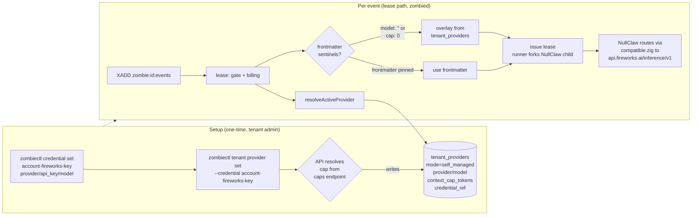

# Scenario 02 — Self-managed provider keys, Fireworks + Kimi 2.6

**Persona — John Doe.** Small-team user with his own Fireworks AI account already provisioned. Wants the orchestration substrate (durable runtime, webhook ingest, audit trail, sandbox, approval gating) but pays Fireworks directly for inference. Common reasons: cost control, model choice (Kimi K2 / 2.6 isn't in the platform-managed pool), data-locality preference, existing enterprise procurement with a specific provider. Tenant carries an explicit `core.tenant_providers` row with `mode=self_managed` after he runs `tenant provider set`.

**Outcome under test:** John flips his tenant to self-managed with a Fireworks key + Kimi 2.6 model. All zombie runs across every workspace under that tenant route inference through John's Fireworks account. usezombie still mediates the sandbox, the event log, and the orchestration-fee billing — but the LLM tokens hit Fireworks's quota, not ours.

---

## 1. Why Fireworks + Kimi 2.6 is the worked example

NullClaw's `providers/factory.zig` already maps Fireworks as an OpenAI-compatible provider:

| Provider name | Wire shape | Endpoint |
|---|---|---|
| `fireworks` / `fireworks-ai` | OpenAI-compatible (`/chat/completions`) | `https://api.fireworks.ai/inference/v1` |

Kimi K2 (Moonshot's Kimi 2.6) is hosted on Fireworks at the model id `accounts/fireworks/models/kimi-k2.6`. The OpenAI-compatible client in `nullclaw/src/providers/compatible.zig` handles the wire shape; no provider-specific code needed in this repo.

The user can also pick Moonshot's own endpoint (`provider: "kimi"` → `https://api.moonshot.cn/v1`) if they have a Moonshot account directly. Same wire shape; same code path.

This scenario uses Fireworks because it's the most-likely real choice (Western payment, CDN-fronted, multi-model catalogue including Kimi K2, Llama, DeepSeek, etc.).



---

## 2. Setup — user-named credential, one provider config

John runs two CLI commands. He picks the credential name himself — `account-fireworks-key` — so his vault list is self-documenting.

```bash
op read 'op://<vault>/fireworks/api_key' |
  jq -Rn '{provider:"fireworks", api_key: input, model:"accounts/fireworks/models/kimi-k2.6"}' |
  zombiectl credential set account-fireworks-key --data @-

zombiectl tenant provider set --credential account-fireworks-key
```

What each does:

- **`credential set account-fireworks-key`** — upsert. Vault stores an opaque JSON object keyed by the user-chosen name (per M45's structured-credentials model). The name is whatever John wants — another user might pick `anthropic-prod` or `openai-team-shared`. The JSON body is the provider's identity and key. **`context_cap_tokens` is not in the credential body** — it's resolved separately at `tenant provider set` time from the public model-caps endpoint.
- **`tenant provider set --credential <name>`** — flips `core.tenant_providers.mode` to `self_managed` and writes a row keyed on the tenant. As part of the PUT, the API:
  1. Loads the vault row at `(tenant_id, "account-fireworks-key")`.
  2. Validates the JSON has `provider`, `api_key`, `model` (eager structural validation; PUT fails with `400 credential_data_malformed` otherwise).
  3. GETs `https://api.usezombie.com/_um/da5b6b3810543fe108d816ee972e4ff8/model-caps.json?model=<urlencoded-model>` to resolve the cap.
  4. Writes the row: `mode=self_managed`, `provider=fireworks`, `model=accounts/fireworks/models/kimi-k2.6`, `context_cap_tokens=256000`, `credential_ref=account-fireworks-key`.

If the model isn't in the public catalogue, the API returns `400 model_not_in_caps_catalogue` with a hint on how to add it (PR to the catalogue source, or wait for the admin-zombie's next sweep — see [`../billing_and_provider_keys.md`](../billing_and_provider_keys.md) §9). The PUT does **not** make a synthetic call to Fireworks to verify the key works — auth-validity surfaces at the first event as `provider_auth_failed` (lazy auth validation). The CLI prints a `Tip: run a test event to verify the key works against fireworks.` after success.

`tenant_providers.tenant_id` is the primary key (one active provider per tenant). Multi-credential tenants are supported in vault — John can store `anthropic-prod` AND `account-fireworks-key` and flip between them with another `tenant provider set --credential <other>` — but only one is active at a time.

The same setup works through the dashboard at `/settings/provider`: a credential dropdown populated from the tenant's vault list, a model override field auto-filled from the picked credential, a Save button.

---

## 3. Subsequent install — the skill takes a different fork

When John runs `/usezombie-install-platform-ops` after self-managed is set:

1. The skill calls `zombiectl doctor --json`. Doctor's `tenant_provider` block reports `{ mode: "self_managed", provider: "fireworks", model: "accounts/fireworks/models/kimi-k2.6", context_cap_tokens: 256000 }`. The api_key is **never** in this block — doctor is a readiness surface, not a secret surface.
2. The skill writes `.usezombie/platform-ops/SKILL.md` with sentinel frontmatter:
   ```yaml
   x-usezombie:
     model: ""                       # sentinel: control plane overlays from tenant_providers
     context:
       context_cap_tokens: 0         # sentinel: control plane overlays from tenant_providers
       tool_window: auto
       memory_checkpoint_every: 5
       stage_chunk_threshold: 0.75
   ```
3. Everything else (tool credentials, webhook URL, first steer) is identical to Scenario 01.

**Overlay rule (at lease time):** `model == ""` OR the `model:` key absent from the frontmatter ⇒ the control plane overlays from `tenant_providers.model`. Same rule for `context_cap_tokens: 0` OR absent. The two fields overlay independently: John could pin a custom model in frontmatter while leaving the cap at zero (inherit), or vice versa. The install-skill emits the **visible sentinels** (`""` / `0`) under self-managed posture rather than omitting the keys, so a human reading the file can spot at a glance that "this zombie inherits from tenant config." Hand-edits that strip the keys still work — absent-key is the safety net.

If John later runs `zombiectl tenant provider set --credential account-fireworks-key` again with a different `--model` (or after editing the credential body), the API re-resolves the cap from the public endpoint and overwrites `tenant_providers.{model, context_cap_tokens}`. Existing zombies pick up the new model + cap on their **next** event; in-flight events finish with the snapshot they were claimed under.

---

## 4. Trigger and execute — the divergence point

When a webhook arrives or the user steers, `zombied` builds the lease (the lease path):

1. INSERT `core.zombie_events` (status='received').
2. Balance gate fires. **Important:** the gate runs for self-managed too — see Scenario 03 for the full billing model. (Earlier drafts said self-managed skips the gate; that's wrong. self-managed skips only the **LLM-token meter**, not the orchestration-fee meter. The gate stays on.)
3. Approval gate.
4. Resolve `secrets_map` (tool credentials only — `fly`, `slack`, `github`, etc.).
5. **Resolve provider:** `tenant_provider.resolveActiveProvider(tenant_id)` reads the `tenant_providers` row, follows `credential_ref="account-fireworks-key"` to the vault, returns `{mode: "self_managed", provider: "fireworks", api_key: "fw_…", model: "accounts/fireworks/models/kimi-k2.6", context_cap_tokens: 256000}`. The resolved `provider`+`api_key` ride the lease on `ExecutionPolicy.provider`/`api_key` (the credential `account-fireworks-key` is referenced via `credential_ref`, so it is **never** in `secrets_map`) and reach the runner's NullClaw child for the inference call only — never any user-facing surface. See [`../billing_and_provider_keys.md`](../billing_and_provider_keys.md) §8.2 for the full visibility boundary.
6. **Overlay sentinels:**
   - if `frontmatter.context_cap_tokens == 0` → use `tenant_providers.context_cap_tokens`.
   - if `frontmatter.model == ""` → use `tenant_providers.model`.
   - both are mutually independent overlays; either can be pinned in frontmatter and overridden in tenant config or vice versa. The platform path leaves frontmatter populated; the self-managed path leaves it empty.
7. `zombied` issues the lease with `policy = ExecutionPolicy{network_policy, tools, secrets_map, provider: "fireworks", api_key: "fw_…", context: {context_cap_tokens: 256000, model: "accounts/fireworks/models/kimi-k2.6", …}}`; the runner forks a sandboxed NullClaw child to execute it.

The provider key stays **separate** from `secrets_map` — `zombied` resolves it (`resolveActiveProvider`) and delivers it on `ExecutionPolicy.provider`/`api_key`; the runner injects it so NullClaw uses it as the `Authorization: Bearer <key>` on the inference call only. It never enters the agent's tool context, never substitutes into a tool call, never logs.

NullClaw routes the call through `compatible.zig` to `POST https://api.fireworks.ai/inference/v1/chat/completions` with `model: accounts/fireworks/models/kimi-k2.6` and the agent's prompt. Fireworks bills the user. The diagnosis streams from the sandboxed child to the runner over the pipe; the runner reports it to `zombied`, which handles it the same way as Scenario 01.

The runner's report arrives. Two telemetry rows exist for this event (per the credit-pool model — see [`../billing_and_provider_keys.md`](../billing_and_provider_keys.md) §3):
- The receive row was INSERTed earlier at gate time: `charge_type='receive'`, `posture='self_managed'`, `credit_deducted_nanos=0` (events are free both postures under M66).
- The run row was INSERTed at lease issue, before the runner executed: `charge_type='stage'`, `posture='self_managed'`, `credit_deducted_nanos=100000` (flat $0.0001 orchestration overhead under self-managed; no token markup).
- Now UPDATEd post-execution with `token_count_input=820, token_count_output=1320, wall_ms=11400` — recorded for transparency on the Usage tab and for John's separate Fireworks-bill review, but the `credit_deducted_nanos` column does **not** change because self-managed pricing is flat.

L3 run chunking (M41 §6) sees `context_cap_tokens=256000`, sets the chunk-trigger threshold at `0.75 * 256000 = 192000`. Same code path as Scenario 01; only the number differs.

---

## 5. The model-caps endpoint (cryptic-prefix, public-but-unguessable)

The endpoint is the single source of truth for model→cap mapping. Design constraints:

1. **Hot, unauthenticated, cacheable** — `tenant provider set` and the platform-side synth-default resolver need to call it without holding any tenant token.
2. **Not a DDoS magnet** — `/_um/da5b6b3810543fe108d816ee972e4ff8/model-caps.json` would advertise itself to every random scanner. We use a cryptic path prefix that is unguessable to scanning but well-known to our own clients.
3. **Cheap to serve** — small static JSON, CDN-cacheable, immutable per release.

```
GET https://api.usezombie.com/_um/da5b6b3810543fe108d816ee972e4ff8/model-caps.json
GET https://api.usezombie.com/_um/da5b6b3810543fe108d816ee972e4ff8/model-caps.json?model=<urlencoded>

200 {
  "version": "2026-04-29",
  "models": [
    { "id": "claude-opus-4-7",                          "context_cap_tokens": 1000000 },
    { "id": "claude-sonnet-4-6",                        "context_cap_tokens": 200000  },
    { "id": "claude-haiku-4-5-20251001",                "context_cap_tokens": 200000  },
    { "id": "gpt-5.5",                                  "context_cap_tokens": 256000  },
    { "id": "gpt-5.4",                                  "context_cap_tokens": 256000  },
    { "id": "kimi-k2.6",                                "context_cap_tokens": 256000  },
    { "id": "accounts/fireworks/models/kimi-k2.6",      "context_cap_tokens": 256000  },
    { "id": "accounts/fireworks/models/deepseek-v4-pro","context_cap_tokens": 256000  },
    { "id": "glm-5.1",                                  "context_cap_tokens": 128000  }
  ]
}
```

The provider hosting a given model is encoded in the `model_id` itself (`accounts/fireworks/...` is Fireworks; bare `kimi-k2.6` is Moonshot; `claude-*` is Anthropic; `gpt-*` is OpenAI; `glm-*` is Zhipu). Users pick their provider via their `llm` credential body, not via this catalogue.

Properties:

- **Path key (`da5b6b3810543fe108d816ee972e4ff8`) is 64 bits of entropy.** Random scanning to find this URL is cost-prohibitive. Treat the key as obscurity, not secrecy — it's referenced from the public install-skill repo, but anyone who deliberately reads that repo is not the threat model. The threat model is opportunistic crawlers.
- **Hard-coded in clients.** `zombiectl` and the install-skill embed the URL at build/release time. Rotation is a coordinated CLI + skill release on a quarterly cadence (or sooner if abuse is detected). Old key gets a 410 Gone with a "upgrade your CLI" hint for ~30 days, then 404.
- **Cloudflare in front.** `Cache-Control: public, max-age=86400, s-maxage=604800, immutable` per release URL. Per-IP rate limit (1 RPS sustained, burst 10) at the edge — well above any legitimate client and well below any scraping budget.
- **Backed by a static table (v2.0) → admin-zombie (later).** Initial implementation is a JSON file checked into the API repo and served by a route handler. Later, an admin-only zombie owned by `nkishore@megam.io` wakes hourly, queries each provider's models endpoint where one exists (Anthropic, OpenAI, Moonshot, OpenRouter), reconciles against the table, and opens a PR with deltas. Humans review/merge. Same endpoint, fresher data — the admin-zombie is a dogfood instance of the platform-ops pattern.
- **Resolved at provider-set / install time, never at trigger time.** Triggers must not depend on a network call to a sibling endpoint — the cap is pinned into either `tenant_providers` (self-managed) or frontmatter (platform).
- **Adding a new model is a table edit, not a usezombie release.** Users can request additions through a public form; the admin-zombie auto-merges low-risk deltas (a model with a published cap from the provider's own docs).

---

## 6. Terminal transcript — what John Doe sees

This is the verbatim end-to-end CLI experience for the self-managed setup, model switch, and credential-deletion failure mode.

### 6.1 Initial setup

```text
$ op read 'op://<vault>/fireworks/api_key' |
    jq -Rn '{provider:"fireworks", api_key: input, model:"accounts/fireworks/models/kimi-k2.6"}' |
    zombiectl credential set account-fireworks-key --data @-
✓ Credential `account-fireworks-key` stored in vault for tenant tnt_01HX9P…

$ zombiectl tenant provider set --credential account-fireworks-key
▸ Loading credential `account-fireworks-key` …                    ✓
▸ Validating shape (provider, api_key, model present) …            ✓
▸ Resolving cap for accounts/fireworks/models/kimi-k2.6 …          256000
▸ Writing core.tenant_providers …                                  ✓

✓ Tenant provider set:
    Mode:               self_managed
    Provider:           fireworks
    Model:              accounts/fireworks/models/kimi-k2.6
    Context cap tokens: 256000
    Credential ref:     account-fireworks-key

ⓘ Tip: run a test event to verify the key works against fireworks.
   zombiectl steer <zombie_id> "ping"
```

### 6.2 Confirmation via doctor and `tenant provider get`

```text
$ zombiectl doctor --json | jq .tenant_provider
{
  "mode": "self_managed",
  "provider": "fireworks",
  "model": "accounts/fireworks/models/kimi-k2.6",
  "context_cap_tokens": 256000,
  "credential_ref": "account-fireworks-key"
}

$ zombiectl tenant provider get
Mode:                self_managed
Provider:            fireworks
Model:               accounts/fireworks/models/kimi-k2.6
Context cap tokens:  256000
Credential ref:      account-fireworks-key

ⓘ LLM tokens billed to John's fireworks account. usezombie charges the
  flat 1¢ per event regardless of model or token count.
```

The api_key bytes are absent from both surfaces — `doctor --json` strips it before serialising; `tenant provider get` never asks for it.

### 6.3 Switching models on the same credential

A month later John wants to try DeepSeek V4 Pro on the same Fireworks account. He updates the credential body and re-runs `tenant provider set`:

```text
$ op read 'op://<vault>/fireworks/api_key' |
    jq -Rn '{provider:"fireworks", api_key: input, model:"accounts/fireworks/models/deepseek-v4-pro"}' |
    zombiectl credential set account-fireworks-key --data @-
✓ Credential `account-fireworks-key` updated.

$ zombiectl tenant provider set --credential account-fireworks-key
▸ Loading credential …                                             ✓
▸ Resolving cap for accounts/fireworks/models/deepseek-v4-pro …    131072
▸ Writing core.tenant_providers …                                  ✓

✓ Tenant provider updated:
    Model:              accounts/fireworks/models/deepseek-v4-pro
    Context cap tokens: 131072  (was 256000)
    Credential ref:     account-fireworks-key  (unchanged)
```

John's `.usezombie/platform-ops/SKILL.md` does not need regeneration. The sentinels (`model: ""`, `context_cap_tokens: 0`) keep working — the control plane just overlays the new values on the next event's lease. In-flight events claimed under Kimi K2 finish under Kimi K2.

### 6.4 Failure mode — credential deleted while still in self-managed

If John deletes the credential without first running `tenant provider reset`, the next event dead-letters cleanly:

```text
$ zombiectl credential delete account-fireworks-key
✓ Credential `account-fireworks-key` removed from vault.

# (a webhook fires later that day)

$ zombiectl events zmb_01HX9N3K…
EVENT_ID                 ACTOR             STATUS               STARTED              FAILURE_LABEL
evt_01HXC7P2…           webhook:github    dead_lettered        2026-06-03T11:08:42  provider_credential_missing

$ zombiectl tenant provider get
Mode:                self_managed
Provider:            fireworks
Model:               accounts/fireworks/models/deepseek-v4-pro
Context cap tokens:  131072
Credential ref:      account-fireworks-key
⚠ Credential `account-fireworks-key` is missing from vault.
   Re-add it with `zombiectl credential set`, OR fall back to platform with
   `zombiectl tenant provider reset`. Mode is NOT auto-reverted (would silently
   re-enable platform billing without your consent).
```

The system never auto-reverts the mode to platform. Either John re-adds the credential (events resume on the next webhook), or he explicitly opts back into platform billing with `tenant provider reset`.

---

## 7. What this scenario proves

- self-managed is a tenant-scoped credential + provider-config flip. It does **not** require any code path that knows about provider identity inside `zombied` or the runner — both stay model-agnostic; the routing happens inside NullClaw.
- The model→cap source of truth is the **same endpoint** for both platform and self-managed paths. The difference is *where the resolved cap is stored after lookup* (synth-default constants for tenants with no row, `tenant_providers` row for tenants with explicit config) and *when the control plane resolves it* (the resolver runs once per lease; sentinels in frontmatter trigger overlay from `tenant_providers`).
- Fireworks + Kimi 2.6 works today because NullClaw already speaks OpenAI-compatible. No provider-specific work in this repo. The same path opens up Together AI, Groq, Cerebras, Moonshot, OpenRouter, DeepSeek, Nebius, xAI — every compatible provider in NullClaw's catalogue.
- The self-managed credential body is `{provider, api_key, model}` only. Cap lives in `tenant_providers`. Splitting the two means the cap can be re-resolved when the model changes without touching vault.
- The credential name is user-chosen, not a hardcoded convention. Multi-credential tenants are supported; the active credential is whichever name `tenant_providers.credential_ref` points at.
- The api_key crosses one boundary cleanly — vault → resolver (`zombied`) → runner's NullClaw → outbound HTTPS — and is absent from every user-facing surface (doctor, CLI output, dashboard, event log, frontmatter). See [`../billing_and_provider_keys.md`](../billing_and_provider_keys.md) §8.2.

---

## 8. What is NOT in this scenario

- Per-workspace self-managed override. Tenant-scoped only in v2.
- self-managed with an LLM provider not in NullClaw's catalogue. User is told to PR NullClaw or use OpenRouter as a shim.
- Auto-fallback from self-managed to platform on provider error. Errors surface to the user; no silent fallback (would charge them without consent).
- Cost reporting on the user's self-managed spend. They check Fireworks's dashboard.
- Provider-specific feature flags (vision, JSON mode, etc.). NullClaw's compatible client doesn't expose them yet; v3 work.
