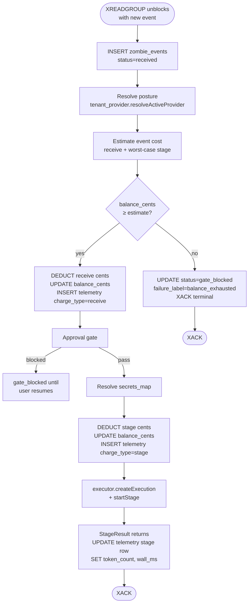

# Scenario 03 — The credit pool, John drains under both postures

**Persona — John Doe.** Same user from Scenarios 01 and 02. He installed his platform-ops zombie cold, ran for a couple of weeks on the default platform-managed posture, then brought his own Fireworks key. This scenario watches his $10 starter grant drain over time across both postures and ends with the gate tripping.

**Outcome under test:** A tenant whose `core.tenant_billing.balance_cents` reaches zero stops dispatching new events at the gate. Same code path under both postures; only the per-event drain rate differs. The user gets a clear "credits exhausted" UX pointing at the dashboard billing page. There is no Stripe purchase flow in v2.0 — exhausted users contact support for a manual top-up.



> Single source of truth for the cost model: [`../billing_and_byok.md`](../billing_and_byok.md). This scenario walks through what those numbers mean in practice for one user over time.

---

## 1. The credit pool

John starts with the same balance every new tenant gets:

```
SELECT balance_cents FROM core.tenant_billing WHERE tenant_id = $1;
 balance_cents
---------------
          1000
(1 row)
```

That's $10 USD, granted once at tenant-create. There is no monthly refill. There are no plan tiers in the gate — every tenant runs through the same `processEvent` code path and the same `compute_*_charge` functions. The only number that varies is the drain rate, and the drain rate is purely posture-dependent.

Plans (Free / Team / Scale, if they exist as marketing constructs) only show up at credit-grant time as bigger or smaller starting numbers — never inside the gate or the cost function. In v2.0 we ship one tier: $10 starter grant for every new tenant.

---

## 2. Phase 1 — John on platform-managed (Week 1-2 of his journey)

**Setup recap.** John ran the wedge demo (Scenario 01). His tenant has no `core.tenant_providers` row — the resolver synthesises the platform default: `mode=platform`, `provider=anthropic`, `model=claude-sonnet-4-6`, `context_cap_tokens=200000`. The platform-side server config holds the actual Anthropic api_key.

### 2.1 First webhook fires (Monday morning, week 1)

```
XREADGROUP unblocks → INSERT zombie_events (status='received')
resolveActiveProvider → mode=platform
estimate cost = compute_receive_charge(.platform)
              + compute_stage_charge(.platform, claude-sonnet-4-6,
                                     worst_case_in=900, worst_case_out=1200)
              = 1¢ + (1¢ + 0¢ + 1¢) = 3¢

gate: 1000¢ ≥ 3¢ → pass

DEDUCT RECEIVE
  UPDATE tenant_billing SET balance_cents = 1000 - 1 = 999
  INSERT zombie_execution_telemetry
    (event_id, posture='platform', model='claude-sonnet-4-6',
     charge_type='receive', credit_deducted_cents=1)

approval gate → pass (no destructive tools in this run)

resolveSecretsMap → {fly, slack, github}

DEDUCT STAGE
  UPDATE tenant_billing SET balance_cents = 999 - 2 = 997
  INSERT zombie_execution_telemetry
    (event_id, posture='platform', model='claude-sonnet-4-6',
     charge_type='stage', credit_deducted_cents=2)

executor.createExecution → executor.startStage
  outbound to api.anthropic.com
  StageResult returns: tokens(in=820, out=1040), wall=8.2s

UPDATE zombie_execution_telemetry  (the stage row)
  SET token_count_input=820, token_count_output=1040, wall_ms=8210

reconcile actual cost:
  actual_stage = compute_stage_charge(.platform, sonnet, 820, 1040)
               = 1¢ + ((300×820 + 1500×1040) / 1_000_000) ≈ 1¢ + 1¢ = 2¢
  matches the conservative estimate; no adjustment.

UPDATE zombie_events status='processed'
XACK
```

After event 1: balance = 997¢. John spent 3¢ for one event.

### 2.2 Through week 1 and into week 2

Monday's webhook + steers run. John gets ~30 events Monday at an average of 3¢ each = 90¢ spent. Tuesday is busier (a flaky deployment generates 50 webhook events plus a few manual steers) — say 60 events × ~3¢ = 180¢. By end of Tuesday: 1000 − 90 − 180 = 730¢ left.

Wednesday through Friday continue at ~40 events/day × ~3¢ = ~120¢/day. End of week 1: 730 − 360 = 370¢ left.

Week 2 opens. By midweek John is at ~150¢ left and notices his balance is lower than he'd hoped. He decides to bring his own Fireworks key.

---

## 3. Phase 2 — John switches to BYOK (week 2 onwards)

He runs through Scenario 02's setup:

```bash
zombiectl credential set account-fireworks-byok --data '{
  "provider": "fireworks",
  "api_key":  "fw_LIVE_…",
  "model":    "accounts/fireworks/models/kimi-k2.6"
}'
zombiectl tenant provider set --credential account-fireworks-byok
```

`core.tenant_providers` now has a row: `mode=byok`, `provider=fireworks`, `model=accounts/fireworks/models/kimi-k2.6`, `context_cap_tokens=256000`, `credential_ref=account-fireworks-byok`. John's UseZombie balance is unchanged at ~150¢.

### 3.1 First post-flip event

```
resolveActiveProvider → mode=byok, api_key=fw_LIVE_…, model=kimi-k2.6
estimate cost = compute_receive_charge(.byok) + compute_stage_charge(.byok, …)
              = 0¢ + 1¢ = 1¢

gate: 150¢ ≥ 1¢ → pass

DEDUCT RECEIVE → 0¢ deducted (BYOK receive is zero in v2.0)
  INSERT telemetry (charge_type='receive', credit_deducted_cents=0)

DEDUCT STAGE → 1¢ deducted
  UPDATE balance_cents = 150 - 1 = 149
  INSERT telemetry (charge_type='stage', credit_deducted_cents=1)

executor.startStage with provider_api_key=fw_LIVE_… → outbound to
  api.fireworks.ai/inference/v1/chat/completions
StageResult returns: tokens(in=820, out=1320), wall=11.4s
  — tokens recorded on the row, but compute_stage_charge under BYOK
    does NOT consume them (flat 1¢ regardless of token count)

UPDATE telemetry stage row SET token_count_input=820, token_count_output=1320,
                              wall_ms=11400
(credit_deducted_cents stays 1¢; tokens are FYI only under BYOK)

UPDATE zombie_events status='processed'
XACK

Fireworks bills John's Fireworks account directly for the 820+1320 tokens
of Kimi K2.6 on his own monthly invoice. UseZombie sees only the
StageResult.tokens count for telemetry; we do not know what Fireworks
charged John for those tokens, and we do not care.
```

After this event: balance = 149¢. John's UseZombie drain dropped from ~3¢ to 1¢ per event the moment he flipped postures.

### 3.2 Through weeks 2-4

Same workload shape (~40 events/day) but now at 1¢ each = ~40¢/day instead of ~120¢/day. John's 150¢ remaining at flip time would cover roughly 4 more days under platform; under BYOK it covers roughly two weeks.

By end of week 4: balance ≈ 30¢ left.

---

## 4. Phase 3 — the gate eventually trips

Week 5 opens. John's balance is hovering around 30¢. A flaky deploy triggers a 30-event burst from his CD pipeline. `processEvent` runs through the first 30 events at 1¢ each, draining to 0¢:

```
estimate cost = 1¢
gate: 0¢ < 1¢ → BLOCK

UPDATE zombie_events
  SET status='gate_blocked', failure_label='balance_exhausted'
PUBLISH event_complete (status=gate_blocked)
XACK terminal
```

The next event (and every event after) gate-blocks identically. None of them touch the executor; UseZombie's costs for them are SQL-only.

John's experience:

- His Slack stops getting diagnoses around the burst's end.
- He runs `zombiectl billing show` and `zombiectl events <id>` (transcripts in §6).
- He opens `https://app.usezombie.com/settings/billing`, sees the empty-balance state, and emails support for a top-up. Stripe Purchase Credits ships in v2.1.
- After support tops him up to $10 again, he can re-trigger the missed events manually if any are worth running. There is no auto-replay of gate-blocked events.

Note that the gate trip happens identically under both postures — the only difference is *when* it happens. Had John never flipped to BYOK, his $10 would have run out around the start of week 2 instead of week 5.

---

## 5. Same user, two drain rates — comparison

The same user with the same workload sees different drain rates depending on which posture he's in. Cumulative spend over ~5 weeks of identical activity:

| Phase | Posture | Events/day (avg) | ¢/event | ¢/week (5 days × 40 events) | Cumulative ¢ |
|---|---|---|---|---|---|
| Week 1-1.5 | platform | 40 | ~3 | ~600 | ~850 (full week + half) |
| Week 1.5-5 | byok | 40 | 1 | ~200 | ~150 over 3.5 weeks |
| **Total** | mixed | — | — | — | **1000 (the starter grant)** |

If John had stayed on platform the entire time, his $10 would have lasted roughly 1.5–2 weeks. Switching to BYOK extended his runway to ~5 weeks for the same workload. The 3× extension is the BYOK incentive — paid for by his separate Fireworks bill.

| Aspect | Platform phase | BYOK phase |
|---|---|---|
| `tenant_providers` row | Absent (synth-default) | `mode=byok`, `credential_ref=account-fireworks-byok` |
| Resolver returns | `{provider: anthropic, api_key: <PLATFORM>, model: claude-sonnet-4-6, …}` | `{provider: fireworks, api_key: fw_LIVE_…, model: …kimi-k2.6, …}` |
| Receive deduct per event | 1¢ | 0¢ |
| Stage deduct per event | 1¢ overhead + token cost (~1–4¢ for Sonnet) | 1¢ flat |
| Typical per-event total | ~3¢ | 1¢ |
| LLM bill payer | UseZombie (passthrough in our token rate) | John's Fireworks account directly |
| Outbound LLM call | `api.anthropic.com` | `api.fireworks.ai/inference/v1` |
| Gate code path | Identical | Identical |
| Telemetry rows per event | 2 (receive + stage) | 2 (receive=0¢, stage=1¢) |

---

## 6. The credit-exhausted user experience — terminal transcripts

### 6.1 At the gate trip

```text
$ zombiectl events zmb_01HX9N3K… --since 24h | head -3
EVENT_ID                 ACTOR             STATUS         FAILURE_LABEL
evt_01HXG2K4…           webhook:github    gate_blocked   balance_exhausted
evt_01HXG2K3…           webhook:github    gate_blocked   balance_exhausted
evt_01HXG2K2…           webhook:github    gate_blocked   balance_exhausted

ⓘ Credits exhausted. See https://app.usezombie.com/settings/billing
```

```text
$ zombiectl billing show
Tenant balance:    $0.00 (0¢)

Last 10 events drained credits:
  EVENT_ID         POSTURE  MODEL                            IN_TOK  OUT_TOK  RECEIVE  STAGE  TOTAL
  evt_01HXJ4P7…    byok     accounts/.../kimi-k2.6            820     1320       0¢     1¢     1¢
  evt_01HXJ4P6…    byok     accounts/.../kimi-k2.6            800     1240       0¢     1¢     1¢
  evt_01HXJ4P5…    byok     accounts/.../kimi-k2.6            860     1180       0¢     1¢     1¢
  …
  evt_01HX9N3M…    platform claude-sonnet-4-6                 820     1040       1¢     2¢     3¢
  evt_01HX9N3L…    platform claude-sonnet-4-6                 800     1100       1¢     2¢     3¢
  evt_01HX9N3K…    platform claude-sonnet-4-6                 880     1320       1¢     2¢     3¢

ⓘ Out of credits? See https://app.usezombie.com/settings/billing
   Stripe purchase ships in v2.1; for now contact support for a top-up.
```

The Usage tab shows John's full posture history — the three platform rows from his first week and the recent BYOK rows side-by-side. Under BYOK the `IN_TOK` / `OUT_TOK` columns are populated for transparency (John can reconcile against his Fireworks bill) but the `STAGE` cents column is flat 1¢ regardless of token count.

### 6.2 The dashboard

`https://app.usezombie.com/settings/billing` shows:

- Headline: **$0.00 USD**.
- **Purchase Credits** button (disabled, tooltip "Coming in v2.1 — contact support for a top-up").
- Usage tab populated with John's drain history (both posture phases visible).
- Invoices tab: empty state.
- Payment Method tab: empty state.
- Auto Top Up card: hidden (not shipped in v2.0).

### 6.3 No automatic replay

Once topped up (manually in v2.0; via Stripe in v2.1+), the gate-blocked events do **not** auto-replay. If John wants to re-process a missed webhook, he:

1. Re-triggers from the source (push a no-op commit, send another steer), or
2. Uses the resume affordance — which writes an `actor=continuation:<original>` event referencing `resumes_event_id=<blocked_row>`, dispatched cleanly through the gate at the new balance.

The reasoning is that a balance-exhausted event is usually evidence the user was already off the rails (runaway loop, mis-configured cron). Auto-replay would compound the bill.

---

## 7. Posture-switch mechanics

John can flip postures at any time during his journey. The mechanics:

- **Platform → BYOK** (what John did at the start of week 2):
  ```
  zombiectl credential set <name> --data '{ "provider": "...", "api_key": "...", "model": "..." }'
  zombiectl tenant provider set --credential <name>
  ```
  Next event resolves `mode=byok`. Drain drops from ~3¢ to 1¢ per event. The api_key is in vault; he never sees it again from any UseZombie surface.

- **BYOK → platform** (e.g. if Fireworks has a billing issue):
  ```
  zombiectl tenant provider reset
  ```
  Next event resolves `mode=platform`. Drain jumps from 1¢ to ~3¢. If his balance is now too low for the platform-rate worst-case estimate, the gate trips on the next event — he'd see the credit-exhausted UX and need to top up.

In-flight events finish under the posture they were claimed under (gate snapshot). No mid-execution re-billing.

---

## 8. Edge cases

### 8.1 Mid-event balance crossing zero

In-flight events finish at the snapshot taken at gate time. Both deductions (receive + stage) committed before the executor ran; the executor's success or failure does not retroactively adjust the deduction. If the user's balance crosses zero during a long stage, the next event hits the gate cleanly and blocks.

### 8.2 Concurrent events on near-zero balance

Two events claim the queue simultaneously, both pass the gate (balance was sufficient for one), both deduct → balance briefly goes negative. We accept the small overshoot rather than serialise all events behind a row lock that would limit throughput. The next event sees `balance_cents < 0`, gate trips, system stabilises.

### 8.3 Posture flip mid-event

The resolver runs exactly once at gate time (step "Resolve posture" in the flowchart). Whatever posture it returned is the snapshot for both deductions and the outbound LLM call. A `tenant provider set` that lands during step 3-7 of the flowchart has no effect on this event; it takes effect on the next event.

### 8.4 BYOK credential deleted while still in BYOK mode

Resolver returns `error.CredentialMissing`. Event dead-letters with `failure_label='provider_credential_missing'`. **Receive is not debited** (we couldn't even resolve posture, so we wouldn't know which receive rate to use); the dead-letter row stays at the very-early step. This is a different terminal state than `balance_exhausted` and the dashboard distinguishes them.

---

## 9. What this scenario proves

- **Same code path serves both postures.** The gate, the receive deduct, the stage deduct, and the telemetry rows are identical SQL; only the cents differ.
- **Drain rate is the BYOK signal.** John's UseZombie credits last ~3× longer under BYOK than they would have under continued platform use — a transparent, observable benefit of bringing a key.
- **Plan tiers are not a code-path concept.** They never appear inside `processEvent` or `compute_*_charge`. Future plan tiers will manifest only as different starting grants or recurring top-ups, not as branches in the gate.
- **The api_key boundary holds in production traffic.** A grep across `core.zombie_events`, `core.zombie_execution_telemetry`, worker logs, executor logs, and HTTP responses for either api_key (PLATFORM_ANTHROPIC or `fw_LIVE_…`) returns zero hits across the entire test run. (M48 acceptance criterion; tested in CI.)
- **The credit-exhausted UX is a dashboard story, not a CLI story.** The CLI surfaces the state and points at the dashboard. Purchase / top-up are dashboard-shipping concerns (and ship empty in v2.0, with the actual Stripe integration in v2.1).

---

## 10. Open questions deferred to v2.1+ and v3

- **Stripe Purchase Credits flow.** v2.1. Adds `core.credit_purchases` table, Stripe webhook handler, dashboard button enablement.
- **Auto Top Up** when balance drops below a threshold. v2.1.
- **Plan tiers as recurring credit grants.** v2.1+ if onboarding metrics suggest the $10 starter is the wrong knob. Any plan tier ships as a recurring Stripe charge that tops up `balance_cents` — never as a branch inside `compute_charge`.
- **Refund-on-actual-tokens.** v3. Today the conservative estimate is the charge; reconciling to actual tokens adds bookkeeping for marginal accuracy gain.
- **Per-workspace soft caps inside a tenant.** v3 — needs a new gate at the workspace level.
- **Volume discounts.** v3, sales-led.
- **Auto-fallback from BYOK to platform on provider error.** Errors surface to the user; no silent fallback (would charge them without consent).
