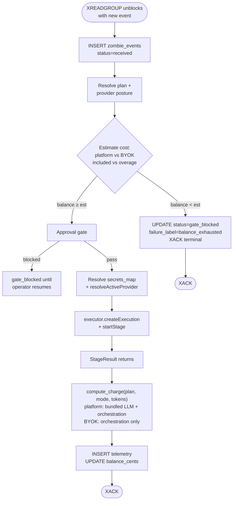

# Scenario 03 — Balance gate, plan tiers, and what we charge for

**Persona:** Operator past the free tier. Either still on platform-managed Anthropic (paying us bundled), or on BYOK Fireworks (paying Fireworks for inference + paying us for orchestration). Either way, the balance gate is the load-bearing mechanism that keeps a runaway zombie from spending unbounded money.

**Outcome under test:** A tenant whose balance reaches zero stops dispatching new events at the gate. The operator gets a clear "credit exhausted" UX, a 1-click upgrade path, and an unambiguous picture of what's metered under each plan and each provider posture.

> Current `main` note: the universal balance-gate semantics in this scenario are current, but any references to tenant-scoped `tenant_providers` or `zombiectl provider set` describe the intended M48 contract. Today the shipped BYOK credential storage surface is workspace-scoped `PUT /v1/workspaces/{workspace_id}/credentials/llm`.



---

## 1. Plan structure (v2)

Three plans. Tenant-scoped, billed monthly, can be combined with either platform or BYOK provider posture.

| Plan | Monthly | Included events | Overage (platform) | Overage (BYOK) | Notes |
|---|---|---|---|---|---|
| **Free** | $0 | 50 events / mo | n/a — gate trips at zero | n/a — gate trips at zero | Single workspace. No BYOK (paid plans only). |
| **Team** | $99 | 2,000 events / mo | $0.05 / event | $0.01 / event | Multi-workspace per tenant. BYOK enabled. |
| **Scale** | $499 | 15,000 events / mo | $0.03 / event | $0.005 / event | All Team features + priority support, longer retention. |

Pricing is illustrative — the architectural shape is what matters.

What an "event" is for billing: one entry on `zombie:{id}:events` that the worker dispatches into `executor.startStage`. Steer, webhook, cron, and continuation all count as one event each. Gate-blocked events count as **zero** (they never reach the executor; we charged nothing).

The provider posture changes only the **overage rate**, not the gate logic. Free plan does not allow BYOK because BYOK pricing presumes a paid baseline.

---

## 2. What we meter under each posture

The two postures meter different things because the cost structure is different:

### Platform-managed (we pay Anthropic / OpenAI / etc.)

| Cost component | Source of truth | Charged to operator |
|---|---|---|
| LLM tokens (input + output) | `StageResult.tokens` | Bundled into per-event price |
| Egress / storage | Hosting provider | Bundled |
| Orchestration (worker + executor + DB + Redis) | UseZombie infra | Bundled |

One per-event price covers all three. The bundled rate has margin over our wholesale LLM cost.

### BYOK (operator pays the LLM provider directly)

| Cost component | Source of truth | Charged to operator |
|---|---|---|
| LLM tokens | Operator's provider account (Fireworks, etc.) | Provider bills operator directly |
| Egress / storage | UseZombie hosting | Bundled |
| Orchestration | UseZombie infra | Per-event orchestration fee |

The operator pays Fireworks for the Kimi inference. We charge a smaller per-event orchestration fee (margin over our infra cost only, no LLM markup).

This means the **balance gate stays on for both postures** — only the cost function differs. Earlier drafts said "BYOK skips balance gate"; that's wrong. BYOK skips only the LLM-token meter.

---

## 3. The gate — code path

In `processEvent`, before the executor call:

```
1. INSERT core.zombie_events (status='received')
2. PUBLISH event_received

3. Balance gate:
   - resolve tenant plan (tenant_billing.plan)
   - resolve provider posture (tenant_providers.mode)
   - estimate event cost:
       if mode=platform: overage_rate_platform[plan] (or zero if within included)
       if mode=byok:     overage_rate_byok[plan]     (or zero if within included)
   - if tenant_billing.balance_cents < estimated_cost:
       UPDATE core.zombie_events
         SET status='gate_blocked',
             failure_label='balance_exhausted',
             updated_at=now()
       PUBLISH event_complete (status=gate_blocked)
       XACK
       — done. Operator sees the row in zombiectl events.

4. Approval gate (separate, using the same gate-blocked lifecycle).
5. Resolve secrets_map.
6. executor.createExecution.
7. executor.startStage.
8. UPDATE core.zombie_events (status=processed).
9. INSERT zombie_execution_telemetry:
       credit_deducted_cents = compute_charge(plan, mode, tokens)
   compute_charge:
       if within included quota for the month → 0
       elif mode=platform → overage_rate_platform[plan]
       elif mode=byok     → overage_rate_byok[plan]
10. UPDATE tenant_billing SET balance_cents = balance_cents - credit_deducted_cents.
11. UPSERT zombie_sessions, PUBLISH event_complete, XACK.
```

The gate is **single-pass at step 3**. If the operator's balance can't cover the estimated cost of *one* event, the event is rejected at the gate. The estimate is conservative (use the overage rate, not the actual token count — we don't know it yet).

Mid-event balance crossing zero is fine: in-flight events run to completion. The next event hits the gate.

---

## 4. The credit-exhausted UX

When the gate blocks, the operator's surfaces show:

- **`zombiectl events {id}`**: the gate-blocked row appears with `status='gate_blocked'`, `failure_label='balance_exhausted'`. The CLI prints a one-liner suggestion: `⚠ Tenant balance exhausted. Upgrade or top up: zombiectl plan upgrade`.
- **Dashboard `/zombies/{id}/events`**: the row renders with a red `Blocked: balance` chip and an inline upgrade CTA.
- **Slack (if the SKILL.md author wired it)**: optional — the SKILL.md prose can include a "if I can't run, post to #ops-billing" instruction. Out-of-the-box samples don't include this; it's an authoring choice.
- **Email** (optional follow-up surface): a daily digest "you blocked N events yesterday — upgrade?".

The blocked row is **terminal** (XACKed, immutable narrative). When the operator tops up, **no automatic replay**. If they want the missed events processed, they either:

1. Re-trigger from the source (push another commit, send another steer), or
2. Use the dashboard or CLI resume affordance, which synthesises an `actor=continuation:<original>` event referencing `resumes_event_id=<blocked_row>`.

The reasoning is that a balance-exhausted event is usually evidence the operator was already off the rails (runaway loop, mis-configured cron). Auto-replay would compound the bill.

---

## 5. Switching postures mid-month

An operator can switch between platform and BYOK at any time. Effects:

- **Platform → BYOK** (e.g. operator runs out of platform credit, brings own Fireworks key): `provider set` flips `tenant_providers.mode=byok` immediately. Next event uses BYOK's lower overage rate. In-flight events finish at the platform rate they were claimed under.
- **BYOK → platform** (operator stops paying Fireworks): `provider reset` flips `mode=platform`. Next event uses the platform overage rate. If the operator's balance is now too low for platform pricing, the gate trips on the next event.
- **Mid-event change**: the snapshot at claim time wins. Provider posture is resolved exactly once, before `createExecution`.

The "in-flight events" question matters because BYOK and platform have wildly different per-event costs. We never want a request that the operator started under one posture to bill at another.

---

## 6. What this scenario proves

- Balance gate is a single code path. It runs for both postures. The cost function differs; the gate logic does not.
- Free plan doesn't allow BYOK. BYOK costs us less to serve, but presumes the operator is paying upstream — the Free tier is for evaluation, and giving free orchestration to operators with their own LLM key would be a vector for abuse.
- The operator's billing surface is `tenant_billing.balance_cents` — same column, regardless of posture. The composition of what depleted it (LLM tokens vs orchestration fees) is a reporting concern, not a runtime concern.
- No auto-replay of gate-blocked events. Resume is always a deliberate operator action.
- Plan changes and provider posture changes are independent. Tenant can be on Scale + platform, Team + BYOK, etc. Five product combinations from two orthogonal axes.

---

## 7. Open product questions deferred from this scenario

- Pre-paid credits vs. post-paid invoicing for Team/Scale. v2 starts pre-paid only — simpler dunning, no AR risk.
- Per-workspace soft caps inside a tenant (e.g. "the staging workspace can spend at most $10/day even if the tenant balance is $1000"). v3 work — needs a new gate at the workspace level.
- Refunds for events that completed but produced obviously broken output. Manual support process in v2.
- Volume discounts beyond Scale (Enterprise tier). Sales-led, off-list pricing, deferred.
