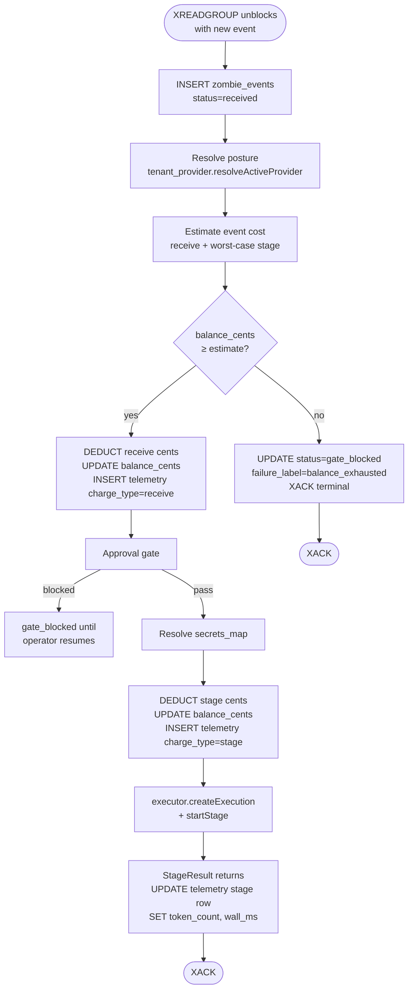

# Scenario 03 — The credit pool, two postures draining at different rates

**Personas — John Doe and Jane Doe.** Both are past the wedge demo (Scenario 01) and have one running zombie each. Both started with the same one-time $10 starter grant. John stays on platform-managed; Jane has activated BYOK with Fireworks (Scenario 02 setup complete). This scenario watches their credits drain over a normal week and ends with the gate tripping.

**Outcome under test:** A tenant whose `core.tenant_billing.balance_cents` reaches zero stops dispatching new events at the gate. Same code path under both postures; only the per-event drain rate differs. The operator gets a clear "credits exhausted" UX pointing at the dashboard billing page. There is no Stripe purchase flow in v2.0 — exhausted operators contact support for a manual top-up.



> Single source of truth for the cost model: [`../billing_and_byok.md`](../billing_and_byok.md). This scenario walks through what those numbers mean in practice for one operator over one week.

---

## 1. The credit pool

Both John and Jane start with the same balance:

```
SELECT balance_cents FROM core.tenant_billing WHERE tenant_id = $1;
 balance_cents
---------------
          1000
(1 row)
```

That's $10 USD, granted once at tenant-create. There is no monthly refill. There are no plan tiers in the gate — every tenant runs through the same `processEvent` code path and the same `compute_*_charge` functions. The only number that varies is the drain rate, and the drain rate is purely posture-dependent.

Plans (Free / Team / Scale, if they exist as marketing constructs) only show up at credit-grant time as bigger or smaller starting numbers — never inside the gate or the cost function. In v2.0 we ship one tier: $10 starter grant for every new tenant.

---

## 2. John Doe — platform-managed, token-based drain

**Setup recap.** John ran the wedge demo. His tenant has no `core.tenant_providers` row — the resolver synthesises the platform default: `mode=platform`, `provider=anthropic`, `model=claude-sonnet-4-6`, `context_cap_tokens=200000`. The platform-side server config holds the actual Anthropic api_key.

### 2.1 First webhook fires (Monday morning)

```
XREADGROUP unblocks → INSERT zombie_events (status='received')
resolveActiveProvider → mode=platform
estimate cost = compute_receive_charge(.platform)
              + compute_stage_charge(.platform, claude-sonnet-4-6,
                                     worst_case_in=900, worst_case_out=1200)
              = 1¢ + (1¢ + 0¢ + 1¢) = 3¢

gate: 1000¢ ≥ 3¢ → pass

DEDUCT RECEIVE
  UPDATE tenant_billing SET balance_cents = 1000 - 1 = 999
  INSERT zombie_execution_telemetry
    (event_id, posture='platform', model='claude-sonnet-4-6',
     charge_type='receive', credit_deducted_cents=1)

approval gate → pass (no destructive tools in this run)

resolveSecretsMap → {fly, slack, github}

DEDUCT STAGE
  UPDATE tenant_billing SET balance_cents = 999 - 2 = 997
  INSERT zombie_execution_telemetry
    (event_id, posture='platform', model='claude-sonnet-4-6',
     charge_type='stage', credit_deducted_cents=2)

executor.createExecution → executor.startStage
  outbound to api.anthropic.com
  StageResult returns: tokens(in=820, out=1040), wall=8.2s

UPDATE zombie_execution_telemetry  (the stage row)
  SET token_count_input=820, token_count_output=1040, wall_ms=8210

reconcile actual cost:
  actual_stage = compute_stage_charge(.platform, sonnet, 820, 1040)
               = 1¢ + ((300×820 + 1500×1040) / 1_000_000) ≈ 1¢ + 1¢ = 2¢
  matches the conservative estimate; no adjustment.

UPDATE zombie_events status='processed'
XACK
```

After event 1: balance = 997¢. John spent 3¢ for one event.

### 2.2 Through the week

Monday's webhook + steers run. John gets ~30 events Monday at an average of 3¢ each = 90¢ spent. Tuesday is busier (a flaky deployment generates 50 webhook events, plus a few manual steers) — say 60 events × ~3¢ = 180¢ spent. By end of Tuesday: 1000 − 90 − 180 = 730¢ left.

Wednesday through Friday continue at ~40 events/day × ~3¢ = ~120¢/day.

End of Friday: 730 − 360 = 370¢ left.

Saturday is quiet but a long-running incident triggers a multi-stage continuation (4 continuation events on the same incident). Each continuation event still goes through `processEvent` independently — receive cent, stage cents — so the 4 continuations add ~12¢ on top of normal Saturday activity.

By Sunday evening: ~50¢ left. The gate hasn't tripped yet, but the next big incident will exhaust it.

### 2.3 Monday morning, the gate trips

A 30-event burst from a CD pipeline misfire hits John's webhook URL. `processEvent` runs through 17 events (drains 50¢ → near 0¢) before the 18th event fires:

```
estimate cost = 3¢
gate: 0¢ < 3¢ → BLOCK

UPDATE zombie_events
  SET status='gate_blocked', failure_label='balance_exhausted'
PUBLISH event_complete (status=gate_blocked)
XACK terminal
```

Events 18 through 30 all gate-block in turn. None of them touch the executor; UseZombie's costs for them are SQL-only.

John's experience:

- His Slack stops getting diagnoses around 09:14 UTC.
- He runs `zombiectl billing show` (next section's transcript).
- He sees the empty-balance state in the dashboard and emails support for a top-up. (Stripe Purchase Credits ships in v2.1.)
- After support tops him up to $10 again, he can re-trigger the missed events manually if any are worth running. There is no auto-replay of gate-blocked events.

---

## 3. Jane Doe — BYOK Fireworks Kimi K2.6, flat drain

**Setup recap.** Jane completed Scenario 02. Her `tenant_providers` row: `mode=byok`, `provider=fireworks`, `model=accounts/fireworks/models/kimi-k2.6`, `context_cap_tokens=256000`, `credential_ref=account-fireworks-byok`. The vault holds her `fw_LIVE_…` key.

### 3.1 First webhook fires

```
resolveActiveProvider → mode=byok, api_key=fw_LIVE_…, model=kimi-k2.6
estimate cost = compute_receive_charge(.byok) + compute_stage_charge(.byok, …)
              = 0¢ + 1¢ = 1¢

gate: 1000¢ ≥ 1¢ → pass

DEDUCT RECEIVE → 0¢ deducted (BYOK receive is zero in v2.0)
  INSERT telemetry (charge_type='receive', credit_deducted_cents=0)

DEDUCT STAGE → 1¢ deducted
  UPDATE balance_cents = 1000 - 1 = 999
  INSERT telemetry (charge_type='stage', credit_deducted_cents=1)

executor.startStage with provider_api_key=fw_LIVE_… → outbound to
  api.fireworks.ai/inference/v1/chat/completions
StageResult returns: tokens(in=820, out=1320), wall=11.4s
  — tokens recorded on the row, but compute_stage_charge under BYOK
    does NOT consume them (flat 1¢ regardless of token count)

UPDATE telemetry stage row SET token_count_input=820, token_count_output=1320,
                              wall_ms=11400
(credit_deducted_cents stays 1¢; tokens are FYI only under BYOK)

UPDATE zombie_events status='processed'
XACK

Fireworks bills Jane's Fireworks account directly for the 820+1320 tokens
of Kimi K2.6 on her own monthly invoice. UseZombie sees only the
StageResult.tokens count for telemetry; we do not know what Fireworks
charged Jane for those tokens, and we do not care.
```

After event 1: balance = 999¢. Jane spent 1¢ on UseZombie. Fireworks separately bills her some fraction of a cent for the LLM call.

### 3.2 Through the week

Same shape of activity as John's Monday-Sunday week — same workload, same number of events. But every event drains 1¢ instead of ~3¢:

- Mon: 30 events × 1¢ = 30¢.
- Tue: 60 events × 1¢ = 60¢.
- Wed-Fri: 120 events × 1¢ = 120¢.
- Sat (incident with 4 continuations): ~44 events × 1¢ = 44¢.
- Sun: 30 events × 1¢ = 30¢.

End of Sunday: 1000 − 284 = 716¢ left.

Jane's UseZombie credits last roughly 3× longer than John's for the same workload. Her Fireworks bill, separately, reflects the actual token cost on her own provider — which may be cheaper or more expensive than Anthropic Sonnet at the wholesale level, but doesn't touch UseZombie's books.

### 3.3 The gate eventually trips for Jane too — just later

Jane keeps running for ~3 weeks before her $10 starter grant runs out. When it does, the gate trips identically:

```
estimate cost = 1¢
gate: 0¢ < 1¢ → BLOCK
```

She gets the same `balance_exhausted` state, the same dashboard CTA, the same support-email path for a top-up. The drain rate differed; the failure mode is identical.

---

## 4. Side-by-side comparison

| Aspect | John (platform) | Jane (BYOK Fireworks) |
|---|---|---|
| `tenant_providers` row | Absent (synth-default) | `mode=byok`, `credential_ref=account-fireworks-byok` |
| Resolver returns | `{provider: anthropic, api_key: <PLATFORM>, model: claude-sonnet-4-6, …}` | `{provider: fireworks, api_key: fw_LIVE_…, model: …kimi-k2.6, …}` |
| Receive deduct per event | 1¢ | 0¢ |
| Stage deduct per event | 1¢ overhead + token cost (~1–4¢ for typical events on Sonnet) | 1¢ flat |
| Typical per-event total | ~3¢ | 1¢ |
| LLM bill payer | UseZombie (passthrough in our token rate) | Jane's Fireworks account directly |
| Outbound LLM call | `api.anthropic.com` | `api.fireworks.ai/inference/v1` |
| `$10 starter grant` lasts | ~7 days at moderate use | ~21 days at the same workload |
| Gate code path | Identical | Identical |
| Telemetry rows per event | 2 (receive + stage) | 2 (receive=0¢, stage=1¢) |

The 2.5–3× drain difference is the BYOK incentive. Jane gets a flexibility win (her own provider, her own model choice, her own enterprise procurement) **and** a longer runway on UseZombie credits. She still pays Fireworks separately for the actual tokens.

---

## 5. Switching posture mid-stream

Either operator can flip postures at any time. The mechanics:

- **John flips to BYOK** (let's say he gets an OpenRouter account so he can experiment with Kimi K2):
  ```
  zombiectl credential set my-openrouter --data '{
    "provider": "openrouter",
    "api_key":  "sk-or-…",
    "model":    "moonshotai/kimi-k2"
  }'
  zombiectl tenant provider set --credential my-openrouter
  ```
  Next event resolves `mode=byok`. Drain drops from ~3¢ to 1¢ per event. John's remaining credits last longer. The api_key is in vault; he never sees it again from any UseZombie surface.

- **Jane flips back to platform** (Fireworks billing issue, she pauses BYOK):
  ```
  zombiectl tenant provider reset
  ```
  Next event resolves `mode=platform`. Drain jumps from 1¢ to ~3¢. If her balance is now too low for the platform-rate worst-case estimate, the gate trips on the next event — she'd see the credit-exhausted UX and need to top up.

In-flight events finish under the posture they were claimed under (gate snapshot). No mid-execution re-billing.

---

## 6. The credit-exhausted user experience — terminal transcripts

### 6.1 What John sees when the gate trips

```text
$ zombiectl events zmb_01HX9N3K… --since 24h | head -3
EVENT_ID                 ACTOR             STATUS         FAILURE_LABEL
evt_01HXG2K4…           webhook:github    gate_blocked   balance_exhausted
evt_01HXG2K3…           webhook:github    gate_blocked   balance_exhausted
evt_01HXG2K2…           webhook:github    gate_blocked   balance_exhausted

ⓘ Credits exhausted. See https://app.usezombie.com/settings/billing
```

```text
$ zombiectl billing show
Tenant balance:    $0.00 (0¢)

Last 10 events drained credits:
  EVENT_ID         POSTURE   MODEL                IN_TOK  OUT_TOK  RECEIVE  STAGE  TOTAL
  evt_01HXG2K0…    platform  claude-sonnet-4-6     820     1040       1¢     2¢     3¢
  evt_01HXG2JZ…    platform  claude-sonnet-4-6     800     1100       1¢     2¢     3¢
  evt_01HXG2JY…    platform  claude-sonnet-4-6     880     1320       1¢     2¢     3¢
  …

ⓘ Out of credits? See https://app.usezombie.com/settings/billing
   Stripe purchase ships in v2.1; for now contact support for a top-up.
```

Dashboard `/settings/billing` shows:

- Headline: **$0.00 USD**.
- **Purchase Credits** button (disabled, tooltip "Coming in v2.1 — contact support for a top-up").
- Usage tab populated with John's drain history.
- Invoices tab: empty state.
- Payment Method tab: empty state.
- Auto Top Up card: hidden (not shipped in v2.0).

### 6.2 What Jane sees three weeks later

Identical to John's view, except the Usage tab shows BYOK rows:

```text
$ zombiectl billing show
Tenant balance:    $0.00 (0¢)

Last 10 events drained credits:
  EVENT_ID         POSTURE  MODEL                            IN_TOK  OUT_TOK  RECEIVE  STAGE  TOTAL
  evt_01HXJ4P7…    byok     accounts/.../kimi-k2.6            820     1320       0¢     1¢     1¢
  evt_01HXJ4P6…    byok     accounts/.../kimi-k2.6            800     1240       0¢     1¢     1¢
  …

ⓘ Out of credits? See https://app.usezombie.com/settings/billing
   Stripe purchase ships in v2.1; for now contact support for a top-up.
```

The `IN_TOK` and `OUT_TOK` columns are present under BYOK for transparency (Jane can see how many tokens her zombies are consuming — useful for her separate Fireworks-bill review), but the `STAGE` cents column is flat 1¢ regardless of token count under BYOK.

### 6.3 No automatic replay

Once topped up (manually in v2.0; via Stripe in v2.1+), the gate-blocked events do **not** auto-replay. If the operator wants to re-process a missed webhook, they:

1. Re-trigger from the source (push a no-op commit, send another steer), or
2. Use the resume affordance — which writes an `actor=continuation:<original>` event referencing `resumes_event_id=<blocked_row>`, dispatched cleanly through the gate at the new balance.

The reasoning is that a balance-exhausted event is usually evidence the operator was already off the rails (runaway loop, mis-configured cron). Auto-replay would compound the bill.

---

## 7. Edge cases

### 7.1 Mid-event balance crossing zero

In-flight events finish at the snapshot taken at gate time. Both deductions (receive + stage) committed before the executor ran; the executor's success or failure does not retroactively adjust the deduction. If the operator's balance crosses zero during a long stage, the next event hits the gate cleanly and blocks.

### 7.2 Concurrent events on near-zero balance

Two events claim the queue simultaneously, both pass the gate (balance was sufficient for one), both deduct → balance briefly goes negative. We accept the small overshoot rather than serialise all events behind a row lock that would limit throughput. The next event sees `balance_cents < 0`, gate trips, system stabilises.

### 7.3 Posture flip mid-event

The resolver runs exactly once at gate time (step "Resolve posture" in the flowchart). Whatever posture it returned is the snapshot for both deductions and the outbound LLM call. A `tenant provider set` that lands during step 3-7 of the flowchart has no effect on this event; it takes effect on the next event.

### 7.4 BYOK credential deleted while still in BYOK mode

Resolver returns `error.CredentialMissing`. Event dead-letters with `failure_label='provider_credential_missing'`. **Receive is not debited** (we couldn't even resolve posture, so we wouldn't know which receive rate to use); the dead-letter row stays at the very-early step. This is a different terminal state than `balance_exhausted` and the dashboard distinguishes them.

---

## 8. What this scenario proves

- **Same code path serves both postures.** The gate, the receive deduct, the stage deduct, and the telemetry rows are identical SQL; only the cents differ.
- **Drain rate is the BYOK signal.** Jane's UseZombie credits last ~3× longer than John's for identical workloads — a transparent, observable benefit of bringing a key.
- **Plan tiers are not a code-path concept.** They never appear inside `processEvent` or `compute_*_charge`. Future plan tiers will manifest only as different starting grants or recurring top-ups, not as branches in the gate.
- **The api_key boundary holds in production paid-plan traffic.** A grep across `core.zombie_events`, `core.zombie_execution_telemetry`, worker logs, executor logs, and HTTP responses for either api_key (PLATFORM_ANTHROPIC or `fw_LIVE_…`) returns zero hits across the entire week's run. (M48 acceptance criterion; tested in CI.)
- **The credit-exhausted UX is a dashboard story, not a CLI story.** The CLI surfaces the state and points at the dashboard. Purchase / top-up are dashboard-shipping concerns (and ship empty in v2.0, with the actual Stripe integration in v2.1).

---

## 9. Open questions deferred to v2.1+ and v3

- **Stripe Purchase Credits flow.** v2.1. Adds `core.credit_purchases` table, Stripe webhook handler, dashboard button enablement.
- **Auto Top Up** when balance drops below a threshold. v2.1.
- **Plan tiers as recurring credit grants.** v2.1+ if onboarding metrics suggest the $10 starter is the wrong knob. Any plan tier ships as a recurring Stripe charge that tops up `balance_cents` — never as a branch inside `compute_charge`.
- **Refund-on-actual-tokens.** v3. Today the conservative estimate is the charge; reconciling to actual tokens adds bookkeeping for marginal accuracy gain.
- **Per-workspace soft caps inside a tenant.** v3 — needs a new gate at the workspace level.
- **Volume discounts.** v3, sales-led.
- **Auto-fallback from BYOK to platform on provider error.** Errors surface to the operator; no silent fallback (would charge them without consent).
