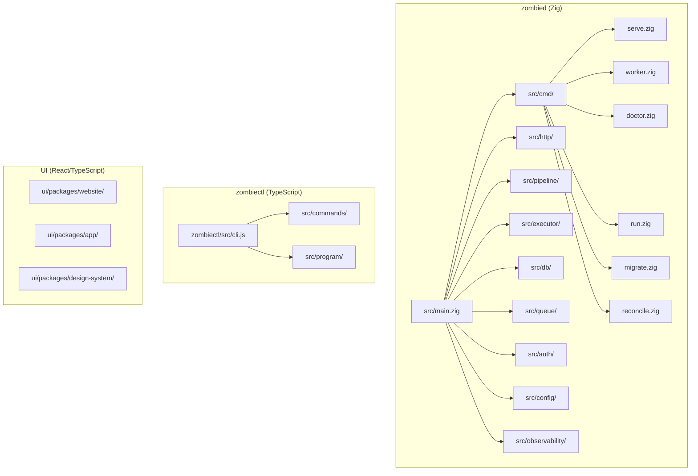

# Source tree

## Module map

## Top-level directories

| Directory | Language | Description |
|-----------|----------|-------------|
| `src/` | Zig | zombied server and worker. The core of the platform. |
| `src/cmd/` | Zig | CLI subcommands for zombied (`serve`, `worker`, `doctor`, `run`, `migrate`, `reconcile`). |
| `src/http/` | Zig | HTTP route handlers for the REST API. |
| `src/pipeline/` | Zig | Spec parsing, gate evaluation, and scorecard generation. |
| `src/executor/` | Zig | Run execution engine. Manages sandbox lifecycle and agent orchestration. |
| `src/db/` | Zig | Database layer. Migrations, queries, and connection pooling (Postgres). |
| `src/queue/` | Zig | Job queue backed by Redis. Handles run scheduling and worker dispatch. |
| `src/auth/` | Zig | Authentication and authorization. Clerk token validation, workspace-scoped access. |
| `src/config/` | Zig | Configuration loading from environment, files, and defaults. |
| `src/observability/` | Zig | Structured logging, metrics, and tracing. |
| `zombiectl/` | TypeScript | CLI tool for developers. Wraps the REST API with ergonomic commands. |
| `ui/packages/website/` | React/TS | Marketing website and documentation. |
| `ui/packages/app/` | React/TS | Dashboard application for workspace and run management. |
| `ui/packages/design-system/` | React/TS | Shared component library across UI packages. |

## Pipeline model

The pipeline executes stages defined by the active profile, loaded from `config/pipeline-default.json` at worker startup. If that file is absent, a compiled-in fallback (`DEFAULT_PROFILE_JSON` in `src/pipeline/topology.zig`) is used.

The default profile defines three stages: plan (echo skill), implement (scout skill), and verify (warden skill). Custom profiles declare their own `role_ids` and `skill_ids` — the platform does not hardcode these names.

**Key invariant (M20_001):** No production code may branch on the literal strings `"echo"`, `"scout"`, or `"warden"` as role or skill identifiers. All role and skill resolution goes through the active profile and the `SkillRegistry`. The `_hardcoded_role_check` lint gate (part of `make lint-zig`) enforces this on every commit.
