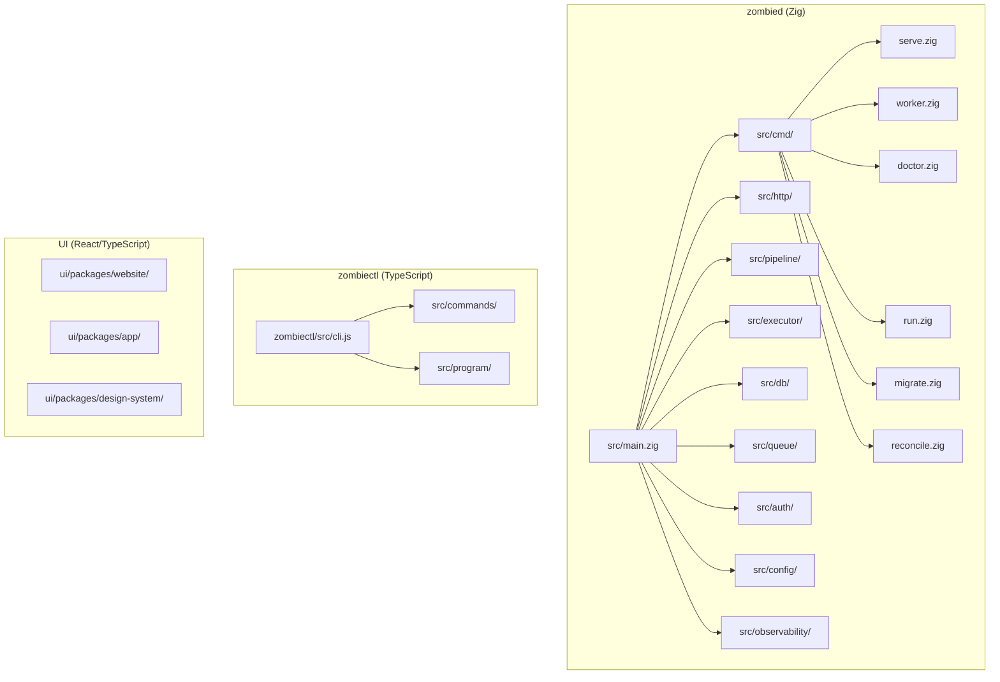

# Source tree

## Module map



## Top-level directories

| Directory | Language | Description |
|-----------|----------|-------------|
| `src/` | Zig | zombied server and worker. The core of the platform. |
| `src/cmd/` | Zig | CLI subcommands for zombied (`serve`, `worker`, `doctor`, `run`, `migrate`, `reconcile`). |
| `src/http/` | Zig | HTTP route handlers for the REST API. |
| `src/pipeline/` | Zig | Spec parsing, gate evaluation, and scorecard generation. |
| `src/executor/` | Zig | Run execution engine. Manages sandbox lifecycle and agent orchestration. |
| `src/db/` | Zig | Database layer. Migrations, queries, and connection pooling (Postgres). |
| `src/queue/` | Zig | Job queue backed by Redis. Handles run scheduling and worker dispatch. |
| `src/auth/` | Zig | Authentication and authorization. Clerk token validation, workspace-scoped access. |
| `src/config/` | Zig | Configuration loading from environment, files, and defaults. |
| `src/observability/` | Zig | Structured logging, metrics, and tracing. |
| `zombiectl/` | TypeScript | CLI tool for developers. Wraps the REST API with ergonomic commands. |
| `ui/packages/website/` | React/TS | Marketing website and documentation. |
| `ui/packages/app/` | React/TS | Dashboard application for workspace and run management. |
| `ui/packages/design-system/` | React/TS | Shared component library across UI packages. |

## Pipeline model

The pipeline executes stages defined by the active profile, loaded from `config/pipeline-default.json` at worker startup. If that file is absent, a compiled-in fallback (`DEFAULT_PROFILE_JSON` in `src/pipeline/topology.zig`) is used.

The default profile defines three stages: plan (echo skill), implement (scout skill), and verify (warden skill). Custom profiles declare their own `role_ids` and `skill_ids` — the platform does not hardcode these names.

**Key invariant (M20_001):** No production code may branch on the literal strings `"echo"`, `"scout"`, or `"warden"` as role or skill identifiers. All role and skill resolution goes through the active profile and the `SkillRegistry`. The `_hardcoded_role_check` lint gate (part of `make lint-zig`) enforces this on every commit.

## Agent relay model

For lightweight agent interactions (spec init, impact preview), zombied acts as a
stateless relay between the CLI and the workspace's LLM provider. Unlike the pipeline
model (which queues jobs and runs agents in sandboxes), the relay model has no server
state, no sandbox, and no job queue.

**Architecture (M18_003):**

```
zombiectl (CLI)                   zombied                     LLM Provider
─────────────────                 ──────                      ────────────
POST /v1/agent/stream
  { mode, messages, tools } ────→ resolve workspace provider
                                  add system prompt + API key
                                  forward ───────────────────→
                                                           ←── tool_use: read_file("go.mod")
                              ←── SSE: event: tool_use
CLI executes tool locally
POST /v1/agent/stream
  { messages: [...accumulated,
    tool_result] } ─────────────→ forward ───────────────────→
                                                           ←── text: "# M5_001..."
                              ←── SSE: event: text_delta
                              ←── SSE: event: done { usage }
```

**Key properties:**
- **Stateless:** CLI manages conversation history and resends with each POST. zombied
  holds nothing between requests. Same pattern as Anthropic's Messages API.
- **Provider-agnostic:** zombied resolves the LLM provider from workspace config.
  Could be Anthropic, OpenAI, Google, or user's own key.
- **Files stay local:** CLI executes read-only tools (read_file, list_dir, glob) on
  the user's laptop. Files only leave the machine one at a time when the model asks.
- **Security:** CLI validates all tool call paths against the repo root before reading.
  zombied has no path awareness.
- **Protocol:** Multi-request loop over HTTP/1.1 keep-alive. Each tool result is a new
  POST to the same endpoint with accumulated messages.

**When to use which model:**

| Use case | Model | Why |
|----------|-------|-----|
| `spec init`, `run --preview` | Agent relay | Short-lived (5-8s), read-only, needs local file access |
| `run` (full execution) | Pipeline | Long-lived (1-5min), needs write access, sandbox isolation |

**Reference:** Claude Code (~/Projects/claurst/) and OpenCode (~/Projects/opencode/)
use the same pattern: CLI holds tools, model calls them on demand, API is a relay.
The difference is zombied sits between CLI and provider (because API keys are
server-side), whereas Claude Code calls the provider directly.
