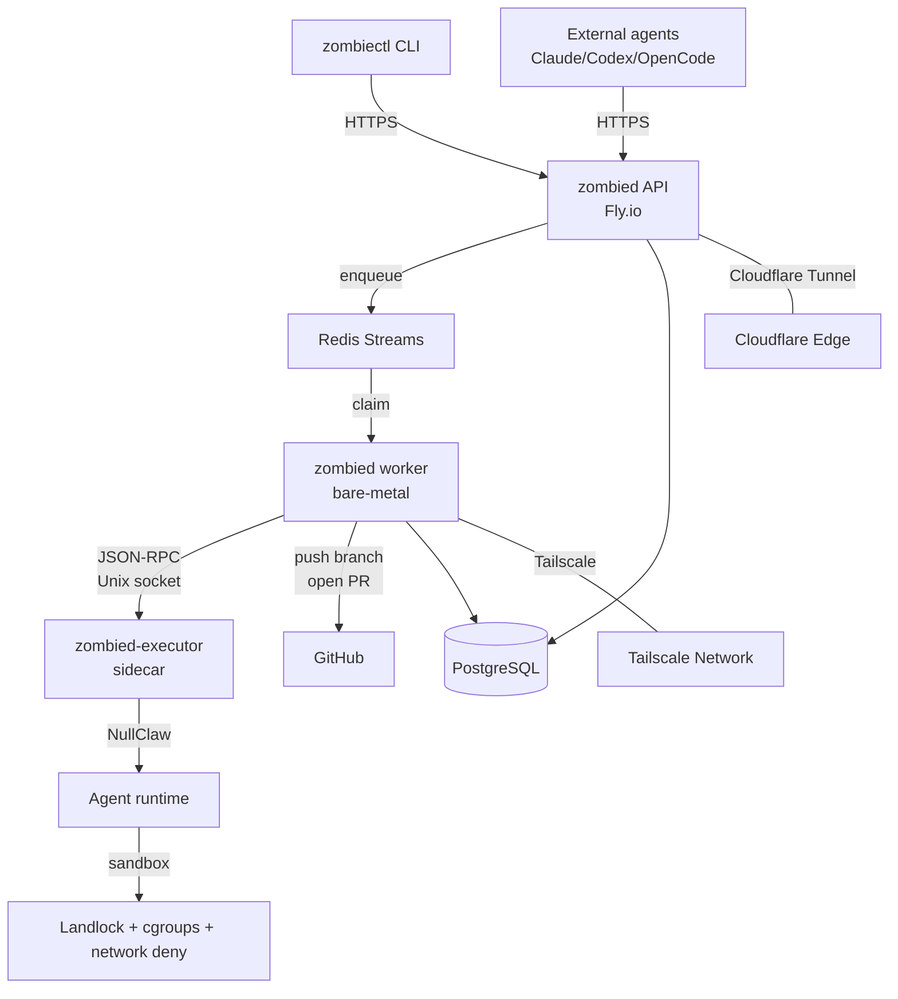

# Architecture overview

Date: Mar 28, 2026
Status: Canonical architecture reference for UseZombie v1

For step-by-step deployment playbooks, see the `playbooks/` directory.
For sandbox enforcement details, see `docs/operator/security/sandbox.md`.
For observability (metrics, error codes, PostHog), see `docs/operator/observability/`.
For RBAC and policy guards, see `docs/operator/security/rbac.md`.
For per-component deployment, see `api-server.md`, `worker.md`, and `executor.md` in this directory.

## System diagram

UseZombie is a spec-driven agent delivery platform. You submit a spec, and the system produces a pull request. Three runtime components handle this pipeline — all compiled from the same Zig binary (`zombied`) with different subcommands.



## Components

### zombiectl

The CLI client. Operators and developers use `zombiectl` to submit specs, check run status, manage workspaces, and configure harnesses. It authenticates via Clerk and talks HTTPS to the API server. Distributed as a standalone binary for macOS and Linux.

### zombied API

The HTTP API server, started with `zombied serve`. Runs on Fly.io behind a Cloudflare Tunnel — no public `*.fly.dev` address is exposed. Handles authentication, workspace management, spec validation, run creation, and webhook delivery. Exposes Prometheus metrics on a separate port.

### zombied worker

The execution orchestrator, started with `zombied worker`. Runs on OVHCloud bare-metal machines connected via Tailscale. Claims work from Redis Streams, manages the run lifecycle (clone, stage execution, gate loop), and pushes branches and opens pull requests on GitHub when runs complete.

### zombied-executor

The sandboxed execution sidecar, started as a separate systemd service. Communicates with the worker over a Unix socket using JSON-RPC. Embeds the NullClaw agent runtime and applies sandbox policies (Landlock, cgroups v2, network deny) to every agent execution. This is the only component that runs untrusted agent code.

### Redis

Redis Streams serves as the work queue between the API and workers. The API enqueues run payloads, and workers claim them using consumer groups. Redis also powers distributed locking for worker fleet coordination.

### PostgreSQL

The persistent store for all domain state: workspaces, runs, stages, scorecards, billing records, and the transactional outbox. Both the API and worker connect directly. Migrations are managed by `zombied migrate`.

### Clerk

Third-party authentication provider. Handles user sign-up, sign-in, session tokens, and JWT verification. The API server validates Clerk JWTs on every request. Workspace membership and role assignment are stored in PostgreSQL and enforced server-side.

### GitHub App

The UseZombie GitHub App is installed on target repositories. The worker uses it to clone repos, push implementation branches, and open pull requests. Installation tokens are scoped per-repository with one-hour TTL, requested on demand by the worker for each run.

## Version roadmap

| Version | Codename | Focus |
|---------|----------|-------|
| **v1** | Ship | End-to-end spec-to-PR pipeline. Bubblewrap sandbox, CLI-first UX, free and paid billing tiers. |
| **v2** | Harden | Firecracker VM isolation, libgit2 native git (no subprocess), semgrep/gitleaks gates on PRs, webhook delivery hardening. |
| **v3** | Scale | Mission Control web UI, team model with org-level billing, multi-region worker fleet, self-hosted worker support. |

## Canonical assumptions

1. `zombied` is split into API and worker roles.
2. Postgres is the source of truth for run state, artifacts, and policy history.
3. Redis is mandatory for queueing and worker coordination.
4. Worker orchestration and dangerous code execution are separate runtime boundaries.
5. v1 execution durability is stage-boundary durability, not mid-token session migration.
6. The worker-facing executor contract must survive a future backend swap from host sandbox to Firecracker.

## Canonical execution lifecycle

1. **spec request:** `zombiectl` submits a run request to the API.
2. **worker scheduling:** API writes the run row and enqueues `run_id` in Redis.
3. **profile resolution:** worker resolves the active workspace harness/profile.
4. **execution lease:** worker opens an executor session for the active stage.
5. **sandbox execution:** `zombied-executor` runs the stage via embedded NullClaw inside the selected sandbox backend.
   - 5a. **gate loop:** after agent implementation, worker triggers gate tools (`make lint`, `make test`, `make build`) inside the sandbox. On gate failure, stderr/stdout is fed back to the agent as a new conversation turn. Agent self-repairs. Loop repeats up to `max_repair_loops` (default 3, from agent profile).
   - 5b. **gate exhaustion:** if all repair loops are exhausted, worker marks run as `FAILED` with structured gate failure record (gate name, loop count, final stderr).
6. **result evaluation:** worker persists verdict, artifacts, metrics, and failure classification in Postgres.
7. **billing finalization:** completed runs finalize billable usage; free-plan work deducts from the workspace credit ledger only at this point.
8. **iteration loop:** on retryable failure, worker re-enqueues the same `run_id`.
9. **PR creation:** on all gates passing, worker pushes branch (`zombie/<run_id_short>/<spec_slug>`) and opens PR via GitHub App installation token. PR body contains agent-generated plain-english explanation of changes. Scorecard (gate results, loop counts, wall time, tokens) posted as a separate PR comment.

## Runtime boundary

```text
zombiectl / API
      |
      v
  zombied worker
      |
      | JSON-RPC over Unix socket (/run/zombie/executor.sock)
      | CreateExecution -> StartStage(agent_config, tools, message, context) -> GetUsage -> DestroyExecution
      v
 zombied-executor
      |
      +--> runner.zig (agent-agnostic NullClaw bridge)
      |       +--> Config from env + RPC overrides (model, provider, temperature, max_tokens)
      |       +--> Tool set from RPC spec or allTools() fallback
      |       +--> Agent.fromConfig() -> agent.runSingle(composed_message) -> ExecutionResult
      |
      +--> Landlock (filesystem policy)
      +--> cgroups v2 (memory + CPU limits)
      +--> network policy (deny_all)
      +--> executor_metrics -> Prometheus /metrics -> Grafana Cloud
      +--> structured logs -> Loki via OTLP
```

### Fallback path (dev / macOS)

When `EXECUTOR_SOCKET_PATH` is unset, the worker runs NullClaw in-process via `agents.runByRole()`. This preserves local development without requiring the executor sidecar.

### Why this boundary exists

- Keep agent execution crashes and kill paths out of the worker process.
- Make Linux sandbox enforcement authoritative in one place.
- Preserve one worker contract as host sandboxing evolves into Firecracker.
- The executor is agent-agnostic — it receives a NullClaw config and runs any dynamic agent.

## Gate loop architecture

The gate loop is the self-repair cycle that validates agent output before PR creation.

```text
Agent implements spec
  |
  v
Gate: make lint
  |-- PASS --> Gate: make test
  |-- FAIL --> feed stderr to agent, agent repairs, retry (loop N of max_repair_loops)
                |-- PASS --> Gate: make test
                |-- EXHAUSTED --> run FAILED (gate=lint, loops=max_repair_loops)
  |
Gate: make test
  |-- same pattern as lint
  |
Gate: make build
  |-- same pattern as test
  |
All gates PASS --> push branch, open PR with scorecard
```

Gate tools are NullClaw tool definitions passed via the executor `StartStage` RPC payload. The executor remains agent-agnostic — it runs the tools specified in the stage config. The gate loop counter is tracked by the worker, not the executor.

### Run dedup

Duplicate spec submissions are deduplicated by composite key: `sha256(spec_markdown) + repo + base_commit_sha`. If a run with the same key exists in a non-terminal state (PLANNED, RUNNING), the API returns the existing run ID. Terminal runs (COMPLETED, FAILED) do not block resubmission.

### Worktree isolation

Each run gets an isolated git worktree created from the target repo's base branch HEAD:

- Bare repo cache: `/tmp/zombie/repos/<repo_id>/`
- Per-run worktree: `/tmp/zombie/worktrees/<run_id>/`
- Base commit SHA recorded on run row before execution
- Landlock policy scoped to the run's worktree path
- Worktree cleaned up after run completes (pass or fail)

## Failure and restart model

UseZombie is **durable at stage boundaries**:

- Run state is persisted in Postgres.
- Queue state is persisted in Redis.
- In-flight agent process state is not durable.

Operationally:

- If `zombied-executor` crashes mid-stage, the run is retried or blocked from persisted state.
- If the worker crashes mid-stage, the active lease is eventually lost and the stage is restarted.
- Upgrading worker or executor interrupts in-flight work unless the operator first drains active runs.

This is deliberate. We prefer honest restart semantics over pretending we support mid-session migration.

The same honesty applies to free-plan billing:

- Admission checks stop new free-plan execution once credit is exhausted.
- In-flight work is not killed mid-stage on a speculative credit boundary.
- Free credit is deducted only for completed billable runtime.

## Dynamic harness/profile model

Harnesses are workspace-scoped and profile-driven:

- Operators store source.
- Compile candidate versions.
- Activate valid versions.
- Worker resolves the active version before execution.

Stages are defined in the active profile (JSON topology) — not hardcoded. Built-in skill kinds (`echo`, `scout`, `warden`) provide defaults, but custom skills can be registered via `SkillRegistry` and referenced by any profile stage. The executor is agent-agnostic: it receives a NullClaw config + tool spec + message from the worker and runs it without interpreting roles.

## v2 Firecracker model

Firecracker is a backend swap behind the same executor contract:

```text
worker
  -> CreateExecution / StartStage / StreamEvents / CancelExecution / DestroyExecution
  -> backend=firecracker
  -> guest runtime executes stage
  -> worker receives the same typed results and failure signals
```

The point of the executor API is to avoid rewriting the control plane when the backend changes.
