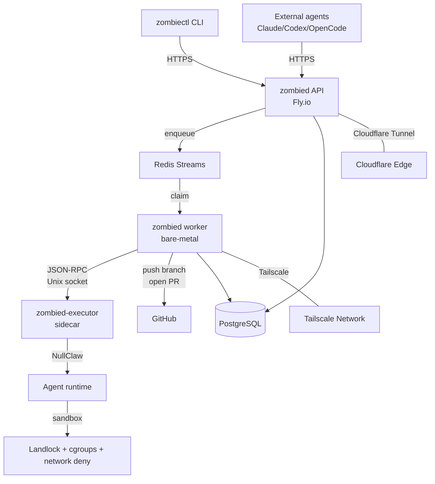

# Architecture overview

For step-by-step deployment playbooks, see the `playbooks/` directory.

## System diagram

UseZombie is a spec-driven agent delivery platform. You submit a spec, and the system produces a pull request. Three runtime components handle this pipeline — all compiled from the same Zig binary (`zombied`) with different subcommands.

## Components

### zombiectl

The CLI client. Operators and developers use `zombiectl` to submit specs, check run status, manage workspaces, and configure harnesses. It authenticates via Clerk and talks HTTPS to the API server. Distributed as a standalone binary for macOS and Linux.

### zombied API

The HTTP API server, started with `zombied serve`. Runs on Fly.io behind a Cloudflare Tunnel — no public `*.fly.dev` address is exposed. Handles authentication, workspace management, spec validation, run creation, and webhook delivery. Exposes Prometheus metrics on a separate port.

### zombied worker

The execution orchestrator, started with `zombied worker`. Runs on OVHCloud bare-metal machines connected via Tailscale. Claims work from Redis Streams, manages the run lifecycle (clone, stage execution, gate loop), and pushes branches and opens pull requests on GitHub when runs complete.

### zombied-executor

The sandboxed execution sidecar, started as a separate systemd service. Communicates with the worker over a Unix socket using JSON-RPC. Embeds the NullClaw agent runtime and applies sandbox policies (Landlock, cgroups v2, network deny) to every agent execution. This is the only component that runs untrusted agent code.

### Redis

Redis Streams serves as the work queue between the API and workers. The API enqueues run payloads, and workers claim them using consumer groups. Redis also powers distributed locking for worker fleet coordination.

### PostgreSQL

The persistent store for all domain state: workspaces, runs, stages, scorecards, billing records, and the transactional outbox. Both the API and worker connect directly. Migrations are managed by `zombied migrate`.

### Clerk

Third-party authentication provider. Handles user sign-up, sign-in, session tokens, and JWT verification. The API server validates Clerk JWTs on every request. Workspace membership and role assignment are stored in PostgreSQL and enforced server-side.

### GitHub App

The UseZombie GitHub App is installed on target repositories. The worker uses it to clone repos, push implementation branches, and open pull requests. Installation tokens are scoped per-repository with one-hour TTL, requested on demand by the worker for each run.

## Version roadmap

| Version | Codename | Focus |
|---------|----------|-------|
| **v1** | Ship | End-to-end spec-to-PR pipeline. Bubblewrap sandbox, CLI-first UX, free and paid billing tiers. |
| **v2** | Harden | Firecracker VM isolation, libgit2 native git (no subprocess), semgrep/gitleaks gates on PRs, webhook delivery hardening. |
| **v3** | Scale | Mission Control web UI, team model with org-level billing, multi-region worker fleet, self-hosted worker support. |
