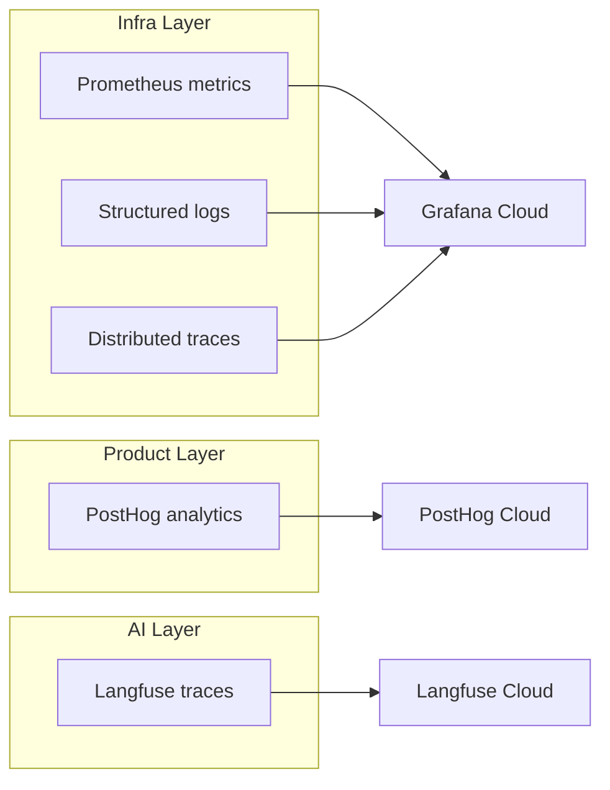

# Observability overview

## Overview

UseZombie observability is organized into three layers, each serving a different audience and concern.



## Infrastructure layer — Grafana Cloud

The infrastructure layer covers system health, resource usage, and operational metrics. It is the primary tool for operators monitoring the platform.

- **Prometheus metrics** — Counters, gauges, and histograms for session lifecycle, stage execution, sandbox enforcement, and system resources. Scraped from the `/metrics` endpoint on port 9091.
- **Structured logs** — JSON-formatted logs shipped to Loki. Every log line includes correlation fields for filtering and tracing.
- **Distributed traces** — OpenTelemetry traces shipped to Tempo. Each run generates a trace spanning API request, queue claim, stage execution, and PR creation.

## Product layer — PostHog

The product layer tracks user-facing events and feature adoption. It answers questions like "how many specs were submitted this week" and "what is the P95 time-to-PR."

- Events are emitted from the API server and the CLI.
- No PII is stored — events reference workspace IDs and anonymized user IDs.
- Used for product decisions, funnel analysis, and feature flags.

## AI layer — Langfuse

The AI layer traces agent behavior within each run. It answers questions like "how many tokens did the agent use" and "where did the agent spend the most time."

- Each stage execution generates a Langfuse trace with prompt/completion pairs.
- Token usage, latency, and model selection are recorded.
- Used for cost analysis, prompt optimization, and agent quality scoring.

## Correlation fields

All three layers share a common set of correlation fields that enable cross-layer investigation:

| Field | Description | Present in |
|-------|-------------|------------|
| `trace_id` | OpenTelemetry trace ID | Grafana, Langfuse |
| `run_id` | UseZombie run identifier | All three layers |
| `workspace_id` | Workspace scoping | All three layers |
| `stage_id` | Individual stage within a run | Grafana, Langfuse |
| `executor_id` | Executor instance that handled the stage | Grafana |

To investigate a failed run across all layers:

1. Start with the `run_id` from the API response or CLI output.
2. Search Grafana logs and traces by `run_id`.
3. Search Langfuse traces by `run_id` to see agent behavior.
4. Search PostHog by `run_id` to see the user-facing event timeline.

---

## Execution telemetry model

The worker and executor emit a structured event sequence for every run:

```text
worker
  -> executor.session_created
  -> executor.stage_started
  -> executor.stage_finished | executor.stage_failed
  -> executor.session_destroyed

zombied-executor
  -> sandbox.preflight
  -> sandbox.policy_denied
  -> sandbox.timeout_kill
  -> sandbox.oom_kill
  -> sandbox.resource_usage
```

### Operational interpretation

1. If worker is healthy but executor health degrades, treat that as execution-substrate failure, not application success.
2. If executor dies mid-stage, the run should show a clear infrastructure-classified failure.
3. Worker and executor upgrades should be visible as interrupted or drained runs, never silent disappearance.
4. Inbound `traceparent` should be preserved when available; otherwise generate a new root trace.

### Product analytics boundary

PostHog tracks run started/completed/failed, agent completed, and workspace/CLI product usage. PostHog should not be the primary source of truth for sandbox enforcement or executor health.

---

## Log scopes

Structured logs use `std.log.scoped` with the following scopes:

| Scope | Source |
|---|---|
| `.zombied` | `main.zig`, `cmd/run.zig`, `cmd/serve.zig`, `cmd/migrate.zig`, `cmd/common.zig` |
| `.worker` | `pipeline/worker.zig`, `worker_claim.zig`, `worker_allocator.zig`, `worker_stage_executor.zig`, `cmd/worker.zig` |
| `.otel_export` | `observability/otel_export.zig` |
| `.event_bus` | `events/bus.zig` |
| `.reliable` | `reliability/reliable_call.zig` |
| `.scoring` | `pipeline/scoring.zig` |
| `.agents` | `pipeline/agents.zig`, `agents_runner.zig` |
| `.http` | `http/server.zig`, `handlers/runs/start.zig`, `handlers/runs/retry.zig`, `handlers/workspaces.zig` |
| `.state` | `state/machine.zig` |
| `.policy` | `state/policy.zig` |
| `.outbox_reconciler` | `state/outbox_reconciler.zig` |
| `.reconcile` | `cmd/reconcile/*.zig` |
| `.db` | `db/pool.zig` |
| `.redis_queue` | `queue/redis_client.zig` |
| `.git` | `git/pr.zig`, `command.zig`, `repo.zig` |
| `.github_auth` | `auth/github.zig` |
| `.secrets` | `secrets/crypto.zig` |
| `.memory` | `memory/workspace.zig` |

---

## Metric inventory

All metrics use the `zombie_` prefix and are exposed at the `/metrics` endpoint.

### Run lifecycle

| Metric | Type | Description |
|---|---|---|
| `zombie_runs_created_total` | counter | Total runs accepted by API |
| `zombie_runs_completed_total` | counter | Total runs completed successfully |
| `zombie_runs_blocked_total` | counter | Total runs that ended blocked |
| `zombie_run_retries_total` | counter | Total retry attempts across runs |

### Agent calls

| Metric | Type | Description |
|---|---|---|
| `zombie_agent_echo_calls_total` | counter | Total Echo agent invocations |
| `zombie_agent_scout_calls_total` | counter | Total Scout agent invocations |
| `zombie_agent_warden_calls_total` | counter | Total Warden agent invocations |
| `zombie_agent_tokens_total` | counter | Total tokens consumed by agent calls |

### External reliability

| Metric | Type | Description |
|---|---|---|
| `zombie_external_retries_total` | counter | Total retry attempts inside external side-effect wrappers |
| `zombie_external_failures_total` | counter | External calls that exited as classified failures |
| `zombie_retry_after_hints_total` | counter | Retry attempts that used Retry-After guidance |
| `zombie_backoff_wait_ms_total` | counter | Total backoff wait time in milliseconds |
| `zombie_rate_limit_wait_ms_total` | counter | Total wait time due to rate limiting in milliseconds |

### Side-effect outbox

| Metric | Type | Description |
|---|---|---|
| `zombie_side_effect_outbox_enqueued_total` | counter | Total outbox entries enqueued |
| `zombie_side_effect_outbox_delivered_total` | counter | Total outbox entries marked delivered |
| `zombie_side_effect_outbox_dead_letter_total` | counter | Total outbox entries dead-lettered |

### Infrastructure

| Metric | Type | Description |
|---|---|---|
| `zombie_worker_running` | gauge | Worker liveness (1 running, 0 stopped) |
| `zombie_worker_in_flight_runs` | gauge | Current in-flight runs across worker threads |
| `zombie_worker_errors_total` | counter | Total worker loop errors |
| `zombie_worker_allocator_leaks_total` | counter | Total worker allocator leak detections on teardown |
| `zombie_queue_depth` | gauge | Current queued runs in SPEC_QUEUED |
| `zombie_oldest_queued_age_ms` | gauge | Oldest queued run age in milliseconds |
| `zombie_api_in_flight_requests` | gauge | Current in-flight API requests (backpressure guard) |
| `zombie_api_backpressure_rejections_total` | counter | Total API requests rejected by backpressure guard |

### Scoring

| Metric | Type | Description |
|---|---|---|
| `zombie_agent_score_computed_total` | counter | Total scored runs across all tiers |
| `zombie_agent_scoring_failed_total` | counter | Total scoring failures caught by fail-safe |
| `zombie_agent_score_latest` | gauge | Most recently computed agent score |

### Exporter health

| Metric | Type | Description |
|---|---|---|
| `zombie_otel_export_total` | counter | Total OTEL metric export attempts |
| `zombie_otel_export_failed_total` | counter | Total OTEL export failures |
| `zombie_otel_last_success_at_ms` | gauge | Timestamp (ms) of last successful OTEL export |

### Histograms

Buckets: `1, 3, 5, 10, 30, 60, 120, 300`.

| Metric | Type | Description |
|---|---|---|
| `zombie_agent_duration_seconds` | histogram | Duration of individual agent calls in seconds |
| `zombie_run_total_wall_seconds` | histogram | End-to-end run wall-clock duration in seconds |
| `zombie_agent_scoring_duration_ms` | histogram | Time spent in scoreRun in milliseconds |

---

## Trace format

W3C Trace Context (`traceparent` header) for distributed tracing. Spans are batch-exported via OTLP/HTTP JSON to Grafana Tempo.

| Span Name | Source | Attributes |
|---|---|---|
| `http.request` | `http/server.zig` dispatch | `http.route` |
| `agent.call` | `pipeline/worker_stage_executor.zig` | `agent.actor`, `agent.tokens`, `agent.duration_ms`, `agent.exit_ok` |

Trace propagation: incoming `traceparent` header is parsed and a child span is created. Missing `traceparent` generates a new root trace. Export uses a ring buffer (1024 capacity) with background flush (5s interval, 50 spans/batch), fire-and-forget.

---

## Event bus

In-process bounded ring buffer (`capacity=1024`) with background log sink. Fields per event: `ts_ms`, `kind` (max 32 bytes), `run_id` (max 64 bytes), `detail` (max 256 bytes). Drops are logged via `.event_bus` scope.

---

## Delivery health signals

| Exporter | Protocol | Config | Failure mode |
|---|---|---|---|
| OTLP Metrics | `POST /v1/metrics` | `OTEL_EXPORTER_OTLP_ENDPOINT`, `OTEL_SERVICE_NAME` | Fire-and-forget, logged via `.otel_export` |
| OTLP Logs | `POST /v1/logs` | `GRAFANA_OTLP_ENDPOINT`, `GRAFANA_OTLP_INSTANCE_ID`, `GRAFANA_OTLP_API_KEY` | Ring buffer (2048), 5s flush, fire-and-forget |
| OTLP Traces | `POST /v1/traces` | Reuses Grafana OTLP config | Ring buffer (1024), 5s flush, fire-and-forget |

### No silent-drop policy

All exporter failures must: emit a structured log line with `error_code` prefix (`UZ-OBS-*`), increment the corresponding `*_failed_total` counter, never block the worker execution path, and never silently swallow errors.

### Observability error codes

| Code | Description |
|---|---|
| `UZ-OBS-OTEL-001` | OTEL metrics export failed (generic) |
| `UZ-OBS-OTEL-002` | OTEL connect failed (DNS, connection refused, timeout) |
| `UZ-OBS-OTEL-003` | OTEL request failed (non-connect HTTP error) |
| `UZ-OBS-OTEL-004` | OTEL unexpected status (non-2xx response) |
| `UZ-OBS-OTEL-LOG-001` | OTEL log export failed |
| `UZ-OBS-OTEL-LOG-002` | OTEL log connect failed |
| `UZ-OBS-OTEL-TRACE-001` | OTEL trace export failed |
| `UZ-OBS-OTEL-TRACE-002` | OTEL trace connect failed |
