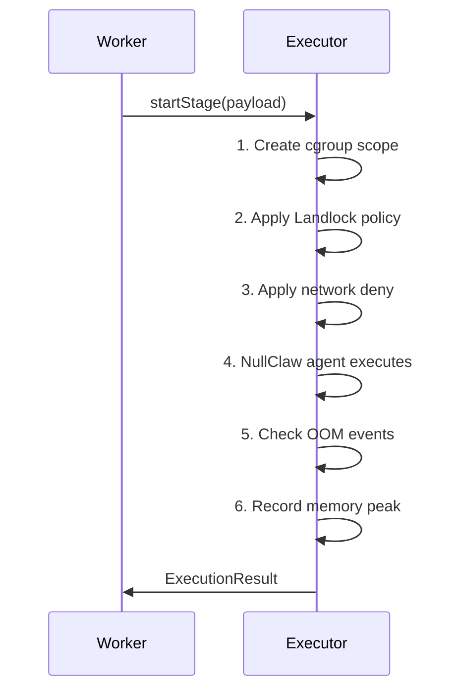

# Sandbox enforcement

## Overview

Every agent execution in UseZombie runs under four isolation layers. These layers are applied by the executor sidecar before the agent begins work and are enforced for the entire duration of the execution.

## Layer 1: Filesystem isolation (Landlock)

Landlock is a Linux security module (available since kernel 5.13) that restricts filesystem access at the process level without requiring root privileges.

### Filesystem policy table

| Path | Access | Purpose |
|------|--------|---------|
| Workspace directory (`/tmp/zombie/runs/<run_id>/`) | Read-write | The cloned repository where the agent implements changes. |
| `/usr/bin`, `/usr/lib`, `/lib` | Read-only | System binaries and libraries needed for compilation toolchains. |
| `/usr/local/bin` | Read-only | Locally installed tools (compilers, interpreters). |
| `/etc/ssl/certs` | Read-only | TLS certificates for registry access (when allowlisted). |
| `/tmp` (private namespace) | Read-write | Agent temporary files. Isolated via `PrivateTmp`. |
| Everything else | **Denied** | No access to host config, other workspaces, credentials, or system state. |

If the agent attempts to access a denied path, the system call returns `EACCES`. The denial is logged and increments the `landlock_denials_total` metric.

## Layer 2: Resource limits (cgroups v2)

Each agent execution runs in its own cgroups v2 scope with memory and CPU limits.

### Memory

- Default limit: 512 MB (`EXECUTOR_MEMORY_LIMIT_MB`).
- Enforcement: kernel OOM killer terminates the process if the limit is exceeded.
- Detection: executor reads cgroup OOM events after execution completes.
- Error code: `UZ-EXEC-009`.

### CPU

- Default limit: 100% of one core (`EXECUTOR_CPU_LIMIT_PERCENT`).
- Enforcement: cgroups CPU bandwidth control throttles the process.
- Detection: executor reads `cpu.stat` for throttled time.
- Metric: `cpu_throttled_ms_total`.

## Layer 3: Network isolation

Network access is denied by default using a dedicated network namespace with no routes.

| Policy | Behavior |
|--------|----------|
| `deny_all` (default) | No outbound connections. All `connect()` calls fail with `ENETUNREACH`. |
| `registry_allowlist` | Outbound connections permitted only to allowlisted registry hosts (npm, PyPI, crates.io, Go proxy). All other destinations denied. |

The network policy is configured via `EXECUTOR_NETWORK_POLICY`. See [Sandbox configuration](/operator/configuration/sandbox) for the allowlist details.

## Layer 4: Process isolation (systemd hardening)

The executor systemd service applies additional process-level restrictions:

| Directive | Effect |
|-----------|--------|
| `PrivateTmp=true` | `/tmp` is a private mount, not shared with other services. |
| `ProtectSystem=strict` | The entire filesystem is read-only except explicitly allowed paths. |
| `NoNewPrivileges=true` | The process cannot gain new privileges via `setuid`, `setgid`, or capabilities. |

## Failure classification

When an agent execution fails due to sandbox enforcement, the failure is classified and recorded:

| Failure class | Error code | Metric | Description |
|---------------|------------|--------|-------------|
| OOM kill | `UZ-EXEC-009` | `oom_kills_total` | Memory limit exceeded, process killed by kernel OOM. |
| Timeout | `UZ-EXEC-008` | `timeout_kills_total` | Execution exceeded `RUN_TIMEOUT_MS`. |
| Filesystem denial | `UZ-EXEC-011` | `landlock_denials_total` | Agent tried to access a denied path. |
| Network denial | `UZ-EXEC-010` | — | Agent tried to make a blocked network connection. |
| Resource kill | — | `resource_kills_total` | Aggregate: any resource-based kill (OOM, timeout, CPU). |
| Lease expired | `UZ-EXEC-014` | `lease_expired_total` | Worker lost the run lease before completion. |
