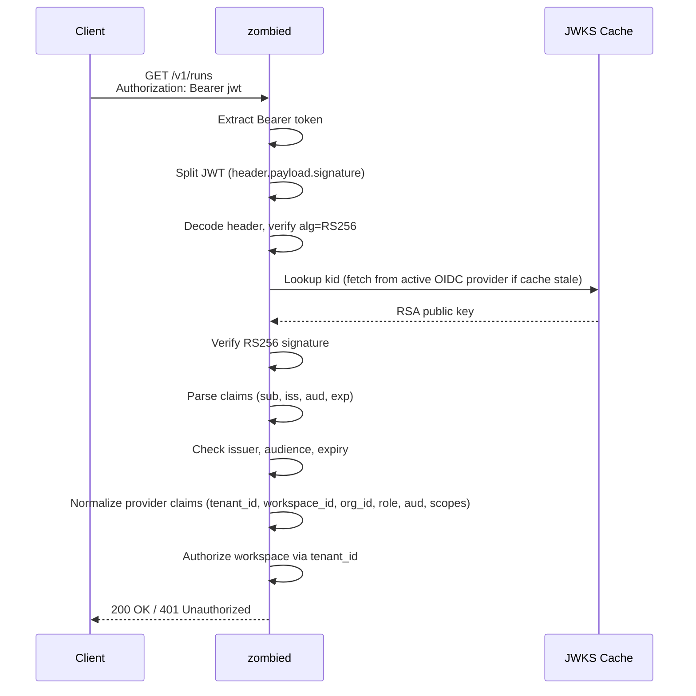
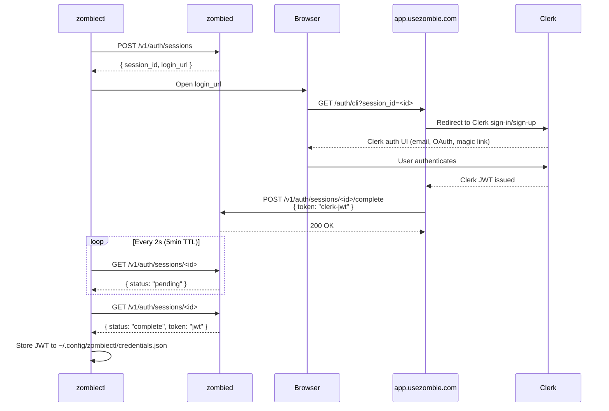
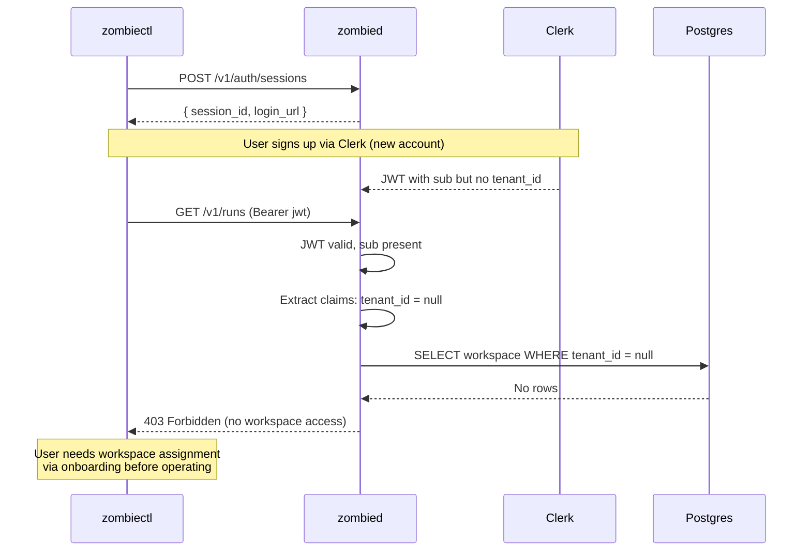

# OIDC Security

## Why This Exists

API identity verification needs a centralized issuer and signed JWT validation to prevent unauthorized control-plane mutation across supported OIDC providers.

## Architecture

```
src/auth/
  jwks.zig      Generic OIDC JWKS verifier (RS256). Provider-agnostic.
  claims.zig    Provider claim normalization (Clerk/custom).
  clerk.zig     Clerk adapter kept for direct adapter tests and doctor checks.
  oidc.zig      Vendor-neutral verifier facade + provider routing.
  sessions.zig  In-memory auth session store for CLI login polling flow.
```

The JWKS verification core (`jwks.zig`) stays unchanged. Runtime routing now supports:
- `clerk`
- `custom`

The active adapter is selected with `OIDC_PROVIDER`. Provider transport config is vendor-neutral:
- `OIDC_JWKS_URL`
- `OIDC_ISSUER`
- `OIDC_AUDIENCE`

## Authentication Flow: API Request



Step-by-step:

1. Extract Bearer token from Authorization header
2. Split JWT into header, payload, signature (base64url)
3. Decode header, reject if `alg` is not `RS256`
4. Lookup `kid` in cached JWKS (HTTP fetch from active OIDC provider if cache expired, 6hr TTL)
5. Verify RS256 signature against JWKS public key
6. Parse standard claims: `sub`, `iss`, `aud`, `exp`
7. Check issuer match, audience match, token not expired
8. Normalize provider claims into a canonical identity contract: `tenant_id`, `workspace_id`, `org_id`, `role`, `audience`, `scopes`
9. Authorize workspace access: query DB for workspace ownership by `tenant_id`

## Authentication Flow: CLI Login (signup or signin)



## New User (First Signup)



Key points:
- zombied never sees passwords or signup data. Clerk handles all registration.
- The session store is ephemeral (in-memory, 5-min TTL, max 64 concurrent).
- `POST /v1/auth/sessions` and `GET /v1/auth/sessions/:id` are unauthenticated (CLI has no token yet).
- `POST /v1/auth/sessions/:id/complete` is authenticated (website has the JWT).
- Session IDs are 24-character hex (96 bits of randomness from CSPRNG).

## Endpoint Auth Policy

| Endpoint                                  | Auth Required |
|-------------------------------------------|---------------|
| `GET /healthz`                            | No            |
| `GET /readyz`                             | No            |
| `GET /metrics`                            | No            |
| `POST /v1/auth/sessions`                  | No            |
| `GET /v1/auth/sessions/:id`               | No            |
| `POST /v1/auth/sessions/:id/complete`     | Yes (JWT)     |
| `POST /v1/runs`                           | Yes           |
| `GET /v1/runs/:id`                        | Yes           |
| `POST /v1/runs/:id:retry`                 | Yes           |
| `GET /v1/specs`                           | Yes           |
| `POST /v1/workspaces/:id:sync`            | Yes           |
| `POST /v1/workspaces/:id:pause`           | Yes           |
| All other `/v1/*`                         | Yes           |

Auth accepts two user auth types:
- OIDC JWT via the configured provider
- bearer `API_KEY` for users/operators issued API keys

## Role Claim Contract

JWTs used against workspace control-plane endpoints must normalize a `role` claim with one of:

- `user`
- `operator`
- `admin`

Accepted source locations are provider-specific but normalize into one contract:

- Clerk top-level `role`
- Clerk `metadata.role`
- custom OIDC top-level `role`
- custom OIDC nested or namespaced `role` (e.g. `custom_claims.role`, `app_metadata.role`, `https://usezombie.dev/role`)

Server-side authorization consumes the normalized value and rejects unknown roles with 403 `ERR_UNSUPPORTED_ROLE`. API-key auth maps to `admin`.

### RBAC Hierarchy

```
admin > operator > user
```

| Role | Assigned when | What it can do |
|------|--------------|----------------|
| `user` | Default — JWT has no role claim | Read-only. Authenticated but blocked from all mutations (403 on any `workspace_guards.enforce` call). |
| `operator` | Clerk admin sets `metadata.role = "operator"` | All workspace mutations: harness changes, skill secrets, billing upgrade, run sync, proposal decisions. |
| `admin` | Clerk admin sets `metadata.role = "admin"`, or via API key | Everything operator can do, plus admin-only endpoints (billing lifecycle events like `PAYMENT_FAILED`, `DOWNGRADE_TO_FREE`). |

### How Roles Are Assigned

Roles are managed in the **identity provider (Clerk)**, not in the UseZombie backend. The backend only reads and enforces — it never writes roles.

- **JWT auth**: Role comes from the token claims. If absent, defaults to `user`.
- **API key auth**: Always maps to `admin` (API keys are issued to trusted operators/automation).

To grant `operator` or `admin` to a user, a Clerk org admin sets `role` in the user's metadata via the Clerk dashboard or Clerk API.

### Self-Serve Gap (Known Friction)

Today, a new user who signs up gets `user` by default and cannot perform any mutations until a Clerk admin manually upgrades their role. This creates onboarding friction for self-serve signups.

A future improvement should auto-assign `operator` to workspace creators or provide a self-serve role upgrade path tied to workspace ownership, removing the dependency on manual Clerk admin intervention.

## New User (First Signup)

1. User has no account. Runs `zombiectl login`.
2. Browser opens Clerk signup page. User creates account.
3. Clerk issues JWT. JWT contains `sub` but may have no `tenant_id` or `org_id` yet.
4. CLI receives JWT. User is authenticated.
5. Workspace-scoped endpoints reject them (`authorizeWorkspace` returns false when `tenant_id` is null).
6. User must be assigned to a workspace/tenant via onboarding before they can operate.

## Decisions

1. OIDC JWT verification for API authentication in hardened environments.
2. JWKS endpoint required and validated; cached with 6-hour TTL.
3. Clear error mapping for token expiry, signature, and JWKS failures.
4. Provider-agnostic split: swapping IdP is a config change, not a rewrite.
5. Separate bearer `API_KEY` auth remains available for issued user/operator API keys.
6. Empty token in session complete is rejected (handler validates non-empty).
7. Session store caps at 64 concurrent sessions to prevent resource exhaustion.

## What This Prevents

1. Unauthenticated API mutations.
2. Acceptance of expired or invalid signatures.
3. Silent auth bypass when identity provider is unavailable.
4. `alg:none` attack (CVE-2015-9235) — only RS256 accepted.
5. `alg` switching attack (CVE-2016-5431) — HS256/other algorithms rejected.
6. Missing `kid` bypass — tokens without kid are rejected before key lookup.
7. JWKS poisoning — only RSA keys with valid kid/n/e are accepted.
8. Session hijacking — session IDs are 96-bit CSPRNG, 5-min TTL.
9. Role confusion via hidden CLI commands — authorization now depends on server-side role checks, not help-text visibility.

## Required Configuration

| Env Var             | Required | Default                        |
|---------------------|----------|--------------------------------|
| `OIDC_PROVIDER`     | No       | `clerk` (default), `custom` |
| `OIDC_JWKS_URL`     | Yes*     | Active-provider JWKS URL |
| `OIDC_ISSUER`       | No       | Active-provider issuer check |
| `OIDC_AUDIENCE`     | No       | Active-provider audience check |
| `API_KEY`           | No       | Bearer API key auth when issued/configured |
| `APP_URL`           | No       | `https://app.usezombie.com`    |

## Test Coverage

Auth coverage includes `jwks.zig`, `claims.zig`, `oidc.zig`, `clerk.zig`, and `sessions.zig`, including:

- JWT signature verification (valid, expired, tampered)
- OWASP attack vectors (alg:none, alg switching, missing kid)
- Missing/malformed claims (sub, iss, exp type confusion)
- Audience edge cases (array, empty array, wrong type, missing)
- Injection payloads (SQL injection in sub, XSS, null bytes, 10KB DoS)
- JWKS parsing (truncated, empty modulus, null keys, duplicate kids)
- RS256 edge cases (wrong modulus, empty sig, length mismatch)
- Clerk claim normalization (metadata.tenant_id, top-level, missing, non-JSON)
- Clerk and custom provider role normalization (`user`/`operator`/`admin`)
- Custom provider claim normalization (nested and namespaced tenant/workspace claims, aud arrays, scope arrays)
- Live HTTP RBAC enforcement for `harness`, `skill-secret`, and admin billing-event endpoints, including deterministic `403 INSUFFICIENT_ROLE` rejection for non-operator/non-admin tokens
- Runtime config parsing for supported and invalid `OIDC_PROVIDER` values
- Session store (create, poll, complete, max limit, double complete, injection payloads, independence)

## Verification

1. Expired token maps to deterministic `token_expired` 401.
2. JWKS outage maps to `AUTH_UNAVAILABLE` 503.
3. Signature failure maps to `UNAUTHORIZED` 401.
4. New user with no tenant_id authenticates but cannot access workspace endpoints.
5. Session complete with empty token is rejected with `INVALID_REQUEST`.
6. Session complete without auth is rejected with `UNAUTHORIZED`.
7. Unknown or malformed role claims are rejected before operator/admin endpoints execute.
