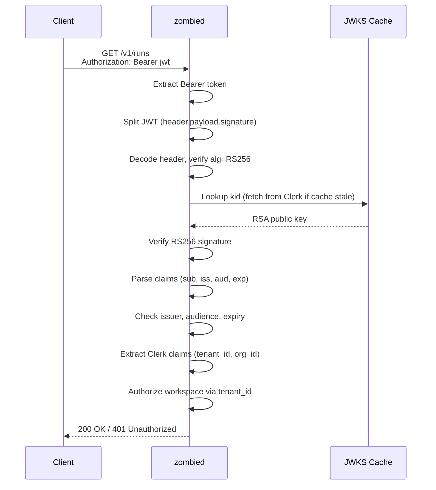
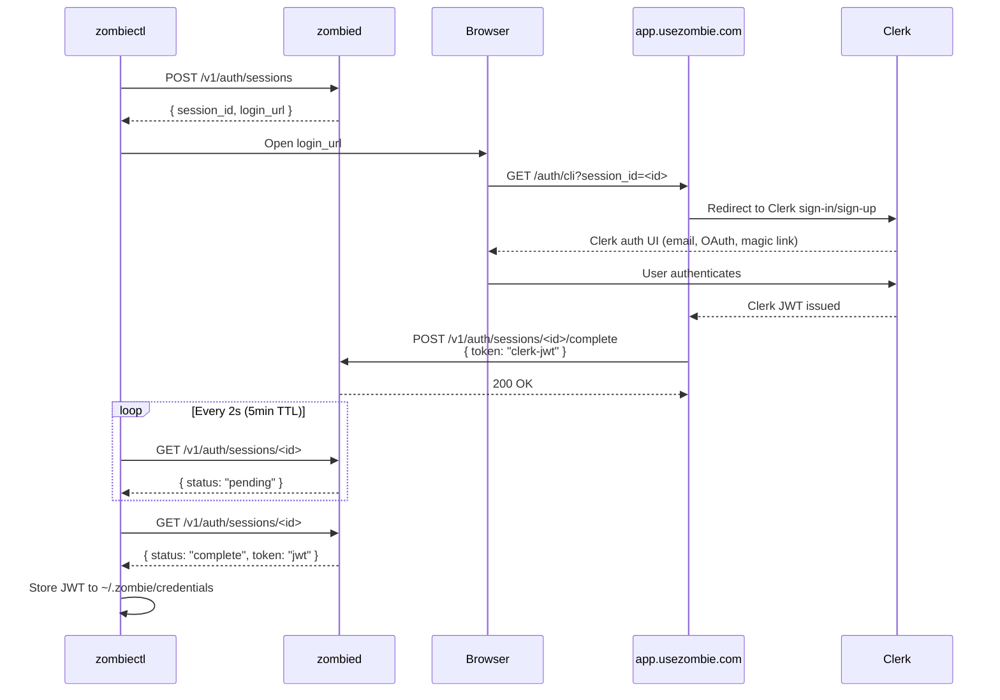
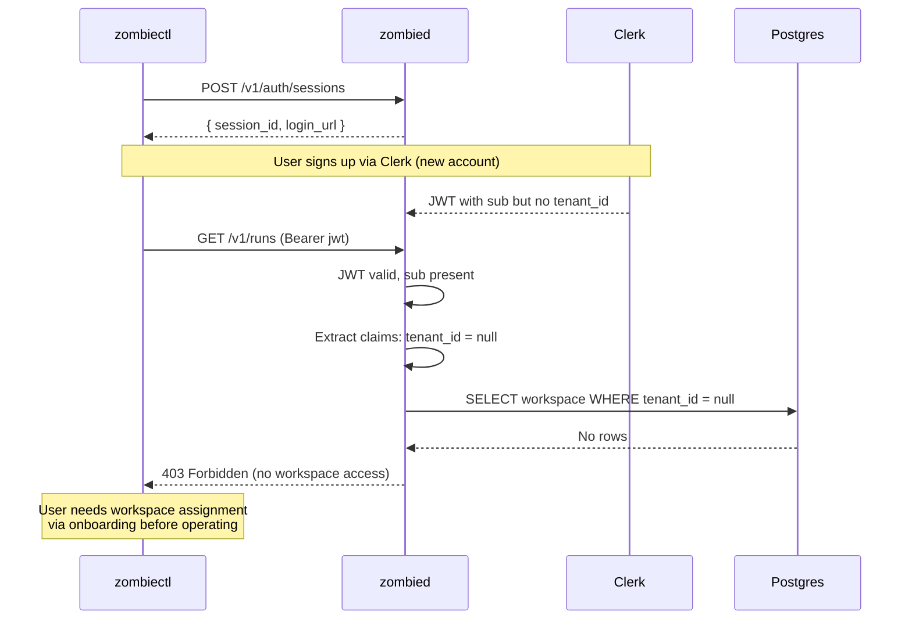

# Clerk Security

## Why This Exists

API identity verification needs a centralized issuer and signed JWT validation to prevent unauthorized control-plane mutation.

## Architecture

```
src/auth/
  jwks.zig      Generic OIDC JWKS verifier (RS256). Provider-agnostic.
  claims.zig    Provider-specific claim extraction (Clerk: tenant_id, org_id).
  clerk.zig     Thin wrapper: jwks.Verifier + claims.extractClerkClaims -> Principal.
  sessions.zig  In-memory auth session store for CLI login polling flow.
```

Swapping identity providers means writing a new `claims.zig` extractor and wrapper.
The JWKS verification core (`jwks.zig`) stays unchanged.

## Authentication Flow: API Request



Step-by-step:

1. Extract Bearer token from Authorization header
2. Split JWT into header, payload, signature (base64url)
3. Decode header, reject if `alg` is not `RS256`
4. Lookup `kid` in cached JWKS (HTTP fetch from Clerk if cache expired, 6hr TTL)
5. Verify RS256 signature against JWKS public key
6. Parse standard claims: `sub`, `iss`, `aud`, `exp`
7. Check issuer match, audience match, token not expired
8. Extract Clerk-specific claims: `tenant_id` (from `metadata.tenant_id` or top-level), `org_id`
9. Authorize workspace access: query DB for workspace ownership by `tenant_id`

## Authentication Flow: CLI Login (signup or signin)



## New User (First Signup)



Key points:
- zombied never sees passwords or signup data. Clerk handles all registration.
- The session store is ephemeral (in-memory, 5-min TTL, max 64 concurrent).
- `POST /v1/auth/sessions` and `GET /v1/auth/sessions/:id` are unauthenticated (CLI has no token yet).
- `POST /v1/auth/sessions/:id/complete` is authenticated (website has the JWT).
- Session IDs are 24-character hex (96 bits of randomness from CSPRNG).

## Endpoint Auth Policy

| Endpoint                                  | Auth Required |
|-------------------------------------------|---------------|
| `GET /healthz`                            | No            |
| `GET /readyz`                             | No            |
| `GET /metrics`                            | No            |
| `POST /v1/auth/sessions`                  | No            |
| `GET /v1/auth/sessions/:id`               | No            |
| `POST /v1/auth/sessions/:id/complete`     | Yes (JWT)     |
| `POST /v1/runs`                           | Yes           |
| `GET /v1/runs/:id`                        | Yes           |
| `POST /v1/runs/:id:retry`                 | Yes           |
| `GET /v1/specs`                           | Yes           |
| `POST /v1/workspaces/:id:sync`            | Yes           |
| `POST /v1/workspaces/:id:pause`           | Yes           |
| All other `/v1/*`                         | Yes           |

Auth tries Clerk JWT first, falls back to API key (`common.authenticate()`).

## New User (First Signup)

1. User has no account. Runs `zombiectl login`.
2. Browser opens Clerk signup page. User creates account.
3. Clerk issues JWT. JWT contains `sub` but may have no `tenant_id` or `org_id` yet.
4. CLI receives JWT. User is authenticated.
5. Workspace-scoped endpoints reject them (`authorizeWorkspace` returns false when `tenant_id` is null).
6. User must be assigned to a workspace/tenant via onboarding before they can operate.

## Decisions

1. Clerk JWT verification for API authentication in hardened environments.
2. JWKS endpoint required and validated; cached with 6-hour TTL.
3. Clear error mapping for token expiry, signature, and JWKS failures.
4. Provider-agnostic split: swapping IdP is a config change, not a rewrite.
5. Empty token in session complete is rejected (handler validates non-empty).
6. Session store caps at 64 concurrent sessions to prevent resource exhaustion.

## What This Prevents

1. Unauthenticated API mutations.
2. Acceptance of expired or invalid signatures.
3. Silent auth bypass when identity provider is unavailable.
4. `alg:none` attack (CVE-2015-9235) — only RS256 accepted.
5. `alg` switching attack (CVE-2016-5431) — HS256/other algorithms rejected.
6. Missing `kid` bypass — tokens without kid are rejected before key lookup.
7. JWKS poisoning — only RSA keys with valid kid/n/e are accepted.
8. Session hijacking — session IDs are 96-bit CSPRNG, 5-min TTL.

## Required Configuration

| Env Var             | Required | Default                        |
|---------------------|----------|--------------------------------|
| `CLERK_SECRET_KEY`  | Yes      | (enables Clerk auth when set)  |
| `CLERK_JWKS_URL`    | Yes*     | (required when Clerk enabled)  |
| `CLERK_ISSUER`      | No       | (skips issuer check if unset)  |
| `CLERK_AUDIENCE`    | No       | (skips audience check if unset)|
| `APP_URL`           | No       | `https://app.usezombie.com`    |

## Test Coverage

97 auth-related tests across `jwks.zig`, `claims.zig`, `clerk.zig`, `sessions.zig`:

- JWT signature verification (valid, expired, tampered)
- OWASP attack vectors (alg:none, alg switching, missing kid)
- Missing/malformed claims (sub, iss, exp type confusion)
- Audience edge cases (array, empty array, wrong type, missing)
- Injection payloads (SQL injection in sub, XSS, null bytes, 10KB DoS)
- JWKS parsing (truncated, empty modulus, null keys, duplicate kids)
- RS256 edge cases (wrong modulus, empty sig, length mismatch)
- Clerk claims (metadata.tenant_id, top-level, missing, non-JSON)
- Session store (create, poll, complete, max limit, double complete, injection payloads, independence)

## Verification

1. Expired token maps to deterministic `token_expired` 401.
2. JWKS outage maps to `AUTH_UNAVAILABLE` 503.
3. Signature failure maps to `UNAUTHORIZED` 401.
4. New user with no tenant_id authenticates but cannot access workspace endpoints.
5. Session complete with empty token is rejected with `INVALID_REQUEST`.
6. Session complete without auth is rejected with `UNAUTHORIZED`.
