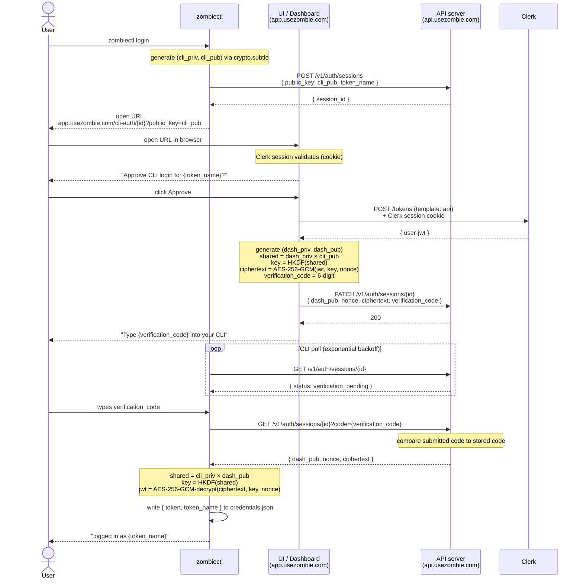

<!--
SPEC AUTHORING RULES (load-bearing — do not delete):
- No time/effort/hour/day estimates anywhere in this spec.
- No effort columns, complexity ratings, percentage-complete, implementation dates.
- No assigned owners — use git history and handoff notes.
- Priority (P0/P1/P2) is the only sizing signal. Use Dependencies for sequencing.
- If a section below contradicts these rules, the rule wins — delete the section.
- Enforced by SPEC TEMPLATE GATE (`docs/gates/spec-template.md`).
-->

# M74_002: CLI Browser Authorization Flow (verification code + ciphertext transport)

**Prototype:** v2.0.0
**Milestone:** M74
**Workstream:** 002
**Date:** May 17, 2026
**Status:** PENDING
**Priority:** P1 — closes the session-id phishing-without-terminal attack class on the device-authorization flow, and removes plaintext JSON Web Token (JWT) from server-side transport, storage, log, queue, and metrics surfaces. **Honest scope: this spec does NOT authenticate a specific Command Line Interface (CLI) installation or device.** Persistent device identity is deferred to M75_xxx.
**Categories:** Application Programming Interface (API), CLI, User Interface (UI)
**Batch:** B2 — depends on M74_001 substrate landing.
**Branch:** feat/m74-002-cli-browser-authorization-flow (to be created on CHORE(open))
**Depends on:** M74_001 (Effect-TS substrate in `zombiectl`). The new login handler is implemented on the Effect-TS dispatcher; landing this before M74_001 means rewriting the handler twice.
**Provenance:** human-written from `HANDOFF_SUPABASE_HARDENING_SPEC.md` (Captain ask, May 17, 2026). Rewritten May 17, 2026 after a threat-model challenge from Captain and cross-Large-Language-Model (LLM) review (Claude + ChatGPT) exposed that the prior framing conflated transport confidentiality with CLI authentication. The rewrite makes the conflation impossible by stating each property's scope and limits up front.

**Canonical architecture:** `docs/AUTH.md` Flow 1 (CLI device flow). Updated as part of this spec.

---

## Threat Model

**This is the load-bearing section. Every implementation decision below must trace to an attacker capability listed here. If a decision does not trace to a listed threat, it is out of scope — flag it and re-read this section.**

### What this flow protects against

| # | Threat | Closed by |
|---|---|---|
| 1 | **Session-row plaintext disclosure.** Database (DB) dumps, application logs, queue inspection, metrics blobs. Today the server-side session row carries `{ status, token: "<jwt>" }`. | Elliptic Curve Diffie-Hellman (ECDH) ciphertext transport. After this spec, the row carries `{ status, ciphertext, nonce, verification_code }`. The JWT is never persisted server-side in plaintext. |
| 2 | **Passive network observation of the JWT.** Transport Layer Security (TLS)-inspecting corporate proxies, captured Hypertext Transfer Protocol Secure (HTTPS) payload logs, intermediaries that terminate and re-issue TLS. These see the PATCH body. Today it's a JWT in cleartext. | ECDH ciphertext transport. After this spec, intermediaries see ciphertext only. |
| 3 | **Session-id phishing without terminal access.** Attacker who has only the `session_id` (Uniform Resource Locator (URL) sniff, browser history sync, shoulder-surf). Today, polling `GET /v1/auth/sessions/{id}` after Approve hands them a plaintext JWT. | The `verification_code` requirement. An attacker without terminal access to the user's machine cannot complete the flow. |

### What this flow does NOT protect against

**Each of these is real, and the spec is brutally explicit that we have not closed them.** Future readers debating "should M74_002 also do X?" against any of these should redirect to M75_xxx or a later milestone.

| # | Threat | Why this spec does not close it |
|---|---|---|
| 1 | **Compromised browser session.** Cross-Site Scripting (XSS) on the dashboard, malicious browser extension, session-cookie theft. | The plaintext JWT lives momentarily in the dashboard JavaScript (JS) process before encryption. Anything with execution access to that process sees the JWT. ECDH does not help. |
| 2 | **Malware on the CLI host.** Compromised `zombiectl` machine, malicious user-space process, memory scraping. | `cli_priv` lives in CLI process memory during the flow; the decrypted JWT lives in `credentials.json` after. Local malware reads either. |
| 3 | **Malicious local browser extensions.** Extension injecting JS into `/cli-auth/{session_id}`. | The extension runs inside the dashboard's JS execution context, where the JWT exists in plaintext momentarily. |
| 4 | **Attacker with simultaneous browser + terminal access.** User running attacker-supplied software ("paste this curl command into your terminal"). | The verification code cannot defend against the user actively typing the code into the attacker's tool. |
| 5 | **Device impersonation.** Any actor can generate a valid ECDH keypair using publicly-known mathematics. | Possessing a valid public key proves nothing about identity. This spec does NOT authenticate "this is the real `zombiectl` binary on the real user's laptop." Closed by M75_xxx. |
| 6 | **Fake `zombiectl` binaries.** Attacker distributes a malicious binary the user runs. | No binary signing or attestation in this spec. Closed by M75_xxx or a separate distribution-trust milestone. |
| 7 | **Attacker-controlled CLI generating valid ECDH keys.** See Attack C below. | Closed only by the verification code, NOT by ECDH. |

### Security properties by layer

This table is the contract. Every line of code in this spec must trace to one of these properties. Any claim of "auth hardening" in the abstract should be re-read against this table.

| Layer | Property |
|---|---|
| TLS | Server authenticity (cert chain to a trusted Certificate Authority (CA)) + transport encryption (network observers see ciphertext, not plaintext Hypertext Transfer Protocol (HTTP)) |
| Clerk session | Browser-user authentication (the human at the keyboard owns the Clerk identity) |
| **Verification code** | **Browser ↔ terminal authorization binding** — proves the human approving in the browser is the same human typing into the local terminal |
| ECDH (Prime 256 / P-256) | Ciphertext-only session transport — no intermediate server, log, or DB row sees the JWT in plaintext |
| Advanced Encryption Standard / Galois Counter Mode (AES-GCM) | Tamper detection — any ciphertext modification produces a hard `DecryptError`, not silent corruption |
| `token_name` | Auditability only — operator can list active sessions by label; not a security control |

---

## Non-goals

This spec does **NOT**:

- Authenticate a specific device or `zombiectl` installation. Device identity is M75_xxx.
- Establish hardware trust (Trusted Platform Module (TPM) / Secure Enclave / Web Authentication (WebAuthn) / passkey).
- Prevent fake CLI implementations (no binary signing, no attestation).
- Prevent malware on the local machine from stealing the JWT post-login.
- Persist long-term cryptographic identity. ECDH keys in this spec are ephemeral and single-flow.
- Replace TLS — TLS is still required for transport.
- Replace Clerk authentication — the dashboard still relies on Clerk for human authentication.

For persistent device identity, signed challenges, and revocation, see **M75_xxx CLI Device Identity** (to be authored).

---

## Why each component exists

Brutally separated to prevent the conflation that motivated this rewrite.

### Verification code — primary authorization binding

**The verification code is the security property that closes the phishing-without-terminal attack.** Without it, possession of `session_id` is sufficient to complete the login (the attacker creates the session, phishes Approve, polls the result). With it, the code-typing step proves the human who clicked Approve in the browser is the same human controlling the terminal that initiated the session.

The verification code does NOT depend on ECDH. The code mechanism works equally well in a plaintext-JWT design (GitHub's `gh auth login` uses this pattern without any transport encryption beyond TLS).

### ECDH transport encryption — confidentiality only

ECDH in this flow does NOT authenticate the CLI. Anyone can generate a valid ECDH keypair using publicly-known mathematics; possession of a valid public key proves nothing about identity.

ECDH exists solely to ensure intermediate transport and storage surfaces never contain a plaintext JWT. Surfaces protected:

- The API server's session table / store
- Application logs
- Queue inspections (if the session row ever transits a queue)
- Metrics pipelines
- Database dumps
- Captured HTTPS payloads from a TLS-inspecting proxy

The JWT exists in plaintext **only**:

- Inside the dashboard JS process, momentarily, before encryption
- Inside the `zombiectl` process, momentarily, after decryption

All other surfaces receive ciphertext. **A compromised dashboard or a compromised CLI defeats this. ECDH does not help against either.** Listed in Non-goals.

### `token_name` — auditability only

A human-readable device label persisted with each credential. Operator-facing: `zombiectl auth status` shows which session is active. Optionally surfaced on the dashboard sessions surface (see Open Question Q1). Not a security control — an attacker can set `token_name` to any string; it is an audit hook, not a trust signal.

### Already-authenticated detection on dashboard

A User Experience (UX) guardrail, not a security boundary. Surfaces "this will replace your previous CLI session on **{previous_token_name}**" so the user does not silently invalidate their own active session. Defense-in-depth against a user accidentally completing a phishing flow against their own active CLI.

---

## Concrete attacker walkthroughs

Explicit so future agents debating "do we need X?" read these first.

### Attack A — Session-id phishing without terminal access

```
Attacker:
1. Generates atk_priv, atk_pub via crypto.subtle.generateKey({ namedCurve: "P-256" }).
2. Calls POST /v1/auth/sessions with { public_key: atk_pub, token_name: "user-laptop" }.
   Receives atk_session_id.
3. Phishes the user with:
     https://app.usezombie.com/cli-auth/{atk_session_id}?public_key={atk_pub}
4. User clicks Approve in their browser (Clerk session already valid).
5. Dashboard generates verification_code, encrypts the JWT with atk_pub via ECDH, PATCHes.
6. Dashboard shows "Type {verification_code} into your CLI to complete login."

Result:
- User has no zombiectl session matching atk_session_id.
- If the user has their own zombiectl running, it polls a DIFFERENT session_id (their own).
- Typing the code into their own CLI sends it to their own session — no match against
  atk_session_id.
- Attacker's session expires in verification_pending state. Ciphertext never released.

Outcome: BLOCKED by verification_code. NOT blocked by ECDH.
```

### Attack B — Database / log compromise (passive server-side)

```
Attacker compromises the API server's session storage (DB dump, log capture, queue
inspection).

Before M74_002:
- Session row: { status: "complete", token: "<jwt>" }
- Attacker extracts the JWT, uses it directly until expiry (~15 min Clerk TTL).

After M74_002:
- Session row: { status: "approved", ciphertext, nonce, verification_code }
- Attacker has ciphertext, no cli_priv, cannot decrypt.
- The verification_code is moot for an attacker who already controls the server —
  but they still cannot recover the JWT without cli_priv from the CLI machine.

Outcome: BLOCKED by ECDH. JWT confidentiality preserved unless the attacker
ALSO compromises cli_priv on the user's machine.
```

### Attack C — Attacker runs their own CLI with their own keypair

```
Attacker controls a machine. Generates valid atk_priv, atk_pub. Wants the JWT.

Without verification code:
1. Attacker creates session_id, gets a URL.
2. Phishes the user with the URL.
3. User approves.
4. Attacker polls, gets ciphertext, decrypts with atk_priv → has JWT.

  ECDH did NOT prevent this. The attacker is a valid participant in the ECDH protocol.

With verification code:
1. Same setup.
2. User approves; dashboard shows code on the USER's screen.
3. Attacker has no way to see the user's dashboard screen.
4. Attacker polls, sees session in verification_pending, but cannot present the code.
5. Session expires.

Outcome: BLOCKED by verification_code requiring an out-of-band human channel.
```

### Attack D — Passive TLS-inspecting proxy

```
Attacker has visibility into TLS-terminated traffic at a corporate proxy
(common at enterprises with "TLS inspection" / "Secure Sockets Layer (SSL) decryption"
appliances).

Before M74_002:
- PATCH body: { status: "complete", token: "<jwt>" }
- Proxy logs the JWT in cleartext.

After M74_002:
- PATCH body: { status: "approved", nonce, ciphertext, verification_code }
- Proxy logs ciphertext, no cli_priv, cannot decrypt.

Outcome: BLOCKED by ECDH.
```

---

## Step-by-step flow — who initiates, who responds

This diagram shows the **temporal sequence** of the flow: `zombiectl login` is the initiator; UI, API, and Clerk respond. Read top to bottom.



Two facts the diagram pins:

1. **The CLI is the initiator.** Every interaction with the UI, API, or Clerk is downstream of `zombiectl login`. The user typing the verification code closes the loop back to the CLI.
2. **Clerk is the JWT mint.** The UI talks to Clerk only at one step (POST /tokens). The API server never talks to Clerk in this flow (Clerk's involvement is JWKS-only — the API verifies the JWT's signature when the CLI later uses it on normal API calls).

---

## JWT confidentiality path — where the secret lives in plaintext

This is a **different view** from the sequence above. The sequence shows *who calls whom* (temporal). This diagram shows *where the JWT exists in plaintext vs ciphertext* (data lifecycle of the secret). They point in opposite directions because the JWT is born in the dashboard process (right after Clerk mints it) and ends in the CLI process (after decryption) — but the user-initiated flow direction is the opposite (CLI starts, ends with CLI receiving the JWT).

```
┌──────────────────────┐
│  UI / Dashboard      │  ← plaintext JWT lives here momentarily
│  process             │     (vulnerable to XSS / extensions / page compromise —
│  (browser tab)       │      out of scope for this spec; see Non-goals)
│                      │
│  Clerk mint → JWT    │
│  AES-GCM encrypt     │
│  with shared secret  │
└──────────┬───────────┘
           │ PATCH /v1/auth/sessions/{id}
           │ { dash_pub, nonce, ciphertext, verification_code }
           ▼
┌──────────────────────┐
│  API server          │  ← ciphertext only
│  session row         │     (no decrypt capability; the API never holds a
│  { ciphertext,       │      key that can recover the JWT)
│    nonce,            │
│    verification_code,│
│    dash_pub }        │
└──────────┬───────────┘
           │ GET /v1/auth/sessions/{id}?code=<verification_code>
           │ (only after CLI presents the matching code)
           ▼
┌──────────────────────┐
│  zombiectl process   │  ← plaintext JWT reconstituted here
│  cli_priv in memory  │     (vulnerable to local malware reading the process —
│  AES-GCM decrypt     │      out of scope for this spec; see Non-goals)
│  → JWT to            │
│    credentials.json  │
└──────────────────────┘
```

**Explicit:** The API server never possesses decryption capability. Compromise of the API server, its database, logs, queues, or metrics pipeline cannot recover the JWT.

**Equally explicit:** The UI / dashboard process and the `zombiectl` process each hold the plaintext JWT momentarily. Compromise of either endpoint compromises the JWT regardless of this spec.

**Why these two diagrams point in opposite directions:** The CLI initiates the flow, but the JWT is *produced* at the dashboard (after Clerk mints it) and *consumed* at the CLI. The data lifecycle of the secret is dashboard → API → CLI. The temporal sequence of the flow is CLI → UI → API → Clerk → API → CLI. Both views are accurate; conflating them was the source of the earlier confusion.

---

## Implementing agent — read these first

1. **The Threat Model + Why each component exists sections above** — every decision below traces to them.
2. `docs/AUTH.md` end-to-end. **Flow 1** is the primary target. Read this before writing any spec claim; prior agents hit Captain rejections for getting Flow 1 vs Flow 3 confused.
3. [`supabase/cli`'s `apps/cli/src/next/commands/login/login.handler.ts`](https://github.com/supabase/cli/blob/main/apps/cli/src/next/commands/login/login.handler.ts) (228 lines) end-to-end. The pattern being ported.
4. `zombiectl/src/commands/auth.{js,ts}` — current `commandLogin` (~70-211) and `commandLogout` (~213-220). M74_001 migrates these to Effect-TS; this spec adds the new flow on the migrated handler.
5. `src/auth/sessions.zig` + `src/http/handlers/auth/sessions.zig` — the SessionStore (in-memory) and the `PATCH` / `POST` / `GET` handler surface.
6. The dashboard `/cli-auth/{session_id}` page in `ui/packages/app/app/` (find via `grep -rln 'cli-auth-approve' ui/packages/app/`). Read it end-to-end before drafting §3.

---

## Applicable Rules

- `docs/AUTH.md` — applies to every change. Flow 1 sequence diagrams + field shapes update as part of this work; the Security-properties-by-layer table from above lands durable in AUTH.md.
- `docs/REST_API_DESIGN_GUIDELINES.md` — applies to session-handler shape changes.
- `docs/greptile-learnings/RULES.md` — RULE NLG forbids `legacy_*` / `V2` framing pre-2.0.0. Migration handling addressed in Failure Modes.
- `docs/ZIG_RULES.md` — applies to `src/auth/sessions.zig` + `src/http/handlers/auth/sessions.zig`. PostgreSQL drain lifecycle if any new DB-backed work lands; default to in-memory unless drift demands persistence.
- `docs/SCHEMA_CONVENTIONS.md` — Not Applicable (N/A) (sessions stay in-memory in v2.0 per `src/auth/sessions.zig`'s current shape).

---

## Overview

**Goal (testable):** `zombiectl login` rejects a wrong verification code with a typed `VerificationFailedError` and a documented exit code; a successful login fetches the token via ECDH-decrypt of the dashboard's PATCH ciphertext (never in plaintext on the wire or in the session row); the minted credential carries a device label visible in `zombiectl auth status` and (Q1 pending) on the dashboard sessions surface; an already-authenticated CLI prompts to replace the session before kicking off a fresh browser flow.

**Two distinct property additions:**

1. **Verification code (authorization binding).** Closes phishing-without-terminal (Attack A, Attack C).
2. **Ciphertext transport (confidentiality).** Closes server-side plaintext exposure (Attack B, Attack D).

Both are required to close the full set of in-scope threats. Either one alone leaves the other class open. See *Why each component exists* for the precise scope claim of each.

---

## Files Changed (blast radius)

| File | Action | Why |
|------|--------|-----|
| `src/auth/sessions.zig` | EDIT | Extend `SessionState` with `public_key`, `nonce`, `ciphertext`, `verification_code`, `token_name`, `dash_pub`. |
| `src/http/handlers/auth/sessions.zig` | EDIT | `POST /v1/auth/sessions` accepts the new fields; `GET /v1/auth/sessions/{id}` returns ciphertext + nonce + `dash_pub` only after a matching `verification_code` is presented; `PATCH` writes ciphertext, never plaintext. |
| `zombiectl/src/commands/auth.ts` | EDIT | New Effect-TS Effect (ECDH keypair generation → open browser with `public_key` + `token_name` in URL → poll → verification-code prompt → ECDH-decrypt → persist). Already-logged-in detection prompts before kicking off. |
| `zombiectl/src/lib/credentials.ts` | EDIT | Persist optional `token_name` alongside the JWT for `zombiectl auth status` display. |
| `ui/packages/app/app/cli-auth/[session_id]/page.tsx` (or wherever it lives — grep first) | EDIT | Read `public_key` + `token_name` from URL parameters; display verification code post-Approve; ECDH-encrypt before PATCH; surface "Replacing previous session" when a token already exists. |
| `ui/packages/app/tests/e2e/acceptance/cli-acceptance/lifecycle-after-login.spec.ts` (or successor) | EDIT | Assert verification-code happy path + wrong-code reject + device-label visibility. |
| `docs/AUTH.md` | EDIT | Flow 1 sequence diagram + field shapes updated. New "Security properties by layer" table. Explicit "what's protected vs what isn't." Boundary diagram from this spec lands durable. |
| `zombiectl/src/errors/auth.ts` (created in M74_001) | EDIT | Add `VerificationFailedError`, `DecryptError`, `SessionHijackSuspectedError` variants. |
| `zombiectl/test/auth/login.unit.test.ts` (new) | CREATE | ECDH round-trip + verification-code happy/sad paths. |

---

## Sections (implementation slices)

### §1 — Wire protocol

Extend `SessionState` in `src/auth/sessions.zig` and the handler surface in `src/http/handlers/auth/sessions.zig` with the new fields. New shapes:

`POST /v1/auth/sessions` request body:

```
{ "public_key": "<base64url-encoded P-256 SubjectPublicKeyInfo>",
  "token_name": "<hostname>-<username>" }
```

`GET /v1/auth/sessions/{id}` (CLI poll) response evolves through three states:

```
{ "status": "pending" }                            // before Approve
{ "status": "verification_pending" }               // after PATCH, before code presented
{ "status": "approved",                            // after matching code presented
  "nonce": "<base64url>",
  "ciphertext": "<base64url>",
  "dash_pub": "<base64url-encoded P-256>" }
{ "status": "expired" }                            // TTL elapsed
```

`PATCH /v1/auth/sessions/{id}` (dashboard, post-Approve) request body:

```
{ "status": "approved",
  "dash_pub": "<base64url>",
  "nonce": "<base64url>",
  "ciphertext": "<base64url>",
  "verification_code": "<6-digit>" }
```

Server-side invariant: PATCH body MUST NOT contain a top-level `token` field. The route rejects with HTTP 400 if it does (Invariant 1 below).

AUTH.md update lands in the same diff.

### §2 — CLI handler

New login handler as an Effect-TS Effect (substrate from M74_001) that:

1. Generates an ECDH P-256 keypair via `crypto.subtle.generateKey` (Node.js ≥20 standard library — see Q4).
2. Determines the default `token_name` (`hostname-username`); allows override via `--token-name`.
3. POSTs `{ public_key, token_name }` to `/v1/auth/sessions`; receives `session_id`.
4. Detects an existing local token; prompts "You're already logged in as **{previous_token_name}**. Replace?" unless `--force`.
5. Opens the browser to `${dashboard}/cli-auth/{session_id}?public_key=...&token_name=...`.
6. Polls `GET /v1/auth/sessions/{id}` (exponential backoff per M68 §13 D24).
7. On `status=verification_pending`, prompts the user for the 6-digit verification code displayed on the dashboard.
8. Sends the code (via Q5-resolved channel) to retrieve the ciphertext + nonce + `dash_pub`. Wrong code → `VerificationFailedError`.
9. Derives shared secret = `cli_priv × dash_pub`; passes through HMAC-based Key Derivation Function (HKDF) to produce the AES-256-GCM key; decrypts the ciphertext to recover the JWT. Failure → `DecryptError`.
10. Persists `{ token, token_name }` to `credentials.json`.

### §3 — Dashboard handler

`/cli-auth/{session_id}` reads `public_key` + `token_name` from URL parameters. Surfaces the device label on the Approve screen ("This will log in **{token_name}**"). On Approve:

1. Mint the Clerk JWT for the active session.
2. Generate a 6-digit `verification_code`.
3. Generate an ephemeral ECDH P-256 keypair; derive the shared secret with the CLI's `public_key`; pass through HKDF to produce the AES-256-GCM key; encrypt the JWT with a fresh `nonce`.
4. PATCH the session with `{ status: "approved", dash_pub, nonce, ciphertext, verification_code }`.
5. Display the verification code to the user with a "Type this into the CLI" hint.

When the dashboard detects an existing session for the active user, surface "This will replace your previous CLI session on **{previous_token_name}**" alongside the Approve button (UX guardrail; not a security control).

### §4 — Test coverage

Extend `lifecycle-after-login.spec.ts` (or successor) to cover: verification-code happy path; wrong-code reject; expired-session reject; replaced-session warning; device-label visibility in `zombiectl auth status` output. New unit test `zombiectl/test/auth/login.unit.test.ts` asserts the ECDH round-trip math + the dispatcher's error mapping for each new error variant.

### §5 — AUTH.md update

`docs/AUTH.md` gains:

1. The **Security properties by layer** table from the Threat Model section above (durable in AUTH.md so future readers see crypto context together).
2. Updated Flow 1 sequence diagram + payload shapes.
3. A new subsection "What the dashboard sees vs what the wire sees" with the boundary diagram from this spec.
4. An explicit "What this flow does not protect against" subsection mirroring the spec's Non-goals.

---

## Interfaces

See §1 for wire shapes. Locked contracts:

- `POST /v1/auth/sessions` request body shape — additive (`public_key`, `token_name` are new fields; old `zombiectl` binaries that omit them fail per Q3).
- `GET /v1/auth/sessions/{id}` response shape — adds `verification_pending` intermediate status; adds `dash_pub` + `nonce` + `ciphertext` on successful verification.
- `PATCH /v1/auth/sessions/{id}` request body shape — replaces top-level `token` with `dash_pub` + `nonce` + `ciphertext` + `verification_code`. **Top-level `token` is rejected with HTTP 400** (Invariant 1).
- `zombiectl auth status --json` output gains `token_name` field (additive).

---

## Failure Modes

| Mode | Cause | Handling |
|------|-------|----------|
| Wrong verification code | User mistypes or attacker has wrong code | `VerificationFailedError` → documented exit code (per M74_001's error taxonomy). CLI offers one retry; second wrong code aborts. |
| Decryption failure | Ciphertext tampered with mid-flight or key mismatch | `DecryptError` → exit code distinct from `VerificationFailedError`. Surfaces "Session integrity check failed — try `zombiectl login` again." |
| Old `zombiectl` binary with PATCH plaintext | Pre-M74_002 binary in the wild hits the new handler | Per Q3: either keep both PATCH shapes for a deprecation window OR hard-flip with a clear "upgrade required" error. RULE NLG forbids `legacy_*` naming pre-2.0.0 — Captain decides. |
| Browser closed mid-flow | User closes the tab before Approve | CLI poll eventually times out; surfaces "Session expired. Re-run `zombiectl login`." Existing M68 §13 D24 backoff applies. |
| Already-logged-in user runs `zombiectl login` | Replacement detection fires | CLI prompts "Replace existing session for **{token_name}**?" unless `--force`. Dashboard surfaces the same on the Approve screen. |
| Clerk session no longer valid when dashboard mints | User's dashboard session expired between page load and Approve click | Standard Clerk re-auth flow on dashboard; CLI poll times out and surfaces "Session expired." |

---

## Invariants

1. **Top-level `token` field is rejected in the PATCH body.** Enforced at the handler level in `src/http/handlers/auth/sessions.zig` — the route returns HTTP 400 if `body.token` is present. Closes the regression path where a future bug or rollback re-introduces plaintext PATCH.
2. **A verification code is required for every successful login.** Enforced by the CLI handler — there is no path through the Effect that recovers a JWT without entering the code. Server-side: the GET endpoint refuses to release ciphertext until a matching code is presented.
3. **`token_name` is persisted with every minted credential.** Enforced by `credentials.json` schema — `token_name` is non-optional in the persisted shape (defaulted to `hostname-username` if the user passes nothing).
4. **No TypeScript error variant in this spec is unhandled by M74_001's dispatcher formatter.** Enforced by TypeScript exhaustiveness on the formatter switch.
5. **The API server never holds the decryption key.** Enforced by inspection: `cli_priv` never crosses any wire; `dash_priv` is generated in-browser, used once, and not transmitted to the API server. Audit at code-review time; no test can fully prove a negative, but the data-flow diagram in *What the dashboard sees vs what the wire sees* pins the model.

---

## Test Specification

| Test | Asserts |
|------|---------|
| `test_ecdh_round_trip_unit` | CLI keypair + dashboard keypair → derive shared secret on both sides → AES-256-GCM encrypt-decrypt of a JWT round-trips byte-identically. |
| `test_login_happy_path_e2e` | Full flow: `zombiectl login` → browser Approve → user types verification code → credential persisted with `token_name` set. |
| `test_login_wrong_verification_code` | User enters wrong code → handler fails with `VerificationFailedError` and the documented exit code; no credential persisted; the matching attacker-walkthrough Attack A path is blocked. |
| `test_login_expired_session` | Session expires before dashboard Approve → CLI surfaces "Session expired" and exits without persisting. |
| `test_login_already_authenticated_prompts` | Existing credential present → CLI prompts to replace; `--force` skips the prompt. |
| `test_login_already_authenticated_dashboard_surfaces` | Existing session for the same user → dashboard shows "Replacing previous session on **{token_name}**." |
| `test_auth_status_shows_token_name` | `zombiectl auth status` output includes the `token_name` of the active credential. |
| `test_patch_rejects_plaintext_token` | Server returns HTTP 400 when PATCH body contains `{ token: <…> }` instead of `{ dash_pub, nonce, ciphertext, verification_code }`. Pins Invariant 1. |
| `test_session_row_never_holds_plaintext_jwt` | Inspect the in-memory session store after a successful PATCH; assert no field on the row equals the JWT plaintext. Pins Attack B's protection. |
| `test_get_refuses_ciphertext_without_code` | After PATCH-approve, polling GET without presenting the verification code returns `status: verification_pending`, never `ciphertext`. Pins Attack C's protection. |
| `test_authmd_security_layers_table_present` | `grep -c 'Security properties by layer\|verification code.*authorization binding\|ECDH.*ciphertext-only' docs/AUTH.md` returns ≥ 3 (table + key claims durable in AUTH.md). |

---

## Acceptance Criteria

- [ ] `make test` green (Zig unit + zombiectl + UI + app).
- [ ] `make test-integration` green (DB + Redis; session handler).
- [ ] `make lint` green.
- [ ] Cross-compile clean: `zig build -Dtarget=x86_64-linux && zig build -Dtarget=aarch64-linux`.
- [ ] Playwright e2e `lifecycle-after-login.spec.ts` passes including all new assertions.
- [ ] `gitleaks detect` clean.
- [ ] `docs/AUTH.md` Flow 1 reflects the new sequence; the Security-properties-by-layer table is present; manual diff review.
- [ ] No file added over 350 lines (RULE FLL).
- [ ] `grep -nE '"token":' src/http/handlers/auth/sessions.zig | grep -v 'token_name'` returns zero matches in the PATCH handler body (no plaintext token field).

---

## Eval Commands (Post-Implementation Verification)

```bash
# E1: tests
make test && make test-integration

# E2: lint
make lint

# E3: cross-compile
zig build -Dtarget=x86_64-linux && zig build -Dtarget=aarch64-linux

# E4: e2e
cd ui/packages/app && bun run test:e2e lifecycle-after-login

# E5: AUTH.md security-layers table updated
grep -c 'Security properties by layer\|verification code.*authorization binding\|ECDH.*ciphertext-only' docs/AUTH.md

# E6: PATCH handler rejects plaintext token (manual integration check via curl)
curl -X PATCH https://api.usezombie.local/v1/auth/sessions/<id> \
  -H 'Content-Type: application/json' \
  -d '{"status":"approved","token":"abc"}'
# expect HTTP 400 with a "use ciphertext + nonce" error

# E7: gitleaks
gitleaks detect

# E8: session row never holds plaintext JWT (introspection from integration test)
# see test_session_row_never_holds_plaintext_jwt
```

---

## Dead Code Sweep

If Q3 resolves to "hard-flip, no compatibility shim":

| Deleted symbol | Grep | Expected |
|----------------|------|----------|
| Plaintext `token` field in PATCH handler | `grep -nE '"token":' src/http/handlers/auth/sessions.zig` | Only `token_name` matches |
| Old `commandLogin` (pre-Effect) | `grep -rn 'commandLogin' zombiectl/src/` | Zero matches (M74_001 migration deletes the legacy entry point) |

---

## Skill-Driven Review Chain (mandatory)

| When | Skill | What it does | Required output |
|------|-------|--------------|-----------------|
| After implementation, before CHORE(close) | `/write-unit-test` | Audits coverage on the new error variants + ECDH round-trip + verification-code paths. | Clean. |
| After tests pass, before CHORE(close) | `/review` | Adversarial pass against `docs/AUTH.md` Security-properties table + the Threat Model section. Does each line of code trace to a listed property? Does the implementation actually close the listed threats? | Findings dispositioned. |
| After `gh pr create` | `/review-pr` | Re-runs against the immutable diff; catches regressions where any code drifts back toward "ECDH authenticates the CLI" framing. | Comments addressed. |

---

## Discovery (consult log)

Captain challenged the prior framing on May 17, 2026 with the question: *"What attacker capability did we actually remove?"* Cross-LLM review (Claude + ChatGPT) confirmed the prior spec conflated transport confidentiality with CLI authentication. This rewrite is the response: every property explicitly scoped, every attacker capability explicitly listed, every Non-goal explicitly disowned.

Future agents: that question (*"what attacker capability did we actually remove?"*) should become mandatory in every security-spec review. If the answer is vague or amounts to "we added cryptography," the protocol is probably cargo-cult crypto and the spec needs a Threat Model rewrite before any implementation.

---

## Open Questions (Captain decides)

- **Q1 — Token labeling visibility.** The CLI receives a Clerk-issued JWT, not a server-side row. Options: (a) save the label client-side only in `credentials.json` (visible in `zombiectl auth status` only — no server visibility); (b) dashboard writes a separate audit row in `zombied` recording "device X logged in at T" without touching the JWT itself; (c) defer until CLI auth switches to `zmb_t_` keys. Surface trade-offs; Captain picks.
- **Q2 — Verification-code direction.** Supabase shows the code on the dashboard, CLI prompts. Alternative: CLI prints the code, dashboard prompts (closer to GitHub `gh auth login` / Amazon Web Services Single Sign-On (AWS SSO)). Both prevent session-id phishing; one is more familiar. Captain picks.
- **Q3 — Backward compat during migration.** Old `zombiectl` binaries in the wild won't speak ECDH. Backend keeps both PATCH shapes for a deprecation window, OR hard-flip and force `zombiectl upgrade`? Pre-v2.0 (`cat VERSION` < 2.0.0) means RULE NLG forbids `legacy_*` naming — surface this constraint to Captain.
- **Q4 — ECDH key-generation library.** Node.js standard library `crypto.subtle` (no extra dependency, available Node.js ≥20) vs `tweetnacl` vs `@noble/curves`. The browser is forced into `crypto.subtle`. The CLI is a choice. Recommendation: `crypto.subtle` both sides — same Application Programming Interface (API) surface, zero extra dependencies. Captain confirms.
- **Q5 — Verification-code presentation channel.** Two options for "CLI presents the code to the API": (a) include it as a query parameter on the next `GET /v1/auth/sessions/{id}` call; (b) separate `POST /v1/auth/sessions/{id}/verify` endpoint. Option (a) keeps the polling loop simple; option (b) keeps the GET semantically read-only. Captain picks.
- **Q6 — Should this spec ship as ECDH + verification code, or verification code only?** ChatGPT's review (May 17, 2026) suggested scoping the spec down to verification code + `token_name` only (a GitHub `gh auth login` shape), deferring ECDH to a separate confidentiality milestone. Argument: verification code is the authorization boundary; ECDH adds narrow value (Attack B + Attack D) that some operators may not need. Counter-argument: the implementation cost is small once the substrate is in place, and the threat model is cleaner if both ship together. Captain decides; flagged so the spec does not drift back into "ECDH is the security story."
- **Q7 — Effect-TS error variant naming.** `VerificationFailedError` vs `Auth.VerificationFailed` (Effect's tagged-class convention). Defer to M74_001's chosen taxonomy convention.

---

## Verification Evidence

| Check | Command | Result | Pass? |
|-------|---------|--------|-------|
| Tests (E1) | `make test && make test-integration` | | |
| Lint (E2) | `make lint` | | |
| Cross-compile (E3) | `zig build` | | |
| e2e (E4) | Playwright | | |
| AUTH.md (E5) | grep for security-layers table | | |
| PATCH plaintext rejected (E6) | curl | | |
| gitleaks (E7) | `gitleaks detect` | | |
| Session row plaintext-free (E8) | integration introspection | | |

---

## Out of Scope

- **M68 §13 CLI-side dimensions (D20–D32 except where renumbered).** Those landed in M68. This spec is the deeper auth-flow work, not the polish.
- **Clerk session revocation.** Still a Clerk admin-API problem, not ours.
- **`zmb_t_` API-key auth (Flow 3).** Separate surface; not affected by this spec.
- **Dashboard sessions surface.** Listing active CLI sessions on the dashboard with revoke buttons is a UX follow-up; this spec scopes mint-time only.
- **CLI binary upgrade prompt.** "Your `zombiectl` is out of date" is a separate UX consideration; surface as a follow-up if Q3 picks hard-flip.
- **Effect-TS migration itself.** Sibling workstream M74_001 owns the substrate; this spec depends on it.
- **Persistent device identity.** Authoring a `zombiectl` device keypair, signing server-issued challenges, server-side device inventory, and revocation are all **M75_xxx CLI Device Identity** (to be authored). M74_002 intentionally does not include device identity — see Non-goals.
- **Hardware-backed authentication.** TPM / Secure Enclave / WebAuthn / passkey-based CLI auth is a separate downstream milestone, not in M74_002 or M75_xxx by default.
- **Defense against compromised dashboard or compromised CLI host.** See Non-goals — these compromises defeat any flow this spec could produce.
